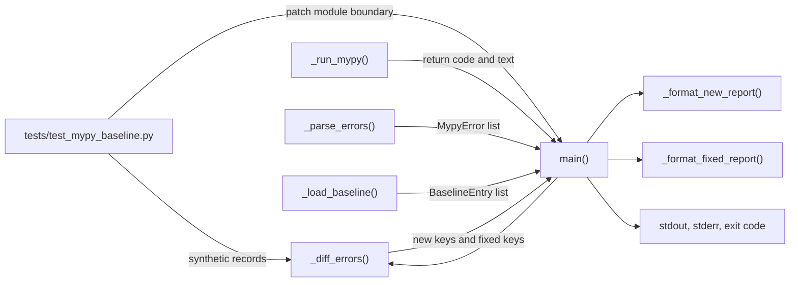

# PYPOST-1066: Verify clean mypy baseline boundaries

## Research

- The production boundary is contained in `scripts/check_mypy_baseline.py`. `_diff_errors()` is a
  pure multiset comparison over `(path, code, message)` identities. `main()` owns orchestration,
  report selection, output streams, and the exit code.
- `_diff_errors([], [])` already returns `([], [])`: both `Counter` operands are empty, so neither
  subtraction has positive elements. This is the direct clean-to-clean contract and needs a focused
  regression test, not a production change.
- `_diff_errors([], non_empty_baseline)` already returns no new keys and every baseline identity as
  fixed. `main()` then emits only `_format_fixed_report(...)`, prints the baseline/current counts to
  standard error, returns `1`, and cannot reach the ordinary `mypy baseline OK` branch. This is the
  established fully-resolved-but-stale-baseline policy described by the requirements.
- Existing tests in `tests/test_mypy_baseline.py` cover a pure full-fix multiset calculation, but do
  not cover the empty-to-empty calculation or the complete `main()` outcome for a clean current run
  against a stale baseline. The missing value is boundary and orchestration coverage.
- The existing end-to-end test pattern already isolates the gate: patch the module-owned `_run_mypy`
  reference, redirect `BASELINE_PATH` to `tmp_path`, and set `sys.argv` before calling `main()`.
  Pytest's current monkeypatch guidance recommends patching the reference used by the code under test
  and automatically restores fixture changes after the test. Its capture fixture exposes separate
  standard-output and standard-error text, which is appropriate for verifying that the fixed report
  appears and the ordinary success report does not.
- No live mypy process, network request, repository baseline rewrite, or `pypost/` import is needed.
  The test module already has `pytestmark = pytest.mark.timeout(30)`, satisfying the repository's
  timeout policy for added tests.

Research source: [pytest monkeypatch documentation](https://docs.pytest.org/en/stable/how-to/monkeypatch.html)
and [pytest built-in fixtures](https://docs.pytest.org/en/stable/builtin.html).

## Implementation Plan

1. Add a focused pure unit test under `TestDiffErrors` that calls `_diff_errors([], [])` and asserts
   that both returned lists are empty.
2. Add a focused gate-flow test under `TestMypyBaseline` using a temporary version-2 baseline with at
   least one `BaselineEntry`-shaped JSON object. Patch `check_mypy_baseline.BASELINE_PATH`, patch
   `check_mypy_baseline._run_mypy` to return a clean synthetic result, and patch `sys.argv` to the
   normal (non-update) invocation.
3. Invoke `check_mypy_baseline.main()` and assert the public boundary contract: exit code `1`; no new
   error heading; the resolved-baseline heading and representative entry on standard error; the
   `Baseline: N errors; current: 0 errors` summary on standard error; and no ordinary
   `mypy baseline OK` message on standard output.
4. Run the focused test module, then the repository-prescribed validation gates. Change production
   code only if these tests expose a real contract mismatch, and keep any correction limited to this
   boundary behavior.

**Mandatory — Failing Repro (next Step 3):** N/A — no behavioral change is presently indicated.
Repository inspection shows both requested boundary behaviors are already implemented correctly;
PYPOST-1066 is a verification/coverage task. Fabricating a red test by asserting behavior contrary
to the approved requirements would not be a valid repro. Step 3 should record this N/A disposition,
and Step 4 should add the regression tests above. If an honestly specified test unexpectedly fails,
the workflow must reopen Step 3, preserve that failure as the repro, and only then correct production
behavior in Step 4.

## Architecture

### System module diagram

### Modules and responsibilities

| Component | Responsibility | PYPOST-1066 impact |
| --- | --- | --- |
| `scripts/check_mypy_baseline.py` | Implements the baseline CLI and comparison policy | No planned change; remains the system under test |
| `_diff_errors(current, baseline)` | Computes pure count-aware new/fixed identities | Gain explicit empty-to-empty coverage |
| `main()` | Coordinates current output, baseline loading, diagnostics, and process result | Gain isolated fully-fixed-flow coverage |
| `_format_fixed_report()` | Formats actionable resolved-debt diagnostics | Exercised through `main()` without changing its interface |
| `tests/test_mypy_baseline.py` | Provides hermetic regression coverage for the gate | Receives the two focused boundary tests |
| `mypy-baseline.json` | Stores accepted version-2 debt | Not read or modified by the new tests; a temporary file substitutes for it |

### Dependencies and interactions

- The pure test depends only on the public-in-practice test seam `_diff_errors()` and empty Python
  sequences. It does not cross filesystem or process boundaries.
- The flow test depends on `main()` plus pytest-provided `monkeypatch`, `tmp_path`, and output capture.
  It replaces the two external boundaries owned by the script: `_run_mypy()` and `BASELINE_PATH`.
- The test deliberately calls `main()` instead of separately testing the formatter, because the
  requirement concerns branch selection: fixed-only output must be actionable and ordinary success
  must be absent while stale entries remain.
- Production dependencies and interfaces remain unchanged. No new package, abstraction, command-line
  option, baseline schema, or source module is introduced.

### Architectural patterns and rationale

- **Functional core / imperative shell:** `_diff_errors()` is the deterministic functional core;
  `main()` is the imperative shell. One test targets each boundary at its proper level.
- **Dependency substitution at owned seams:** patch the symbols looked up by
  `scripts.check_mypy_baseline`, rather than spawning mypy or mutating the committed baseline. This
  keeps the flow test deterministic and verifies orchestration without external dependencies.
- **Contract-focused assertions:** assert stable policy signals (exit status, diagnostic headings,
  representative resolved item, counts, and absence of success/new-error signals). Avoid asserting
  incidental parser or subprocess behavior already covered elsewhere.
- **Minimal-change design:** because current behavior matches the requirements, coverage is added at
  the existing seams. Extracting new helpers or changing production architecture would add risk
  without improving the tested contract.

### Main interfaces

| Interface | Input | Output / observable contract |
| --- | --- | --- |
| `_diff_errors(current, baseline)` | `Sequence[MypyError]`, `Sequence[BaselineEntry]` | `(new_keys, fixed_keys)`; empty/empty yields two empty lists |
| `_run_mypy()` test seam | No arguments | Patched to return `(0, "")` for a clean synthetic run |
| `BASELINE_PATH` test seam | Path to version-2 JSON | Patched to a `tmp_path` file containing non-empty accepted debt |
| `main()` | Normal CLI arguments via `sys.argv` | Fully fixed state returns `1`, writes resolved maintenance guidance to stderr, and does not write ordinary success |
| pytest output capture | Process-level text written by `main()` | Separately exposes stdout and stderr for positive and negative assertions |

### Invariants and non-goals

- Empty current plus empty baseline means no new and no fixed differences.
- Empty current plus non-empty baseline means fixed-only differences and an actionable non-zero gate
  result until the baseline is updated.
- No new-error report is permitted in the fully fixed scenario, and no ordinary success report is
  permitted while fixed entries remain.
- Error identity, duplicate counts, line-shift handling, JSON schema, parsing, path scope, and baseline
  generation are unchanged.

## Q&A

### Why is Step 3 N/A if tests will be added?

Step 3 exists to preserve a failing reproduction before a production behavior correction. These
requirements ask for missing regression coverage around behavior that repository inspection shows is
already correct. A new test that passes against the current implementation is still valuable, but it
is development work in Step 4 rather than an artificial red repro.

### Why test `_diff_errors([], [])` separately from `main()`?

It isolates the mathematical no-debt boundary. The flow test uses a deliberately non-empty baseline
to cover policy and diagnostics, so it cannot simultaneously prove the empty-to-empty return value.

### Why not invoke real mypy in the gate-flow test?

The contract under test starts at a clean parsed result, not at mypy installation or subprocess
behavior. Substituting `_run_mypy()` makes the scenario fast, deterministic, and independent of the
repository's current type-error inventory.
