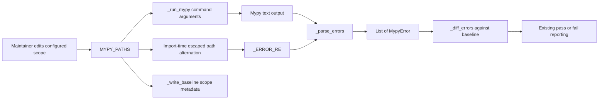

# PYPOST-1067: Derive mypy diagnostic scope from the configured paths

## Research

The current gate already uses `MYPY_PATHS` in three places:

- `_run_mypy()` expands it into the mypy command.
- `_write_baseline()` records it as the JSON `scope` metadata.
- `main()` includes it in the successful-run message.

Diagnostic recognition is the exception. `_ERROR_RE` independently spells the same directories
as `pypost/(?:core|models|ui)`. Commit `830953c7` illustrates the maintenance hazard: extending
the gate to `pypost/ui` required coordinated edits to both `MYPY_PATHS` and `_ERROR_RE`.

The Python 3.11 standard-library documentation establishes the relevant regex behavior:

- [`re.escape()`](https://docs.python.org/3.11/library/re.html#re.escape) escapes characters that
  can have special meaning in a regex. Each configured path must therefore be escaped before it
  becomes a regex alternative. A path such as `pypost/ui.v2` must match its literal dot, not any
  character.
- [Regex alternation](https://docs.python.org/3.11/library/re.html#regular-expression-syntax) is
  tried from left to right and accepts the first matching branch. Sorting prefixes by descending
  length makes overlapping alternatives deterministic and gives a more specific configured path
  precedence over its parent.
- [`re.compile()`](https://docs.python.org/3.11/library/re.html#re.compile) creates a reusable
  pattern object. Compiling the derived expression once at module import preserves the existing
  parser structure and avoids rebuilding it for every output line.
- `^` and `$` anchor the existing diagnostic grammar. A literal `/` after the configured prefix
  is also required: it admits descendants while preventing `pypost/ui_extra/...` from being
  treated as a descendant of `pypost/ui`.

A local Python experiment confirmed that a derived pattern recognizes
`pypost/ui.v2/check.py`, while rejecting both `pypost/uiXv2/check.py` and
`pypost/ui_extra/check.py`. This is consistent with the documented escaping and alternation
semantics.

## Implementation Plan

1. **Step 3 — write the failing repro before production changes.** Add one focused test to
   `tests/test_mypy_baseline.py` that creates a temporary copy of
   `scripts/check_mypy_baseline.py`, changes only that copy's `MYPY_PATHS` declaration to append
   the existing valid project directory `pypost/agent`, and loads the copy with
   `runpy.run_path()`.
2. Feed the temporary module's `_parse_errors()` a valid diagnostic from
   `pypost/agent/tree_index.py`. Assert that it returns the expected `MypyError`. The current
   code fails because its copied `_ERROR_RE` still contains only `core|models|ui`, directly
   demonstrating that the configured extension is ignored by parsing.
3. In the same hermetic test, include an out-of-scope lookalike diagnostic such as
   `pypost/agent_extra/check.py` and assert that it remains excluded. This checks the required
   directory-separator boundary without changing the real configured scope.
4. In Step 4, replace the hard-coded path alternatives with a string derived from
   `MYPY_PATHS`. Escape every prefix, order alternatives by descending length with a stable
   lexical tie-break, and compile `_ERROR_RE` once after `MYPY_PATHS` is declared.
5. Run the focused test, the complete `tests/test_mypy_baseline.py` module, and the repository
   quality gate. Existing parser, baseline, reporting, and mypy-invocation tests must remain
   green.

**Mandatory — Failing Repro (next Step 3):** The test described in items 1–3 is mandatory. It
must alter only a temporary module copy and must not invoke a live mypy process, modify the real
source file, or depend on network access. Loading the copy represents the fresh process that
would follow a real configuration edit, which is necessary because the production regex is
intentionally constructed at import time. Sequence: create the hermetic scope extension, confirm
the new-path diagnostic is red on current code, implement the derived regex, then run it green.

## Architecture

### Module diagram



### Components and responsibilities

| Component | Responsibility | Change |
| --- | --- | --- |
| `MYPY_PATHS` | Declare relative project directories. | Becomes the sole scope authority. |
| Derived path alternation | Escape and order scope prefixes. | New private module-level value. |
| `_ERROR_RE` | Recognize complete in-scope error lines. | Derive its path branch. |
| `_run_mypy()` | Invoke mypy for every configured path. | None. |
| `_parse_errors()` | Convert recognized lines to sorted `MypyError` values. | None. |
| Baseline pipeline | Persist and compare error occurrences. | None. |
| Baseline tests | Lock scope coupling and parser behavior. | Add the hermetic repro. |

### Module interaction

1. Python imports `scripts.check_mypy_baseline` and evaluates `MYPY_PATHS`.
2. The module sorts the configured prefixes from longest to shortest, uses `re.escape()` on each
   prefix, joins them as a non-capturing alternation, and compiles `_ERROR_RE` once.
3. `_run_mypy()` passes the original tuple, in its original order, to mypy. Sorting affects only
   regex branch precedence; it does not change checker scope or invocation ordering.
4. `_parse_errors()` strips each output line and applies the compiled pattern. A matching line
   yields the existing `path`, `line`, `message`, and `code` fields.
5. The existing multiset comparison and reporting pipeline consumes those values unchanged.

### Selected patterns

- **Single source of truth:** `MYPY_PATHS` supplies invocation, baseline scope metadata, success
  output, and now diagnostic recognition. A maintainer performs one scope edit.
- **Derived immutable configuration:** the regex scope is computed once from the tuple during
  module import. Normal CLI execution starts a new process, so a source configuration change and
  its parser derivative are atomic for that run.
- **Boundary-aware prefix matching:** each escaped directory prefix is followed by `/`, rather
  than relying on an unbounded `startswith`-style prefix. This preserves exclusion of similarly
  named directories.
- **Existing functional pipeline:** parsing still returns values to the pure Counter-based diff;
  no new service, class, dependency, or stateful abstraction is warranted.

### Main interfaces

#### Configured scope

```python
MYPY_PATHS: tuple[str, ...]
```

`MYPY_PATHS` remains an ordered, non-empty tuple of repository-relative directory prefixes. Its
members use `/` and do not end in `/`. The gate passes the values unchanged to mypy.

#### Derived parser expression

The implementation introduces no public API. A private module-level alternation is derived as if
by the following contract:

```python
path_alternation = "|".join(
    re.escape(path)
    for path in sorted(MYPY_PATHS, key=lambda path: (-len(path), path))
)
```

`_ERROR_RE` embeds `path_alternation` inside a non-capturing group within the existing named
`path` group. The path grammar remains conceptually:

```text
^(configured-prefix)/non-colon-path:decimal-line: error: message [code]$
```

The slash after the alternation is part of the grammar, not part of an alternative. This keeps
the named `path` value identical to mypy's full relative file path while enforcing a directory
boundary.

#### Parser result

```python
def _parse_errors(output: str) -> list[MypyError]: ...
```

The function signature, sorting order, and `MypyError(path, line, code, message)` values remain
unchanged. Downstream baseline identity remains `(path, code, message)`.

### Dependencies

- The implementation continues to use only the Python standard library, specifically existing
  `re` functionality.
- `_ERROR_RE` depends on `MYPY_PATHS` being declared first in the module.
- `_parse_errors()` depends on `_ERROR_RE` and feeds the existing baseline comparison functions.
- Tests depend only on pytest's existing fixtures and standard-library temporary module loading;
  no mypy subprocess is required for the new repro.

### Invariants

- Every diagnostic below a configured directory is eligible for baseline comparison.
- A diagnostic outside every configured directory is ignored by this gate.
- Regex metacharacters in a valid configured prefix are treated literally.
- Textual prefix similarity is insufficient; the configured prefix must end at a `/` boundary.
- More specific overlapping configured prefixes precede their parents in regex alternation.
- Existing named capture groups and diagnostic identity do not change.
- A runtime mutation of `MYPY_PATHS` after module import does not rebuild `_ERROR_RE`; production
  configuration is source-level and each CLI run imports it afresh.

### Non-goals

- Do not add, remove, normalize, or reorder paths passed to mypy.
- Do not change mypy options, output format, subprocess handling, or return-code policy.
- Do not alter baseline version, contents, identity, multiset semantics, or report formatting.
- Do not accept diagnostics from absolute paths or alternate separator formats that the current
  gate does not support.
- Do not add general configuration validation or a new parser abstraction for this focused fix.
- Do not update static-type-checking documentation until the later documentation step.

## Q&A

- **Why escape before joining?** Joining first and escaping afterward would escape the `|`
  operators too, converting the intended alternation into literal text. Each untrusted literal
  prefix must be escaped independently, then joined with regex syntax owned by the gate.
- **Why sort longest first?** Python tries alternation branches left to right. Specific prefixes
  first make overlap handling explicit and stable, even though the required slash boundary
  already prevents ordinary textual-prefix false positives.
- **Why compile at import time?** The scope is static for one command invocation, and parsing can
  inspect many lines. One derived compiled object is simpler and avoids repeated construction.
- **Why does the red test load a temporary source copy?** Monkeypatching `MYPY_PATHS` after import
  would not model the intended import-time contract. A temporary copy safely simulates the exact
  maintainer action and a fresh gate process without touching repository source.
- **Why not parse every mypy diagnostic and filter afterward?** That would widen the parser and
  add a second filtering stage. Deriving the existing anchored grammar is the smallest change and
  preserves current exclusion behavior.
