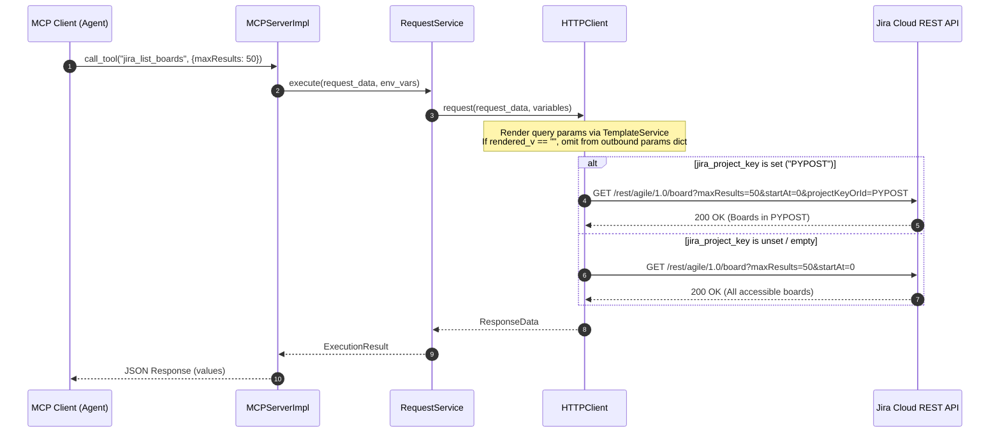

# PYPOST-1068: Jira MCP: Unconstrained Access When jira_project_key Is Unset

## Research

### Jira Cloud REST API Specifications & Behavior
- **Agile Board Listing (`GET /rest/agile/1.0/board`)**:
  - Query parameters: `projectKeyOrId` (optional string), `maxResults` (optional int), `startAt` (optional int).
  - When `projectKeyOrId` is omitted: Jira returns all boards visible to the authenticated user across all projects.
  - When `projectKeyOrId` is passed as an empty string (`projectKeyOrId=`): Jira treats the empty string as an invalid/non-matching project key and returns zero boards.
- **PyPost Request Execution (`HTTPClient._prepare_request_kwargs`)**:
  - `HTTPClient` iterates through `request_data.params` and renders each value using `TemplateService`.
  - When `request_data.params` has `"projectKeyOrId": "{{ jira_project_key }}"`, and `jira_project_key` is not defined in the environment snapshot, Jinja resolves the placeholder to `""`.
  - Storing `""` in `params` causes `requests.request(..., params=params)` to serialize `?projectKeyOrId=&...`.
  - Omitting parameters whose rendered string value is empty (`rendered_v != ""`) ensures clean, idiomatic query strings across all HTTP endpoints.

## Implementation Plan

1. **Step 3 (Failing Repro Test)**:
   - Create tests in `tests/test_example_fixtures.py` and `tests/test_mcp_server_integration.py` verifying:
     - When `jira_project_key` is omitted or empty, `jira-list-boards` dispatches HTTP GET without `projectKeyOrId` in query.
     - When `jira_project_key` is provided (e.g. `"PROJ"`), `jira-list-boards` dispatches HTTP GET with `projectKeyOrId=PROJ`.
     - Tool descriptions in `examples/collections/jira_mcp.json` include explicit dual-mode guidance.
   - Run the test suite to confirm RED status before production code edits.
2. **Step 4 (Development)**:
   - Update `pypost/core/http_client.py`: In `_prepare_request_kwargs`, skip adding keys to `params` when `rendered_v == ""`.
   - Update `examples/collections/jira_mcp.json`: Update tool descriptions and parameter descriptions for `jira-list-boards`, `jira-search-issues-jql`, and `jira-create-issue`.
   - Update `tests/test_example_fixtures.py` and other test fixtures if necessary to match the refined wording and clean query behavior.
   - Verify all tests pass GREEN.
3. **Step 5–8**:
   - Code cleanup, observability review, tech-debt analysis, and developer documentation update in `doc/dev/jira_mcp_project_default.md` and `examples/README.md`.

## Architecture

### Component Architecture & Interaction Flow

### Module Responsibilities & Changes

| Module | Responsibility | Changes in PYPOST-1068 |
| --- | --- | --- |
| `pypost.core.http_client.HTTPClient` | Prepares kwargs and executes outbound HTTP requests | Filter out empty rendered string query params (`rendered_v != ""`) in `_prepare_request_kwargs`. |
| `examples/collections/jira_mcp.json` | Curated Jira MCP tool definitions | Update `mcp_description` and parameter descriptions for `jira-list-boards`, `jira-search-issues-jql`, and `jira-create-issue` to reflect unconstrained vs scoped modes. |
| `examples/environments/jira_cloud.json` | Sample Jira Cloud environment | Maintain `jira_project_key` placeholder as optional soft configuration. |
| `tests/test_example_fixtures.py` | Fixture contract lock | Validate updated tool descriptions, parameter descriptions, and dual-mode behavior. |
| `tests/test_mcp_server_integration.py` | End-to-end MCP server integration tests | Add test case verifying outbound query strings for `jira_list_boards` in both set and unset environments. |

## Q&A

- **Q: Does stripping empty string parameters affect other HTTP requests?**
  - A: In standard HTTP/REST query parameter semantics, `?param=` signifies an empty value string which is almost never desired when templating variables that are absent. Omitting empty parameters prevents accidental broken filters and matches standard API client behaviors.
- **Q: How does this interact with future multi-project support in PYPOST-1069?**
  - A: When `jira_project_key` contains multiple comma-separated keys (PYPOST-1069), `jira_list_boards` or search handlers can build the multi-project query. PYPOST-1068 establishes the baseline where unset = all projects and set = scoped.
