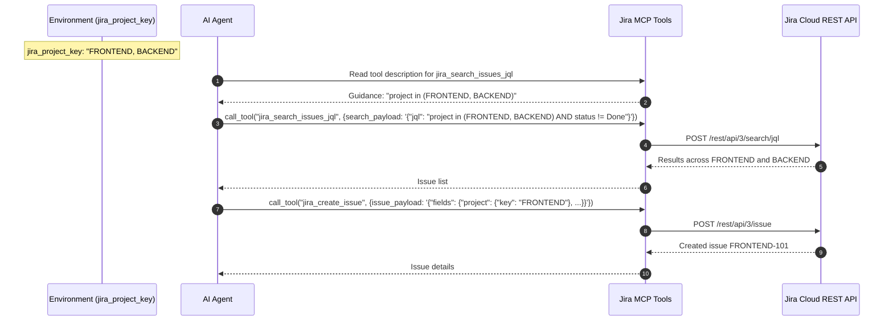

# PYPOST-1069: Jira MCP: Support Multiple Projects in jira_project_key

## Research

### Multi-Project Key Configuration in Jira REST & MCP
- **JQL Search (`POST /rest/api/3/search/jql`)**:
  - For single project: `project = KEY`
  - For multiple projects: `project in (KEY1, KEY2, ...)`
  - For unconstrained: search across all accessible projects without project clause
- **Issue Creation (`POST /rest/api/3/issue`)**:
  - Jira requires exactly one project key in `fields.project.key`.
  - When multiple keys are configured in `jira_project_key`, the caller specifies the target project explicitly or uses the primary (first) key in the list.
- **Board Discovery (`GET /rest/agile/1.0/board`)**:
  - `jira-list-boards` accepts `projectKeyOrId`. For multiple configured projects, callers can supply individual keys or query across boards.
- **Normalization Rules**:
  - Given `" ALPHA , , BETA "`, splitting by comma, stripping whitespace, and ignoring empty tokens yields `["ALPHA", "BETA"]`.

## Implementation Plan

1. **Step 3 (Failing Repro Test)**:
   - In `tests/test_example_fixtures.py`, add contract tests checking:
     - Multi-project JQL search guidance `project in (...)` in `jira-search-issues-jql`.
     - Multi-project creation guidance and primary project fallback in `jira-create-issue`.
     - Comma-separated project key parsing and normalization helper.
   - Confirm RED status before fixture/doc updates.
2. **Step 4 (Development)**:
   - Update `examples/collections/jira_mcp.json`:
     - `jira-search-issues-jql` description & `search_payload` description: state `project = <key>` for single project or `project in (<key1>, <key2>, ...)` for multiple projects.
     - `jira-create-issue` description & `issue_payload` description: state specifying target project explicitly or using the primary project from multiple configured keys.
     - `jira-list-boards` description: mention single or multi-project scoping.
   - Run tests to confirm GREEN.
3. **Step 5–8**:
   - Code cleanup, observability review, tech-debt analysis, and developer documentation update in `doc/dev/jira_mcp_project_default.md` and `examples/README.md`.

## Architecture

### Multi-Project Workflow Diagram

### Module Responsibilities

| Module | Responsibility | Changes in PYPOST-1069 |
| --- | --- | --- |
| `examples/collections/jira_mcp.json` | Tool definitions and guidance | Update search, create, and list descriptions with multi-project `project in (...)` and primary project guidance. |
| `doc/dev/jira_mcp_project_default.md` | Developer documentation | Document multi-project comma-separated syntax, parsing, and JQL examples. |
| `examples/README.md` | User-facing documentation | Document comma-separated `jira_project_key` configuration. |
| `tests/test_example_fixtures.py` | Fixture contract lock | Validate multi-project guidance and comma-separated parsing behavior. |

## Q&A

- **Q: Are spaces around commas tolerated?**
  - A: Yes, parsing rules normalize whitespace and ignore empty elements (e.g. `" PROJ1 , , PROJ2 "` -> `["PROJ1", "PROJ2"]`).
- **Q: Does this break existing single-project configurations?**
  - A: No, a single project string like `"PYPOST"` normalizes to `["PYPOST"]` and uses `project = PYPOST`.
