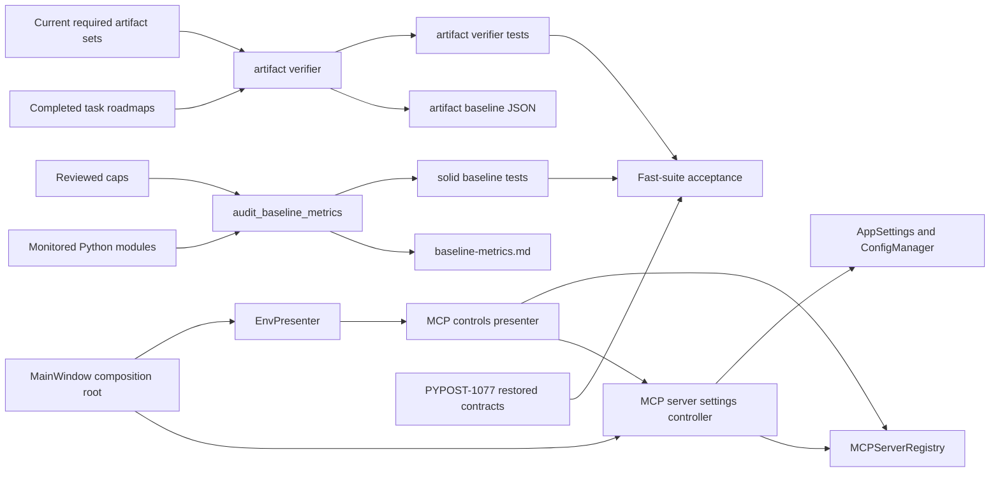

# PYPOST-1071: Restore a Trustworthy Fast-Suite Baseline

## Research

### Reproduced state

The five named tests fail deterministically in 0.15 seconds. The four SOLID tests report five
measured violations because the inventory test reports all offending modules together:

| Metric | Snapshot | Current | Cap | Disposition |
| --- | ---: | ---: | ---: | --- |
| `main_window.py` file | 429 | 565 | 435 | Decompose, then recalibrate |
| `MainWindow` class | 385 | 520 | 390 | Decompose, then recalibrate |
| `http_client.py` file | 332 | 380 | 340 | Accept cohesive growth; cap 418 |
| `collections_presenter.py` file | 328 | 366 | 330 | Accept thin delegation; cap 403 |
| `env_presenter.py` file | 470 | 599 | 470 | Decompose, then recalibrate |

Rows 1, 2 and 5 — the `main_window.py` file, the `MainWindow` class, and `env_presenter.py` —
come from PYPOST-1044 (commit `31bff0ce`), the only change to either module since PYPOST-1025.
It added 137 lines to `main_window.py` and 135 lines to `env_presenter.py` (net +136 and +129) for
multi-server MCP composition, persistence, status rendering, and dialogs. These are cohesive
responsibilities with an existing typed controller seam, but they do not belong in the composition
root or environment presenter.
A blanket cap increase would undo the forcing function recorded by PYPOST-1025, which deliberately
left the presenters at their caps so later growth had to justify decomposition.

The other two rows have a different disposition:

- PYPOST-1037 added 48 lines to `http_client.py` for strict integer-template conversion, safe
  origin-only error logging, and conversion-to-`ExecutionError` mapping. The behavior remains part
  of outbound transport preparation and failure translation; extracting it solely to satisfy LOC
  would create a fragmented transport API.
- `collections_presenter.py` grew 328 -> 366 (+38) after PYPOST-1025 across four changes:
  PYPOST-1005 +17, PYPOST-1013 +5 net, and PYPOST-1012 +5 for thin collection action entry points
  and busy-cue coordination, plus PYPOST-1044 +11 for `collection_by_id()`
  (`pypost/ui/presenters/collections_presenter.py:149`). Import, export, and tree behavior remain
  delegated to their existing action objects, and the 366-line presenter has not absorbed their
  algorithms. PYPOST-1044's contribution here is thin delegation: a read-only lookup over the
  already-cached collection list, consumed by the composition root through
  `MainWindow._collection_by_id` (`pypost/ui/main_window.py:398`). The disposition therefore
  differs from rows 1, 2 and 5 for a stated reason — the same feature placed persistence,
  lifecycle, and dialog responsibilities into `main_window.py` and `env_presenter.py`, but only an
  accessor here, so this module stays "accept thin delegation" rather than "decompose".

For those two explicitly accepted modules, `ceil(current LOC * 1.10)` gives caps of 418 and 403.
This follows the approximately 10% policy established by PYPOST-376 and PYPOST-735 rather than
raising a cap only to the failing value.

### Artifact-baseline contract drift

The committed artifact baseline contains 259 grandfathered tasks, while the current scan contains
289. Every one of the 30 apparent additions is missing only `70-dev-docs.md`. The current Top-Down
contract defines Step 8 output as developer documentation under `doc/dev/`, not a per-task
`70-dev-docs.md` summary. Recent completed tasks correctly record those `doc/dev/` paths in their
roadmaps.

Removing only the obsolete `70-dev-docs.md` requirement from both standard and audit task sets
leaves 227 baseline violations and 227 current violations, with no new, resolved, or changed task
entries. The correct disposition is therefore to reconcile the verifier and developer guidance,
then canonically regenerate the baseline. Adding 30 new grandfathered exceptions would preserve a
stale contract and weaken the gate.

### Prior decisions and external references

- PYPOST-376 established AST class spans, physical file LOC, generated snapshots, and roughly 10%
  headroom. PYPOST-717/735 refreshed justified caps; PYPOST-728 rejected unnecessary decomposition;
  PYPOST-776 regenerated stale measurements; PYPOST-1025 preferred focused extraction when drift
  represented a misplaced responsibility.
- PYPOST-1077 owns the four already-restored application contracts. This task must rerun those
  checks but must not reopen their implementation.
- Python documents `ast` node `lineno` and `end_lineno`, supporting the existing class-span
  measurement: [Python AST documentation](https://docs.python.org/3/library/ast.html).
- Python `Protocol` provides structural typing for a narrow controller boundary:
  [Python typing documentation](https://docs.python.org/3/library/typing.html#typing.Protocol).
- Qt signals connect an emitter to typed receiver callables without requiring either side to own
  the other's implementation:
  [Qt for Python signals and slots][qt-signals].

[qt-signals]: https://doc.qt.io/qtforpython-6.8/tutorials/basictutorial/signals_and_slots.html

## Implementation Plan

1. In Step 3, add a failing artifact-contract test to
   `tests/test_verify_ai_task_artifacts.py`. It creates a completed current-format roadmap and
   asserts that the task is not incomplete merely because it has no `70-dev-docs.md`. It also
   asserts the standard/audit required-file sets match the current workflow. This fails against
   today's verifier without touching production or baseline files.
2. Retain the four already-red SOLID tests as the automated structural repro. Record the exact
   current values above and confirm the new artifact test plus those four failures are red for the
   intended reasons. Do not add a duplicate LOC test.
3. Extract multi-server persistence and lifecycle control from `MainWindow` into
   `pypost/ui/mcp_server_controller.py`. The extracted controller owns registry construction,
   persisted configuration updates, transactional reconfiguration completion, start/stop/remove,
   startup loading, and shutdown. `MainWindow` remains the composition root and readiness gate.
4. Extract MCP status controls and dialog routing from `EnvPresenter` into
   `pypost/ui/presenters/mcp_controls_presenter.py`. Preserve the legacy single-server behavior,
   multi-server aggregate status, selected-server dialogs, and scoped collection/environment
   refreshes through delegation.
5. Require the extraction to bring `main_window.py`, `MainWindow`, and `env_presenter.py` back
   within their current caps before any cap recalibration. Then set each changed cap to
   approximately 10% above its measured post-extraction baseline. This prevents a nominal
   extraction followed by blessing the original oversized structures.
6. Accept the cohesive `http_client.py` and thin `collections_presenter.py` growth explicitly and
   set their caps to 418 and 403. Add adjacent comments citing the responsible feature boundaries.
7. Remove `70-dev-docs.md` from `STANDARD_FILES` and `AUDIT_FILES`, update the corresponding unit
   expectations and `doc/dev/setup.md`, then regenerate `ai-tasks-artifacts-baseline.json` through
   `scripts/verify_ai_task_artifacts.py --update-baseline`. The expected count is 227, with no
   current-versus-baseline delta after normalization.
8. Regenerate `ai-tasks/PYPOST-376/baseline-metrics.md` only through
   `audit_baseline_metrics.py --markdown`; update `doc/dev/solid_audit.md` from that output.
9. Run the focused SOLID and artifact-verifier modules, the MCP/MainWindow/environment/collection/
   HTTP affected suites, the PYPOST-1077 verification suite, both baseline tools in their real
   verification form — `scripts/audit_baseline_metrics.py --check` and the no-flag
   `scripts/verify_ai_task_artifacts.py` (that script has no `--check` flag; verification is its
   default invocation, as `make verify-ai-tasks` runs it at `Makefile:141`) — and the complete
   fast suite. No check may be skipped or changed to subset matching.

### Mandatory — Failing Repro (next Step 3)

This task has behavioral quality-gate changes, so Step 3 is not N/A. Add these deterministic,
offline assertions to `tests/test_verify_ai_task_artifacts.py`:

- a task whose current-format roadmap marks Steps 1 through 8 complete and whose required task
  artifacts exist is compliant without `70-dev-docs.md`, because Step 8 output lives in `doc/dev/`;
- `required_files_for_task()` returns the six standard task artifacts, or seven for an audit task
  including `30-audit-report.md`, and never requires `70-dev-docs.md`.

Both fail on the current seven/eight-file verifier. Run them together with the four existing red
SOLID tests. Step 3 changes tests and roadmap evidence only; Step 4 performs extraction, cap and
verifier changes, and both canonical regenerations.

## Architecture



### Components and responsibilities

| Component | Responsibility |
| --- | --- |
| `MainWindow` | Compose UI services and complete the two-source startup readiness gate |
| MCP settings controller | Own registry creation, persistence, lifecycle commands, and shutdown |
| `EnvPresenter` | Own environment state, storage, variable propagation, and its dialog |
| MCP controls presenter | Own MCP buttons, status, dialogs, and scoped refresh routing |
| SOLID generator | Measure monitored modules, enforce caps, and render the canonical snapshot |
| Artifact verifier | Compare completed task folders with the current workflow artifact contract |
| Artifact baseline JSON | Freeze genuine legacy gaps, not valid Step 8 output choices |

### Main interfaces

The controller continues to satisfy the existing structural UI boundary:

```python
class McpServerController(Protocol):
    def mcp_server_configurations(self) -> list[McpServerConfiguration]: ...
    def mcp_server_status(self, instance_id: str) -> McpServerStatus: ...
    def upsert_mcp_server(self, configuration: McpServerConfiguration) -> None: ...
    def remove_mcp_server(self, instance_id: str) -> None: ...
    def start_mcp_server(self, instance_id: str) -> None: ...
    def stop_mcp_server(self, instance_id: str) -> None: ...
    def mcp_server_activity(self, instance_id: str) -> list[McpActivityEntry]: ...
```

The concrete controller additionally exposes `registry`, `start_enabled()`, and `stop_all()` to
the composition root. Registry signals remain the notification interface for status changes and
transactional reconfiguration completion.

The MCP controls presenter owns the operations extracted from `EnvPresenter`, keeping their current
names: `refresh_mcp_tools()` (`pypost/ui/presenters/env_presenter.py:425`), `mcp_status_text()`
(:215), `mcp_tools_button_text()` (:218), `mcp_activity_button_text()` (:221), and the scoped
refresh `_refresh_registry_environment(environment_id)` (:596), which is private today and becomes
an internal detail of the new presenter. It receives callables for current collections/environments
and does not own their storage.

`EnvPresenter` keeps the four public `mcp_*` methods as delegating shims after extraction. This is
mandatory, not optional: `pypost/ui/main_window_signals.py` connects `window.env.refresh_mcp_tools`
to three Qt signals (lines 18, 21, and 31), and `tests/test_env_presenter.py` asserts on
`mcp_status_text()`, `mcp_tools_button_text()`, and `mcp_activity_button_text()` through the
`EnvPresenter` instance. Renaming or dropping them would break callers, which is outside this
task's scope.

Baseline interfaces remain stable:

```python
def measure_all() -> list[FileMetrics]: ...
def check_caps() -> list[str]: ...
def format_markdown(metrics: list[FileMetrics]) -> str: ...
def collect_violations(ai_tasks_dir: Path = AI_TASKS_DIR) -> dict[str, list[str]]: ...
```

### Data flow and invariants

1. `MainWindow` composes the controller, registry, environment presenter, and MCP controls.
2. Collections and environments load; only the existing readiness gate calls
   `controller.start_enabled()` after both stable-ID sources are ready.
3. MCP dialog actions call the controller protocol; committed settings and registry state stay
   synchronized. Shutdown calls `controller.stop_all()`.
4. Source reconciliation occurs before cap calculation. Caps are derived from reviewed, smaller
   module measurements, while accepted HTTP/collection values use 418 and 403.
5. The SOLID generator renders the canonical snapshot; tests compare the snapshot exactly and
   independently enforce caps.
6. The artifact verifier evaluates only task-local artifacts defined by the current workflow.
   Step 8 output lives in `doc/dev/`, not in an obsolete summary filename, and no automated check
   verifies it: `is_roadmap_completed` requires steps 1-7 only and the verifier never reads
   `doc/dev/`. The regenerated JSON continues to freeze all 227 genuine legacy gaps exactly.

### Selected patterns

- **Composition root plus controller:** keep construction in `MainWindow` while moving mutable MCP
  persistence/lifecycle behavior behind a typed boundary.
- **Presenter extraction:** separate environment state from MCP controls without changing Qt
  signal semantics or the registry's per-instance isolation.
- **Disposition before baseline refresh:** classify each growth source; extraction is mandatory
  for misplaced responsibilities, while cohesive growth is accepted transparently.
- **Generated single source of truth:** never hand-edit either generated baseline to conceal drift.
- **Exact-set comparison:** both baseline domains retain equality checks, so future additions,
  removals, cap breaches, and changed legacy gaps remain failures.

## Q&A

**Q: Why not raise all four file caps to current LOC plus 10%?**

**A:** PYPOST-1044 moved substantial MCP persistence and UI coordination into two modules whose
documented purpose is composition or environment state. Those seams are cohesive and already
typed, so extraction is evidence-backed. HTTP template-error translation and thin collection
delegation remain within their owners' stated responsibilities and justify explicit cap refreshes.

**Q: Why change the artifact verifier instead of adding 30 baseline entries?**

**A:** All 30 additions are the same obsolete `70-dev-docs.md` expectation. Removing it from both
baseline and current scans produces the same 227 genuine gaps with no delta. Grandfathering the 30
would encode current compliant work as debt and retain a contract that conflicts with Step 8.

**Q: Does removing `70-dev-docs.md` stop developer-documentation enforcement?**

**A:** It removes the only trace of Step 8 this verifier ever had, and nothing replaces it: the
script's completion rule covers steps 1-7 (`range(1, 8)` / the collapsed `STEP 1-7` form) and it
never reads `doc/dev/`. Step 8 still requires reviewed documentation in `doc/dev/`, but that
requirement is enforced by the workflow and by review, not by any automated check. The removed
`70-dev-docs.md` expectation did not enforce it either — it demanded a file the current workflow
no longer produces. The task-folder verifier continues to require all task-local design, cleanup,
observability, and debt artifacts, plus audit reports for audit tasks. Giving Step 8 a real
automated check is deferred follow-up work (F3 in
[60-tech-debt.md](60-tech-debt.md#follow-up-tasks)).

**Q: How is approximately 10% headroom preserved after extraction?**

**A:** The three decomposed metrics must first fit their existing limits. Only then are their caps
derived from the reviewed post-extraction measurements. HTTP and collections have known accepted
measurements, so their deterministic target caps are 418 and 403.

**Q: What protects the PYPOST-1077 fixes?**

**A:** Its exact artifact-contract and focused behavior tests remain unchanged and are mandatory in
focused and full-suite verification. PYPOST-1071 does not alter those four restored contracts.
