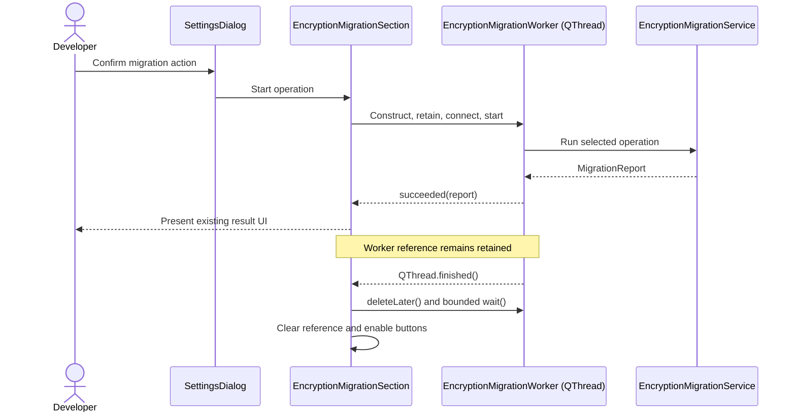

# PYPOST-1072: Stabilize encryption migration UI worker lifecycle

## Research

### Repository findings

- `SettingsDialog` delegates migration actions to `EncryptionMigrationSection` but retains the
  active `EncryptionMigrationWorker` through the compatibility field
  `SettingsDialog._migration_worker`.
- `EncryptionMigrationWorker` subclasses `QThread` and declares `finished = Signal(object)` for
  its result. This shadows the inherited no-argument `QThread.finished()` Python attribute, so
  the section has no ordinary signal interface for native thread termination.
- Both success and failure result slots immediately replace the only retained worker reference
  with `None`. A result is emitted inside `run()` before that method returns; result delivery and
  complete native thread shutdown are therefore distinct lifecycle events.
- The test helper in `tests/test_settings_encryption_migration_ui.py` repeatedly calls
  `QCoreApplication.processEvents()` and `QTest.qWait()`, but silently returns at its deadline.
  It treats a cleared Python reference as completion and cannot distinguish result delivery from
  native thread termination.
- Newer storage worker owners use distinct domain-result signals and inherited
  `QThread.finished()`. Their cleanup slots call `deleteLater()`, perform a short bounded
  `wait()`, and only then release the retained worker reference. This is the closest established
  repository pattern.
- Git history shows the collision and early reference release originated with the background
  migration worker change (`3aee5b12`). The later settings-section extraction (`eccccf78`)
  preserved that lifecycle unchanged. The shared `qapp` migration (`88cd2c83`) changed test
  isolation but did not create the underlying ownership pattern.

### Current official guidance

- The [Qt for Python `QThread` documentation][qthread-doc]
  recommends responding to the inherited `finished()` signal and connecting completion to
  `deleteLater()`. It also states that cleanup can continue after `finished()` and that `wait()`
  must return true to synchronize with all thread effects.
- The [Qt for Python `QCoreApplication` documentation][qcoreapplication-doc]
  discourages manual `processEvents()` loops and warns that continuously calling it can defer
  `DeferredDelete` processing. This makes the current test wait a poor lifecycle oracle.
- The [pytest-qt signal documentation][pytest-qt-signals]
  demonstrates waiting for `QThread.finished` with an explicit timeout and raising when that
  timeout expires. The repository does not currently depend on pytest-qt, so Step 3 should use
  its existing bounded `tests.helpers.process_until` facility rather than add a dependency.
- The [pytest fixture documentation][pytest-fixtures]
  states that module-scoped fixtures are shared until the module teardown. The repository's
  module-scoped `qapp` therefore makes complete per-test worker and widget teardown essential.

### Architectural conclusion

The exact full-suite trigger remains unconfirmed. The strongest code-level explanation is that
the result signal is being used as the lifecycle signal: the GUI releases the wrapper while the
`QThread` can still be completing native cleanup. Earlier Qt activity can change timing enough
to expose that race. The architecture should remove the ambiguity regardless of whether it is
the sole cause of the reported bus error.

## Implementation Plan

1. Add the deterministic Step 3 red repro described below. Confirm it fails because result
   delivery currently releases the worker before a distinct thread-completion event.
2. Rename the worker's domain result signal from `finished(object)` to `succeeded(object)`.
   Preserve the inherited no-argument `QThread.finished()` as the lifecycle boundary.
3. Update `EncryptionMigrationSection` to handle domain success or failure without releasing
   ownership. Connect inherited thread completion to one cleanup slot that schedules deletion,
   performs a short bounded join consistent with existing storage gateways, logs a timeout, and
   releases the reference only after that cleanup attempt.
4. Replace the migration UI test's silent polling helper with the repository's bounded,
   assertion-producing Qt wait helper. Include worker state and operation in timeout diagnostics.
5. Keep all eight existing UI scenarios and direct worker behavior assertions. Run the module in
   isolation, relevant Qt worker/lifecycle tests, and repeated full `make test` validation within
   the established suite limit.

### Mandatory — Failing Repro (next Step 3)

Add a focused test to `tests/test_settings_encryption_migration_ui.py` named
`test_migration_worker_is_retained_until_thread_completion`. Patch the section's worker factory
with a deterministic fake exposing three separate signals: `succeeded(report)`, `failed(str)`,
and no-argument `finished()`. Its `start()` method emits `succeeded` first, records whether the
dialog still retains it, and emits lifecycle `finished()` second.

The desired assertions are:

- the result dialog is requested after `succeeded`;
- the worker reference is still retained between domain-result and lifecycle completion;
- the reference is cleared only after lifecycle `finished()`;
- migration buttons are enabled after completion; and
- no live storage, encryption, sleep, or operating-system scheduling dependency is involved.

This test deterministically fails against the current implementation because it connects the
worker's `finished` attribute as if it carried a report and has no separate success/lifecycle
contract. After the red test is independently reviewed, implement the signal split and cleanup
until this test and the preserved eight scenarios are green. A suite-order stress test may be
added as secondary coverage, but a native bus error is not the primary repro oracle.

## Architecture

### Selected patterns

- **Explicit lifecycle ownership:** `EncryptionMigrationSection` remains the logical owner, with
  the dialog compatibility field retaining the active worker until termination cleanup.
- **Separate domain and infrastructure events:** `succeeded(MigrationReport)` and `failed(str)`
  communicate operation outcomes; inherited `QThread.finished()` communicates thread lifecycle.
- **Bounded cleanup:** cleanup uses a small, named millisecond bound and reports failure instead
  of blocking the GUI indefinitely.
- **Deterministic seam testing:** a signal-compatible fake proves ordering. Real Qt tests retain
  coverage of actual worker execution and event delivery.
- **Minimal change:** migration service behavior, confirmation flow, reports, button labels, and
  encryption semantics remain unchanged.

### Module and component responsibilities

- **`SettingsDialog`:** Composes settings sections and preserves UI compatibility fields. It
  continues to provide the existing worker reference boundary.
- **`EncryptionMigrationSection`:** Confirms actions, starts one worker, updates buttons,
  presents results, and owns lifecycle cleanup. It will split outcome handling from termination
  cleanup.
- **`EncryptionMigrationWorker`:** Executes one migration service operation outside the GUI
  thread. It will publish `succeeded`, `failed`, and inherited lifecycle `finished` distinctly.
- **`EncryptionMigrationService`:** Verifies or mutates encrypted environment data and returns a
  report. It does not change.
- **`tests.helpers.process_until`:** Provides a bounded Qt event-loop wait with an assertion on
  timeout. It will be reused unless Step 3 reveals missing diagnostics support.
- **Migration UI tests:** Cover settings presentation, confirmation, service calls, reports, and
  lifecycle completion. They gain the red ordering repro and assertion-producing waits.
- **Worker unit tests:** Validate operation dispatch and result/error signals without a GUI. They
  will use the renamed success signal and preserve failure/log assertions.

### Dependencies

- `SettingsDialog` composes `EncryptionMigrationSection`.
- `EncryptionMigrationSection` depends on `EncryptionMigrationWorker`, confirmation/result UI
  callables, settings extraction, and its host dialog's compatibility reference.
- `EncryptionMigrationWorker` depends on `EncryptionMigrationService`, `AppSettings`, and
  `QThread` signal/lifecycle semantics.
- Tests depend on mocked `EncryptionMigrationService` behavior, the shared `qapp`, and bounded
  repository test helpers; they do not depend on live storage or new packages.

### Main interfaces

#### `EncryptionMigrationWorker`

- Constructor:
  `EncryptionMigrationWorker(service, operation, settings)` where operation remains the typed
  `MigrationOperation` literal.
- `succeeded: Signal(object)`: emits exactly one `MigrationReport` when the service returns.
- `failed: Signal(str)`: emits a user-displayable error string when the service raises.
- inherited `finished: Signal()`: emitted by Qt after `run()` returns; used only for lifecycle
  cleanup, never as a domain result.
- `wait(timeout_ms) -> bool`: used only with a small bound from the GUI-thread cleanup slot.

#### `EncryptionMigrationSection`

- `_on_migration_worker_succeeded(operation, title, report)`: logs and presents success/failure
  encoded by the report without clearing the worker.
- `_on_migration_worker_failed(message)`: logs and presents the exception outcome without
  clearing the worker.
- `_on_migration_worker_thread_finished()`: schedules deletion, performs the bounded join,
  records a warning if the join times out, restores buttons, and clears the retained reference.
- `migration_worker`: remains the single-active-operation guard and compatibility-backed owner.

#### Test wait contract

- Wait until `dialog._migration_worker is None` with an explicit wall-clock bound.
- Raise an `AssertionError` on timeout with `worker_running` and `worker_operation` diagnostics.
- Never use the outer `pytest-timeout` marker as the only bound and never use thread-based
  pytest timeout handling for GUI event-loop tests.

### Interaction diagram

### Invariants and failure handling

- At most one migration worker is active per settings dialog.
- Domain outcome never implies native thread termination.
- The worker stays strongly referenced until the lifecycle cleanup slot runs.
- Cleanup waits are bounded; a timeout produces a structured warning and cannot stall the UI or
  suite indefinitely.
- Exceptions retain the existing user-visible failure dialog and error logging contract.
- Closing the dialog does not terminate a running thread forcibly. `QThread.terminate()` remains
  excluded because Qt documents it as dangerous and unable to guarantee safe cleanup.

## Q&A

### Does this change encryption migration behavior?

No. It changes ownership and test synchronization only. Service calls, backups, reports,
confirmations, and visible results remain unchanged.

### Why not only increase the test timeout?

The current inner wait already has a deadline but does not fail when it expires, and the outer
timeout cannot make premature native object destruction safe. A larger timeout would retain the
same lifecycle ambiguity.

### Why rename the result signal?

`QThread` already defines `finished()` as its termination signal. Giving a subclass result signal
the same name hides the lifecycle interface in Python and conflates two different events.

### Why not add pytest-qt?

Its signal-wait model supports the design, but this repository already provides a bounded Qt
event-loop helper and does not list pytest-qt as a dependency. Adding a package is unnecessary
for this fix.

### Is the root cause proven?

No. The native bus error is timing-sensitive. The design addresses a concrete ownership defect
that matches the symptom and adds a deterministic contract test; repeated full-suite validation
is still required before claiming the reported stall is resolved.

[qthread-doc]: https://doc.qt.io/qtforpython-6/PySide6/QtCore/QThread.html
[qcoreapplication-doc]: https://doc.qt.io/qtforpython-6/PySide6/QtCore/QCoreApplication.html
[pytest-qt-signals]: https://pytest-qt.readthedocs.io/en/latest/signals.html
[pytest-fixtures]: https://docs.pytest.org/en/stable/how-to/fixtures.html
