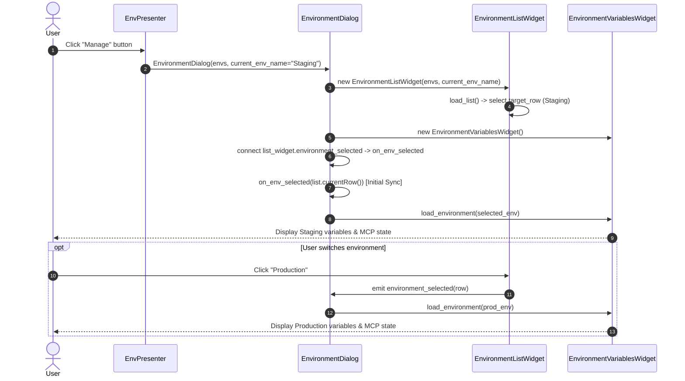

# PYPOST-1073: Manage Environments — Display Current Environment Variables on Open

## Research

### Current Implementation & Root Cause Analysis

In PyPost, the environment management feature is implemented using a Model-View-Presenter (MVP) architecture split into:
1. **`EnvPresenter`** (`pypost/ui/presenters/env_presenter.py`): Manages the top-bar environment selector (`QComboBox`), loads and persists environments via `StorageInterface`, handles encryption gateways and MCP lifecycle, and creates/executes `EnvironmentDialog` when the user clicks "Manage".
2. **`EnvironmentDialog`** (`pypost/ui/dialogs/env_dialog.py`): A modal `QDialog` that coordinates between the left-side list of environments and the right-side variables table.
3. **`EnvironmentListWidget`** (`pypost/ui/widgets/environments/environment_list_widget.py`): A `QWidget` housing the `QListWidget` for selecting, creating, duplicating, importing, exporting, and deleting environments.
4. **`EnvironmentVariablesWidget`** (`pypost/ui/widgets/environments/environment_variables_widget.py`): A `QWidget` housing the `QTableWidget` for displaying and editing key-value pairs, hidden mask checkboxes, and MCP server enablement for the selected environment.

#### Root Cause of the Missing Variables on Open

When `EnvPresenter._open_env_manager()` opens the dialog:
```python
current_env_name = self._env_selector.currentText()
if self._env_selector.currentIndex() == 0:
    current_env_name = None

dialog = EnvironmentDialog(
    self._environments,
    self._widget,
    current_env_name,
    ...
)
dialog.exec()
```
Inside `EnvironmentDialog.__init__`:
```python
self._env_list_widget = EnvironmentListWidget(
    self._environments,
    current_env_name=current_env_name,
    ...
)
self._vars_widget = EnvironmentVariablesWidget(...)
...
self._env_list_widget.environment_selected.connect(self.on_env_selected)
```
Inside `EnvironmentListWidget.__init__`, `self.load_list()` is called:
```python
def load_list(self) -> None:
    self.env_list.blockSignals(True)
    self.env_list.clear()
    target_row = 0
    current_name = self._get_current_env_name()
    for i, env in enumerate(self.environments):
        item = QListWidgetItem(env.name)
        item.setFlags(item.flags() | Qt.ItemFlag.ItemIsEditable)
        self.env_list.addItem(item)
        if current_name and env.name == current_name:
            target_row = i

    if self.environments:
        self.env_list.setCurrentRow(target_row)
    self.env_list.blockSignals(False)
```

Three critical defects prevent the variables from displaying on open:
1. **Signal Blocking on Selection**: `self.env_list.setCurrentRow(target_row)` is called while `self.env_list.blockSignals(True)` is active, preventing `currentRowChanged` from emitting.
2. **Order of Signal Connection**: Even if signals were unblocked, `self._env_list_widget.environment_selected.connect(self.on_env_selected)` is connected *after* `EnvironmentListWidget.__init__` completes `load_list()`.
3. **No Initial Load Trigger**: `EnvironmentDialog.__init__` never calls `self.on_env_selected(self.env_list.currentRow())` or `self._vars_widget.load_environment(...)` after assembling the widgets and connecting the signals.

Consequently:
- The left list visually highlights row `target_row` (the active environment or first environment).
- The right variables table remains at row count 0 (`self._vars_widget._current_env` is `None`), and the MCP checkbox remains disabled.
- If the user clicks on the highlighted row, Qt's `currentRowChanged` does *not* fire because the row index did not change, leaving the table persistently blank.
- Existing tests masked this defect because unit tests in `tests/test_env_dialog.py` were manually invoking `dlg.on_env_selected(0)` after dialog creation.

#### Additional Edge Cases Identified in Operations

1. **Adding an Environment (`add_environment`)**:
   `EnvironmentListWidget.add_environment` sets `self.env_list.setCurrentRow(...)` while `blockSignals(True)` is active. The new environment's empty table is not loaded unless explicitly signaled.
2. **Deleting an Environment (`delete_environment`)**:
   When deleting row 0 from a 2-item list, row 0 remains the current row index in `QListWidget`. Because the row index does not change, Qt does not emit `currentRowChanged`, leaving stale data unless an explicit reload is emitted.
3. **Importing Environments (`import_environments`)**:
   After import, `self.load_list()` blocks signals when resetting `setCurrentRow(target_row)`. The variables widget is not reloaded with the imported environment data.

---

## Implementation Plan

### High-Level Flow
1. **Step 3 (Failing Repro Test)**:
   - Add automated test `test_dialog_init_immediately_loads_current_environment_variables` to `tests/test_env_dialog.py` without manual `on_env_selected()` calls.
   - Add tests for "No Environment" fallback selection and empty environments list.
   - Run tests to confirm RED failure on un-fixed codebase.
2. **Step 4 (Production Fix & Verification)**:
   - Update `EnvironmentDialog.__init__` to perform initial synchronization by calling `self.on_env_selected(self.env_list.currentRow())`.
   - Update `EnvironmentListWidget` (`load_list`, `add_environment`, `delete_environment`) to guarantee `environment_selected` is emitted whenever the selected environment model changes.
   - Verify all tests pass (GREEN) and run full regression suite.
3. **Step 5 (Code Cleanup)**:
   - Clean up unnecessary manual `dlg.on_env_selected(0)` calls in existing tests where dialog initialization should naturally handle it.
   - Verify compliance with PEP 8 and linting rules.
4. **Step 6 (Observability)**:
   - Ensure clear structured logging for environment manager dialog opening and environment selection.
5. **Step 7 (Technical Debt Analysis)**:
   - Document any remaining debt or opportunities for further simplification in environment UI state management.
6. **Step 8 (Dev Docs)**:
   - Update developer documentation regarding `EnvironmentDialog` lifecycle and component interaction.

---

### Mandatory — Failing Repro (Next Step 3)

- **Target File**: `tests/test_env_dialog.py`
- **Assertion Design**:
  - `test_dialog_init_immediately_loads_current_environment_variables`:
    Instantiate `EnvironmentDialog` with an active environment (containing variables, hidden keys, and MCP enabled). Assert immediately (without any `dlg.on_env_selected(...)` call) that:
    - `dlg.vars_table.rowCount() == len(env.variables) + 1`
    - `dlg.vars_table.item(0, 0).text()` matches the first variable key.
    - `dlg.vars_table.item(0, 1).text()` matches the first variable value (or mask).
    - `dlg.mcp_check.isEnabled() is True`
    - `dlg.mcp_check.isChecked() is True`
  - `test_dialog_init_with_no_env_specified_loads_first_env`:
    Instantiate `EnvironmentDialog` with multiple environments and `current_env_name=None`. Assert that row 0 is selected and variables of the first environment are immediately displayed in `vars_table`.
  - `test_dialog_init_with_empty_environments_leaves_table_empty_and_disabled`:
    Instantiate `EnvironmentDialog` with `[]`. Assert `dlg.env_list.currentRow() == -1`, `dlg.vars_table.rowCount() == 0`, and `dlg.mcp_check.isEnabled() is False`.
- **Failure Mechanism**:
  On the current code, `dlg.vars_table.rowCount()` is `0` and `dlg.mcp_check.isEnabled()` is `False` immediately after construction because `on_env_selected` is never triggered during `__init__`.
- **Sequencing**:
  1. Write the repro tests in `tests/test_env_dialog.py` (Step 3).
  2. Run pytest to assert RED failure.
  3. Apply fix in Step 4 until all tests turn GREEN.

---

## Architecture

### Component Architecture & Responsibilities

```
+-------------------------------------------------------------------------+
|                              EnvPresenter                               |
| (Coordinates MainWindow combo selector, Storage gateway, MCP lifecycle) |
+-------------------------------------------------------------------------+
                                    |
                                    | creates & exec()
                                    v
+-------------------------------------------------------------------------+
|                           EnvironmentDialog                             |
|    (Composite View & Mediator between list and variable table widgets)   |
|                                                                         |
|  +-----------------------------+     +-------------------------------+  |
|  |    EnvironmentListWidget    |     |  EnvironmentVariablesWidget   |  |
|  |  (Left Pane: QListWidget)   |     | (Right Pane: QTableWidget)    |  |
|  | - Environments working list |     | - Variable key/value editing  |  |
|  | - Add / Delete / Import     |     | - Secret mask checkbox        |  |
|  | - Selection state           |     | - MCP enablement checkbox     |  |
|  +-----------------------------+     +-------------------------------+  |
|                 |                                    ^                  |
|                 +--- environment_selected(int) ------+                  |
+-------------------------------------------------------------------------+
```

### Module Diagram & Interaction



### Architectural Patterns & Decisions

1. **Mediator Pattern (`EnvironmentDialog`)**:
   `EnvironmentDialog` acts as the mediator between `EnvironmentListWidget` and `EnvironmentVariablesWidget`. Instead of tight coupling between the two widgets, the dialog connects `EnvironmentListWidget.environment_selected` to its internal `on_env_selected` slot, which delegates to `EnvironmentVariablesWidget.load_environment()`.
2. **Initial State Synchronization Contract**:
   Upon construction, after subwidgets are created and signals are connected, `EnvironmentDialog` must immediately evaluate `self.env_list.currentRow()` and dispatch `self.on_env_selected(row)`. This guarantees that the visual state of the variables table always matches the selection state of the list.
3. **Reactive Selection Lifecycle**:
   `EnvironmentListWidget` must ensure that any list mutation (adding an environment, deleting an environment, reloading from import) reliably emits `environment_selected` with the new row index, preventing stale variable table display when row indices are preserved.

### Interfaces & Signal Contracts

- **`EnvironmentListWidget`**:
  - `environment_selected = Signal(int)`: Emitted whenever the active row changes or the list is reloaded. Emits the current row index (`-1` if list is empty).
  - `load_list() -> None`: Clears and repopulates the `QListWidget`, selects `target_row`, and emits `environment_selected`.
  - `add_environment() -> None`: Appends a new environment, selects the new row, and emits `environment_selected`.
  - `delete_environment(row: int | None = None) -> None`: Removes the environment, updates selection, and emits `environment_selected`.
- **`EnvironmentVariablesWidget`**:
  - `load_environment(env: Environment | None) -> None`:
    - If `env is None`: Clears `vars_table` (0 rows), unchecks and disables `mcp_check`.
    - If `env is Environment`: Populates `vars_table` with `len(env.variables) + 1` rows (variables + trailing row), configures secret masks, enables `mcp_check`, and sets checked state matching `env.enable_mcp`.
- **`EnvironmentDialog`**:
  - `__init__(environments, parent, current_env_name, ...)`: Initializes subwidgets, connects `environment_selected`, and triggers `on_env_selected(self.env_list.currentRow())`.
  - `on_env_selected(row: int) -> None`: Resolves environment at `row` and invokes `self._vars_widget.load_environment(env)`.

---

## Q&A

| Question | Answer |
| --- | --- |
| Why was `EnvironmentDialog` not populating the variables table on open? | In `EnvironmentDialog.__init__`, `load_list()` was called inside `EnvironmentListWidget` with signals blocked before `EnvironmentDialog` connected to `environment_selected`. After signal connection, no initial load call was made. |
| What happens when "No Environment" is active in MainWindow? | `EnvPresenter` passes `current_env_name=None`. `EnvironmentListWidget` defaults to selecting row 0 (the first available environment). `EnvironmentDialog` immediately loads row 0 into the variables table. If no environments exist at all, row index is -1, clearing and disabling the variables table. |
| How does this affect existing unit and E2E tests? | Existing tests that manually called `dlg.on_env_selected(0)` will continue to work, but will now also be updated/supplemented with true user-scenario tests that verify automatic loading without manual intervention. |
| Does this change persistence or the model layer? | No. The domain models (`Environment`), storage interface, encryption, and export/import serialization formats remain untouched. |
