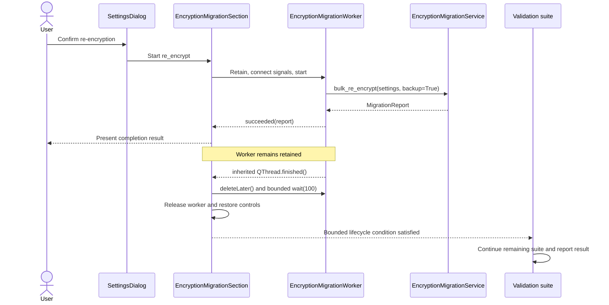

# PYPOST-1076: Verify crash-free encryption migration validation

## Research

### Repository evidence

- The current `HEAD` is commit `17c20fb9180b05efd16ac04f17dd630efcd16cc1`,
  `fix(ui): PYPOST-1072 stabilize migration worker lifecycle`. Its tree is unchanged for all four
  scoped production and test files.
- Before that commit, `EncryptionMigrationWorker.finished(object)` shadowed the inherited
  no-argument `QThread.finished()` lifecycle signal, and result handling released the retained
  worker before native thread termination. Commit `17c20fb9` replaced the domain signal with
  `succeeded(object)` and preserved inherited `finished()` for lifecycle cleanup.
- `EncryptionMigrationSection` now retains exactly one worker, connects `succeeded` and `failed`
  to result presentation, and separately connects inherited `finished()` to cleanup. Cleanup
  calls `deleteLater()`, performs `wait(100)`, logs a structured warning if the bound expires,
  clears the retained reference, and restores the migration buttons.
- `test_reencrypt_runs_when_confirmed` confirms the affirmative path calls
  `bulk_re_encrypt(..., backup=True)` exactly once and requests the existing result UI exactly
  once. `test_migration_worker_is_retained_until_thread_completion` independently checks that
  presentation happens after domain success while the worker remains retained, then that native
  completion triggers deletion, ownership release, and control restoration.
- Both scoped test modules have explicit pytest timeouts. The real-Qt UI helper also has an
  assertion-producing 5,000 millisecond internal bound and waits for lifecycle cleanup rather
  than merely waiting for result delivery.
- Committed PYPOST-1072 evidence records 14 focused tests passing and two full `make test` runs
  completing on the unchanged implementation in 549.51 and 547.88 seconds of pytest time. Each
  run reached its overall result with 2,205 passed, 5 pre-existing PYPOST-1071 failures, and 22
  deselected; every migration scenario completed without a crash or hang.
- The present host is macOS arm64, but its repository virtual environment is CPython 3.14.6.
  Therefore Step 2 does not treat a new run in this environment as substitute evidence for the
  required CPython 3.13.13 platform check.

### Current official guidance

- The [Qt for Python `QThread` documentation][qthread-doc] defines `finished()` as the thread
  lifecycle signal, permits connecting it to `deleteLater()`, and notes that cleanup effects can
  continue after signal delivery. It prescribes checking a successful `wait()` when all thread
  effects must be synchronized. The current implementation follows this separation and uses a
  bounded wait rather than an unbounded GUI-thread join.
- The [Qt for Python `QCoreApplication` documentation][qcoreapplication-doc] discourages local
  loops that continuously call `processEvents()` and warns that they do not process
  `DeferredDelete` events without additional handling. The current tests instead use a bounded
  repository helper and explicitly flush deferred deletion when closing each dialog.
- The [pytest flaky-test guidance][pytest-flaky] identifies uncontrolled shared state and
  incomplete thread cleanup as common causes of nondeterminism, and specifically recommends
  eventually waiting for threads spawned by tested behavior. Retaining the worker through native
  completion and closing every dialog address those risks for the module-scoped `qapp` fixture.
- The [pytest fixture documentation][pytest-fixtures] defines fixture scope as the lifetime over
  which an instance is shared. Since `tests/conftest.py` declares `qapp` at module scope, explicit
  per-test widget and worker cleanup is part of the test-isolation contract.

### Gap decision

No distinct production or test change remains for PYPOST-1076. Commit `17c20fb9` already supplies
the lifecycle correction and the behavioral coverage requested by the requirements. Its exact
tree is current, and its recorded focused and repeated full-suite results cover confirmation,
exactly-once re-encryption, result presentation, continued execution, and bounded completion.

The remaining work is acceptance verification, particularly preserving explicit evidence from
macOS arm64 with CPython 3.13.13. That is a validation activity, not a reason to manufacture a
failing test against behavior that is already correct. The separately tracked PYPOST-1078
failure-path UI coverage is non-blocking and does not represent the confirmed-success behavior in
scope here.

## Implementation Plan

PYPOST-1076 is a verification-only closure. Production behavior, test behavior, public signals,
dependencies, migration semantics, and user-visible results remain unchanged.

1. Record the immutable baseline before validation: `HEAD` must contain `17c20fb9`, and the four
   scoped production/test files must have no worktree diff.
2. On macOS arm64 with CPython 3.13.13, use the repository-managed environment and run the focused
   worker and Settings UI modules through the Makefile:
   `make test PYTEST_ARGS='tests/test_encryption_migration_worker.py
   tests/test_settings_encryption_migration_ui.py -v'`.
3. Confirm all 14 focused tests pass. In particular, verify exactly-once re-encryption and result
   presentation, retained ownership between domain success and native completion, bounded cleanup,
   restored controls, and assertion-producing waits.
4. Run `make test` twice without changing the scoped tree. Capture interpreter version, OS and
   architecture, command, exit code, counts, duration, and any native termination diagnostics.
5. Accept the result when both runs reach a conclusive overall pytest result within the
   established limit, all migration scenarios complete, and neither run stalls, hangs, reports a
   bus error, nor terminates at process level. Known unrelated test failures may be classified only
   with separately established baseline evidence; they must not obscure migration completion.
6. If verification contradicts the committed evidence, stop verification-only closure and open a
   newly scoped defect from the captured failing evidence. Do not alter PYPOST-1076 behavior based
   on a speculative cause.

**Mandatory — Failing Repro (next Step 3):** N/A — no behavioral change required in PYPOST-1076
because 17c20fb9 already provides and tests the fix. Step 3 must record this N/A decision and the
verification plan above; it must not add a red test that asserts an incorrect lifecycle or fails
against the correct current behavior.

## Architecture

### Selected patterns

- **Verification-only closure:** preserve the established design and prove acceptance without a
  redundant implementation delta.
- **Separate domain and lifecycle events:** `succeeded(MigrationReport)` and `failed(str)` report
  business outcomes; inherited `QThread.finished()` is the sole native completion boundary.
- **Explicit lifecycle ownership:** the settings section retains one active worker until bounded
  termination cleanup completes.
- **Deterministic contract plus platform validation:** focused tests lock observable ordering and
  exactly-once behavior; repeated full runs sample native integration on the affected platform.
- **Bounded waits:** both application cleanup and test polling have explicit limits and diagnostics.

### Module and component responsibilities

- **`SettingsDialog`:** composes the settings UI and hosts the compatibility worker reference.
- **`EncryptionMigrationSection`:** confirms migration, prevents concurrent migration workers,
  starts the selected operation, presents the existing result, and owns completion cleanup.
- **`EncryptionMigrationWorker`:** runs one selected `EncryptionMigrationService` operation off
  the GUI thread and emits distinct success or failure results.
- **`EncryptionMigrationService`:** performs the existing re-encryption operation and returns a
  `MigrationReport`; it is unchanged by this task.
- **Focused worker tests:** prove operation dispatch, exactly-once service invocation, success
  report delivery, and exception signaling/logging without live external dependencies.
- **Settings migration UI tests:** prove confirmation decisions, result presentation, lifecycle
  ordering, cleanup bounds, control restoration, and explicit dialog teardown.
- **`tests.helpers.process_until`:** provides bounded Qt event processing and raises a diagnostic
  assertion rather than silently returning at its deadline.
- **Makefile validation:** establishes the offscreen Qt environment and runs the repository's
  configured pytest suite consistently.

### Dependencies and interfaces

- `SettingsDialog` composes `EncryptionMigrationSection`.
- `EncryptionMigrationSection` depends on the worker, confirmation/result callables, current
  settings, and its host dialog's retained worker reference.
- `EncryptionMigrationWorker(service, operation, settings)` depends on
  `EncryptionMigrationService`, `AppSettings`, and Qt thread/signal semantics.
- `succeeded: Signal(object)` emits one `MigrationReport` after a service return.
- `failed: Signal(str)` emits a displayable message after a service exception.
- inherited `finished: Signal()` triggers lifecycle cleanup only.
- `wait(timeout_ms) -> bool` is invoked with the named 100 millisecond bound; `False` produces a
  structured warning rather than an unbounded wait.
- `_wait_for_migration_worker(..., timeout_ms=5_000)` succeeds only after the retained reference is
  cleared by lifecycle cleanup and raises with worker state and operation on timeout.

### Interaction scheme

### Preserved invariants

- A confirmed re-encryption starts at most one worker and calls the service exactly once.
- Domain-result delivery is not treated as proof of native thread termination.
- The completion result is presented before worker ownership is released.
- Cleanup cannot block indefinitely; timeout behavior is observable.
- Every dialog is explicitly closed and scheduled deferred deletion in tests.
- No user-visible encryption migration behavior or encryption data semantics change.

## Q&A

### Does PYPOST-1076 require a new production change?

No. Current code already implements the lifecycle behavior that removes the identified ownership
hazard, and the committed repeated-suite evidence reports complete runs without migration crash or
hang.

### Does PYPOST-1076 require a new test?

No. Existing tests directly cover the confirmed-success acceptance path and the lifecycle ordering.
Adding a deliberately red test against the corrected behavior would provide false evidence. The
appropriate next action is bounded verification on the required interpreter and platform.

### Why repeat the full suite if PYPOST-1072 already ran it twice?

The earlier runs establish strong evidence for the unchanged tree. Recording fresh environment
metadata and results under CPython 3.13.13 makes PYPOST-1076's platform-specific acceptance
self-contained without changing behavior.

### What happens if the platform verification fails?

Preserve the process-level failure details, suite position, logs, and environment metadata, then
scope a distinct defect. A new red repro is justified only by that observed gap, not by assuming
the already-fixed ownership race still exists.

[qthread-doc]: https://doc.qt.io/qtforpython-6/PySide6/QtCore/QThread.html
[qcoreapplication-doc]: https://doc.qt.io/qtforpython-6/PySide6/QtCore/QCoreApplication.html
[pytest-flaky]: https://docs.pytest.org/en/stable/explanation/flaky.html
[pytest-fixtures]: https://docs.pytest.org/en/stable/reference/fixtures.html
