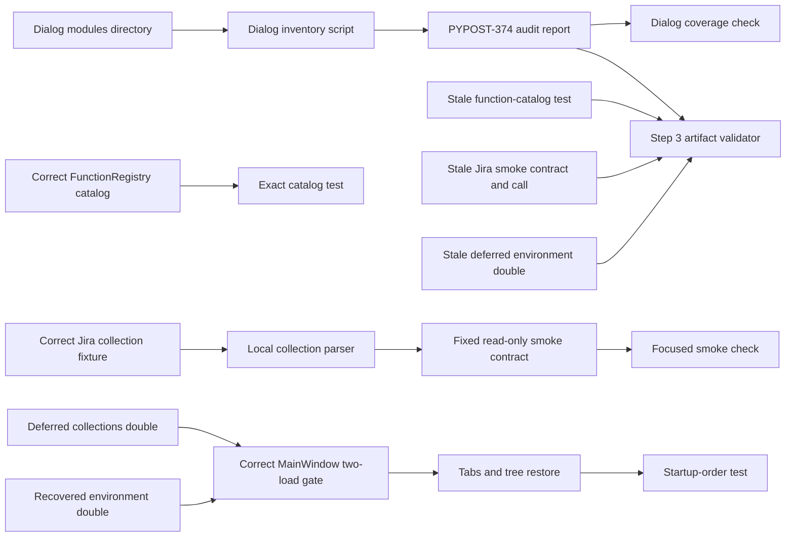

# PYPOST-1077: Restore Four Established Application Contracts

## Research

The approved requirements in `10-requirements.md` name four checks that must be restored
without reducing their protected contracts. Local inspection and repository history show
verification-contract drift, not a shared runtime defect.

### Contract classification and local evidence

1. **Dialog audit — documentation-as-contract recovery.**
   `scripts/audit_dialogs_inventory.py --check` finds that the PYPOST-374 audit report does
   not name `mcp_servers_dialog.py`, which was added in commit `31bff0ce`. Discovery correctly
   finds eight non-`__init__.py` modules totaling 1,030 LOC; `mcp_servers_dialog.py` is 333 LOC.
   The report is incomplete and has now-stale aggregate claims of seven modules, 923 LOC, two
   MCP dialogs, a seven-row testability table, and a complete-for-seven verdict. The recovered
   documentation contract requires a coherent full-inventory report, not merely one added name.
2. **Function catalog — stale test expectation over correct runtime behavior.**
   `FunctionRegistry.allowed_names()` correctly returns `urlencode`, `md5`, `base64`, and
   `to_int`; commit `70cbc2e8` added `to_int`. The existing exact-set assertion has only the
   first three names. The recovered test contract is exact equality with the four-name frozen
   catalog, not a subset or permissive assertion.
3. **Jira smoke — stale fixture-contract expectation over correct runtime behavior.**
   The local `jira-list-boards` collection request correctly has required `maxResults` and
   `startAt` MCP inputs after pagination was added in commit `dba00082`. The fixed smoke
   contract still expects no inputs. The recovered test and fixture contract preserves exact
   request IDs, normalized names, read-only methods, routes, bodies, input sets, and MCP
   exposure. Its board-listing input set is exactly `{"maxResults", "startAt"}`.
4. **Encrypted startup — stale test double over correct runtime behavior.**
   `MainWindow` still restores only after both readiness flags are true. Its constructor now
   calls `EnvPresenter.set_mcp_server_controller`, also added in commit `31bff0ce`; the deferred
   environment presenter double lacks that method and fails setup before the order assertion.
   The recovered double supplies that constructor seam without bypassing the two-load gate.

The exact private test names were searched on the public web and returned no useful result.
The architecture therefore relies on local source, fixtures, focused-test output, and the
repository history above. The remaining three recoveries are respectively a test expectation,
fixture contract, and test-double contract over correct runtime behavior. No finding shows that
the registry, Jira collection, or startup gate currently violates its intended contract.

## Implementation Plan

1. In Step 3, create dedicated automated red checks for the desired verification-artifact
   contracts. This is intentional for a task that recovers stale tests and documentation:
   each check reads and parses the local stale artifact, not a live service or an already-correct
   production component. It must fail on the obsolete artifact data and must not be described as
   diagnosing a production defect.
2. Keep Step 3 red: do not update the report, test expectations, fixture expectations, test
   double, production modules, or runtime behavior in that step. Independently review the red
   failures before beginning recovery.
3. In Step 4 only, recover the dialog report in
   `ai-tasks/PYPOST-374/30-dialogs-audit-report.md`. Add the `mcp_servers_dialog.py` inventory
   entry and assessment, including its 333 LOC, then regenerate every dependent aggregate claim:
   scope and inventory state eight modules and 1,030 LOC; the MCP summary covers three dialogs;
   the testability table has one row for each of the eight modules; and the final verdict says
   complete for all eight. Update inventory and coverage language so it describes the same scope.
   The report must contain no internally contradictory module-count, LOC, MCP-dialog, table, or
   completion claims. Retain directory discovery and its complete-coverage check; do not exclude
   the module.
4. In Step 4 only, recover the function-catalog verification by expecting the exact immutable
   set `frozenset({"urlencode", "md5", "base64", "to_int"})`. Equality remains required so an
   omission or an unapproved extra callable fails.
5. In Step 4 only, recover the Jira smoke verification and fixture call contract. Preserve the
   selected four tools and all exact read-only checks. Require `maxResults` and `startAt` for
   `jira-list-boards`, and pass deterministic values `maxResults=50` and `startAt=0`; do not
   enable live Jira for focused verification.
6. In Step 4 only, add `set_mcp_server_controller` to the narrow deferred environment presenter
   double. Preserve the assertions that no restore occurs after either single readiness signal
   and exactly one tabs/tree restore occurs after the second signal.
7. After the Step 4 artifact updates, run both the new artifact-validation tests and the existing
   focused functional checks, then their containing modules. The former prove recovered artifact
   declarations; the latter retain behavior coverage. No production code change is expected or
   authorized by this plan.

### Mandatory — Failing Repro (next Step 3)

This work is **not N/A**. Although production behavior is presently correct, PYPOST-1077
explicitly requires restoration of every named check. Step 3 adds
`tests/test_pypost_1077_verification_artifacts.py`: dedicated, local artifact-validation tests.
They use `ast.parse` for Python test declarations instead of brittle text matching, and use the
existing dialog-audit parser for the Markdown report. They do not execute a live service, read
credentials, or call Jira.

1. **Dialog audit report:** call `check_audit_report_covers(discover_dialog_modules())` and
   require an empty issue list; this remains the full filename-discovery coverage check. Also
   parse the report as the documentation contract and require its complete inventory to state
   eight modules and 1,030 LOC, include `mcp_servers_dialog.py` at 333 LOC, describe three MCP
   dialogs, provide an eight-row testability table, and end with a complete-for-all-eight verdict.
   Assert that its scope, inventory, MCP summary, testability table, coverage language, and
   verdict have no contradictory aggregate or completion claims. It is red because the report
   omits the discovered module and retains false seven-module aggregates; this proves incomplete
   report coverage, not a dialog runtime fault.
2. **Function-catalog expectation:** parse `tests/test_function_registry.py`, locate
   `TestFunctionRegistry.test_allowed_names_matches_catalog`, and extract its expected
   `frozenset` literal from the equality assertion. Require exactly `urlencode`, `md5`, `base64`,
   and `to_int`. It is red now because the stale test artifact declares only three names, even
   though `FunctionRegistry.allowed_names()` already returns the desired four-name catalog.
3. **Jira smoke contract and invocation:** parse `tests/test_jira_mcp_live_smoke.py`. Locate the
   `jira-list-boards` tuple in `_SMOKE_READ_ONLY_CONTRACTS` and require its input-name set to be
   exactly `{"maxResults", "startAt"}`. Also locate the `await _mcp_call_tool_result` board call
   in `_run_live_smoke` and require its third argument to be exactly
   `{"maxResults": 50, "startAt": 0}`. Both assertions are red now: the declared input set is
   empty and the board call has no argument dictionary. This AST-only repro has no opt-in,
   credentials, transport, or live-Jira dependency.
4. **Encrypted-startup double:** parse `tests/test_main_window_encrypted_startup.py`, locate
   `_DeferredEnvPresenter`, and require a callable `set_mcp_server_controller` method that
   accepts the controller argument used by `MainWindow`. It is red because the stale double lacks
   that constructor seam. This proves a test-double artifact defect, not a startup-gate defect.

Run the local artifact-validation file before the existing focused functional checks. Step 3 makes
no recovery changes. Only after independent review confirms that every failure demonstrates the
stated artifact drift may Step 4 update the report, test expectations, smoke declaration and call,
and deferred double. Step 4 then reruns the artifact tests green and preserves the focused checks:
the dialog audit coverage check, the registry equality test, the Jira fixed-read-only smoke
contract check, and the Qt two-signal restore-order test. This validates the desired artifacts and
behavior without a production implementation change.

## Architecture

### Module and interaction diagram

The Step 3 validator reads declared artifacts, so it deliberately fails until the recovery has
updated them. The Step 4 focused checks retain behavior coverage against correct runtime and local
fixture state. The dialog path is documentation-as-contract: discovery supplies the complete
inventory, and the audit report must faithfully reconcile all derived totals, summaries, table
rows, and final coverage claims. The other recoveries repair only test expectations, fixture
invocation, or a double's collaboration seam, while preserving exact contracts.

### Components and responsibilities

- **`scripts/audit_dialogs_inventory.py`:** discovers dialog modules and reports omissions.
  `check_audit_report_covers(modules) -> list[str]` is empty only for full report coverage.
- **PYPOST-374 audit report:** is the documentation contract. It must name every discovered
  dialog, including `mcp_servers_dialog.py`, and reconcile its full eight-module, 1,030-LOC scope
  across the inventory, three-dialog MCP summary, eight-row testability table, coverage language,
  and final complete-for-all-eight verdict.
- **PYPOST-1077 artifact validator:** parses the report or Python ASTs to lock the desired
  declarations in stale verification artifacts. It is deliberately separate from the focused
  runtime and fixture checks that Step 4 retains.
- **`pypost.core.function_registry.FunctionRegistry`:** already owns the canonical permitted
  catalog. `allowed_names() -> frozenset[str]` is exactly `urlencode`, `md5`, `base64`, and
  `to_int`; the test must lock that complete set.
- **Jira fixture and smoke selector:** already represent exactly four approved read-only requests.
  The smoke declaration for `jira-list-boards` must include `maxResults` and `startAt`; its call
  must supply the deterministic values 50 and 0. Routes, methods, bodies, parameters, and MCP
  exposure remain strict.
- **`MainWindow` startup gate:** already requires collection and environment readiness before
  restoring tabs and tree state. The deferred environment double must implement the existing
  `set_mcp_server_controller` constructor collaboration so the test reaches that gate.

### Dependencies, patterns, and interfaces

- The dialog audit uses a strict documentation-as-contract pattern: filesystem discovery must
  equal the audit-report inventory, and all report aggregates must agree with that inventory. The
  report is repaired, never discovery weakened.
- The registry test uses immutable-set equality to protect both missing and unexpected callable
  names. It changes only the frozen expected catalog to match the already-correct registry.
- The Jira selector is a defensive allow-list adapter over parsed local fixture data. It remains
  fixed to four non-mutating requests and verifies exact request metadata before optional live
  transport. The Step 3 artifact validator never uses that transport, while the existing focused
  smoke tests retain their isolated local checks.
- Startup uses a two-event readiness barrier. Controlled Qt doubles drive the signals; the
  recovered double provides the constructor seam but does not mock or alter the barrier logic.

No new service, data store, public API, or product capability is introduced. Step 4 restores
verification artifacts and documentation only, and must not make a production implementation
change simply to make a test pass.

## Q&A

**Q: Why are these red checks not evidence of one runtime defect?**

**A:** The dialog failure identifies an incomplete audit report. The other three artifact checks
conflict with current correct production behavior: the registry contains `to_int`, the fixture
declares pagination inputs, and `MainWindow` retains the two-load barrier. Their stale
verification artifacts fail before the retained focused checks can protect those facts.

**Q: Why must the dialog report update more than its missing module row?**

**A:** The report is a documentation contract. Leaving its seven-module totals, two-dialog MCP
summary, seven-row testability table, or complete-for-seven verdict would make the report
self-contradictory despite filename coverage. Step 4 therefore regenerates all derived claims
from the same eight-module, 1,030-LOC inventory.

**Q: Does the recovery weaken any contract?**

**A:** No. The audit remains complete, the registry test remains exact equality, the Jira smoke
remains exactly four read-only tools with strict metadata, and the startup test still requires
both signals before exactly one restore.

**Q: Why is Step 3 required if no production fix is expected?**

**A:** PYPOST-1077 requires each named check to be restored. The red repros deliberately validate
the stale artifacts themselves; Step 4 recovers them, proves those checks green, and retains
focused validation against unchanged desired runtime behavior.
