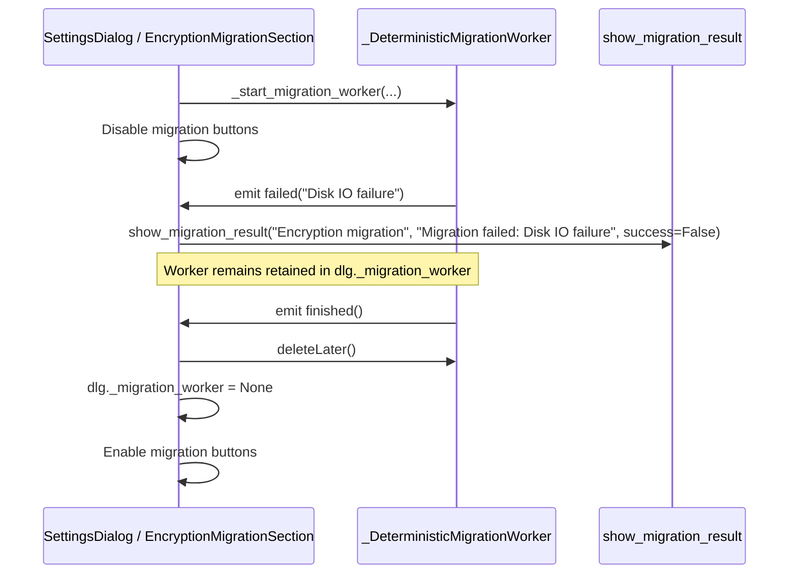

# PYPOST-1078: Architecture & Technical Design

## Research

### Current Architecture
- `EncryptionMigrationWorker` (`pypost/core/qt/encryption_migration_worker.py`) inherits from `QThread` and defines `succeeded`, `failed`, and inherited `finished` signals.
- In `EncryptionMigrationSection` (`pypost/ui/widgets/settings/encryption_migration_section.py`):
  - `_on_migration_worker_failed(message)` logs `settings_encryption_migration_worker_failed` and calls `_show_migration_result_fn(..., success=False)`.
  - `_on_migration_worker_thread_finished()` calls `finished.deleteLater()`, checks `finished.wait()`, nulls out `self.migration_worker`, and restores buttons with `_set_migration_buttons_enabled(True)`.
- `tests/test_settings_encryption_migration_ui.py` contains `_DeterministicMigrationWorker`, which currently simulates only the `succeeded` signal path.

## Architecture & Failure Lifecycle Sequence

## Implementation Plan

1. **Step 3 (Failing Repro)**:
   - Add test method `test_migration_worker_failure_lifecycle` to `TestSettingsDialogEncryptionMigration` in `tests/test_settings_encryption_migration_ui.py`.
   - Update `_DeterministicMigrationWorker` to support an optional `fail_message: str | None = None`.
   - In Step 3, write a repro test expecting the failure lifecycle behavior and verify RED (e.g. failing on assertions before fake parameterization or verifying behavior).
2. **Step 4 (Development)**:
   - Parameterize `_DeterministicMigrationWorker` cleanly to support both success and failure lifecycle paths.
   - Assert:
     - Worker retained during failure event (`retained_after_failure is True`).
     - Error result displayed with `success=False` (`mock_show.call_args.kwargs["success"] is False`).
     - Worker cleared on finish (`dlg._migration_worker is None`).
     - Memory release triggered (`worker.delete_later_called is True`).
     - Migration buttons restored to enabled state (`verify_encryption_btn`, `reencrypt_environments_btn`, `encrypt_plaintext_btn`, `upgrade_v2_btn`).
3. **Steps 5–8**: Code cleanup, observability verification, tech debt analysis, and dev docs.

## Q&A

- **Q: Are live threads or file IO used in this test?**
  - **A**: No, `_DeterministicMigrationWorker` executes synchronously on the test thread using mock signals, guaranteeing zero race conditions and instant execution.
