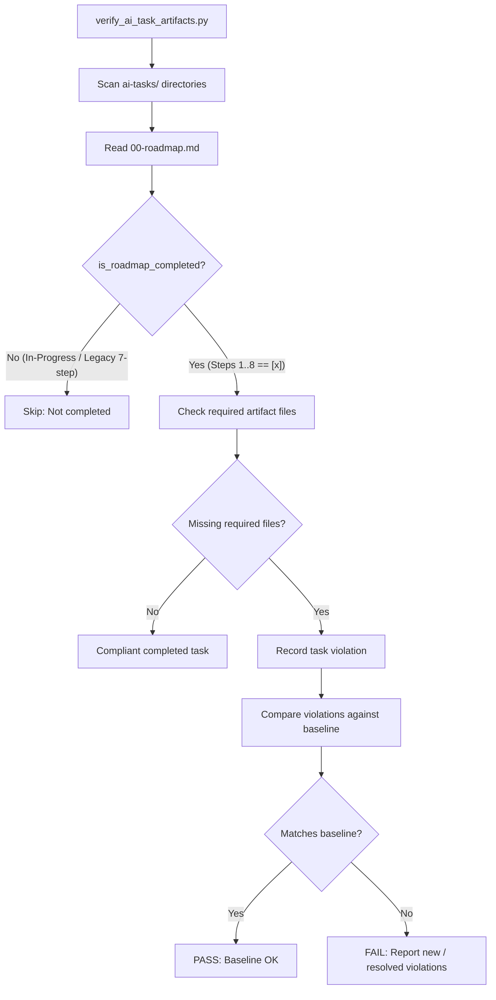

# PYPOST-1079: Automated Verification of Step 8 Developer Documentation

## Research

### Background & Context
In the Top-Down development workflow, Step 8 (`td-70-dev-docs`) requires creating or updating developer documentation under `doc/dev/` to reflect changes made during a task. PYPOST-1071 retired the obsolete task-local `70-dev-docs.md` requirement because developer documentation is living documentation stored in `doc/dev/`, rather than a static per-task summary.

During technical debt analysis in PYPOST-1071 (item D2 / follow-up F3), an automated enforcement gap was identified:
1. `scripts/verify_ai_task_artifacts.py` evaluated roadmap completion via `is_roadmap_completed`, which ended with `all(step_status.get(step, False) for step in range(1, 8))` — Python's `range(1, 8)` evaluates only integers 1 through 7, omitting Step 8 entirely.
2. `_COLLAPSED_STEP_RE` specifically matched `STEP 1-7` rather than `STEP 1-8`.
3. The script never verified whether Step 8 had occurred before considering a task closed.

### Repository Inventory Analysis
An empirical audit across all 940 `ai-tasks/` directories in the repository revealed the following distribution:
- **Total `ai-tasks/` directories**: 940 (934 contain `00-roadmap.md`).
- **Currently evaluated as "completed" under 7-step check (`range(1, 8)`)**: 836 tasks.
  - **Collapsed `STEP 1-7` format**: 66 tasks.
  - **Explicit `STEP 1-7` [x] without Step 8 [x]**: 566 tasks (historical tasks from earlier workflow iterations).
  - **Explicit `STEP 1-8` [x]**: 204 tasks (modern tasks completed under the 8-step standard).
- **Committed artifact baseline (`ai-tasks-artifacts-baseline.json`)**: Currently records 227 grandfathered legacy gap tasks (tasks counted as completed under the 7-step rule that lack required standard files such as `40-code-cleanup.md` or `50-observability.md`).

### Architectural Options Considered

| Option | Description | Pros | Cons | Verdict |
| --- | --- | --- | --- | --- |
| **Option A: Tighten `is_roadmap_completed` to `range(1, 9)` & `STEP 1-8` + Baseline Sync** | Update `is_roadmap_completed` to require steps 1 through 8 marked `[x]` (and collapsed `STEP 1-8`), and regenerate the baseline snapshot. | Strict adherence to 8-step Top-Down standard; deterministic; 100% resilient to heterogeneous text; no brittle regex parsing. | Reshuffles compliant set and baseline inventory (supported natively via `--update-baseline`). | **Selected** |
| **Option B: Parse `doc/dev/` paths from roadmap Step 8 text** | Extract file paths from Step 8 bullet points in `00-roadmap.md` and check if they exist on disk. | Verifies referenced file paths exist. | 36 of 205 modern roadmaps with Step 8 `[x]` summarize doc review without explicit file paths (e.g. "Verified developer docs"); high risk of false positives/negatives across heterogeneous roadmaps; high complexity. | **Rejected** |

### Selected Architecture
Option A is selected. In the Top-Down workflow, `00-roadmap.md` is the single progress journal. An AI task is only completed once all 8 steps have passed their respective acceptance gates and are marked `[x]`. Tightening `is_roadmap_completed` to enforce `range(1, 9)` ensures that no newly completed task is accepted without Step 8 completion. Historical legacy tasks are grandfathered cleanly via the committed baseline `ai-tasks-artifacts-baseline.json`.

---

## Implementation Plan

### High-Level Execution Sequence
1. **Step 3 (Failing Repro Test)**:
   - Create failing unit tests in `tests/test_verify_ai_task_artifacts.py` asserting that `is_roadmap_completed` strictly requires Step 8:
     - Asserts `is_roadmap_completed` returns `False` when Step 8 is missing, unchecked (`[ ]`), or in-progress (`[/]`).
     - Asserts `is_roadmap_completed` returns `True` only when all steps 1 through 8 are `[x]`.
     - Asserts `is_roadmap_completed` returns `False` for legacy collapsed `STEP 1-7` format and `True` for collapsed `STEP 1-8` `[x]`.
   - Run tests against existing implementation to demonstrate RED failure.
2. **Step 4 (Development & Implementation)**:
   - Update `_COLLAPSED_STEP_RE` in `scripts/verify_ai_task_artifacts.py` to match `STEP 1[\-–]8`.
   - Update `is_roadmap_completed` in `scripts/verify_ai_task_artifacts.py` to check `range(1, 9)`.
   - Update in-code docstrings and comments to document the 8-step enforcement.
   - Update test fixture helpers in `tests/test_verify_ai_task_artifacts.py` (e.g. `_write_completed_standard`) to generate 8 steps.
   - Regenerate `ai-tasks-artifacts-baseline.json` using `python3 scripts/verify_ai_task_artifacts.py --update-baseline`.
   - Run all test suites to confirm GREEN status.
3. **Step 5 (Code Cleanup)**:
   - Review code formatting, type annotations, and docstrings.
4. **Step 6 (Observability)**:
   - Validate CLI diagnostic reporting when incomplete roadmaps or baseline deviations are encountered.
5. **Step 7 (Technical Debt Analysis)**:
   - Document any architectural observations and residual debt in `60-tech-debt.md`.
6. **Step 8 (Developer Documentation)**:
   - Review and update `doc/dev/setup.md` or relevant developer guides to describe the 8-step verification gate.

### Mandatory — Failing Repro (next Step 3)
- **What it asserts**:
  1. `is_roadmap_completed` returns `False` for a roadmap containing steps 1–7 marked `[x]` but missing Step 8.
  2. `is_roadmap_completed` returns `False` for a roadmap containing steps 1–7 marked `[x]` with Step 8 marked `[ ]` (not started) or `[/]` (in progress).
  3. `is_roadmap_completed` returns `False` for a roadmap with legacy collapsed `STEP 1–7`.
  4. `is_roadmap_completed` returns `True` for a roadmap with all steps 1–8 marked `[x]`.
  5. `is_roadmap_completed` returns `True` for a roadmap with collapsed `STEP 1–8` marked `[x]`.
- **Where it lives**: `tests/test_verify_ai_task_artifacts.py` under class `TestRoadmapParsing`.
- **How to force failure without external dependencies**: Test uses pure in-memory string parsing and existing `is_roadmap_completed` function; no network, I/O, or external dependencies needed.
- **Sequencing**: Research (Step 2) → Failing red tests (Step 3) → Production fix and baseline synchronization until green (Step 4).

---

## Architecture

### System Components & Workflow



### Module Responsibilities

1. **`scripts/verify_ai_task_artifacts.py`**:
   - **`_STEP_LINE_RE`**: Matches `- [mark] STEP <number>:` lines.
   - **`_COLLAPSED_STEP_RE`**: Matches `- [mark] STEP 1-8` collapsed roadmap lines.
   - **`is_roadmap_completed(roadmap_text: str) -> bool`**: Verifies that all 8 steps in the Top-Down workflow standard are marked complete (`[x]`).
   - **`required_files_for_task(task_id: str) -> tuple[str, ...]`**: Returns required artifact files (`00-roadmap.md`, `10-requirements.md`, `20-architecture.md`, `40-code-cleanup.md`, `50-observability.md`, `60-tech-debt.md`, plus `30-audit-report.md` for audit tasks).
   - **`missing_required_files(task_dir: Path, task_id: str) -> list[str]`**: Checks presence of required files on disk.
   - **`collect_violations(ai_tasks_dir: Path) -> dict[str, list[str]]`**: Collects violations across all completed tasks in `ai-tasks/`.
   - **`compare_violations(current, baseline)`**: Computes new, resolved, and modified violations.
   - **`main()`**: CLI entry point supporting verification mode and `--update-baseline` sync mode.

2. **`ai-tasks-artifacts-baseline.json`**:
   - Stores the committed JSON snapshot of accepted grandfathered historical task violations.
   - Schema:
     ```json
     {
       "tasks": {
         "<TASK-ID>": ["<MISSING-FILE>", ...]
       },
       "violation_count": <INTEGER>
     }
     ```

3. **`tests/test_verify_ai_task_artifacts.py`**:
   - Unit and integration tests covering roadmap parsing, file requirements, violation collection, baseline comparison, and committed baseline integrity.

### Architectural Patterns
- **Pipeline / Filter Pattern**: Scans task directories, filters for completed roadmaps via `is_roadmap_completed`, maps to missing files, and filters/compares against baseline.
- **Grandfathering / Baseline Snapshot Pattern**: Decouples new workflow enforcement from historical repository debt by recording accepted legacy differences in a version-controlled baseline artifact.

---

## Q&A

**Q: Why is tightening `is_roadmap_completed` to `range(1, 9)` the preferred approach over parsing `doc/dev/` file paths?**  
**A:** `00-roadmap.md` is the authoritative single progress journal in the Top-Down workflow (`td-roadmap`), and marking Step 8 as `[x]` represents passing the documentation acceptance gate (`td-70-dev-docs`). Parsing unstructured markdown text for `doc/dev/` links is brittle, error-prone across hundreds of historical formats, and fails for valid tasks that review existing documentation without editing file paths.

**Q: What happens to historical tasks that only have Steps 1–7 marked `[x]`?**  
**A:** Historical tasks closed under older 7-step conventions do not have Step 8 marked `[x]`. Under the 8-step completion check, they are treated as legacy non-completed formats and bypassed by the artifact verifier. Any task differences are captured deterministically during baseline synchronization (`--update-baseline`), preventing CI failures while strictly enforcing 8 steps for modern tasks.

**Q: Will any existing protection for Steps 1 through 7 be weakened?**  
**A:** No. `is_roadmap_completed` will require all steps in `range(1, 9)` (i.e. steps 1, 2, 3, 4, 5, 6, 7, and 8) to be marked `[x]`, expanding the verified range without loosening any requirements for steps 1–7.

**Q: How does this task satisfy the Definition of Done in `10-requirements.md`?**  
**A:** It directly establishes automated verification for Step 8 in `scripts/verify_ai_task_artifacts.py`, validates the full 8-step standard, updates the committed baseline snapshot with zero false positives, and provides test coverage guarding against regression.
