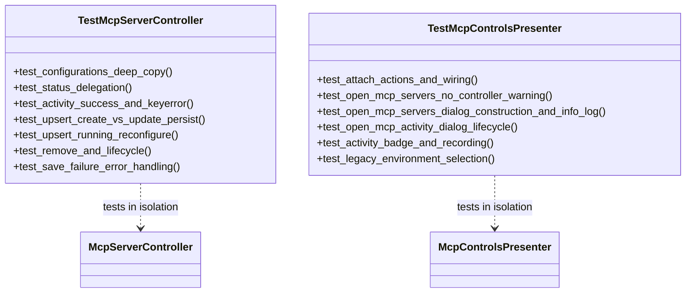

# PYPOST-1080: High-Level Architecture Design

## Research

### Controller and Presenter Boundaries (PYPOST-1071 Extraction)
- `McpServerController` (`pypost/ui/mcp_server_controller.py`):
  - Encapsulates multi-server lifecycle orchestration, state queries, transactional reconfiguration of running servers, persistence synchronization with `AppSettings`, and error recovery.
  - Key interfaces: `mcp_server_configurations()`, `mcp_server_status()`, `mcp_server_activity()`, `upsert_mcp_server()`, `remove_mcp_server()`, `start_mcp_server()`, `stop_mcp_server()`.
- `McpControlsPresenter` (`pypost/ui/presenters/mcp_controls_presenter.py`):
  - Manages toolbar MCP buttons (Server Management, Activity Log viewer), visual badges for activity counts, legacy single-server environment selection, and dialog launching (`McpServersDialog`, `McpActivityDialog`).
  - Key interfaces: `attach()`, `_open_mcp_servers()`, `_open_mcp_activity()`, `_on_mcp_activity_recorded()`, `_selected_legacy_mcp_environment()`.

## Implementation Plan

1. **Step 3 (Failing Repro / Test Harness Skeleton)**:
   - Create skeleton test files `tests/test_mcp_server_controller.py` and `tests/test_mcp_controls_presenter.py`.
   - Add initial failing assertions for the uncovered branches:
     - `mcp_server_activity` KeyError debug log.
     - `upsert_mcp_server` create/update reason tracking and running server reconfigure.
     - `_open_mcp_servers` log emission and 13 injected callables contract.
2. **Step 4 (Development)**:
   - Implement complete unit test suites covering all controller and presenter methods, error states, and edge cases.
   - Include explicit timeout markers (`pytestmark = pytest.mark.timeout(30)` or `60`).
   - Confirm all tests pass GREEN.
3. **Step 5–8**:
   - Run `make lint`, document observability verification, technical debt, and update dev documentation in `doc/dev/testing.md`.

## Architecture

### Test Architecture Diagram

### Coverage Matrix

| Component | Target Branch / Feature | Test Method |
| --- | --- | --- |
| `McpServerController` | `mcp_server_activity` KeyError branch (:126-135) | `test_mcp_server_activity_handles_keyerror_with_debug_log` |
| `McpServerController` | `upsert_mcp_server` create vs update persist path (:148-156) | `test_upsert_mcp_server_creates_and_updates_with_correct_reason` |
| `McpServerController` | `upsert_mcp_server` running server reconfigure (:143-147) | `test_upsert_mcp_server_reconfigures_running_server_without_settings_mutation` |
| `McpControlsPresenter` | `_open_mcp_servers` no controller warning (:285-288) | `test_open_mcp_servers_without_controller_logs_warning` |
| `McpControlsPresenter` | `_open_mcp_servers` info log & 13 callables (:290-311) | `test_open_mcp_servers_logs_info_and_constructs_dialog_with_callables` |
| `McpControlsPresenter` | `_selected_legacy_mcp_environment` (:313-315) | `test_selected_legacy_mcp_environment_filters_by_enable_mcp` |

## Q&A

- **Q: How are Qt widgets instantiated safely across test runners?**
  - A: Using standard PySide6 `QApplication.instance() or QApplication(sys.argv)` fixture handling.
