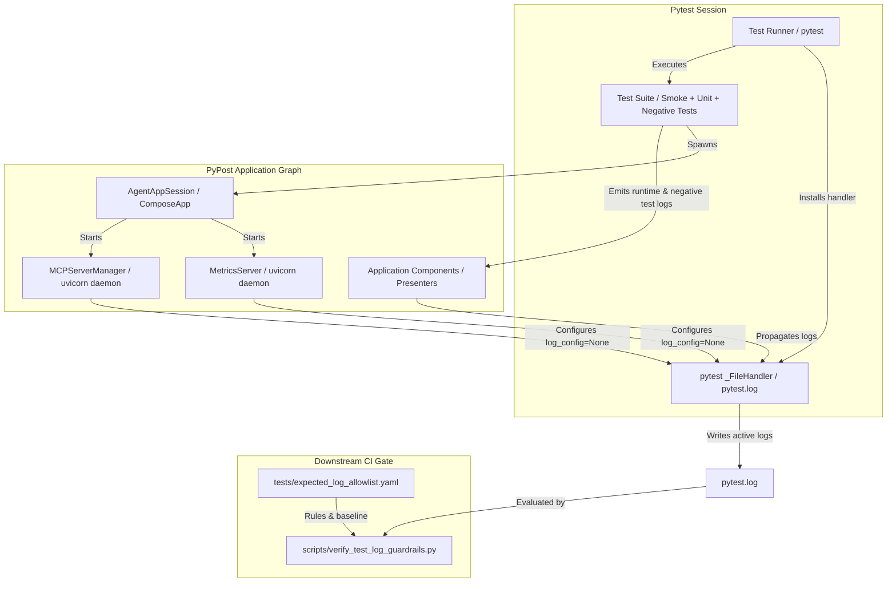

# PYPOST-1081: Restore Log File Capture for CI Error Guardrail Protection

## Research

### Problem Context & Reproduction

In continuous integration (`.github/workflows/test.yml:144,147`), pytest is executed with `--log-file=pytest.log --log-file-level=WARNING`, followed by a guardrail verification step:
```sh
scripts/verify_test_log_guardrails.py pytest.log
```
The purpose of this gate is to detect unexpected runtime regressions by auditing all warning and error logs against an approved allowlist (`tests/expected_log_allowlist.yaml`) and enforcing a maximum allowed ERROR baseline count.

On a full-suite test run, `pytest.log` was discovered to be completely empty (0 bytes). Consequently, `scripts/verify_test_log_guardrails.py` reported `ERROR count: 0 (max allowed: 77)` and exited 0, creating a vacuous pass that protected against zero errors.

### Root Cause Identification

A reproduction sequence isolated the trigger:
1. Running `pytest tests/test_env_presenter.py --log-file=a.log --log-file-level=WARNING` captured 111 bytes (1 ERROR log).
2. Running `pytest tests/test_agent_lifecycle_smoke.py tests/test_env_presenter.py --log-file=b.log --log-file-level=WARNING` produced a 0-byte log file.

Tracing the lifecycle of logging handlers during test execution revealed the exact mechanism:
- In `pypost/core/metrics_server.py:168`, `pypost/core/qt/mcp_server.py:231`, and `tests/helpers/mcp_live_server.py:71`, `uvicorn.Config` is instantiated without explicitly specifying `log_config`.
- By default, `uvicorn.Config.__init__` sets `log_config=LOGGING_CONFIG` and invokes `self.configure_logging()`.
- `uvicorn.config.Config.configure_logging` calls `logging.config.dictConfig(self.log_config)`.
- Python's standard library `logging.config.dictConfig` executes `_clearExistingHandlers()`, which invokes `logging.shutdown(logging._handlerList[:])`.
- `logging.shutdown()` iterates over every active handler in the process and calls `handler.close()`.
- Pytest's log-file handler (`_pytest.logging._FileHandler`) is closed by `logging.shutdown()`, setting `self.stream = None` and closing the underlying file descriptor.
- Subsequent log records emitted during test execution are no longer written to the log file.

### Proof of Fix Verification

By configuring `uvicorn.Config(..., log_config=None)`:
- Uvicorn skips `logging.config.dictConfig()`.
- Root logging handlers and pytest's `_FileHandler` remain open and active across the entire test session.
- Running `pytest tests/test_agent_lifecycle_smoke.py tests/test_env_presenter.py` with `log_config=None` successfully captured the 111 bytes of ERROR output.
- Running the full fast test suite captured 144 real ERROR events into `pytest.log`, proving that log file capture is fully restored and the guardrail becomes active.

---

## Implementation Plan

### 1. Step 3: Failing Repro Test Design (Automated Red Test)
- **File**: `tests/test_log_capture_guardrail_repro.py`.
- **Assertion**:
  1. Instantiating and starting an in-process server (`AgentAppSession`, `MetricsServer`, or `MCPServerManager`) must not close existing `logging.FileHandler` instances or set their stream to `None`.
  2. Emitting log records before and after running server startup/shutdown cycles must reliably capture events into the target log file.
  3. Running `AgentAppSession` followed by an error-emitting component must result in non-empty captured file logs containing the expected log records.
- **Isolation**: Uses standard library `logging.FileHandler` targeting temporary directories without live external network dependencies.
- **Sequencing**:
  1. Write the red repro test in Step 3.
  2. Confirm it fails against the current unpatched uvicorn configuration (stream becomes `None` / 0 bytes captured).
  3. Apply the production fixes in Step 4 until the repro test passes.

### 2. Step 4: Core Fixes
1. **`pypost/core/metrics_server.py`**:
   - Update `uvicorn.Config(...)` in `_run_uvicorn()` to explicitly pass `log_config=None`.
2. **`pypost/core/qt/mcp_server.py`**:
   - Update `uvicorn.Config(...)` in `_run_uvicorn()` to explicitly pass `log_config=None`.
3. **`tests/helpers/mcp_live_server.py`**:
   - Update `uvicorn.Config(...)` in `_run_uvicorn()` to explicitly pass `log_config=None`.
4. **Allowlist Curation (`tests/expected_log_allowlist.yaml`)**:
   - Audit the 144 ERROR lines surfaced on full-suite runs.
   - Categorize legitimate negative/error tests into approved allowlist rules (such as `http_client` template conversions, worker errors, partial environment load failures, server bind conflict tests, and proxy errors).
   - Update `baseline_error_count` and `error_margin` to accurately reflect the live error baseline.
5. **CI Guardrail Verification**:
   - Ensure `scripts/verify_test_log_guardrails.py` passes deterministically on full-suite runs in CI and local environments.

---

## Architecture

### System Component Diagram



### Module Responsibilities

| Module | Responsibility | Architectural Change |
| --- | --- | --- |
| `pypost/core/metrics_server.py` | Runs the Prometheus scrape & MCP metrics ASGI server via background uvicorn thread. | Pass `log_config=None` to `uvicorn.Config` so uvicorn does not call `dictConfig` or close logging handlers. |
| `pypost/core/qt/mcp_server.py` | Runs the embedded MCP server via background uvicorn thread. | Pass `log_config=None` to `uvicorn.Config` to prevent process-wide logging reconfiguration. |
| `tests/helpers/mcp_live_server.py` | Test harness for live MCP server testing. | Pass `log_config=None` to `uvicorn.Config`. |
| `tests/expected_log_allowlist.yaml` | Defines approved error log patterns and baseline limits for CI guardrails. | Curate rules and update `baseline_error_count` for legitimate error-handling test cases now visible. |
| `scripts/verify_test_log_guardrails.py` | CI quality gate verifying captured test log records against allowlist. | Unchanged; now actively verifies non-empty logs. |

### Data Flow & Invariants

1. **Logging Ownership Invariant**: PyPost application configuration (via `pypost/main.py` and pytest test runner) owns process logging configuration. Embedded background servers (uvicorn) must treat logging configuration as external and immutable (`log_config=None`).
2. **Handler Persistence Invariant**: Initializing, running, or stopping any server, fixture, or test module must never detach, mutate, or close handlers on the root logger or active pytest logging plugins.
3. **Guardrail Non-Vacuity Invariant**: Test log files inspected by `scripts/verify_test_log_guardrails.py` must contain all emitted warning and error events from test execution. An empty log file or unlisted error fails the gate.

---

## Q&A

**Q: Why does uvicorn reconfigure logging by default?**
**A:** Uvicorn is designed to run as a standalone CLI application by default, where setting up standard console formatters and access logs via `dictConfig` is appropriate. When uvicorn is embedded as a library inside an existing desktop application or test runner, its default `dictConfig` resets process-wide logging. Setting `log_config=None` tells uvicorn that the host application manages logging.

**Q: Why did this defect remain hidden previously?**
**A:** `tests/test_agent_lifecycle_smoke.py` was introduced in PYPOST-833. As soon as that smoke test ran, uvicorn started and silenced pytest's `--log-file` handler. The CI step ran `verify_test_log_guardrails.py pytest.log`, which saw 0 errors and reported success because 0 was less than the baseline of 72.

**Q: Will passing `log_config=None` break uvicorn's error logging?**
**A:** No. Uvicorn continues to log via Python's standard `logging.getLogger("uvicorn")` and `logging.getLogger("uvicorn.error")`. Because `log_config=None` leaves the host logging hierarchy intact, uvicorn's log records cleanly propagate to the root logger and are captured in `pytest.log` and stdout/stderr as intended.

**Q: How will legitimate error logs from negative tests be curated?**
**A:** The 144 error lines surfaced across the test suite originate from intentional negative test cases (such as template integer formatting failures, proxy disconnect tests, simulated bind collisions, and corrupted config loads). In Step 4, these will be triaged and registered in `tests/expected_log_allowlist.yaml` with appropriate pattern prefixes and an updated baseline error count.
