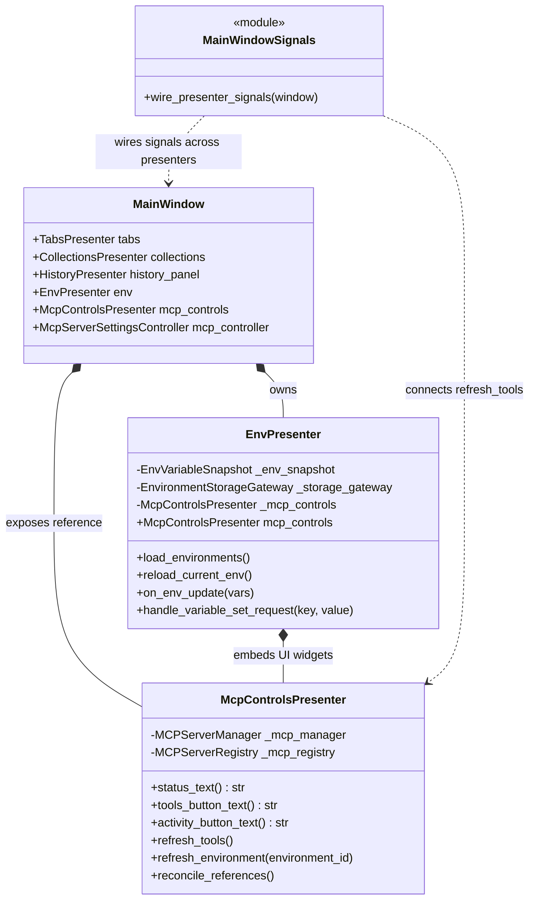

# PYPOST-1082: Retire the EnvPresenter MCP delegating shims and fix its stale class docstring

## Research

### Background and Context

In PYPOST-1071, MCP controls, status rendering, and activity management were modularized out of `EnvPresenter` into a dedicated `McpControlsPresenter` (`pypost/ui/presenters/mcp_controls_presenter.py`). However, to avoid ripple effects across signal wiring and unit tests during that refactor, four delegating shim methods were temporarily preserved on `EnvPresenter`:
1. `mcp_status_text(self) -> str` (`pypost/ui/presenters/env_presenter.py:182`)
2. `mcp_tools_button_text(self) -> str` (`pypost/ui/presenters/env_presenter.py:185`)
3. `mcp_activity_button_text(self) -> str` (`pypost/ui/presenters/env_presenter.py:188`)
4. `refresh_mcp_tools(self) -> None` (`pypost/ui/presenters/env_presenter.py:363`)

In addition:
- The class docstring of `EnvPresenter` (`pypost/ui/presenters/env_presenter.py:51-52`) still states:
  ```python
  class EnvPresenter(QObject):
      """Owns the environment selector: loading envs, propagating vars, managing MCP lifecycle."""
  ```
  This is inaccurate because MCP lifecycle management belongs to `MCPServerManager` / `MCPServerRegistry` and the `McpControlsPresenter` domain.
- `pypost/ui/main_window_signals.py` routes three Qt signals to `window.env.refresh_mcp_tools`:
  - `window.collections.collections_changed.connect(window.env.refresh_mcp_tools)` (line 18)
  - `window.collections.requests_deleted.connect(window.env.refresh_mcp_tools)` (line 21)
  - `window.tabs.request_saved.connect(window.env.refresh_mcp_tools)` (line 31)
- `tests/test_env_presenter.py` has tests calling the legacy shims on `EnvPresenter` or reaching into `p._mcp_controls` directly.

### Target Seam & Component Model

1. **`EnvPresenter` Seam**:
   - Remove the four delegating shims (`mcp_status_text`, `mcp_tools_button_text`, `mcp_activity_button_text`, `refresh_mcp_tools`).
   - Expose a public accessor property `@property def mcp_controls(self) -> McpControlsPresenter:` returning `self._mcp_controls`.
   - Update docstring to: `"""Owns the environment selector: loading envs, propagating vars, and environment selection."""`.
   - Keep `set_mcp_server_controller` as a delegator for MainWindow integration compatibility.

2. **`MainWindow` Seam**:
   - Expose `self.mcp_controls = self.env.mcp_controls` directly on `MainWindow` (in `pypost/ui/main_window.py`).

3. **`pypost/ui/main_window_signals.py` Wiring**:
   - Re-route the three signal connections from `window.env.refresh_mcp_tools` directly to `window.mcp_controls.refresh_tools`:
     - `window.collections.collections_changed.connect(window.mcp_controls.refresh_tools)`
     - `window.collections.requests_deleted.connect(window.mcp_controls.refresh_tools)`
     - `window.tabs.request_saved.connect(window.mcp_controls.refresh_tools)`

4. **Test Suite Modernization**:
   - In `tests/test_env_presenter.py`, update test cases to use `p.mcp_controls.status_text()`, `p.mcp_controls.tools_button_text()`, `p.mcp_controls.activity_button_text()`, and `p.mcp_controls.refresh_tools()`.
   - In `tests/test_main_window_signals.py`, add explicit unit tests verifying that `collections_changed`, `requests_deleted`, and `request_saved` connect directly to `window.mcp_controls.refresh_tools`.

---

## Implementation Plan

### Step-by-Step Sequencing

1. **Step 3: Automated Failing Repro Tests**:
   - Write automated unit tests before applying production code modifications:
     - In `tests/test_main_window_signals.py`: assert that `wire_presenter_signals` connects `collections.collections_changed`, `collections.requests_deleted`, and `tabs.request_saved` to `window.mcp_controls.refresh_tools`.
     - In `tests/test_env_presenter.py` (or a dedicated test): assert that `EnvPresenter` does not have `mcp_status_text`, `mcp_tools_button_text`, `mcp_activity_button_text`, or `refresh_mcp_tools` methods (raising `AttributeError` / returning `False` on `hasattr`).
     - Assert that `EnvPresenter.__doc__` does not claim "managing MCP lifecycle".
     - Assert that `EnvPresenter.mcp_controls` returns the `McpControlsPresenter` instance.
   - Run tests to confirm the expected RED status.

2. **Step 4: Implementation**:
   - **`pypost/ui/presenters/env_presenter.py`**:
     - Update class docstring: `"""Owns the environment selector: loading envs, propagating vars, and environment selection."""`.
     - Add public `@property def mcp_controls(self) -> McpControlsPresenter: return self._mcp_controls`.
     - Remove `mcp_status_text()`, `mcp_tools_button_text()`, `mcp_activity_button_text()`, and `refresh_mcp_tools()`.
   - **`pypost/ui/main_window.py`**:
     - Set `self.mcp_controls = self.env.mcp_controls` right after initializing `self.env`.
   - **`pypost/ui/main_window_signals.py`**:
     - Replace `window.env.refresh_mcp_tools` connections with `window.mcp_controls.refresh_tools`.
   - **`pypost/ui/presenters/mcp_controls_presenter.py`**:
     - Update module docstring to remove outdated notes about delegating shims on `EnvPresenter`.
   - **`tests/test_env_presenter.py` & `tests/test_main_window_signals.py`**:
     - Update all test invocations that used the deleted shims or reached into `_mcp_controls` to use `p.mcp_controls`.
   - Verify that all tests pass (GREEN).

3. **Step 5: Code Cleanup**:
   - Run formatting (`ruff check`, `ruff format`, type checking) and remove any leftover comments or unused imports.

4. **Step 6: Observability**:
   - Verify that logging and metric tracking (e.g. `mcp_active_env_changed`, `mcp_tools_overview_opened`) remain intact with zero regressions.

5. **Step 7: Technical Debt**:
   - Document the resolution of this debt item and any related domain boundaries.

6. **Step 8: Dev Docs**:
   - Update developer documentation under `doc/dev/` (e.g. `mcp_integration.md`, `environments_dialog.md`, `solid_audit.md`) that documented the temporary shims.

### Mandatory — Failing Repro (next Step 3)

- **Target Assertion**:
  1. `wire_presenter_signals(window)` connects `window.collections.collections_changed`, `window.collections.requests_deleted`, and `window.tabs.request_saved` to `window.mcp_controls.refresh_tools`.
  2. `hasattr(EnvPresenter, "mcp_status_text")` is `False`.
  3. `hasattr(EnvPresenter, "mcp_tools_button_text")` is `False`.
  4. `hasattr(EnvPresenter, "mcp_activity_button_text")` is `False`.
  5. `hasattr(EnvPresenter, "refresh_mcp_tools")` is `False`.
  6. `"managing MCP lifecycle"` not in `EnvPresenter.__doc__`.
  7. `isinstance(env_presenter.mcp_controls, McpControlsPresenter)` is `True`.
- **Location**: `tests/test_main_window_signals.py` and `tests/test_env_presenter.py`.
- **Forcing Failure**: Against the current codebase, `wire_presenter_signals` connects to `window.env.refresh_mcp_tools`, `EnvPresenter` defines the four shims, and its docstring contains the obsolete phrase. The tests will fail immediately without requiring external dependencies or network operations.
- **Sequencing**:
  1. Write the tests in Step 3.
  2. Execute `pytest` to confirm failure (RED).
  3. Implement the changes in Step 4.
  4. Execute `pytest` to confirm all tests pass (GREEN).

---

## Architecture

### System Module Diagram



### Module Responsibilities and Boundaries

| Module / Component | Responsibility | Public Interface |
|---|---|---|
| `EnvPresenter` (`pypost/ui/presenters/env_presenter.py`) | Environment selection, loading, saving, variable snapshotting, and managing environment top-bar UI layout. | `mcp_controls`, `widget`, `current_variables`, `current_hidden_keys`, `load_environments`, `reload_current_env`, `on_env_update`, `handle_variable_set_request`, `set_mcp_server_controller` |
| `McpControlsPresenter` (`pypost/ui/presenters/mcp_controls_presenter.py`) | MCP UI status controls, tools overview, activity logs, server configuration dialogs, and tool refresh dispatch. | `widgets`, `status_text`, `tools_button_text`, `activity_button_text`, `refresh_tools`, `refresh_tools_button`, `refresh_environment`, `reconcile_references`, `set_server_controller` |
| `MainWindow` (`pypost/ui/main_window.py`) | Top-level window hosting and coordinating all primary domain presenters. | `tabs`, `collections`, `history_panel`, `env`, `mcp_controls`, `mcp_controller` |
| `main_window_signals` (`pypost/ui/main_window_signals.py`) | Application signal wiring connecting cross-domain events. | `wire_presenter_signals(window)` |

### Architectural Patterns

- **Separation of Concerns (SoC) / Single Responsibility Principle (SRP)**:
  `EnvPresenter` strictly manages environment domain responsibilities. It delegates MCP bar presentation to `McpControlsPresenter` without leaking MCP methods into its own public API.
- **Mediator / Dependency Inversion**:
  `main_window_signals.wire_presenter_signals` acts as an event mediator, connecting Qt signals from `collections` and `tabs` directly to the target handler on `window.mcp_controls.refresh_tools` without intermediate passthrough wrappers.
- **Law of Demeter & Clean Public Seams**:
  `MainWindow` exposes `mcp_controls` directly, preventing external consumers and signal routers from navigating through unrelated presentation objects.

---

## Q&A

### Q: Why expose `window.mcp_controls` on `MainWindow`?
**A:** `McpControlsPresenter` is a first-class presenter managing the MCP controls UI. Exposing `window.mcp_controls` on `MainWindow` mirrors how `window.tabs`, `window.collections`, `window.history_panel`, and `window.env` are organized, providing a direct, standardized seam for signal wiring.

### Q: Does removing `mcp_status_text` break any UI runtime behavior?
**A:** No. `mcp_status_text`, `mcp_tools_button_text`, and `mcp_activity_button_text` were only read by unit tests as convenience getters. The actual UI controls update their `QLabel` and `QPushButton` widgets directly via Qt signals inside `McpControlsPresenter`.

### Q: Why is `set_mcp_server_controller` kept on `EnvPresenter`?
**A:** `set_mcp_server_controller` is used during window initialization to attach the lifecycle controller to `McpControlsPresenter`. It is also verified by startup tests (`tests/test_pypost_1077_verification_artifacts.py` and `tests/test_main_window_encrypted_startup.py`). Keeping `set_mcp_server_controller` on `EnvPresenter` preserves backward compatibility for the deferred initialization sequence while delegating directly to `_mcp_controls`.

### Q: What ensures no regressions in MCP tool refreshes?
**A:** `wire_presenter_signals` connects collection and tab mutation signals (`collections_changed`, `requests_deleted`, `request_saved`) directly to `window.mcp_controls.refresh_tools`. When these signals fire, `McpControlsPresenter.refresh_tools()` executes the exact same tool discovery and server update logic as before.
