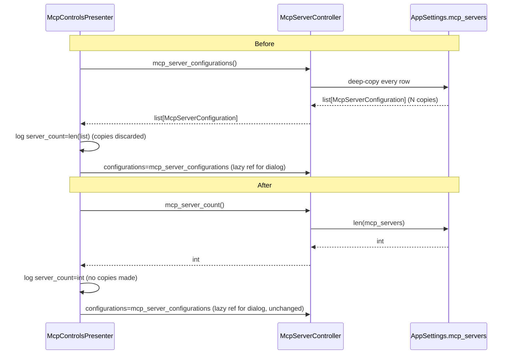

# PYPOST-1083: Stop deep-copying every MCP server row just to log a dialog-open count

## Research

### The wasteful call site

`McpControlsPresenter._open_mcp_servers`
(`pypost/ui/presenters/mcp_controls_presenter.py:281-309`) opens the MCP servers management
dialog. Today it reads:

```python
def _open_mcp_servers(self) -> None:
    """Open the explicit multi-server manager from the MCP portion of the bar."""
    controller = self._mcp_server_controller
    if controller is None:
        logger.warning("mcp_servers_dialog_no_controller")
        return
    settings = self._settings
    logger.info(
        "mcp_servers_dialog_opened server_count=%d",
        len(controller.mcp_server_configurations()),   # <-- line 292, the waste
    )
    dialog = McpServersDialog(
        configurations=controller.mcp_server_configurations,   # <-- line 295, unrelated call
        ...
    )
    dialog.exec()
```

Line 292 calls `controller.mcp_server_configurations()` **eagerly, purely to compute a
`len()`**. Line 295 passes the *same bound method* to `McpServersDialog` as a lazy
`configurations` callable the dialog invokes on its own schedule — that use is legitimate and
out of scope; the dialog genuinely needs the full row data to render.

### What `mcp_server_configurations()` actually costs

`McpServerSettingsController.mcp_server_configurations`
(`pypost/ui/mcp_server_controller.py:115-120`):

```python
def mcp_server_configurations(self) -> list[McpServerConfiguration]:
    """Return independent server rows from persisted application settings."""
    return [
        configuration.model_copy(deep=True)
        for configuration in self._settings.mcp_servers
    ]
```

This deep-copies every `McpServerConfiguration` row. The deep copy is intentional and load-bearing
for the dialog's use (callers mutate the returned rows without touching persisted state — see
`tests/test_mcp_server_controller.py::test_mcp_server_controller_configurations_returns_deep_copies`,
lines 45-69). It is **not** load-bearing for a count: `len()` only needs the number of rows, not
independent copies of their contents. This method must not change — it is exercised elsewhere
(the dialog's lazy `configurations` callable) and its deep-copy contract is under test.

### An existing precedent for cheap counts in the same controller

The controller already knows how to report a count without copying, in its own persistence log
(`pypost/ui/mcp_server_controller.py:265-267`):

```python
logger.info(
    "mcp_servers_persist_requested reason=%s count=%d",
    reason,
    len(self._settings.mcp_servers),
)
```

This reads `len()` directly off `self._settings.mcp_servers` — the raw, uncopied list — inside the
controller. It establishes the pattern this task should reuse: **a count is a `len()` of the
underlying settings collection, not a `len()` of a deep-copied projection of it.**

### The controller/presenter seam

`McpServerController` (`pypost/ui/presenters/mcp_controls_presenter.py:30-45`) is a `Protocol`
that is the *only* sanctioned way `McpControlsPresenter` reaches persisted MCP server rows. It
was introduced by PYPOST-1071 specifically to give this data a testable seam, separate from the
composition root. The presenter does already read two *scalar* settings fields directly
(`self._settings.mcp_host`, `self._settings.mcp_port`, used for the legacy single-server
fallback) — but it never reaches into `self._settings.mcp_servers` (the list the controller owns)
directly; every access to that collection goes through the `McpServerController` protocol
(`mcp_server_configurations`, `mcp_server_status`, `upsert_mcp_server`, `remove_mcp_server`,
`start_mcp_server`, `stop_mcp_server`, `mcp_server_activity`).

Two ways to get a cheap count were weighed:

1. **Presenter reads `len(self._settings.mcp_servers)` directly**, bypassing the controller.
   Rejected: it opens a second, parallel path to data the controller was extracted specifically to
   own, would silently diverge if the controller ever changes what counts as "configured" (e.g.
   filtering, migration, dedup beyond a raw settings list), and blurs the same seam PYPOST-1071
   was written to establish. The presenter's existing direct reads of `mcp_host`/`mcp_port` are
   legacy scalar fields predating the multi-server controller, not precedent for reaching into the
   `mcp_servers` collection it owns.
2. **Add a cheap count accessor to `McpServerController` (Protocol + implementation)** that
   mirrors the controller's existing internal pattern (`len(self._settings.mcp_servers)`,
   line 267) and the Protocol's existing single-purpose query methods (`mcp_server_status`,
   `mcp_server_activity`). Chosen: it keeps "what counts as a configured server" defined in one
   place (the controller), keeps the presenter's only route to `mcp_servers` data behind the same
   Protocol as every other access, and costs nothing beyond a `len()` call.

Option 2 fits the existing controller/presenter separation and is the design carried forward.

## Implementation Plan

1. Add one new method to the `McpServerController` Protocol
   (`pypost/ui/presenters/mcp_controls_presenter.py:30-45`): `mcp_server_count(self) -> int: ...`,
   grouped with the other read-only query methods (`mcp_server_status`, `mcp_server_activity`).
2. Implement it on `McpServerSettingsController`
   (`pypost/ui/mcp_server_controller.py`, next to `mcp_server_configurations` at line 115-120):
   `return len(self._settings.mcp_servers)` — no `model_copy`, no list comprehension over rows.
3. Change `_open_mcp_servers`
   (`pypost/ui/presenters/mcp_controls_presenter.py:290-293`) to source the log's `server_count`
   from `controller.mcp_server_count()` instead of `len(controller.mcp_server_configurations())`.
   The `configurations=controller.mcp_server_configurations` line passed to `McpServersDialog`
   (line 295) is untouched — the dialog still gets the full, deep-copied row data it needs.
4. No other call sites change. `mcp_server_configurations()` keeps its existing signature,
   deep-copy behavior, and every other caller (the dialog's lazy `configurations` callable).

**Mandatory — Failing Repro (next Step 3):** Before any production change, add a red test in
`tests/test_mcp_controls_presenter.py` (extending the existing
`test_open_mcp_servers_with_controller_logs_info_and_constructs_dialog` fixture setup, which
already builds a `MagicMock(spec=McpServerController)` controller and a fake settings object) that
asserts, for a call to `presenter._open_mcp_servers()`:

- `controller.mcp_server_count` is called (and, once `mcp_server_count.return_value` is set to a
  chosen number, that the `mcp_servers_dialog_opened server_count=<N>` log line reports that
  exact number — mirroring the existing `server_count=2` assertion already in that test).
- `controller.mcp_server_configurations` is **not called** as part of opening the dialog (only
  referenced as the lazy `configurations=` callable) — i.e.
  `controller.mcp_server_configurations.assert_not_called()` after `_open_mcp_servers()` runs.

This is a pure unit test against a `MagicMock(spec=McpServerController)` and a `QWidget` /
`QApplication` fixture already present in the test file — no live external dependencies, Qt event
loop beyond the existing fixture, or network/file I/O involved, so it can run in CI as-is.

It fails red today for two independent reasons, both meaningful:
- `mcp_server_count` does not yet exist on the `McpServerController` Protocol, so
  `MagicMock(spec=McpServerController).mcp_server_count` raises `AttributeError` before the
  assertion is even reached.
- Once the Protocol member is added (Step 4, before the presenter is fixed), the production
  `_open_mcp_servers` still calls `controller.mcp_server_configurations()` eagerly for the log,
  so `assert_not_called()` on that mock fails.

Sequencing: this research and design (Step 2) → red test as described (Step 3) → implement the
three changes above until the red test (and all existing tests, notably
`test_open_mcp_servers_with_controller_logs_info_and_constructs_dialog`) are green (Step 4).

## Architecture

### Modules touched

| Module | File | Responsibility | Change |
| --- | --- | --- | --- |
| `McpServerController` (Protocol) | `pypost/ui/presenters/mcp_controls_presenter.py:30-45` | Declares the persistence/lifecycle operations the presenter may call on the owning window's controller | Add `mcp_server_count() -> int` |
| `McpServerSettingsController` | `pypost/ui/mcp_server_controller.py` | Owns persisted MCP server rows (`AppSettings.mcp_servers`), lifecycle, and mutation | Add `mcp_server_count()` implementation; `mcp_server_configurations()` unchanged |
| `McpControlsPresenter` | `pypost/ui/presenters/mcp_controls_presenter.py:281-309` | Owns the MCP toolbar/dialog-opening UI logic | `_open_mcp_servers` sources its log count from `mcp_server_count()` instead of `len(mcp_server_configurations())` |

No other module is touched. `AppSettings.mcp_servers`
(`pypost/models/settings.py`) is read, never written, by the new method.

### Interaction (before → after)



### Selected pattern

**Read-model / query segregation on an existing seam**, not a new pattern: the Protocol already
separates distinct query methods by cost and purpose (`mcp_server_status` for one status,
`mcp_server_activity` for one endpoint's log, `mcp_server_configurations` for full row data).
Adding `mcp_server_count` as a dedicated, cheap query method continues that existing separation
rather than overloading `mcp_server_configurations()` with a "cheap mode" flag or having the
presenter infer a count from data it was never meant to fetch. This keeps the controller as the
single owner of "what does 'configured MCP servers' mean," matches the internal precedent already
in `mcp_server_controller.py:265-267`, and requires the presenter to change only its log call site.

### Interfaces

`McpServerController` Protocol — new member:

```python
def mcp_server_count(self) -> int: ...
```

Contract: returns the number of currently configured MCP server rows. Must not copy, construct,
or validate row contents — implementations should be `O(1)` beyond whatever `len()` costs on the
backing collection. Semantically equivalent to `len(mcp_server_configurations())` at all times
(same rows counted, same ordering source), but must not be implemented in terms of
`mcp_server_configurations()`.

## Q&A

### Why not give `mcp_server_configurations()` a `deep=False` / count-only parameter instead of a new method?

That would still require justifying two different cost profiles behind one method name, and
`MagicMock(spec=McpServerController)`-based tests (already used in
`tests/test_mcp_controls_presenter.py`) would need to special-case call arguments rather than
simply asserting a distinct method was or wasn't called. A separate, single-purpose method reads
its cost directly from its name, matching every other method already on this Protocol.

### Does this affect `McpServersDialog` or any other consumer of `mcp_server_configurations()`?

No. `mcp_server_configurations()` keeps its exact signature, deep-copy behavior, and its one
existing use as the dialog's lazy `configurations=` callable
(`pypost/ui/presenters/mcp_controls_presenter.py:295`). Only the log's count source changes.

### Is there a second implementation of the `McpServerController` Protocol that also needs the new method?

No. `McpServerSettingsController` (`pypost/ui/mcp_server_controller.py`) is the only concrete
implementation in the codebase (confirmed by search); tests use
`MagicMock(spec=McpServerController)`, which will automatically expose the new method once it is
added to the Protocol, so no test fixture needs structural changes beyond the new assertions
described in Step 3.

### Does this change what `mcp_servers_dialog_opened` logs?

No. Same log name, level (`info`), field name (`server_count`), and value — the value is still
the number of currently configured MCP server rows. Only how that number is obtained changes,
which satisfies the Definition of Done in `ai-tasks/PYPOST-1083/10-requirements.md`.
