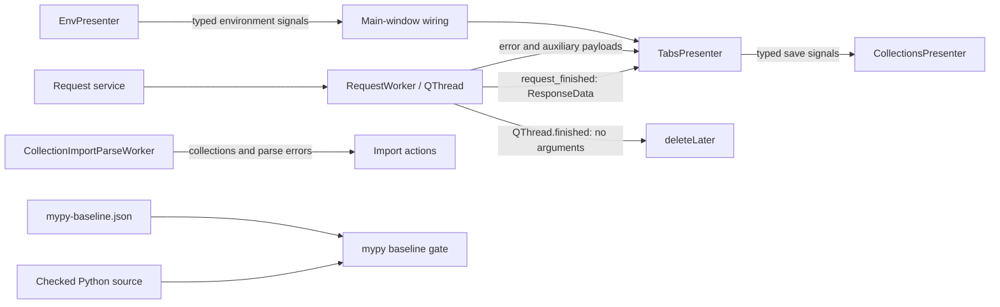

# PYPOST-1086: Type-safe Qt signal contracts and baseline reconciliation

## Research

### Current gate evidence

At base commit `49441bb4017d17d7feb7e0182034ff21f16d90ee`, `make typecheck` reports
eight distinct new comparison records, representing nine diagnostics, and two resolved baseline
records. The baseline contains 219 entries while the current mypy run contains 226 diagnostics.

The new diagnostics have these causes:

- `RequestWorker.finished` replaces the inherited zero-argument `QThread.finished` signal with a
  response-bearing signal, so the subclass and base-class signatures conflict.
- `RequestWorker.script_output` promises a `str` error payload but emits `str | None`.
- Several custom signals declare an `object` payload even though their emitters always provide a
  narrower container or model type. The receiving callbacks correctly declare the narrower type,
  so the generic stubs reject the unsafe connection.
- The environment-key signal intentionally carries either `list[str]` or `None`; Qt signal
  declarations cannot directly express that Python union as one runtime type.

The local development environment uses PySide6 6.11.1 and `types-PySide6` 6.10.3.0. The installed
stub declares `Signal` and `SignalInstance` as generic signature types. Its `connect()` contract
requires a callback compatible with the emitted parameters, while `emit()` requires the declared
argument types. Isolated mypy probes confirmed that `Signal(dict)`, `Signal(list)`, `Signal(set)`,
custom model classes, and a distinct result signal on a `QThread` subclass satisfy those contracts.

The official [Qt for Python signals guide][qt-signals] says custom signals are class variables and
their constructor receives the payload types. The [Qt signals and slots overview][qt-slots]
requires compatible signal and slot signatures. The official [QThread documentation][qthread]
defines `finished()` as a zero-argument lifecycle signal emitted just before the thread finishes
and recommends connecting it to `deleteLater()` for cleanup. These contracts support separating
the request result from thread lifecycle instead of suppressing the subclass conflict.

[qt-signals]: https://doc.qt.io/qtforpython-6.8/tutorials/basictutorial/signals_and_slots.html
[qt-slots]: https://doc.qt.io/qtforpython-6/overviews/qtcore-signalsandslots.html
[qthread]: https://doc.qt.io/qtforpython-6.8/PySide6/QtCore/QThread.html

### Existing runtime coverage

- `tests/test_worker.py` covers successful, cancelled, failed, and retrying request-worker flows.
- `tests/test_worker_race.py` covers worker ownership and stale-worker handling.
- `tests/test_env_presenter.py` and `tests/test_tabs_presenter.py` cover environment payloads,
  persisted requests, save-as events, and tab behavior.
- `tests/test_main_window_signals.py` covers the application-level connection map.
- `tests/test_collection_import_responsiveness.py` covers the threaded parse-to-import flow.
- `tests/test_save_flow_integration.py` covers emitted save-as payloads end to end.
- `tests/test_mypy_baseline.py` covers version 2 baseline schema, multiset comparison, parsing, and
  reporting without invoking live mypy during the normal pytest suite.

## Architecture

### Components and responsibilities

| Component | Responsibility |
| --- | --- |
| `RequestWorker` | Execute a request off the GUI thread and emit result or error payloads. |
| `QThread.finished` | Report native thread termination and trigger deferred cleanup. |
| `EnvPresenter` | Emit the active environment variables, keys, and hidden keys. |
| `TabsPresenter` | Consume worker/environment events and emit typed persistence events. |
| Main-window wiring | Connect presenter signals without adapting valid payloads. |
| Import parse worker | Parse collections off-thread and return lists to import actions. |
| Baseline gate | Compare current `(path, code, message)` instances with accepted debt. |

### Signal interfaces

The custom signal declaration is the payload contract. Each declaration will describe the narrowest
runtime type already emitted by its owner:

| Owner | Signal | Payload contract |
| --- | --- | --- |
| `RequestWorker` | `request_finished` | `ResponseData` |
| `RequestWorker` | inherited `finished` | no arguments; native thread lifecycle only |
| `RequestWorker` | `script_output` | `list`, then `object` for the existing `str | None` value |
| `EnvPresenter` | `env_variables_changed` | `dict` |
| `EnvPresenter` | `env_keys_changed` | `object`, narrowed by its receiver to `list` or `None` |
| `EnvPresenter` | `env_hidden_keys_changed` | `set` |
| `TabsPresenter` | `env_update_requested` | `dict` |
| `TabsPresenter` | `request_save_as_completed` | `RequestData`, then `str` |
| `TabsPresenter` | `request_persisted` | `str`, `RequestData`, then `RequestTab` |
| Import parse worker | `parse_completed` | `list`, then `list` |

`object` is retained only where the existing runtime payload is genuinely a union that Qt cannot
encode as one Python signal type. No `type: ignore`, blanket `Any`, or broad cast is planned. The
environment-key receiver will accept the dynamic boundary as `object`, explicitly allow only
`None` or `list`, and ignore an invalid payload after a type-only warning. The script-output
receiver will likewise accept `object`, narrow it to `str | None`, and report only an unexpected
type if that internal contract is violated.

### Data and control flow

1. A tab starts `RequestWorker` with the current request and environment snapshots.
2. A successful execution emits `request_finished(ResponseData)` at the same point where the old
   response-bearing `finished` signal was emitted. The presenter updates the response UI and clears
   tab ownership exactly as before.
3. When `run()` returns on any path, inherited `QThread.finished()` schedules `deleteLater()`.
   Error and success payload signals no longer own native thread cleanup.
4. Environment selection emits the same `dict`, `list | None`, and `set` values. The main-window
   connection map forwards them to the tabs presenter without changing valid payloads.
5. Save and save-as flows emit their existing request snapshot, source tab, and collection ID.
   An overwrite result must contain a snapshot before the typed persistence signal is emitted.
6. The import worker emits its existing collection and parse-error lists. Exception handling still
   routes known import errors and unexpected exceptions through `parse_failed`.
7. After source fixes remove all eight new comparison records, the gate should report only the two
   already resolved baseline records. Baseline regeneration then removes exactly those records.

### Runtime behavior and error handling

- Request success, cancellation, execution error conversion, retry reporting, streaming, headers,
  environment updates, and script-output logging retain their current branches and payload values.
- Native worker deletion moves to the actual thread-termination signal on every exit path. This
  preserves deferred deletion and removes duplicate result/error cleanup connections.
- The overwrite branch will validate the `SaveResult` invariant before emitting a typed snapshot.
  An impossible missing snapshot is logged and abandoned rather than sent to callbacks that require
  `RequestData`.
- An unexpected environment-key payload is logged by type only and ignored. Valid `None` and list
  payloads retain their distinct meanings in `ResponseView`.
- Collection import keeps its current known-error and unexpected-error handling unchanged.

## Implementation Plan

1. In `pypost/core/qt/worker.py`, rename the response-bearing signal to `request_finished`, emit
   it at the existing success point, and describe the nullable script-error payload honestly.
2. In `pypost/ui/presenters/tabs_presenter.py`, consume `request_finished`, reserve inherited
   `finished` for `deleteLater()`, remove redundant error-triggered deletion, and narrow the custom
   environment and persistence signals to their real payloads.
3. Make the overwrite result invariant explicit before emitting `request_persisted`.
4. In `pypost/ui/presenters/env_presenter.py`, narrow the always-concrete environment signals.
   Update the nullable keys receiver to validate and narrow its dynamic payload.
5. In `pypost/core/qt/collection_import_parse_worker.py`, declare both completed payloads as lists.
6. Update worker-result consumers and nearby tests to use `request_finished`. Preserve existing
   assertions for response, cancellation, environment, import, save, and tab flows.
7. Run `make typecheck` before changing the baseline. It must show no new errors and exactly the
   two expected resolved records:
   - `pypost/core/key_sources/secret_store.py` `no-any-return`;
   - `pypost/ui/widgets/settings/encryption_migration_section.py` `arg-type`.
8. Run `.venv/bin/python scripts/check_mypy_baseline.py --update-baseline`, then inspect the JSON
   diff. It must preserve version 2 and the three-path scope, remove only those two entries, and
   change `error_count` from 219 to 217.
9. Run `make typecheck` again and require exit 0 with 217 known errors. Run focused runtime tests,
   the full test suite, lint, and baseline-schema tests before review.

### Mandatory failing repro for Step 3

Add a focused test to `tests/test_worker.py`. It will assert that `RequestWorker.finished` is the
inherited `QThread.finished` descriptor and that a distinct `request_finished` signal carries the
successful `ResponseData`. Before production changes, it fails because `RequestWorker` defines its
own response-bearing `finished` signal and has no `request_finished` signal. It requires no network,
filesystem, or live external dependency: inject the existing mocked execution result and call
`run()` directly.

The exact node will be
`tests/test_worker.py::test_request_worker_separates_result_from_qthread_finished`.

This test anchors the unsafe inherited-interface collision. The remaining declaration mismatches
are verified by the existing `make typecheck` gate plus the nearby runtime tests. A live mypy run is
not added to normal pytest because the accepted requirements keep mypy optional and outside CI.

Sequence: record the focused test red, implement the signal contracts until it is green, verify the
runtime modules, verify the expected pre-reconciliation gate diff, reconcile the baseline, and
require the final gate to pass.

### Test strategy

- Step 3 exact node: the new `tests/test_worker.py` lifecycle/result-signal contract test.
- Worker behavior: `tests/test_worker.py` and `tests/test_worker_race.py`.
- Environment and main-window wiring: `tests/test_env_presenter.py`,
  `tests/test_main_window_signals.py`, and relevant `tests/test_tabs_presenter.py` nodes.
- Import flow: `tests/test_collection_import_responsiveness.py` and existing import-action tests.
- Persistence flow: relevant `tests/test_tabs_presenter.py` and
  `tests/test_save_flow_integration.py` nodes.
- Baseline schema and reporting: `tests/test_mypy_baseline.py`.
- Static acceptance: pre-update and post-update `make typecheck` runs.
- Repository acceptance: changed-code lint, `git diff --check`, and `make test`.

## Risks and Rollback

- **Missed response consumer:** Search every `RequestWorker` reference and run worker and tab tests.
- **Cleanup timing:** Use the documented native termination signal and exercise threaded race
  tests.
- **Runtime declaration mismatch:** Preserve emitted values and run end-to-end Qt signal tests.
- **Lost nullable-key semantics:** Keep the object boundary and narrow `None` versus list
  explicitly.
- **Unrelated baseline drift:** Require zero new errors before inspecting the exact two-entry diff.
- **Stub/runtime minor-version difference:** Use standard PySide signal types supported by both
  installed versions.

Rollback must treat source, tests, and baseline as one unit. Revert the signal interface changes and
their test updates, restore the 219-entry baseline, and rerun focused Qt tests. That returns to the
documented pre-task state where `make typecheck` reproduces the known eight-new/two-resolved drift;
do not leave a regenerated baseline paired with reverted source.

## Q&A

### Why not silence the diagnostics?

They expose real disagreement between declared signal payloads, connected callbacks, and an
inherited Qt lifecycle interface. Narrow declarations and a distinct result signal make those
contracts explicit while preserving runtime values. Suppression would keep the ambiguity.

### Why is `object` still used for two payloads?

Those values are genuine runtime unions (`list | None` and `str | None`), while `Signal` accepts
runtime classes rather than Python union expressions. The receivers preserve or narrow the union;
all payloads with one concrete runtime family use their concrete class.

### Why regenerate rather than hand-edit the baseline?

The gate writer preserves duplicate instances, sorting, schema version, scope, and count. Running
it only after a zero-new-error check gives an exact 217-entry snapshot, and the subsequent JSON diff
proves that only the two already resolved records were removed.
