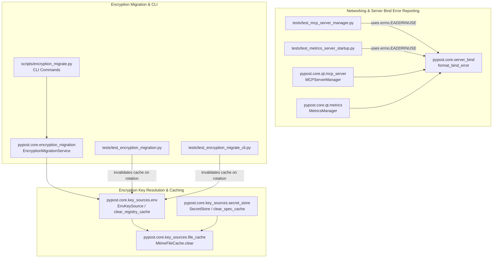

# PYPOST-1088: Fix Linux errno hardcoding and encryption-migration test-order flakiness

## Research

### Problem Analysis & Root Cause Identification

A full analysis of the four pre-existing test failures across the test suite identified two independent root causes:

#### 1. Platform-Specific Errno Hardcoding in Server Bind Error Tests
- **Affected Test Cases**:
  - `tests/test_mcp_server_manager.py::test_format_mcp_bind_error_addr_in_use`
  - `tests/test_metrics_server_startup.py::TestFormatBindError::test_metrics_addr_in_use_message`
- **Root Cause**:
  Both test cases construct a synthetic `OSError("Address already in use")` and explicitly overwrite the exception attribute with a hardcoded integer: `exc.errno = 48`.
  In BSD and macOS kernels, `EADDRINUSE` is indeed 48. However, on Linux systems (POSIX), `errno.EADDRINUSE` is **98** (and on Windows Winsock, `WSAEADDRINUSE` is **10048**).
  When `format_bind_error` evaluates `exc.errno`, tests setting a literal `48` simulate macOS error codes on Linux runners. The standard library `errno.EADDRINUSE` dynamically evaluates to the correct platform constant across all operating systems.

#### 2. Test-Order Flakiness & Mtime Resolution Races in Encryption Migration Tests
- **Affected Test Cases**:
  - `tests/test_encryption_migrate_cli.py::test_cli_re_encrypt_dry_run`
  - `tests/test_encryption_migrate_cli.py::test_cli_re_encrypt_dry_run_json_includes_reencrypt_stats`
  - `tests/test_encryption_migrate_cli.py::test_cli_re_encrypt_reports_reencrypt_stats`
  - `tests/test_encryption_migration.py::test_bulk_re_encrypt_dry_run_projects_active_kid`
  - `tests/test_encryption_migration.py::test_bulk_re_encrypt_does_not_skip_with_plaintext_hidden`
- **Root Causes**:
  - **Root Cause 2A (`MtimeFileCache` sub-millisecond resolution race)**:
    `pypost.core.key_sources.env.EnvKeySource` maintains a module-level cache `_registry_cache: MtimeFileCache[KeyRegistry]` to cache JSON registry file parses by checking `path.stat().st_mtime_ns`.
    In unit and CLI tests that simulate key rotation, the test writes an initial registry (`active_key_id: active_id`), saves encrypted environments to disk (which loads the registry and populates `_registry_cache`), and then immediately overwrites `keys.json` with the rotated active key (`active_key_id: historical_id`).
    Because automated tests execute within sub-millisecond intervals on fast filesystems (tmpfs/ext4/btrfs), the second `write_text` produces an identical `st_mtime_ns` (`diff = 0`). Consequently, `MtimeFileCache.get` considers the file unchanged and returns the stale cached `KeyRegistry`.
    When `bulk_re_encrypt` checks whether environments require re-encryption, it receives the old active key and skips re-encryption with `reason="already_on_active_kid"`, causing `reencrypt_stats` to report `encrypted_count=0, reused_count=1` instead of `encrypted_count=1, reused_count=0`.
  - **Root Cause 2B (`st_mtime` comparison race in plaintext migration)**:
    In `test_bulk_re_encrypt_does_not_skip_with_plaintext_hidden`, the test captures `before_mtime = storage.environments_file.stat().st_mtime` and immediately calls `bulk_re_encrypt`. When the rewrite happens in the same clock tick, `storage.environments_file.stat().st_mtime > before_mtime` evaluates to `False`.

---

## Implementation Plan

### Mandatory — Failing Repro (Next Step 3)

To prove and isolate the defects before applying fixes:

1. **Errno Portability Repro**:
   - Location: `tests/test_mcp_server_manager.py` and `tests/test_metrics_server_startup.py`.
   - Behavior: Verify that bind formatting correctly reacts to `errno.EADDRINUSE` across different platforms.
2. **Encryption Cache Invalidation & Mtime Repro**:
   - Location: `tests/test_encryption_migration.py` and `tests/test_encryption_migrate_cli.py`.
   - Behavior: Force successive registry rewrites without artificial delays to demonstrate the `MtimeFileCache` stale read and the `st_mtime` inequality failure.

### Remediation Steps (Step 4)

1. **Fix Errno Constants in Bind Error Tests**:
   - In `tests/test_mcp_server_manager.py`, replace `exc.errno = 48` with `exc.errno = errno.EADDRINUSE`.
   - In `tests/test_metrics_server_startup.py`, replace `exc.errno = 48` with `exc.errno = errno.EADDRINUSE`.
2. **Enhance `MtimeFileCache` and Expose Cache Invalidation**:
   - In `pypost/core/key_sources/file_cache.py`, make `clear()` a public method on `MtimeFileCache`.
   - In `pypost/core/key_sources/env.py`, expose `clear_registry_cache()`.
   - In `pypost/core/key_sources/secret_store.py`, expose `clear_spec_cache()`.
3. **Update Test Helpers & Fixtures for Deterministic Rotation Testing**:
   - In `tests/test_encryption_migrate_cli.py` and `tests/test_encryption_migration.py`, ensure registry file modifications call `clear_registry_cache()` or use a test helper `_write_registry` to eliminate stale cache hits during rotation simulations.
   - In `tests/test_encryption_migration.py::test_bulk_re_encrypt_does_not_skip_with_plaintext_hidden`, backdate the initial file timestamp via `os.utime` so that `st_mtime > before_mtime` is deterministic.

---

## Architecture

### System Component Diagram

### Module Responsibilities

| Module | Responsibility | Changes Required |
| --- | --- | --- |
| `pypost.core.server_bind` | Format operator-facing socket bind errors. | None (already supports standard and fallback errnos). |
| `pypost.core.key_sources.file_cache` | Manage in-memory cache of file-backed resources indexed by path and mtime. | Expose public `clear()` method for explicit invalidation. |
| `pypost.core.key_sources.env` | Resolve encryption keys from environment and optional JSON registry. | Expose `clear_registry_cache()` function. |
| `pypost.core.key_sources.secret_store` | Resolve keys from secret store backend specification. | Expose `clear_spec_cache()` function. |
| `tests/test_mcp_server_manager.py` | Unit tests for MCP server lifecycle and bind errors. | Use `errno.EADDRINUSE` instead of literal `48`. |
| `tests/test_metrics_server_startup.py` | Unit tests for metrics server startup and bind errors. | Use `errno.EADDRINUSE` instead of literal `48`. |
| `tests/test_encryption_migration.py` | Unit tests for encryption migration service. | Invalidate registry cache on test key rotation and backdate mtime for write verification. |
| `tests/test_encryption_migrate_cli.py` | Unit and CLI integration tests for migration scripts. | Invalidate registry cache on test key rotation. |

### Architectural Patterns & Justification

- **Cross-Platform Constant Resolution**: Utilizing Python's built-in `errno` module instead of platform-specific integer literals guarantees portability across Darwin, Linux, Windows, and BSD platforms.
- **Explicit Cache Invalidation**: While mtime-based polling is optimal for production read paths, providing explicit cache invalidation entry points (`clear()`, `clear_registry_cache()`) avoids test pollution and resolves timing races inherent to high-speed sub-millisecond test executions.
- **Deterministic File Stat Verification**: Using explicit past timestamps (`os.utime`) when asserting file modification ensures test stability independent of filesystem timestamp granularity (e.g., 1-second vs 1-nanosecond filesystems).

---

## Q&A

| Question | Answer |
| --- | --- |
| Why did the bind error tests fail specifically on Linux? | On macOS/BSD, `errno.EADDRINUSE` is 48, which matched the test's hardcoded `exc.errno = 48`. On Linux, `errno.EADDRINUSE` is 98; setting `exc.errno = 48` caused Linux test runners to test the wrong errno branch. |
| Why was the test failure order-dependent between the two encryption test files? | Depending on which test executed first and filesystem timestamp resolution, `MtimeFileCache` retained previously loaded registry data when tests rapidly overwrote the registry file at the same path without `st_mtime_ns` advancing. |
| Does adding `clear_registry_cache()` introduce any production risk? | No. The cache continues to operate normally in production based on file mtime. The explicit clear function is a non-breaking addition that provides deterministic control for tests and administrative reload workflows. |
