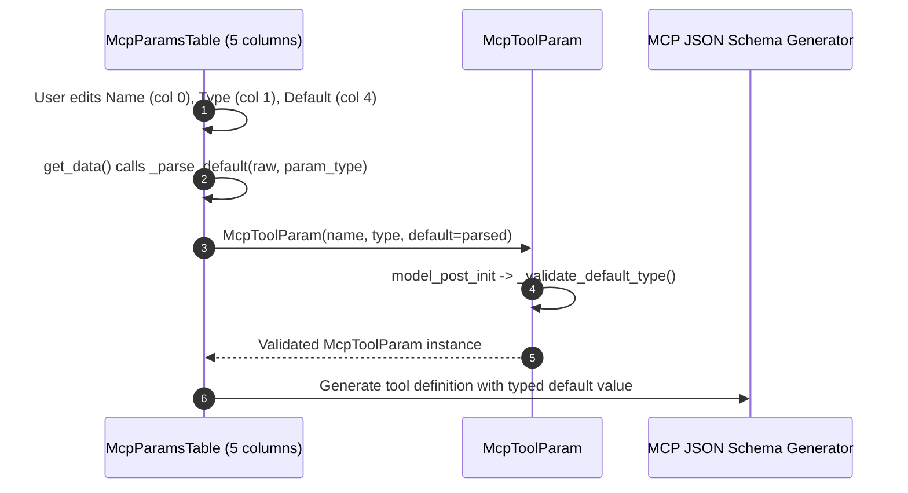

# PYPOST-1089: High-Level Architecture Design

## Python Language Considerations (lsr-python)

- Use `pydantic` `model_post_init` (already present) for runtime validation — Pydantic's
  own `@model_validator` is an alternative but `model_post_init` is consistent with the
  existing codebase pattern.
- All helper functions follow PEP 8 naming and type-annotated signatures.
- Raise `ValueError` (not `TypeError`) for invalid default values — Pydantic's validation
  layer wraps `ValueError` into its own `ValidationError`, which callers expect.
- `json.loads` / `json.dumps` from the stdlib handle array/object serialisation; no third
  party required.

## Research

### Default Type Safety in McpToolParam

`_MCP_PARAM_TYPES` (models.py:10–12) currently contains:
`{"string", "integer", "integer_or_string", "number", "boolean", "array", "object"}`.

The required Python-type mapping for a non-`None` default is:

| Declared `type`      | Accepted Python type for `default`              |
| -------------------- | ----------------------------------------------- |
| `string`             | `str`                                           |
| `integer`            | `int` (excluding `bool`)                        |
| `integer_or_string`  | `int` or `str` (excluding `bool`)               |
| `number`             | `int` or `float` (excluding `bool`)             |
| `boolean`            | `bool`                                          |
| `array`              | `list`                                          |
| `object`             | `dict`                                          |

`number_or_string` is **not** a declared MCP param type and is **not added** by this task.

### McpParamsTable UI Architecture

`McpParamsTable` currently has 4 columns `["Name", "Type", "Description", "Required"]`
(request_editor.py:475–477). It preserves defaults in `self._defaults: dict[str, Any]`
keyed by original parameter name. When a user renames a parameter in column 0, `get_data()`
queries `self._defaults.get(new_name)` and silently returns `None`, dropping the original
default.

The fix adds a 5th column `Default` (column index 4). The cell stores the default as a
human-readable string. `get_data()` reads the cell at column 4 for the current row,
converts the text to a typed Python value using the row's declared type (column 1), and
passes that value to `McpToolParam(default=...)`. Because the value lives in the cell
alongside its row, renaming column 0 does not affect column 4.

## Architectural Patterns

### 1. Validator Object (McpToolParam)

`McpToolParam.model_post_init` already acts as a post-construction validator object —
it validates `self.type` against the whitelist. We extend that same hook with a single
private method `_validate_default_type()` following the **Validator Object** pattern:
validation logic is co-located with the data class and raises a typed exception
(`ValueError`) on invalid state. This keeps the model self-consistent without external
validators or Pydantic `@field_validator`, which would require different calling conventions.

### 2. Table-as-View (McpParamsTable)

`McpParamsTable` follows the **Table-as-View** (MVC subset) pattern: the table widget owns
display and edit, while `McpToolParam` owns the canonical typed representation.
`set_data()` is the view-model binding (model → view); `get_data()` is the inverse
(view → model). The 5th column makes the `default` field a first-class visible value,
consistent with the existing Name, Type, Description, and Required columns.

### 3. Inline Type Coercion (get_data)

Rather than a separate parser class, `get_data()` uses a small **Strategy**-style dispatch
table (a plain `dict[str, Callable[[str], Any]]`) mapping param type strings to
single-argument coercion functions. This is idiomatic Python for low-overhead branching
and avoids a proliferation of if/elif chains.

## Main Interfaces and APIs

### McpToolParam (pypost/models/models.py)

```python
class McpToolParam(BaseModel):
    type: str = "string"
    description: str = ""
    required: bool = True
    default: Optional[Any] = None

    def model_post_init(self, __context: Any) -> None:
        """Called by Pydantic after __init__. Validates type whitelist and default type."""
        if self.type not in _MCP_PARAM_TYPES:
            raise ValueError(f"Unsupported MCP param type: {self.type!r}")
        self._validate_default_type()

    def _validate_default_type(self) -> None:
        """Raises ValueError if self.default is not None and incompatible with self.type.

        Pre-conditions: self.type is already validated as a member of _MCP_PARAM_TYPES.
        Post-conditions: returns None on success.
        Raises: ValueError — message includes type, default value, and expected Python type.
        """
```

Caller contract: constructing `McpToolParam(type="boolean", default="fifty")` raises
`pydantic.ValidationError` (wrapping `ValueError`) at construction time.

### McpParamsTable (pypost/ui/widgets/request_editor.py)

```python
class McpParamsTable(QTableWidget):
    _TYPE_OPTIONS = ("string", "integer", "integer_or_string",
                     "number", "boolean", "array", "object")
    _COERCERS: dict[str, Callable[[str], Any]]  # see Implementation Plan

    def __init__(self) -> None:
        """Creates a 5-column table: Name, Type, Description, Required, Default."""

    def set_data(self, params: dict[str, McpToolParam]) -> None:
        """Populates all rows from params.
        Pre-condition: params is a dict of param_name -> McpToolParam.
        Post-condition: table has len(params)+1 rows; last row is an empty sentinel.
        Side-effects: blockSignals(True/False) guard prevents spurious itemChanged.
        """

    def get_data(self) -> dict[str, McpToolParam]:
        """Reads the table and constructs a McpToolParam per non-empty Name row.
        Pre-condition: table widget is populated (set_data called or user edits made).
        Post-condition: returns a dict keyed by current Name cell text.
        Raises: nothing — unparseable Default cells are treated as None (silent drop
                with a debug log).
        """

    def _set_row(self, row: int, name: str, spec: McpToolParam) -> None:
        """Writes one row. Column 4 is set from spec.default serialised to str.
        An empty string represents None (no default).
        """

    def _parse_default(self, raw: str, param_type: str) -> Any:
        """Converts the Default cell's text to a typed Python value.
        Returns None if raw is empty or blank.
        Uses _COERCERS[param_type] for conversion; falls back to None on ValueError.
        Raises: nothing (all exceptions caught internally).
        """
```

### Coercion Contract (_COERCERS)

| `param_type`        | Input cell text           | Output Python value                |
| ------------------- | ------------------------- | ---------------------------------- |
| `string`            | any string                | `str`                              |
| `integer`           | decimal digit string      | `int(raw)`                         |
| `number`            | numeric string            | `float(raw)` (or int if no '.')    |
| `integer_or_string` | decimal / any string      | `int(raw)` if parseable else `str` |
| `boolean`           | `"true"`, `"1"` / else    | `True` / `False`                   |
| `array`             | JSON array string         | `json.loads(raw)` → `list`         |
| `object`            | JSON object string        | `json.loads(raw)` → `dict`         |

Invalid input (e.g. non-numeric string for `integer`) returns `None` with a debug log.

## Implementation Plan

### Step 3 — Failing Repro (Research → Red Test → Fix Until Green)

Sequencing:
1. **Research**: Read `pypost/models/models.py` and `pypost/ui/widgets/request_editor.py`
   to confirm current absence of type-cross-check and 5th column.
2. **Red test** (no production code change):
   - `tests/test_mcp_tool_contract.py`:
     - `test_boolean_default_string_raises` — assert `McpToolParam(type="boolean",
       default="fifty")` raises `pydantic.ValidationError`.
     - `test_integer_default_float_raises` — assert `McpToolParam(type="integer",
       default=3.14)` raises.
   - `tests/test_request_editor_mcp_params.py`:
     - `test_mcp_params_table_has_five_columns` — assert `McpParamsTable().columnCount() == 5`.
     - `test_default_column_survives_rename` — set a param with a known default, simulate
       name-cell edit via `table.item(0, 0).setText("new_name")`, call `get_data()`, assert
       default is preserved.
3. **Isolation**: Tests run headless using the `qapp` pytest fixture
   (`pytest-qt` offscreen mode; no running MCP server or network required).
4. Confirm RED: `pytest tests/test_mcp_tool_contract.py tests/test_request_editor_mcp_params.py -x`
   must fail for the intended reason (missing validator / missing column), not import errors.

### Step 4 — Development

1. Add `_validate_default_type()` to `McpToolParam.model_post_init` in `models.py`.
2. Expand `McpParamsTable` to 5 columns: update `__init__`, `_set_row`, `get_data`, and
   add `_parse_default` and `_COERCERS` in `request_editor.py`.
3. Run `pytest tests/test_mcp_tool_contract.py tests/test_request_editor_mcp_params.py`
   and confirm GREEN.

### Step 5–8

Code cleanup, observability review, tech-debt analysis, and developer documentation update
in `doc/dev/mcp_integration.md`.

## Module Matrix

| Module | Component | Change Description |
| --- | --- | --- |
| `pypost/models/models.py` | `McpToolParam` | Add `_validate_default_type` in `model_post_init` |
| `pypost/ui/widgets/request_editor.py` | `McpParamsTable` | Add 5th column "Default", populate in `_set_row`, parse in `get_data`, add `_parse_default` and `_COERCERS` |
| `tests/test_mcp_tool_contract.py` | Unit tests | Add tests for valid and invalid default types |
| `tests/test_request_editor_mcp_params.py` | UI tests | Add tests for 5-column table, Default editing, and rename survival |

## Data Flow Diagram



## Q&A

**Q: `number_or_string` appears in Step 1 requirements (`10-requirements.md` line 27). Is it in scope?**

A: **No.** `number_or_string` is not a member of `_MCP_PARAM_TYPES` in `pypost/models/models.py`
(lines 10–12 list: `string`, `integer`, `integer_or_string`, `number`, `boolean`, `array`, `object`).
Its inclusion in Step 1 was a typographic error in the requirements draft — likely a mis-copy of
`integer_or_string`. The requirements document has been corrected (note added at line 31 of
`10-requirements.md`) and this architecture excludes it. No new type is added to `_MCP_PARAM_TYPES`
by this task.

**Q: How should boolean defaults be displayed and parsed in the Default cell?**

A: Cell displays `"true"` or `"false"` (lower-case). `_parse_default` for `boolean` type
accepts `"true"` / `"1"` → `True`; anything else → `False`. Empty cell → `None`.

**Q: What happens when the Default cell contains invalid text for a typed param (e.g. `"abc"` for `integer`)?**

A: `_parse_default` catches the `ValueError` from `int("abc")`, logs a `DEBUG` message, and
returns `None`. The constructed `McpToolParam` gets `default=None`. No exception is propagated
to the UI. The user simply sees no default applied — consistent with the existing behaviour
for empty cells.

**Q: How are structured types (array/object) displayed in the Default cell?**

A: Serialised as compact JSON (via `json.dumps(value)`). Parsed back via `json.loads(raw)`.
A `JSONDecodeError` is treated the same as an invalid value — returns `None` with a debug log.
