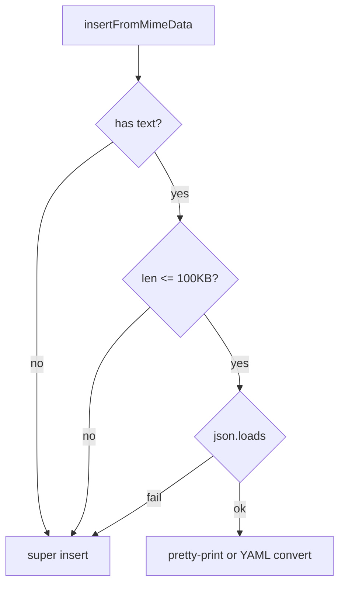

# PYPOST-109: Architecture — skip paste JSON parse for large text

## Research

### Current behaviour (`code_editor.py`)

- `insertFromMimeData` reads clipboard text and always calls `json.loads`.
- On success: pretty-print JSON or convert to YAML when YAML + `yaml_as_json`.
- On failure: `super().insertFromMimeData` (default paste).
- All work runs synchronously on the UI thread.

### Related thresholds

- `ResponseView.LARGE_DOC_CHAR_THRESHOLD = 100 * 1024` — used for response search debounce and
  capped match counts (PYPOST-363, PYPOST-364).

## Implementation Plan

1. Add `_PASTE_JSON_FORMAT_CHAR_THRESHOLD = 100 * 1024` and `_should_format_pasted_json(text)`.
2. In `insertFromMimeData`, if `_should_format_pasted_json` is false, call
   `super().insertFromMimeData` and return before `json.loads`.
3. Add unit tests for large valid JSON and large plain text.
4. Document threshold in `doc/dev/yaml_as_json.md`.

## Architecture

### Module: `CodeEditor` (`pypost/ui/widgets/code_editor.py`)

**Responsibility:** Body editor input, including smart JSON paste.

**Changes:** Size guard before parse; no new widgets or threads.

## Q&A

- **Q:** Why not a quick `{`/`[` heuristic only? **A:** Size bound addresses the reported lag;
  heuristic alone would still parse huge JSON arrays.
- **Q:** Shared constant module? **A:** Not required; threshold documented to match response
  search large-doc constant.
