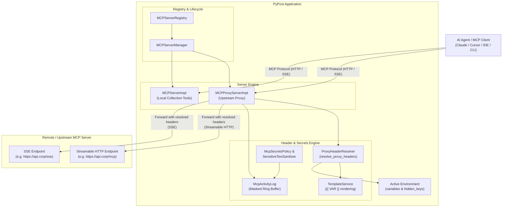
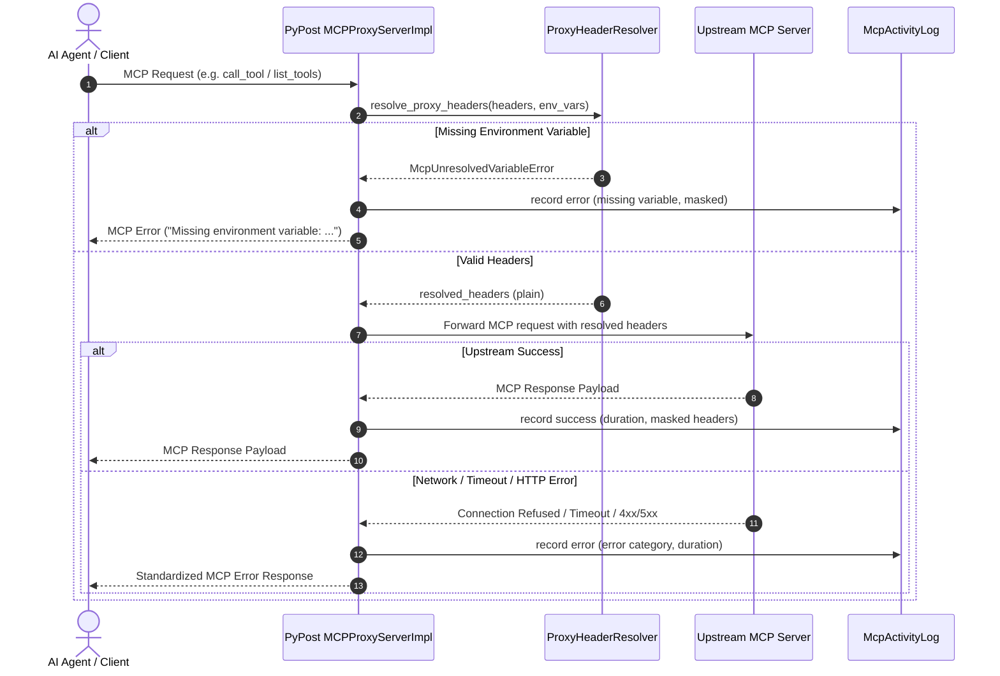

# PYPOST-1092: MCP Proxy: Forward requests to upstream MCP servers with env variable header resolution

## Research

### Existing MCP Architecture in PyPost

1. **Server Lifecycle & Registry (`pypost.core.mcp_server_registry.py`, `pypost.core.qt.mcp_server.py`)**:
   - `MCPServerRegistry` manages persisted `McpServerConfiguration` instances, handling lifecycle (`start`, `stop`, `reconfigure`, `reconcile_references`, `refresh_environment`).
   - `MCPServerManager` wraps an `MCPServerImpl` and a dedicated daemon thread running Uvicorn with an asyncio event loop.
   - `MCPServerImpl` sets up an `mcp.server.Server` instance and creates a Starlette application hosting both modern Streamable HTTP routes (`/mcp`) and legacy SSE routes (`/sse`).
   - Currently, `MCPServerImpl` only registers tools from local PyPost collections (`RequestData` items) and executes them synchronously via `RequestService`.

2. **MCP Client & Transports (`pypost.core.mcp_client_service.py`, `mcp` SDK)**:
   - The Python `mcp` SDK (`mcp>=1.27,<2`) provides both client transports:
     - `mcp.client.streamable_http.streamable_http_client(url, http_client=...)`: Supports passing custom HTTP headers via `httpx.AsyncClient` or `create_mcp_http_client(headers=...)`.
     - `mcp.client.sse.sse_client(url, headers=..., timeout=...)`: Supports passing custom HTTP headers directly or via `httpx_client_factory`.
   - `ClientSession` (`mcp.client.session.ClientSession`) provides standardized async protocol methods:
     - `list_tools()` and `call_tool(name, arguments)`
     - `list_prompts()` and `get_prompt(name, arguments)`
     - `list_resources()`, `read_resource(uri)`, and `list_resource_templates()`

3. **Template Substitution & Environment Variables (`pypost.core.template_service.py`)**:
   - `TemplateService` provides Jinja2 template rendering for `{{ VAR }}` expressions.
   - `tokenize_template_expressions` extracts `{{ ... }}` placeholders from text strings.
   - Dynamic header resolution requires evaluating headers against the active environment snapshot. If an expression references a variable not defined in the environment, the proxy must abort dispatch and return a descriptive error to prevent unauthenticated upstream leaks.

4. **Secrets Policy & Activity Logging (`pypost.core.mcp_secrets_policy.py`, `pypost.core.sensitive_text_sanitizer.py`, `pypost.core.mcp_activity_log.py`)**:
   - `McpSecretsPolicy` and `sensitive_text_sanitizer` define rules for masking sensitive HTTP headers (such as `Authorization`, `X-API-Key`, `Cookie`, `Proxy-Authorization`) and secret environment values (`hidden_keys`).
   - `McpActivityLog` maintains an in-memory ring buffer of `McpActivityEntry` items displayed in `McpActivityDialog`.
   - Forwarded proxy operations must record operation type, outcome, latency, HTTP status, and sanitized details without exposing plaintext credentials.

5. **Configuration Model & UI (`pypost.models.settings.py`, `pypost.ui.dialogs.mcp_servers_dialog.py`)**:
   - `McpServerConfiguration` currently requires `collection_id`, `environment_id`, `host`, `port`, `enabled`.
   - Extending `McpServerConfiguration` with `server_type` (`"local"` | `"proxy"`), `upstream_url`, `upstream_transport` (`"streamable_http"` | `"sse"`), and `headers: dict[str, str]` allows managing both local collection servers and remote upstream proxies in the same unified registry and UI.

---

## Implementation Plan

### 1. Model & Configuration Extensions
- Extend `McpServerConfiguration` in [pypost/models/settings.py](file:///home/src/pypost/models/settings.py):
  - Add `server_type: Literal["local", "proxy"] = "local"`.
  - Make `collection_id: Optional[str] = None` (mandatory for `local`, optional for `proxy`).
  - Add `upstream_url: Optional[str] = None`.
  - Add `upstream_transport: Literal["streamable_http", "sse"] = "streamable_http"`.
  - Add `headers: dict[str, str] = Field(default_factory=dict)`.
  - Add `timeout: float = 30.0`.
  - Add model validation rules ensuring `upstream_url` is provided when `server_type == "proxy"`, and `collection_id` is provided when `server_type == "local"`.

### 2. Upstream Header Resolution & Security Engine
- Create `pypost/core/mcp_proxy_headers.py`:
  - `resolve_proxy_headers(headers: Mapping[str, str], env_vars: Mapping[str, str], template_service: TemplateService | None) -> dict[str, str]`:
    - Evaluates `{{ VAR }}` template placeholders against `env_vars`.
    - Detects unresolvable variables; if any placeholder variable is missing from `env_vars`, raises `McpUnresolvedVariableError(variable_name, header_name)`.
  - `sanitize_proxy_headers(headers: Mapping[str, str], env_vars: Mapping[str, str], hidden_keys: Iterable[str]) -> dict[str, str]`:
    - Masks values for sensitive headers (`Authorization`, `X-API-Key`, etc.) and hidden environment values per `McpSecretsPolicy`.

### 3. MCP Proxy Protocol Implementation
- Create `pypost/core/mcp_proxy_server_impl.py`:
  - Class `MCPProxyServerImpl`:
    - Wraps `mcp.server.Server` and exposes Starlette application with Streamable HTTP (`/mcp`) and legacy SSE (`/sse`) routes.
    - Registers handlers for `list_tools`, `call_tool`, `list_prompts`, `get_prompt`, `list_resources`, `read_resource`, `list_resource_templates`.
    - Implements async client connection helper `_connect_upstream(headers)` supporting both `streamable_http_client` and `sse_client`.
    - Implements exception mapping:
      - `httpx.ConnectError`, `httpx.NetworkError` -> MCP error with clear connectivity diagnostic.
      - `httpx.TimeoutException`, `TimeoutError` -> MCP error with timeout diagnostic.
      - `httpx.HTTPStatusError` -> MCP error with status code and sanitized body.
      - `McpUnresolvedVariableError` -> MCP error indicating missing environment variable.
    - Emits metrics (`track_mcp_request_received`, `track_mcp_response_sent`, `track_mcp_tool_call_duration`) and records entries in `McpActivityLog`.

### 4. Server Manager & Registry Integration
- Update `MCPServerManager` in [pypost/core/qt/mcp_server.py](file:///home/src/pypost/core/qt/mcp_server.py):
  - Support instantiating and running `MCPProxyServerImpl` when starting a proxy server (`start_proxy_server(...)` or unified `start_server_from_config(config)`).
- Update `MCPServerRegistry` in [pypost/core/mcp_server_registry.py](file:///home/src/pypost/core/mcp_server_registry.py):
  - In `start`, detect `configuration.server_type`:
    - For `local`: lookup collection and environment, start local tool server.
    - For `proxy`: lookup environment (if configured), start proxy server pointing to `configuration.upstream_url` with configured transport and headers.
  - In `reconcile_references`: skip collection check for proxy servers.
  - In `refresh_environment`: propagate environment snapshot to proxy servers for dynamic header resolution.

### 5. UI Updates
- Update `_McpServerEditor` and `McpServersDialog` in [pypost/ui/dialogs/mcp_servers_dialog.py](file:///home/src/pypost/ui/dialogs/mcp_servers_dialog.py):
  - Add "Server Type" radio/selector (Local Collection vs. Upstream Proxy).
  - For Upstream Proxy mode:
    - Display Upstream Target URL field.
    - Display Transport combo (`Streamable HTTP`, `Server-Sent Events (SSE)`).
    - Display Custom Headers table (Key-Value editor supporting `{{ VAR }}`).
    - Disable/hide collection picker; keep environment picker for variable resolution.
  - Update `McpServersDialog` table columns to display target endpoint (local collection name or upstream URL) and server mode.

### 6. Activity Dialog & Diagnostics
- Ensure `McpActivityEntry` and `McpActivityDialog` in [pypost/ui/dialogs/mcp_activity_dialog.py](file:///home/src/pypost/ui/dialogs/mcp_activity_dialog.py) display forwarded operations (e.g. `proxy:list_tools`, `proxy:call_tool`, `proxy:get_prompt`, etc.) with properly masked header details and latency.

---

### Mandatory — Failing Repro (next Step 3)

- **Test Path**: `tests/test_mcp_proxy_server.py`
- **What it asserts**:
  1. **Upstream Request Forwarding**: Local client connects to PyPost proxy instance on `localhost:<port>`, invokes `list_tools`, `call_tool`, `list_prompts`, and `list_resources`. PyPost connects to a mock upstream MCP server and returns the upstream results unchanged.
  2. **Dynamic Header Resolution**: Configured header `Authorization: Bearer {{ API_TOKEN }}` is resolved using active environment variables before sending requests to upstream. The mock upstream server verifies receipt of the exact resolved header `Bearer secret-token-123`.
  3. **Missing Variable Protection**: When header `X-API-Key: {{ MISSING_KEY }}` references an undefined environment variable, PyPost aborts dispatch and returns an informative error without contacting upstream.
  4. **Secrets Masking**: When proxy calls execute, `McpActivityLog` records the operation with masked header tokens (e.g. `Bearer ***`) and no unmasked secret variables.
  5. **Error & Timeout Mapping**: When upstream server is unreachable or times out, PyPost catches the transport error and returns structured MCP error responses.
- **Forcing Failure**:
  - The test will import `pypost.core.mcp_proxy_server_impl.MCPProxyServerImpl` and configure a proxy server via `McpServerConfiguration(server_type="proxy", upstream_url=...)`.
  - Since `MCPProxyServerImpl` and the proxy extensions on `McpServerConfiguration` do not exist yet, the test will immediately fail (red) with `ImportError` / `ValidationError` or failing assertions.
- **Sequencing**:
  1. Step 2 (Design) -> 2. Step 3 (Write automated red test in `tests/test_mcp_proxy_server.py`) -> 3. Step 4 (Implement proxy server, header resolution, registry integration, UI, iterate until green).

---

## Architecture

### Module Interaction Diagram

### Protocol Forwarding Sequence

### Module Responsibilities & Main Interfaces

| Module | Responsibility | Key Interfaces |
| --- | --- | --- |
| `pypost.models.settings` | Configuration schema for local and proxy MCP servers | `McpServerConfiguration(id, name, host, port, server_type, upstream_url, upstream_transport, headers, environment_id, enabled)` |
| `pypost.core.mcp_proxy_headers` | Environment variable substitution and secret sanitization for proxy headers | `resolve_proxy_headers(headers, env_vars, template_service) -> dict[str, str]` `sanitize_proxy_headers(headers, env_vars, hidden_keys) -> dict[str, str]` |
| `pypost.core.mcp_proxy_server_impl` | Transparent MCP protocol proxy server hosting Starlette routes and dispatching to upstream | `MCPProxyServerImpl(name, upstream_url, upstream_transport, headers, variable_supplier, hidden_keys_supplier, activity_log, metrics, template_service)` `create_app() -> Starlette` |
| `pypost.core.qt.mcp_server` | Background worker thread management for Uvicorn server instances | `MCPServerManager.start_server(port, tools, host)` `MCPServerManager.start_proxy_server(port, host, upstream_url, upstream_transport, headers)` |
| `pypost.core.mcp_server_registry` | Persistent server lifecycle, state tracking, and reference reconciliation | `MCPServerRegistry.upsert(config)` `MCPServerRegistry.start(instance_id)` `MCPServerRegistry.reconfigure(instance_id, config)` |
| `pypost.ui.dialogs.mcp_servers_dialog` | GUI dialog and editor for creating, viewing, editing, and deleting MCP servers | `McpServersDialog` `_McpServerEditor` (supports Local vs Proxy mode) |

### Selected Architectural Patterns

1. **Transparent Reverse Proxy Pattern**:
   - PyPost acts as an MCP protocol reverse proxy. It implements standard MCP server transports (Streamable HTTP and SSE) on a local port and forwards protocol primitives (`list_tools`, `call_tool`, `list_prompts`, `get_prompt`, `list_resources`, `read_resource`) to the remote upstream MCP endpoint without altering payload contracts.

2. **Decorator & Context Manager Client Pattern**:
   - Forwarding uses transient async context managers (`streamable_http_client` / `sse_client` with `ClientSession`) or reusable pooled clients with per-request header injection, ensuring connection isolation and clean resource disposal.

3. **Strict Template Resolution Gate**:
   - Header evaluation runs as a preflight validation step before initiating any network I/O. If a variable is missing, the request fails fast, ensuring unauthenticated or partially templated requests (e.g. `Bearer {{ TOKEN }}`) are never transmitted over the network.

4. **Defense-in-Depth Secret Masking**:
   - Sensitive header keys (`Authorization`, `X-API-Key`, etc.) and environment values marked in `hidden_keys` are scrubbed before reaching activity logs, UI widgets, or error messages via `McpSecretsPolicy` and `sensitive_text_sanitizer`.

---

## Q&A

| Question | Answer |
| --- | --- |
| How does the proxy handle both Streamable HTTP and SSE upstream transports? | The upstream transport is configured per target (`upstream_transport: "streamable_http" \| "sse"`). `MCPProxyServerImpl` dispatches using `mcp.client.streamable_http.streamable_http_client` or `mcp.client.sse.sse_client` accordingly. |
| Can clients connect to PyPost using either transport regardless of upstream transport? | Yes. PyPost's local endpoint exposes both Streamable HTTP (`/mcp`) and SSE (`/sse`) routes via Starlette, bridging whichever transport the client uses to the configured upstream transport. |
| What happens if a header template syntax is invalid or has missing variables? | PyPost catches template errors or missing variable keys, blocks the outgoing request, logs a sanitized error entry in `McpActivityLog`, and returns an MCP protocol error response to the client. |
| How are custom headers persisted and edited in the UI? | Headers are stored as a key-value dictionary on `McpServerConfiguration.headers` and edited in the `_McpServerEditor` dialog with support for variable autocompletion / hover hints. |
| Are prompt and resource operations forwarded in addition to tools? | Yes. `MCPProxyServerImpl` forwards all MCP protocol operations: `list_tools`, `call_tool`, `list_prompts`, `get_prompt`, `list_resources`, `read_resource`, and `list_resource_templates`. |
