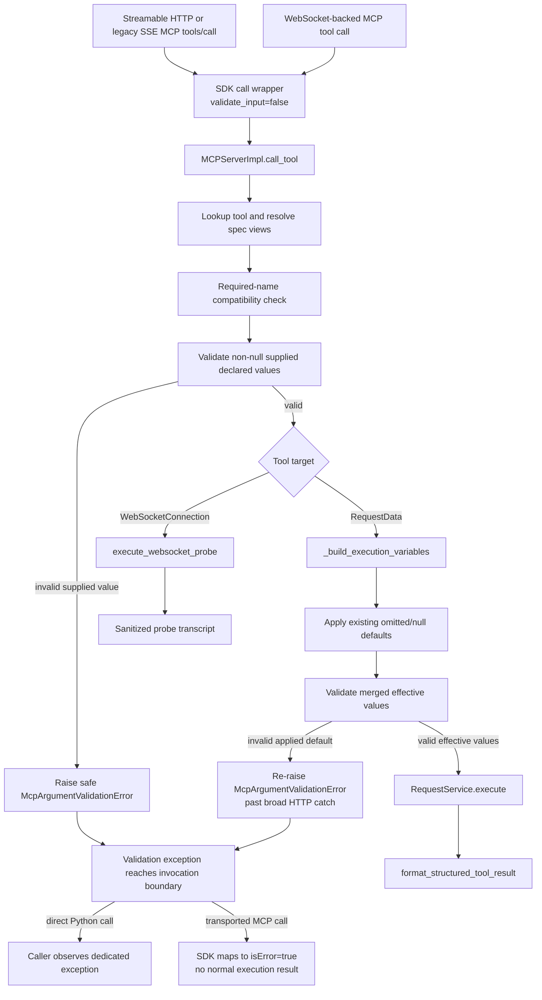

# PYPOST-1100: High-Level Architecture Design

## Research

### Approved requirements

The approved requirements in `10-requirements.md` establish strict rejection as
the runtime policy. Runtime validation must accept exactly the seven declared
MCP types, exclude booleans from numeric types, preserve accepted values without
conversion, keep the existing default and required-argument behavior, and apply
the same rules to HTTP-backed and WebSocket-backed MCP tools.

### Existing implementation boundary

- `McpToolParam.model_post_init()` validates the declared type and calls
  `_validate_default_type()` in `pypost/models/models.py`. That method is the
  existing compatibility behavior for persisted defaults and is not the runtime
  caller-value policy for this task.
- `build_tool_input_schema()` in `pypost/core/mcp_tool_contract.py` publishes
  `integer_or_string` as an `anyOf` containing a JSON integer and a string that
  matches `^[+-]?[0-9]+$`.
- `MCPServerImpl._build_execution_variables()` copies caller arguments, applies
  non-null defaults for omitted or null explicit parameters, and then merges the
  result into the `mcp.request` execution namespace. It currently has no runtime
  type check.
- `MCPServerImpl._call_tool_inner()` has two execution branches. The HTTP branch
  catches ordinary execution exceptions and serializes them with
  `format_structured_tool_result()`-style text; the WebSocket branch dispatches
  directly to `execute_websocket_probe()` and does not use the HTTP variable
  builder.
- Streamable HTTP and legacy SSE both invoke the same registered MCP `call_tool`
  handler. A validation boundary in `MCPServerImpl` therefore covers both MCP
  transports and the WebSocket-backed tool branch.
- The pinned MCP Python SDK v1.29.0 low-level `Server.call_tool()` validates the
  published JSON Schema before invoking the registered handler when
  `validate_input=True` (the default). It returns the SDK-generated
  `Input validation error: ...` text for a schema failure; JSON Schema's
  `ValidationError.message` can expose a value and does not guarantee the
  parameter name. The same wrapper converts exceptions raised by the handler to
  an MCP `CallToolResult` with `isError=True`, and it supports
  `validate_input=False`. See the
  [MCP Python SDK repository](https://github.com/modelcontextprotocol/python-sdk)
  and its [v1.29.0 source tree](https://github.com/modelcontextprotocol/python-sdk/tree/v1.29.0).

### Architectural conclusion

The existing UI `_COERCERS` must not be reused for runtime calls. Those
strategies parse editor text and intentionally convert it; runtime MCP values
must be checked without conversion. The runtime validator is a new, strict
caller-value policy shared by HTTP and WebSocket dispatch. It deliberately does
not replace or tighten `_validate_default_type()`: persisted/default model
compatibility remains unchanged, while an applied default is checked by the
runtime policy at the execution boundary.

The published schema remains strict for client discovery, but the SDK's
pre-handler input validation is disabled for this registered handler. This
ensures every transported typed argument reaches the application adapter, where
the safe parameter-specific diagnostic is produced. The adapter separately
preserves the published required-name behavior before running the runtime type
policy.

## Implementation Plan

1. Add a strict, pure runtime predicate alongside the existing MCP contract
   helpers. Keep `_MCP_PARAM_TYPES` as the authoritative whitelist and use the
   anchored signed-decimal pattern for `integer_or_string`. Do not call or alter
   `_validate_default_type()`; its broader legacy acceptance, including string
   defaults for `integer_or_string`, preserves persisted/default compatibility.
2. Add a transport-neutral validator that accepts argument/spec mappings, checks
   missing names in the published required set, skips `None` so the existing
   null/default path remains authoritative, and checks every non-null declared
   runtime value. It returns no converted values and raises a dedicated
   `McpArgumentValidationError` whose safe message contains only the parameter
   name, expected declared type, and validation kind.
3. Resolve two views from the same declarations before a call: the complete
   execution spec map for declared-value checks and the current
   agent-visible/required spec map after hidden/environment filtering. HTTP
   request templates include discovered `mcp.request.*` variables plus explicit
   metadata. WebSocket templates include discovered variables, explicit metadata,
   and the existing optional `stop_when` parameter. Extra argument names remain
   governed by current behavior and are not newly rejected.
4. Register the MCP handler as `self.server.call_tool(validate_input=False)`.
   Retain the strict schema in `list_tools`, but do not let the SDK's generic
   pre-handler schema error decide the client diagnostic. In
   `MCPServerImpl._call_tool_inner()`, after tool lookup and before either
   dispatch branch, run the application required-argument compatibility check
   and supplied-value validation. This is the adapter/anti-corruption boundary
   for the SDK.
5. Keep the existing HTTP default merge in
   `_build_execution_variables()`. Validate the merged effective values there
   with the strict runtime predicate, so an applied non-null default is checked
   without changing when or how it is inserted. In the current
   `_call_tool_inner()` structure, use the narrow-catch option: add a dedicated
   `except McpArgumentValidationError: raise` path before the broad HTTP
   `except Exception` handler. This lets an invalid applied default escape the
   generic execution-error conversion while retaining the existing merge
   location. The same exception remains observable from direct
   `MCPServerImpl.call_tool()` calls, while the registered MCP SDK wrapper maps
   it to `isError=true` for transported calls; neither path returns a normal
   execution result.
6. Preserve the existing `integer_or_string` JSON Schema `anyOf` and make the
   runtime caller predicate equivalent: native non-boolean integers or strings
   matching the full signed-decimal pattern are accepted, and the original value
   is passed onward unchanged. A legacy persisted default may remain loadable
   under `_validate_default_type()` but, if applied, fails the strict runtime
   check rather than being converted or silently ignored.
7. Record validation failures as a distinct operational outcome using the
   existing MCP activity/response boundaries plus a low-cardinality validation
   counter. Define the event names, outcome values, labels, and pre-handler versus
   execution-boundary behavior below; implement the wiring in Step 6.

**Mandatory — Failing Repro (next Step 3):**

- Add a timeout-marked unit test for the shared predicate covering all seven
  declared types, numeric boolean exclusion, the three accepted
  `integer_or_string` forms (native integer, signed decimal string, and leading
  plus), rejected decimal/exponent/arbitrary strings, and value-form
  preservation. Also pin that `_validate_default_type()` still accepts the
  legacy string-default behavior; the runtime predicate must remain separate.
  The test must fail before the production change because the runtime helper
  does not exist or does not reject the bad value.
- Add a direct `MCPServerImpl.call_tool()` repro for an HTTP `RequestData` whose
  declared parameter is wrong-typed. Stub `RequestService`; assert the call
  fails with the dedicated validation error, the message names the parameter
  and expected type without the raw value, and the service is never invoked.
  Add a missing-required-argument case to prove the application compatibility
  check preserves the existing required behavior after SDK input validation is
  disabled.
- Add the corresponding WebSocket-backed tool repro with
  `execute_websocket_probe` replaced by a no-side-effect mock. Assert the same
  invalid value is rejected and the probe is never called. Do not start a live
  socket for this failure test.
- Add default interaction cases: an omitted/null value with a valid non-null
  default continues through the existing HTTP merge, while a wrong-typed
  non-null supplied value is rejected and does not fall back to that default.
  Assert valid supplied values, including an `integer_or_string` string, reach
  execution unchanged. Preserve a legacy arbitrary string default at model
  construction, then assert that an omitted call rejects it after application
  of the default at the execution boundary without invoking the service.
- Add one live Streamable HTTP MCP call assertion for client visibility:
  `CallToolResult.isError` is true, the validation text names the parameter and
  expected type, the SDK's generic schema text is not the source of the result,
  and the rejected raw value is absent. Reuse the existing in-process MCP
  harness; do not use live external services. Assert the handler registration
  disables SDK input validation while the published `required` schema remains
  unchanged; this proves the transported call uses the safe application path.
- Keep all new pytest modules/tests explicitly timeout-marked. If the chosen
  implementation logs at `ERROR`, satisfy the repository `caplog` contract by
  asserting the expected log or using the project allowlist. Run the repro only
  through the repository Make target.
- Place the repro coverage in these existing test scopes:
  - Pure contract and legacy default-compatibility cases: extend
    `tests/test_mcp_tool_contract.py::TestMcpToolContract`.
  - Direct HTTP `MCPServerImpl.call_tool()` validation, required arguments,
    valid-value preservation, and default interaction cases: extend
    `tests/test_mcp_server_impl.py::TestMCPServerImpl`.
  - WebSocket-backed invalid-call isolation with `execute_websocket_probe`
    mocked: extend
    `tests/test_websocket_mcp_probe_repro.py::TestMCPServerImplWebSocketIntegration`.
  - Client-visible in-process Streamable HTTP validation using the existing
    `live_mcp_server` harness and `_mcp_call_tool_result()` helper: extend
    `tests/test_mcp_server_integration.py::TestMCPServerIntegration`.
- Run the complete Step 3 repro set with this exact Make invocation:

  ```sh
  make test \
    PYTEST_ARGS="tests/test_mcp_tool_contract.py tests/test_mcp_server_impl.py \
    tests/test_mcp_server_integration.py tests/test_websocket_mcp_probe_repro.py"
  ```

## Architecture

### Architectural patterns

1. **Pure-function/shared-policy pattern** — The runtime compatibility
   predicate has no I/O, mutation, coercion, or transport knowledge. HTTP and
   WebSocket calls use the same predicate and the same error type, which keeps
   acceptance and safe diagnostics consistent. The published schema uses the
   same declared categories and signed-decimal rule, while the legacy default
   predicate remains intentionally separate for compatibility.
2. **Adapter/anti-corruption boundary** — `MCPServerImpl` adapts the pinned MCP
   SDK to PyPost's client contract. It disables the SDK's generic input-schema
   rejection for the registered call handler, performs the required-name and
   runtime checks locally, and lets the SDK convert only the safe application
   exception to `CallToolResult(isError=True)`. SDK wording and raw validation
   details therefore cannot cross into the client-facing contract.
3. **Preflight plus execution-boundary defense in depth** — The application
   handler checks supplied values before dispatch, and the HTTP execution
   builder checks effective values after the existing default merge. The second
   check protects the action boundary without changing default insertion or
   adding a second WebSocket default policy.

### Components and responsibilities

| Component | Responsibility in this design |
| --- | --- |
| `models.py` / `McpToolParam` | Type whitelist; retains legacy default compatibility checks. |
| `mcp_tool_contract.py` | Strict runtime policy, validator/error, and schema helper. |
| `mcp_server_impl.py` | Resolves specs, enforces the SDK adapter, preflights, and dispatches. |
| MCP SDK call wrapper | Normalizes results and safely converts application exceptions. |
| `websocket_mcp_tools.py` | Shares WebSocket resolution; remains the low-level probe executor. |
| `RequestService` / probe | Consume accepted args without conversion or a second MCP type system. |
| MCP activity/metrics components | Record distinct validation outcomes without raw argument data. |
| `MCPProxyServerImpl` | Out of scope: forwards calls; does not own local declarations. |

### Main interfaces

The implementation should expose interfaces equivalent to the following
contracts; exact private naming may follow local conventions.

```text
is_mcp_runtime_value_compatible(param_type: str, value: Any) -> bool
validate_mcp_required_arguments(
    arguments: Mapping[str, Any],
    required_specs: Mapping[str, McpToolParam],
) -> None
validate_mcp_argument_values(
    arguments: Mapping[str, Any],
    specs: Mapping[str, McpToolParam],
) -> None
```

`is_mcp_runtime_value_compatible()` is called only for non-null values and
returns a boolean without transforming its input. The required validator checks
missing names against the published required set, while the value validator
checks only declared names present in `arguments`, skips `None`, and leaves
unknown names untouched. Both raise `McpArgumentValidationError` with safe
fields for the parameter name, expected declared type, and validation kind. Its
string form is fixed to a safe message and never includes the rejected value.
The helpers must not call `int()`, `float()`, `str()`, JSON parsing, or a
Pydantic model to transform a runtime value.

`_validate_default_type()` remains the model's existing default-compatibility
check and is not changed to call the runtime predicate. `_build_execution_variables()`
calls the runtime validator after its existing default merge, ensuring an
applied non-null default is covered without changing the default-applied metric,
log, or persistence behavior. The public MCP handler performs required and
supplied-value checks before dispatch; the second check protects the merged
execution boundary.

### Parameter-spec resolution

The published and runtime contracts must derive from equivalent maps, with a
complete execution view and a filtered client-facing view:

- For HTTP `RequestData`, collect the request's `mcp.request.*` placeholders,
  merge them with explicit `request_data.mcp_params`, and use the default
  string specification for an auto-discovered name with no explicit metadata.
  The complete map is used for declared-value checks; the existing filtered map
  supplies required names and the published schema.
- For `WebSocketConnection`, extract placeholders from URL, headers, query
  parameters, and the selected preset payload; merge explicit `conn.mcp_params`;
  and retain the existing optional `stop_when` specification.
- Apply hidden/environment policy only to the client-facing view as today. A
  client-supplied name not represented by the complete spec map is not rejected
  by this task; this preserves the out-of-scope unknown-argument policy.

The WebSocket resolver should be factored so
`build_websocket_mcp_tool_schema()` and runtime preflight cannot drift. The HTTP
resolver should reuse the existing `resolve_mcp_param_specs()` rather than
reconstructing the same map in the server. Required checks use the filtered view
so hidden/environment-only names do not become new client obligations; a value
explicitly supplied for a declared complete-map name is still type-checked.

### Data and control flow



The invalid branch ends before environment resolution, HTTP request execution,
WebSocket connection/probe startup, response formatting, or any externally
visible tool action. For a direct Python call to `MCPServerImpl.call_tool()`,
the dedicated exception is observable to the caller. Through Streamable HTTP
and legacy SSE, the registered SDK wrapper catches that safe exception and
exposes it as an error tool result. The strict schema remains published by
`list_tools`, but it is not allowed to generate the typed-call error; this is
what guarantees the application message names the parameter and expected type.
Neither path uses the HTTP structured execution payload for validation failures.

### Validation and error behavior

| Declared type | Runtime acceptance |
| --- | --- |
| `string` | `str` only |
| `integer` | `int` except `bool` |
| `integer_or_string` | `int` except `bool`, or a full-match `[+-]?[0-9]+` string |
| `number` | `int` or `float`, except `bool` |
| `boolean` | `bool` only |
| `array` | `list` only |
| `object` | `dict` only |

The runtime validator rejects rather than coerces. A validation message should
use a stable safe form such as `Invalid MCP argument '<name>': expected type
'<declared_type>'.` Missing required values use a separate stable form such as
`Missing required MCP argument '<name>': expected type '<declared_type>'.` The
messages contain no received category, received value, serialized body, secret,
or request data. A deterministic first failure is sufficient; the validator
should not partially execute or mutate the caller's argument mapping.

The MCP SDK's `validate_input=False` option is part of this design, not an
implementation detail that may be omitted. With the option set, the SDK does
not call `jsonschema.validate` before `MCPServerImpl.call_tool()`. The
application adapter therefore owns the typed and required checks for all
transported calls, and the SDK's exception conversion preserves
`CallToolResult.isError=True` without rewriting the safe message. Any true
pre-handler transport failure that occurs before the registered handler (for
example malformed request decoding) is outside this argument contract and is
not reported as an application validation failure.

`format_structured_tool_result()` remains an execution-result serializer. It is
not an error channel for argument validation, because returning a plain text
`Error executing request` content would be marked as a normal successful MCP
tool result by the current handler. For the applied-default branch, the
selected narrow-catch implementation re-raises
`McpArgumentValidationError` before the broad HTTP catch converts it. A direct
`MCPServerImpl.call_tool()` caller therefore receives the dedicated exception;
the registered SDK wrapper maps the same exception to `isError=true` for a
transported call, with no normal execution result in either case.

### Validation observability contract

Step 6 will wire the following contract into the existing metric and activity
surfaces; Step 2 defines the names and cardinality without implementing sinks:

- The structured log event is `mcp_argument_validation_failed` with fields
  `stage`, `transport`, `tool`, `param`, and `expected_type`. `stage` is exactly
  `preflight` or `execution_boundary`; `transport` is `http` or `websocket`.
  The event never includes the received value, serialized arguments, defaults,
  secrets, or request body. Expected validation failures are not logged at
  `ERROR`.
- The new counter is
  `mcp_argument_validation_failures_total{stage,transport,declared_type}`.
  `declared_type` is one of the seven supported types. Parameter and tool names
  are log/activity fields, not metric labels, to avoid unbounded cardinality.
- The existing `mcp_responses_sent_total{method,status}` and
  `mcp_tool_call_duration_seconds{method,status}` use `status="validation_error"`
  for this outcome, alongside the existing `success` and `error` values. The
  method label is the HTTP method for `RequestData` and `WEBSOCKET` for a
  WebSocket tool. Existing execution outcomes retain their current values.
- `McpActivityEntry.new_call_tool()` records exactly one entry with
  `outcome="validation_error"`, the tool name, argument count, no HTTP status,
  duration, and the same safe named diagnostic in `detail`. A preflight failure
  does not create a probe entry or an execution-result entry. WebSocket probe
  outcomes such as `success`, `timeout`, and `error` remain unchanged for calls
  that pass validation.

The failure locations are intentionally distinct:

| Failure location | Client behavior | Observability behavior |
| --- | --- | --- |
| SDK pre-handler transport failure | SDK/transport error. | No PyPost activity/counter. |
| Application preflight | Safe error. | `preflight` + `validation_error`; one activity. |
| Execution boundary | Safe error. | `execution_boundary` + `validation_error`; one activity. |

Because SDK input validation is disabled for this handler, a typed schema
rejection cannot take the first row. Missing required names are handled by the
application compatibility check, so required failures use the second row and
remain observable with the same safe contract. Step 6 decides only how these
signals are emitted through Prometheus/OTel and the activity log; it does not
change the validation boundaries or outcome vocabulary.

### Defaults, nulls, and required arguments

- The existing HTTP merge rule remains authoritative: omitted or null explicit
  parameters with a non-null default receive that default; explicit non-null
  values never trigger fallback.
- Supplied non-null values are checked before the merge. The merged value is
  checked against the strict runtime type contract before request execution.
  `McpToolParam` construction retains its existing default validator; the
  runtime check is the only new check for an applied default.
- `None` is not sent through the new type predicate's rejection path. A null
  argument is present, not missing, and continues through the existing
  default/application behavior. The application required check rejects only a
  missing name, matching the published required list and introducing no new
  null policy.
- WebSocket dispatch receives the same strict check for supplied values. It does
  not gain a second default policy in this task; the current WebSocket executor
  remains responsible for its existing argument/default behavior.

The compatibility decision is explicit: persisted `McpToolParam` data is not
revalidated or rewritten, and `_validate_default_type()` is not tightened to
the runtime `integer_or_string` rule. Thus an older arbitrary string default
can still be loaded and remains stored unchanged. If the existing merge applies
that default, the effective value is then rejected by the in-scope runtime
contract before execution, with a safe named diagnostic; it is never coerced,
silently dropped, or replaced by another default. New valid defaults continue
to apply with the existing metric and log behavior.

### Compatibility considerations

- The published schema remains unchanged, including the `integer_or_string`
  `anyOf` and its signed-decimal string pattern. Runtime and schema acceptance
  become equivalent rather than introducing a new client format.
- Accepted values retain their original form: a string identifier stays a
  string, an integer stays an integer, and lists/maps are not serialized.
- Valid existing HTTP calls and WebSocket calls continue to reach their current
  executors. Existing default metrics/logs remain tied to the existing HTTP
  default loop.
- Required names remain published in the same schema and are checked by the
  application compatibility adapter because the SDK input gate is disabled.
  Missing required calls still fail before execution; optional omitted/null
  calls retain the current default path.
- Unknown argument names remain untouched because no unknown-argument policy is
  part of this issue.
- The proxy server is not changed because it does not own the local declared
  parameter metadata. Upstream validation remains the proxy's existing concern.
- The additional predicate is O(number of declared arguments) and performs only
  cheap Python type checks plus one anchored string match, so it adds no material
  delay for normal MCP calls.

### Test strategy

The Step 3 repro plan is the first test artifact and must remain red until
production changes are allowed. Step 4 should turn it green, then retain the
following coverage:

- Pure contract tests for every supported type, booleans excluded from numeric
  types, exact `integer_or_string` strings, no coercion, and safe error text.
- HTTP server tests with a mocked request service proving invalid calls do not
  invoke the service, valid values are preserved, defaults still apply, and a
  supplied invalid value cannot fall back to a valid default.
- WebSocket server tests with a mocked probe proving invalid calls do not open or
  start a probe and valid values reach the probe unchanged.
- Existing schema tests retained to pin the `integer_or_string` `anyOf` and
  pattern. A live in-process Streamable HTTP test verifies client-visible
  `isError`; transport-specific routing tests continue to cover legacy SSE.
- All test items carry an explicit timeout marker. Error-log assertions follow
  the repository `caplog` contract, and all test execution uses Make targets.

## Q&A

**Q: Should runtime values be coerced like editor defaults?**

A: No. `_COERCERS` is an editor-input strategy and would alter request meaning.
Runtime checking uses the shared predicate and preserves accepted values.

**Q: Why disable the MCP SDK's input validation instead of relying on its schema?**

A: The SDK's pre-handler `ValidationError.message` is not a safe named
diagnostic contract. Keeping the strict schema for `list_tools` but registering
the handler with `validate_input=False` routes typed and required checks through
the application adapter, which raises the safe error and lets the SDK preserve
`isError=True`. Direct handler calls and internal helper calls use the same
application policy.

**Q: What happens to `integer_or_string` strings?**

A: Only optional-sign decimal digit strings are accepted. Whitespace, arbitrary
text, decimal fractions, and exponent notation are rejected; accepted strings
remain strings. The existing schema `anyOf` is retained.

**Q: Does a bad supplied value fall back to a default?**

A: No. Supplied non-null values are validated before default application can
replace omitted/null values. A mismatch raises the safe validation error and
execution does not begin.

**Q: Does this change required or unknown argument policy?**

A: No. The published required set is enforced by the application compatibility
adapter after SDK validation is disabled, so missing required names retain their
existing behavior. Null/default handling and unknown names remain outside the
new type-validation rule.

**Q: Does WebSocket support require a second validator?**

A: No. The common `MCPServerImpl` preflight validates both `RequestData` and
`WebSocketConnection` calls. WebSocket schema-spec resolution is shared with its
existing schema builder, while probe execution remains transport-specific.

**Q: Does strict runtime checking revalidate persisted defaults?**

A: No. `_validate_default_type()` remains unchanged so persisted/default data
keeps its current load and storage behavior. Only a non-null default that the
existing HTTP merge actually applies is checked at execution; a legacy value
that fails the runtime contract produces a safe validation failure instead of
being changed or used for an action.

**Q: How are validation failures distinguished operationally?**

A: Application failures use `validation_error` and
`mcp_argument_validation_failed`, with `preflight` or `execution_boundary`
stages. Activity entries use `outcome="validation_error"`; ordinary execution
continues to use `success` or `error`, and WebSocket probe outcomes are unchanged.
