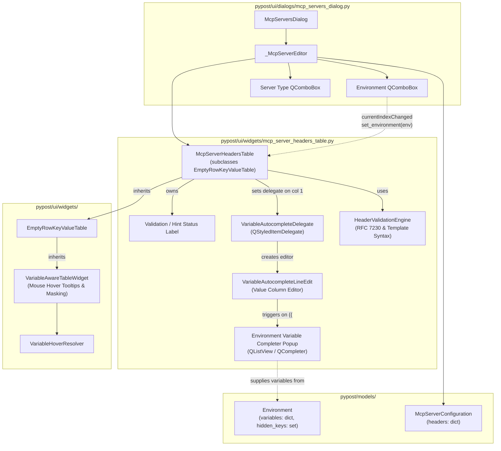

# PYPOST-1104: Upgrade custom headers editor to key-value table widget with env variable completion

## Research

### 1. Existing Custom Headers Editor in `_McpServerEditor`
In [pypost/ui/dialogs/mcp_servers_dialog.py](file:///home/src/pypost/ui/dialogs/mcp_servers_dialog.py#L268-L447), `_McpServerEditor` handles creating and editing local and upstream proxy MCP server configurations:
- **Current Custom Headers UI**: Currently implemented as a raw `QPlainTextEdit` (`self._headers_edit`), with placeholder text `"Authorization: Bearer {{ API_KEY }}\nX-Custom: value"`.
- **Parsing Logic**: `_parse_headers(self)` splits the text by newlines and colons (`line.split(":", 1)`). It strips whitespace and ignores lines beginning with `#`.
- **Limitations**:
  - No tabular structure; users must manually type colons and format lines.
  - No autocomplete or suggestions for environment variables (`{{ VAR }}`).
  - No real-time syntax checking or feedback for malformed keys or undefined variables.
  - Inconsistent with tabular editors used across other PyPost dialogs and tabs.
- **Dialog Context**: `_McpServerEditor` already receives `environments: list[Environment]` and has an `_environment` combobox (`QComboBox`), but currently does not propagate environment variable updates to the headers editor when the selection changes.

### 2. Existing Key-Value Table Widgets in PyPost
An examination of [pypost/ui/widgets/empty_row_key_value_table.py](file:///home/src/pypost/ui/widgets/empty_row_key_value_table.py) and [pypost/ui/widgets/variable_aware_widgets.py](file:///home/src/pypost/ui/widgets/variable_aware_widgets.py) reveals a well-established widget hierarchy:
- **`VariableAwareTableWidget`**: Subclasses `QTableWidget`. Provides mouse tracking and automatic cell hover tooltips that locate `{{ VAR }}` expressions using `VariableHoverLocator` and resolve them with `VariableHoverResolver`, properly masking secret/sensitive variables defined in `_hidden_keys`. Provides `set_variables(variables: dict[str, str])` and `set_hidden_keys(hidden_keys: set[str])`.
- **`EmptyRowKeyValueTable`**: Subclasses `VariableAwareTableWidget`. Implements a two-column ("Key", "Value") table with an automatically managed trailing empty row (`_on_item_changed`), `set_data(dict[str, str])`, and `get_data() -> dict[str, str]` with configurable key stripping (`strip_keys: bool`).
- **Domain Specializations**:
  - `KeyValueTable` in [pypost/ui/widgets/request_editor.py](file:///home/src/pypost/ui/widgets/request_editor.py#L642-L647) subclasses `EmptyRowKeyValueTable(strip_keys=False)`.
  - `McpClientHeadersTable` in [pypost/ui/widgets/mcp_client/headers_table.py](file:///home/src/pypost/ui/widgets/mcp_client/headers_table.py#L12-L17) subclasses `EmptyRowKeyValueTable(strip_keys=True)`.
  - `WebSocketKeyValueTable` in [pypost/ui/widgets/websocket/connection_editor.py](file:///home/src/pypost/ui/widgets/websocket/connection_editor.py#L61-L66) subclasses `EmptyRowKeyValueTable(strip_keys=True)`.
- **Key Insight**: We can directly inherit from `EmptyRowKeyValueTable` (or leverage its mechanics) to get automatic row creation, row population/serialization, and hover tooltip resolution out of the box.

### 3. Autocompletion Mechanisms in PySide6 / Qt
To provide inline environment variable autocompletion in the Value column:
- When a user enters cell edit mode in a `QTableWidget`, Qt uses a `QStyledItemDelegate` to construct the editor widget (typically a `QLineEdit`).
- By assigning a custom `QStyledItemDelegate` to column 1 (Value), we can provide a specialized editor `VariableAutocompleteLineEdit` (or equip `QLineEdit` with a tailored `QCompleter` / popup).
- **Trigger Pattern**: When typing `{{`, or when the text immediately preceding the cursor matches `\{\{\s*([a-zA-Z0-9_]*)$`:
  - Extract the prefix string following `{{`.
  - Filter available variable names from the currently bound environment.
  - Display the suggestion popup positioned adjacent to the editor.
  - Upon item activation (Enter, Tab, or mouse click), replace the incomplete trigger token with `{{ <VARIABLE_NAME> }}` and advance the cursor past the inserted closing braces.
  - Standard keys (Escape to dismiss, Up/Down arrow keys to navigate suggestions) must operate smoothly without prematurely committing or cancelling cell edits.

### 4. HTTP Header Syntax and Template Validation Standards
- **Header Key Syntax (RFC 7230 / RFC 9110)**:
  - Header field names consist of 1 or more token characters: `^[a-zA-Z0-9!#$%&'*+\-.^_`|~]+$`.
  - Prohibited: whitespace (spaces, tabs), colons `:`, control characters, or empty strings when a value is present.
- **Template Placeholder Syntax**:
  - `tokenize_template_expressions` in [pypost/core/template_expression_tokenizer.py](file:///home/src/pypost/core/template_expression_tokenizer.py) detects valid `{{ ... }}` patterns.
  - Detection of unclosed placeholders: finding `{{` without corresponding `}}`.
  - Detection of empty placeholders: `{{}}` or `{{\s*}}`.
- **Variable Existence Verification**:
  - For each placeholder `{{ VAR }}` in a header value, verify whether `VAR` is present in the active environment's variable keys.
  - If missing, generate an advisory warning hint. As established in Step 1 requirements and Q&A, an undefined variable does not block saving (as the user may define the variable in the environment later), but alerts the user with an immediate visual cue and tooltip.
  - In contrast, structural errors (e.g. missing key with non-empty value, or invalid characters like spaces/colons in header keys) are blocking errors that prevent saving.

---

## Implementation Plan

### High-Level Phases

1. **Phase 1: Header Validation Engine**:
   - Implement header key and value validation helpers in `pypost/ui/widgets/mcp_server_headers_table.py` (or a dedicated validation module):
     - `validate_header_key(key: str, has_value: bool) -> tuple[bool, str | None]`: Validates RFC 7230 token conformance and non-empty key requirement.
     - `validate_header_value(value: str, env_vars: set[str] | None) -> tuple[bool, list[str]]`: Validates template placeholder syntax (unclosed braces, empty braces) and checks variable existence against active environment variables.
     - Structural errors (invalid key characters, missing key with value) vs advisory warnings (undefined variable, unclosed template syntax).

2. **Phase 2: Autocomplete Delegate & Editor**:
   - Implement `VariableAutocompleteLineEdit(QLineEdit)`:
     - Configured with the current environment variable names.
     - Detects `{{` trigger and filters completion candidates.
     - Displays completion list popup with keyboard navigation (Up/Down, Enter/Tab, Escape).
     - Formats inserted token as `{{ VAR_NAME }}`.
   - Implement `VariableAutocompleteDelegate(QStyledItemDelegate)`:
     - Installs `VariableAutocompleteLineEdit` for column 1 (Value).
     - Synchronizes active environment variable list from the parent table.

3. **Phase 3: `McpServerHeadersTable` Table Widget**:
   - Subclass `EmptyRowKeyValueTable` in [pypost/ui/widgets/mcp_server_headers_table.py](file:///home/src/pypost/ui/widgets/mcp_server_headers_table.py):
     - Column 0: "Key" (with key syntax validation and error tooltips).
     - Column 1: "Value" (with `VariableAutocompleteDelegate`, variable hover tooltips, template syntax validation, and undefined variable warnings).
     - Dynamic row management: Trailing empty row for quick entry, plus context menu ("Delete Row", "Clear All") and Delete/Backspace key event support.
     - Visual validation feedback: Cell tooltips and warning foreground/icons on invalid items, plus an integrated hint/status label below the table summarizing validation state.
     - Methods: `set_environment(environment: Environment | None)`, `set_data(headers: dict[str, str])`, `get_data() -> dict[str, str]`, `has_structural_errors() -> bool`, `get_validation_errors() -> list[str]`.

4. **Phase 4: Dialog Integration in `_McpServerEditor`**:
   - Update `_McpServerEditor` in [pypost/ui/dialogs/mcp_servers_dialog.py](file:///home/src/pypost/ui/dialogs/mcp_servers_dialog.py):
     - Replace `self._headers_edit` (`QPlainTextEdit`) with `self._headers_table = McpServerHeadersTable(self)`.
     - Connect `self._environment.currentIndexChanged` to an update handler that extracts the selected `Environment` and passes it to `self._headers_table.set_environment(env)`.
     - Initialize `self._headers_table.set_data(configuration.headers)` when editing an existing configuration.
     - In `_accept_if_complete()`, check `self._headers_table.has_structural_errors()`. If invalid, display an error message and reject dialog acceptance.
     - In `configuration()`, serialize headers using `self._headers_table.get_data()`.
     - Maintain toggle visibility in `_on_server_type_changed()`.

---

### Mandatory — Failing Repro (next Step 3)

- **Test File**: `tests/test_mcp_server_headers_table.py`
- **What it asserts**:
  1. **Table Instantiation & Column Setup**: `McpServerHeadersTable` initializes with two columns ("Key", "Value"), an empty trailing row, and proper stretch resizing.
  2. **Data Roundtripping**: `set_data({"Authorization": "Bearer {{ TOKEN }}", "X-Key": "Value1"})` populates rows cleanly, and `get_data()` retrieves identical dictionary contents with stripped keys.
  3. **Row Addition & Deletion**: Typing into the last row adds an empty row; triggering row deletion removes the selected row and excludes it from `get_data()`.
  4. **Value Autocompletion Trigger & Insertion**: Entering edit mode in the Value column and typing `Bearer {{` presents available environment variable candidates (e.g. `TOKEN`, `API_KEY`). Selecting candidate `TOKEN` completes the text to `Bearer {{ TOKEN }}`.
  5. **Header Key Syntax Validation**:
     - Entering a key with spaces (e.g., `Invalid Key`) or colons (e.g., `Header:Name`) sets an error indication and tooltip, and `has_structural_errors()` returns `True`.
     - Providing a non-empty value with an empty key marks the row as structurally invalid.
     - Providing a valid RFC 7230 token (e.g., `X-Custom-Header_1`) clears key errors.
  6. **Template Placeholder & Variable Existence Validation**:
     - Header value referencing `{{ UNDEFINED_VAR }}` produces an advisory warning indicating that `UNDEFINED_VAR` is missing from the active environment.
     - Value with unclosed `{{ TOKEN` produces a syntax warning hint.
     - Value referencing `{{ DEFINED_VAR }}` in the active environment produces no warnings.
  7. **Environment Switching Reactivity**: Switching the table's environment from `Environment(variables={"A": "1"})` to `Environment(variables={"B": "2"})` immediately refreshes autocompletion candidates and updates validation states (e.g. `{{ A }}` becomes undefined, `{{ B }}` becomes defined).
  8. **Dialog Integration**: `_McpServerEditor` embeds `McpServerHeadersTable`, binds the environment combo box to the table, refuses to save when structural errors exist, and correctly includes `headers` in the returned `McpServerConfiguration`.
- **How to force failure**:
  - The test imports `McpServerHeadersTable` from `pypost.ui.widgets.mcp_server_headers_table` and inspects `_McpServerEditor._headers_table`.
  - Since `McpServerHeadersTable` does not exist yet, running the test in Step 3 will fail immediately with `ImportError` or `AttributeError`.
- **Sequencing**:
  - Step 2: High-Level Architecture Design (this document).
  - Step 3: Write failing automated tests in `tests/test_mcp_server_headers_table.py` and verify red failure.
  - Step 4: Implement `McpServerHeadersTable`, `VariableAutocompleteDelegate`, `VariableAutocompleteLineEdit`, and integrate into `_McpServerEditor` until all tests pass green.

---

## Architecture

### System Module Diagram



### Module Descriptions and Responsibilities

| Module / Component | Responsibility |
| --- | --- |
| `pypost/ui/widgets/mcp_server_headers_table.py` | Hosts `McpServerHeadersTable`, `VariableAutocompleteDelegate`, `VariableAutocompleteLineEdit`, and validation functions. |
| `McpServerHeadersTable` | Two-column interactive table managing custom HTTP headers. Inherits `EmptyRowKeyValueTable` for automatic empty row generation and `VariableAwareTableWidget` for hover tooltips. Tracks active `Environment`, coordinates validation, and presents status hints. |
| `VariableAutocompleteDelegate` | Custom `QStyledItemDelegate` for the Value column. Creates `VariableAutocompleteLineEdit` and passes available environment variable names. |
| `VariableAutocompleteLineEdit` | Specialized `QLineEdit` editor that listens for `{{` keystrokes, displays an inline completion popup listing environment variables, and inserts `{{ VAR_NAME }}` upon selection. |
| `HeaderValidationEngine` | Pure functional logic validating header keys against RFC 7230 token specifications and header values for valid template placeholder syntax and environment variable existence. |
| `_McpServerEditor` in `mcp_servers_dialog.py` | Server configuration dialog. Embeds `McpServerHeadersTable`, hooks environment dropdown changes to the table, validates completeness, and serializes headers into `McpServerConfiguration`. |

### Module Interaction Scheme

1. **Initialization & Data Population**:
   - `_McpServerEditor.__init__` instantiates `self._headers_table = McpServerHeadersTable(self)`.
   - If editing an existing configuration, `self._headers_table.set_data(configuration.headers)` is invoked, populating rows and appending a trailing empty row.
   - The editor resolves the initial environment and invokes `self._headers_table.set_environment(current_env)`.
   - The table updates its known environment variables, sets hover tooltip resolver variables/hidden keys, and validates all rows.

2. **Editing Value with Autocompletion**:
   - The user double-clicks or begins typing in a Value cell (column 1).
   - `VariableAutocompleteDelegate.createEditor` creates a `VariableAutocompleteLineEdit` populated with variable names from `self._headers_table.environment_variables`.
   - The user types `Bearer {{`. The line edit detects the `{{` prefix, positions the completion list popup beneath the cursor, and filters candidates.
   - The user selects `API_TOKEN` via Enter, Tab, or click. The line edit completes the text to `Bearer {{ API_TOKEN }}`.
   - When editing finishes, the value is committed back to the table model.

3. **Real-time Syntax and Variable Validation**:
   - On `itemChanged` or `set_data`, `McpServerHeadersTable` runs validation on each row:
     - Key checked for non-empty status and RFC 7230 token characters.
     - Value checked for unclosed `{{` or empty `{{}}`.
     - Value placeholders checked against active environment variables.
   - If an error or warning exists:
     - Item tooltip is updated with the message (e.g. `Invalid header key: spaces are not permitted`, or `Variable 'VAR' is not defined in environment 'Cloud'`).
     - Visual cue is applied to the cell (e.g., subtle warning icon or warning text color).
     - The bottom hint label displays the first relevant warning/error message.
   - If valid:
     - Error cues are cleared, and hover tooltips default to resolved variable values.

4. **Environment Switching**:
   - The user selects a different environment in `self._environment`.
   - Signal `self._environment.currentIndexChanged` fires `_on_environment_changed`.
   - Editor calls `self._headers_table.set_environment(new_env)`.
   - Table updates candidate list for autocompletion and immediately re-evaluates all row validation hints against the new environment variables.

5. **Saving Configuration**:
   - The user clicks Save.
   - `_accept_if_complete()` checks `self._headers_table.has_structural_errors()`.
   - If structural errors exist (e.g. invalid header key characters or missing key with a value), saving is blocked and `_error` is shown.
   - If clean (or only advisory missing variable warnings exist), `configuration()` retrieves `self._headers_table.get_data()` and constructs `McpServerConfiguration(..., headers=headers)`.

---

### Selected Architectural Patterns and Justifications

1. **Component Reuse via Inheritance (`EmptyRowKeyValueTable`)**:
   - `EmptyRowKeyValueTable` and its parent `VariableAwareTableWidget` already provide automatic trailing empty row insertion, table population, key-value extraction, and hover preview resolution with sensitive secret masking.
   - Extending `EmptyRowKeyValueTable` avoids code duplication, preserves PyPost design consistency, and ensures zero regression across existing table behaviors.

2. **Delegate Pattern (`QStyledItemDelegate`)**:
   - Qt's Model/View architecture separates cell rendering from editing via delegates.
   - Using a custom delegate for column 1 allows inserting specialized autocomplete controls without hacking raw table events or replacing the entire table view with composite widgets.

3. **Separation of Structural Errors vs Advisory Warnings**:
   - Structural defects (unparseable keys, forbidden characters like spaces or colons) prevent HTTP proxy requests from functioning and are enforced as blocking validation errors.
   - Undefined environment variables (e.g. `{{ FUTURE_VAR }}`) are advisory warnings. Users frequently draft configurations before creating variables or import environments later; blocking save would disrupt valid workflows.

4. **Reactive State Synchronization**:
   - The editor dialog acts as the coordinator, propagating environment changes down to the headers table via `set_environment`. The table does not subscribe to global application state or singleton services, ensuring isolated unit testability without complex mocking.

---

### Main Interfaces / APIs

#### `McpServerHeadersTable`
```python
class McpServerHeadersTable(EmptyRowKeyValueTable):
    """Interactive Key-Value table for custom headers with env variable autocompletion."""

    def __init__(self, parent: QWidget | None = None) -> None: ...
    def set_environment(self, environment: Environment | None) -> None: ...
    def set_environment_variables(
        self,
        variables: dict[str, str],
        hidden_keys: set[str] | None = None,
    ) -> None: ...
    def set_data(self, data: dict[str, str]) -> None: ...
    def get_data() -> dict[str, str]: ...
    def validate_rows(self) -> None: ...
    def has_structural_errors(self) -> bool: ...
    def get_validation_errors(self) -> list[str]: ...
    def get_validation_warnings(self) -> list[str]: ...
    def remove_selected_rows(self) -> None: ...
    def clear_all_rows(self) -> None: ...
```

#### `VariableAutocompleteDelegate` & `VariableAutocompleteLineEdit`
```python
class VariableAutocompleteDelegate(QStyledItemDelegate):
    """Delegate providing VariableAutocompleteLineEdit for the Value column."""

    def __init__(self, parent: McpServerHeadersTable) -> None: ...
    def createEditor(
        self, parent: QWidget, option: QStyleOptionViewItem, index: QModelIndex
    ) -> QWidget: ...

class VariableAutocompleteLineEdit(QLineEdit):
    """QLineEdit with inline {{ autocomplete popup."""

    def __init__(self, variables: list[str], parent: QWidget | None = None) -> None: ...
    def set_variables(self, variables: list[str]) -> None: ...
```

#### Validation Engine
```python
@dataclass(frozen=True)
class HeaderValidationResult:
    is_valid: bool
    is_structural_error: bool
    message: str

def validate_header_key(key: str, has_value: bool) -> HeaderValidationResult | None: ...
def validate_header_value(value: str, env_vars: set[str] | None) -> list[HeaderValidationResult]: ...
```

---

## Q&A

| Question | Answer |
| --- | --- |
| Why inherit from `EmptyRowKeyValueTable` rather than build a separate widget? | `EmptyRowKeyValueTable` already encapsulates the trailing empty row lifecycle and key-stripping collection logic, while its parent `VariableAwareTableWidget` provides mouse hover variable resolution and secret masking. Inheriting guarantees full feature parity with existing PyPost tables with minimal code footprint. |
| How does the autocompleter distinguish regular typing from variable completion? | The autocompleter activates specifically when `{{` is detected in the input, or when the cursor sits within an open `{{ ...` expression. Regular typing outside `{{` proceeds normally without popup interruptions. |
| Does autocompletion support keyboard navigation? | Yes. While the completion popup is visible, Up/Down arrow keys navigate the candidate list, Enter or Tab selects the candidate and inserts `{{ VAR_NAME }}`, and Escape dismisses the popup without committing the edit. |
| Can users delete rows easily? | Yes. Users can right-click any row to open a context menu with "Delete Row" and "Clear All", or press Delete/Backspace when a row is selected. The trailing empty row cannot be deleted, ensuring an entry point is always available. |
| How are secrets masked during hover? | `VariableAwareTableWidget` uses `VariableHoverResolver`, which inspects `hidden_keys`. Any variable present in `hidden_keys` is rendered as `[HIDDEN]` in the tooltip, preventing credential exposure during table review. |
| Will existing saved MCP proxy configurations load seamlessly? | Yes. `set_data(configuration.headers)` populates the key-value rows exactly as they were stored, and `get_data()` returns the exact dictionary format expected by `McpServerConfiguration.headers`. |
