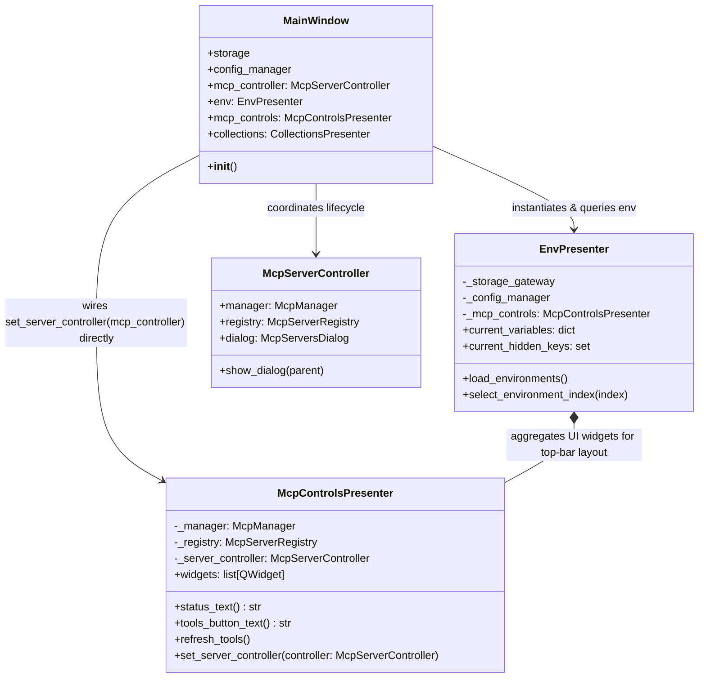

# PYPOST-1107: Retire EnvPresenter.set_mcp_server_controller and Direct Controller Wiring

## Research

### Background and Current Implementation
In PYPOST-1082, MCP controls presentation logic was extracted from `EnvPresenter` into `McpControlsPresenter`. However, `EnvPresenter.set_mcp_server_controller` was temporarily preserved as a legacy passthrough shim:
```python
# pypost/ui/presenters/env_presenter.py
def set_mcp_server_controller(self, controller: McpServerController) -> None:
    """Attach MainWindow's persistence/lifecycle API to the server manager UI."""
    self._mcp_controls.set_server_controller(controller)
```

In `pypost/ui/main_window.py`:
```python
self.env = EnvPresenter(
    self.storage,
    self.config_manager,
    self.mcp_controller.manager,
    self.settings,
    self.request_manager.get_collections,
    self.metrics,
    mcp_registry=self.mcp_controller.registry,
)
self.mcp_controls = self.env.mcp_controls
self.env.set_mcp_server_controller(self.mcp_controller)
```

### References Across the Repository
1. **Source Code**:
   - `pypost/ui/presenters/env_presenter.py:148-150`: `set_mcp_server_controller(self, controller: McpServerController) -> None` defines the delegating method.
   - `pypost/ui/main_window.py:142`: Calls `self.env.set_mcp_server_controller(self.mcp_controller)`.

2. **Test Doubles and Test Contracts**:
   - `tests/test_main_window_encrypted_startup.py:26-27`: Test double `_DeferredEnvPresenter` defines `def set_mcp_server_controller(self, controller: object) -> None: return`.
   - `tests/test_pypost_1077_verification_artifacts.py:190-202`: AST test `test_deferred_environment_presenter_has_the_mcp_controller_seam` specifically checks that `_DeferredEnvPresenter` has a method named `set_mcp_server_controller`. This contract test must be updated to check for direct controller setup or appropriate McpControls double handling.

3. **Developer Documentation**:
   - `doc/dev/presenter_architecture.md`: Mentions `EnvPresenter.set_mcp_server_controller` in the method signature list and troubleshooting table (`window.env.set_mcp_server_controller(...)`).
   - `doc/dev/verification_artifact_contracts.md`: Mentions `set_mcp_server_controller(controller)` in the encrypted-startup test contract section.
   - `doc/dev/mcp_integration.md`: Mentions `MainWindow` calls `env.set_mcp_server_controller(...)` forwarding to `McpControlsPresenter.set_server_controller`.

### Design Rationale & Principles
- **Single Responsibility Principle (SRP)**: `EnvPresenter` should only be responsible for environment variable management and environment selection. Server lifecycle and dialog management belong strictly to `McpControlsPresenter`.
- **Explicit Dependency Wiring**: `MainWindow` as the top-level application coordinator should directly invoke `self.mcp_controls.set_server_controller(self.mcp_controller)`.
- **Elimination of Passthrough Shims**: Removing unused or redundant adapter shims reduces cognitive overhead and prevents dual-path configuration bugs.

---

## Implementation Plan

### 1. Step 3: Failing Repro Test Plan
- **File**: `tests/test_env_presenter_api_surface.py` (or a dedicated test verifying `EnvPresenter` does not expose `set_mcp_server_controller` and that `MainWindow` configures `mcp_controls` directly).
- **Target Assertion**:
  1. Assert `hasattr(EnvPresenter, "set_mcp_server_controller") is False`.
  2. Assert `MainWindow` sets the controller directly on `mcp_controls.set_server_controller`.
- **Expected Failure (Red)**: In the current codebase before Step 4, `hasattr(EnvPresenter, "set_mcp_server_controller")` is `True`, causing the test to fail.
- **Sequencing**:
  - Step 3: Create failing repro test asserting absence of `set_mcp_server_controller` on `EnvPresenter`.
  - Step 4: Remove `set_mcp_server_controller` from `EnvPresenter`, update `MainWindow.__init__`, update `tests/test_main_window_encrypted_startup.py`, update `tests/test_pypost_1077_verification_artifacts.py`, and update documentation files under `doc/dev/`.

### 2. Step 4: Source Code and Test Updates
- **Remove Shim from `EnvPresenter`**:
  - Delete `EnvPresenter.set_mcp_server_controller` in `pypost/ui/presenters/env_presenter.py`.
- **Update Direct Wiring in `MainWindow`**:
  - In `pypost/ui/main_window.py`, replace `self.env.set_mcp_server_controller(self.mcp_controller)` with `self.mcp_controls.set_server_controller(self.mcp_controller)`.
- **Update Test Doubles & Artifact Tests**:
  - In `tests/test_main_window_encrypted_startup.py`: Remove `set_mcp_server_controller` from `_DeferredEnvPresenter`. Ensure `self.mcp_controls` on `_DeferredEnvPresenter` (or directly) receives `set_server_controller` when initialized.
  - In `tests/test_pypost_1077_verification_artifacts.py`: Update `test_deferred_environment_presenter_has_the_mcp_controller_seam` or replace with verification that `_DeferredEnvPresenter` provides `mcp_controls` mock with `set_server_controller` capability (or updated AST seam contract).
- **Update Documentation**:
  - Update `doc/dev/presenter_architecture.md`, `doc/dev/verification_artifact_contracts.md`, and `doc/dev/mcp_integration.md` to reflect `MainWindow` calling `self.mcp_controls.set_server_controller(...)` directly.

---

## Architecture

### Component Interaction Diagram



### Module Boundaries and APIs

| Module | Responsibility | Public API Changes |
|---|---|---|
| `pypost.ui.presenters.env_presenter.EnvPresenter` | Manages environment variables, active selection, and top bar environment selector widget. | **Removed**: `set_mcp_server_controller(controller)` |
| `pypost.ui.presenters.mcp_controls_presenter.McpControlsPresenter` | Manages MCP UI controls, tool refresh triggers, server status, and server management dialog. | **No changes** to existing `set_server_controller(controller)` API. |
| `pypost.ui.main_window.MainWindow` | Coordinates top-level application startup, presenters, and services. | Wires `self.mcp_controls.set_server_controller(self.mcp_controller)` directly instead of delegating through `self.env`. |

---

## Q&A

- **Q**: Does `EnvPresenter` still need a reference to `McpControlsPresenter`?
  - **A**: Yes, `EnvPresenter` embeds `_mcp_controls.widgets` into the top bar header layout and exposes `env.mcp_controls` for caller access. However, `EnvPresenter` no longer proxies controller lifecycle calls.
- **Q**: Will any other components be broken by removing `EnvPresenter.set_mcp_server_controller`?
  - **A**: No runtime callers exist other than `MainWindow.__init__`, which is updated simultaneously. The test doubles in `test_main_window_encrypted_startup.py` and contract verification in `test_pypost_1077_verification_artifacts.py` are explicitly updated as part of this change.
