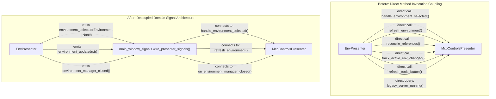

# PYPOST-1108: Decouple Environment-to-MCP state propagation with domain Qt signals

## Research

### Current State Analysis

In the current desktop application, [`EnvPresenter`](file:///home/src/pypost/ui/presenters/env_presenter.py) acts as the presenter for environment loading, variable resolution, and selection. Historically, `EnvPresenter` also managed the entire MCP (Model Context Protocol) subsystem inline. During the PYPOST-1071 refactoring, MCP UI and lifecycle logic were extracted into [`McpControlsPresenter`](file:///home/src/pypost/ui/presenters/mcp_controls_presenter.py). However, as documented in technical debt shortcut #3 of [ai-tasks/PYPOST-1082/60-tech-debt.md](file:///home/src/ai-tasks/PYPOST-1082/60-tech-debt.md), direct method invocations between the two presenters remained:

1. **Active Environment Selection / Deselection** ([`EnvPresenter._on_env_changed`](file:///home/src/pypost/ui/presenters/env_presenter.py#L314-L348)):
   ```python
   mcp_was_running = self._mcp_controls.legacy_server_running()
   ...
   self._mcp_controls.handle_environment_selected(selected)  # or None
   ...
   self._mcp_controls.refresh_tools_button()
   if mcp_was_running:
       self._mcp_controls.track_active_env_changed(previous, selected)
   ```
   Here, `EnvPresenter` queries MCP internal state (`legacy_server_running`), instructs MCP controls to start or stop servers (`handle_environment_selected`), commands MCP UI updates (`refresh_tools_button`), and calculates active environment metric tracking (`track_active_env_changed`).

2. **Variable Mutation Updates** ([`EnvPresenter.on_env_update`](file:///home/src/pypost/ui/presenters/env_presenter.py#L246-L259) and [`EnvPresenter.handle_variable_set_request`](file:///home/src/pypost/ui/presenters/env_presenter.py#L260-L290)):
   ```python
   self._mcp_controls.refresh_environment(selected.id)
   ```
   When post-request scripts or manual user entries modify variables, `EnvPresenter` explicitly notifies `_mcp_controls` to update server endpoints tied to that environment.

3. **Environment Manager Dialog Completion** ([`EnvPresenter._open_env_manager`](file:///home/src/pypost/ui/presenters/env_presenter.py#L349-L375)):
   ```python
   self._mcp_controls.reconcile_references()
   for environment in self._environments:
       self._mcp_controls.refresh_environment(environment.id)
   ```
   When the Environment Manager modal closes after batch edits, imports, or deletions, `EnvPresenter` directly orchestrates reference cleanup and configuration refreshes on `_mcp_controls`.

### Existing Application Signal Architecture

[`pypost/ui/main_window_signals.py`](file:///home/src/pypost/ui/main_window_signals.py) is the application's central mediator and event router. It wires decoupled presenters via Qt signals and slots:
- `window.collections.collections_changed` → `window.env.load_environments` and `window.mcp_controls.refresh_tools`
- `window.collections.requests_deleted` → `window.mcp_controls.refresh_tools`
- `window.tabs.request_saved` → `window.mcp_controls.refresh_tools`
- `window.tabs.variable_set_requested` → `window.env.handle_variable_set_request`
- `window.tabs.env_update_requested` → `window.env.on_env_update`
- `window.env.env_variables_changed` → `window.tabs.on_env_variables_changed`

Presenters such as [`CollectionsPresenter`](file:///home/src/pypost/ui/presenters/collections_presenter.py) and [`TabsPresenter`](file:///home/src/pypost/ui/presenters/tabs_presenter.py) do not hold direct references to `McpControlsPresenter` or call its methods directly. Instead, they broadcast domain events (`Signal`), and `main_window_signals.py` attaches relevant consumers.

The direct coupling between `EnvPresenter` and `_mcp_controls` violates this established design pattern.

### Technical & Architectural Requirements

1. **Loose Coupling**: `EnvPresenter` must communicate environment state transitions strictly by emitting domain Qt signals. It must not call operational methods on `_mcp_controls`.
2. **Encapsulation of MCP Concerns**: Logic determining whether an MCP server was running, whether to start/stop the server, when to refresh the tools button, and when to track metric events belongs entirely within `McpControlsPresenter`.
3. **Central Routing**: The application signal wiring in `main_window_signals.py` must be the single place where environment domain signals are connected to MCP control slots.
4. **Preserved Layout Composition**: In line with technical debt shortcut #1 (to be resolved in [PYPOST-1106](https://pypost.atlassian.net/browse/PYPOST-1106)), `EnvPresenter` will continue to instantiate `McpControlsPresenter` and embed its UI widgets into `ENV_BAR`. However, `EnvPresenter` will not invoke domain methods on it.
5. **No Regressions**: All existing environment workflows (switching environments, script variable mutations, manual variable setting, environment manager editing) must trigger MCP synchronization identically to before.

---

## Implementation Plan

### High-Level Phased Strategy

1. **Step 3: Failing Repro Test (Automated Red Test)**
   - Create [`tests/test_env_mcp_signals_decoupled.py`](file:///home/src/tests/test_env_mcp_signals_decoupled.py) asserting:
     - `EnvPresenter` defines domain Qt signals: `environment_selected`, `environment_updated`, and `environment_manager_closed`.
     - `EnvPresenter` emits these signals on selection/deselection, variable changes, and dialog closure.
     - `EnvPresenter` does NOT invoke `_mcp_controls` methods (`handle_environment_selected`, `refresh_tools_button`, `track_active_env_changed`, `refresh_environment`, `reconcile_references`).
     - `main_window_signals.wire_presenter_signals(window)` connects `window.env` domain signals to `window.mcp_controls` target slots.
   - Run via `make test` to verify expected failure (Red).

2. **Step 4: Development & Implementation**
   - **Phase 1 (`EnvPresenter`)**:
     - Define `environment_selected = Signal(object)` (payload: `Environment | None`).
     - Define `environment_updated = Signal(str)` (payload: `environment_id: str`).
     - Define `environment_manager_closed = Signal()`.
     - In `_on_env_changed`: emit `self.environment_selected.emit(selected)` and remove all direct calls to `_mcp_controls.legacy_server_running()`, `_mcp_controls.handle_environment_selected()`, `_mcp_controls.refresh_tools_button()`, and `_mcp_controls.track_active_env_changed()`.
     - In `on_env_update`: emit `self.environment_updated.emit(selected.id)` and remove direct call to `_mcp_controls.refresh_environment(selected.id)`.
     - In `handle_variable_set_request`: emit `self.environment_updated.emit(selected.id)` and remove direct call to `_mcp_controls.refresh_environment(selected.id)`.
     - In `_open_env_manager`: emit `self.environment_manager_closed.emit()` and remove direct calls to `_mcp_controls.reconcile_references()` and `_mcp_controls.refresh_environment(...)`.
   - **Phase 2 (`McpControlsPresenter`)**:
     - Internalize active environment tracking: maintain `self._active_environment: Environment | None`.
     - Enhance `handle_environment_selected(self, selected: Environment | None)` to:
       - Check `legacy_server_running()` before state transition.
       - Update legacy server start/stop state.
       - Call `_refresh_mcp_tools_button()`.
       - If legacy server was running, call `track_active_env_changed(previous, selected)`.
       - Update `self._active_environment = selected`.
     - Add public slot `on_environment_manager_closed(self) -> None`:
       - Invoke `self.reconcile_references()`.
       - Iterate over `self._get_environments()` and invoke `self.refresh_environment(env.id)`.
   - **Phase 3 (`main_window_signals.py`)**:
     - Wire `window.env.environment_selected.connect(window.mcp_controls.handle_environment_selected)`.
     - Wire `window.env.environment_updated.connect(window.mcp_controls.refresh_environment)`.
     - Wire `window.env.environment_manager_closed.connect(window.mcp_controls.on_environment_manager_closed)`.
   - **Phase 4 (Existing Unit Tests & Quality Gate)**:
     - Update unit tests in [`tests/test_env_presenter.py`](file:///home/src/tests/test_env_presenter.py) that previously asserted side-effects on `_mcp_controls` without signal wiring to verify signal emission or wire presenter signals.
     - Add signal routing assertions in [`tests/test_main_window_signals.py`](file:///home/src/tests/test_main_window_signals.py).
     - Run `make check` to verify full green suite, linting, and AI task verification.

3. **Step 5: Code Cleanup**
   - Review docstrings, eliminate dead imports, verify PEP 8 compliance.

4. **Step 6: Observability**
   - Ensure logging remains informative (`env_selected`, `env_deselected`, `env_variables_updated_from_script`, `mcp_active_env_changed`).

5. **Step 7: Technical Debt Analysis**
   - Document any remaining shortcuts (e.g. `_mcp_controls` widget embedding pending PYPOST-1106).

6. **Step 8: Developer Documentation**
   - Update `doc/dev/` documentation to reflect the decoupled signal architecture.

---

### Mandatory — Failing Repro (next Step 3)

- **Test File**: [`tests/test_env_mcp_signals_decoupled.py`](file:///home/src/tests/test_env_mcp_signals_decoupled.py)
- **Timeout Compliance**: Declare `pytestmark = pytest.mark.timeout(60)`.
- **Target Assertions**:
  1. `test_env_presenter_defines_domain_signals`:
     Verify that `hasattr(EnvPresenter, "environment_selected")`, `hasattr(EnvPresenter, "environment_updated")`, and `hasattr(EnvPresenter, "environment_manager_closed")`.
  2. `test_env_presenter_emits_environment_selected_signal`:
     Instantiate `EnvPresenter`, connect test spies to `environment_selected`, trigger `_on_env_changed(1)` and `_on_env_changed(0)`. Assert signal fires with `selected` (`Environment`) and `None` respectively.
  3. `test_env_presenter_emits_environment_updated_signal`:
     Instantiate `EnvPresenter` with an active environment, connect spy to `environment_updated`. Call `on_env_update({"KEY": "VAL"})` and `handle_variable_set_request("K", "V")`. Assert signal fires with the environment ID.
  4. `test_env_presenter_emits_environment_manager_closed_signal`:
     Instantiate `EnvPresenter`, patch `EnvironmentDialog.exec`, connect spy to `environment_manager_closed`. Call `_open_env_manager()`. Assert signal fires.
  5. `test_env_presenter_does_not_directly_invoke_mcp_controls`:
     Instantiate `EnvPresenter` with a mocked `_mcp_controls`. Execute `_on_env_changed`, `on_env_update`, `handle_variable_set_request`, and `_open_env_manager`. Assert that `mock_mcp_controls.handle_environment_selected.assert_not_called()`, `mock_mcp_controls.refresh_environment.assert_not_called()`, `mock_mcp_controls.reconcile_references.assert_not_called()`, and `mock_mcp_controls.track_active_env_changed.assert_not_called()`.
  6. `test_wire_presenter_signals_connects_env_domain_signals_to_mcp_controls`:
     Instantiate a mock `window` with `window.env` and `window.mcp_controls`. Call `wire_presenter_signals(window)`. Assert:
     - `window.env.environment_selected.connect.assert_any_call(window.mcp_controls.handle_environment_selected)`
     - `window.env.environment_updated.connect.assert_any_call(window.mcp_controls.refresh_environment)`
     - `window.env.environment_manager_closed.connect.assert_any_call(window.mcp_controls.on_environment_manager_closed)`
- **Failure Mechanism**:
  On current unpatched code, `EnvPresenter` lacks `environment_selected`, `environment_updated`, and `environment_manager_closed` attributes, directly calls `_mcp_controls` methods, and `wire_presenter_signals` contains no connections between `window.env` and `window.mcp_controls`. Tests will immediately fail.
- **Sequencing**:
  Implement red tests in Step 3 → Verify failure with `make test` → Proceed to Step 4 implementation until green.

---

## Architecture

### System Architecture Diagram (Before vs After)



### Component Roles & Responsibilities

| Component | Responsibility | Boundary Changes in PYPOST-1108 |
|---|---|---|
| [`EnvPresenter`](file:///home/src/pypost/ui/presenters/env_presenter.py) | Manages environment definitions, variable snapshots, combo box UI, variable mutations, and dialog launches. | **Removes** all direct calls to `_mcp_controls`. **Adds** domain Qt signals: `environment_selected`, `environment_updated`, `environment_manager_closed`. |
| [`McpControlsPresenter`](file:///home/src/pypost/ui/presenters/mcp_controls_presenter.py) | Manages MCP toolbar UI elements, server lifecycle (start/stop), tool counts, activity logs, multi-server dialogs, and registry refreshes. | **Internalizes** active environment tracking and legacy server state checks. **Exposes** slots: `handle_environment_selected`, `refresh_environment`, `on_environment_manager_closed`. |
| [`main_window_signals.py`](file:///home/src/pypost/ui/main_window_signals.py) | Central application signal wiring mediator. Connects events across presenters and panels. | **Adds** connections from `window.env` domain signals to `window.mcp_controls` slots. |

### Module Interaction Flows

#### Flow 1: Active Environment Selection / Deselection
1. User changes environment in combo box or `EnvPresenter.load_environments()` selects an environment.
2. `EnvPresenter._on_env_changed(index)` resolves variables, updates internal snapshot, and emits:
   - `env_variables_changed.emit(variables)`
   - `env_keys_changed.emit(keys)`
   - `env_hidden_keys_changed.emit(hidden_keys)`
   - `environment_selected.emit(selected)`  *(new domain signal)*
3. `main_window_signals.py` routes `environment_selected` to `McpControlsPresenter.handle_environment_selected(selected)`.
4. `McpControlsPresenter`:
   - Inspects `legacy_server_running()`.
   - Starts or stops the legacy MCP server if in single-server mode.
   - Refreshes the tools count badge on `_mcp_tools_btn`.
   - Tracks metrics via `track_active_env_changed(previous, selected)`.
   - Records `self._active_environment = selected`.

#### Flow 2: Environment Variable Mutation
1. Post-request script triggers `tabs.env_update_requested` or user triggers `tabs.variable_set_requested`.
2. `EnvPresenter` merges variables, persists to storage, updates snapshot, and emits:
   - `environment_updated.emit(selected.id)`  *(new domain signal)*
3. `main_window_signals.py` routes `environment_updated` to `McpControlsPresenter.refresh_environment(environment_id)`.
4. `McpControlsPresenter.refresh_environment(environment_id)` triggers `self._mcp_registry.refresh_environment(environment_id)` if registry is configured.

#### Flow 3: Environment Manager Batch Updates
1. User opens Environment Manager dialog and modifies/imports/deletes environments.
2. `dialog.exec()` finishes, `EnvPresenter` saves environments and emits:
   - `environment_manager_closed.emit()`  *(new domain signal)*
3. `main_window_signals.py` routes `environment_manager_closed` to `McpControlsPresenter.on_environment_manager_closed()`.
4. `McpControlsPresenter`:
   - Reconciles orphaned references via `self.reconcile_references()`.
   - Refreshes all active environment configurations via `self.refresh_environment(env.id)`.

### Architectural Patterns & Justification

- **Observer Pattern (Qt Signals & Slots)**:
  Decouples the source of state changes (`EnvPresenter`) from downstream subscribers. `EnvPresenter` announces *what happened* in its domain, not *what other components should do*.
- **Mediator Pattern (`main_window_signals.py`)**:
  Prevents peer presenters from depending directly on each other's APIs. All cross-presenter communication is visible and configurable in a single location.
- **High Cohesion & Information Expert**:
  Tracking whether an MCP server is running and updating MCP button labels belongs exclusively to `McpControlsPresenter`. `EnvPresenter` should not hold knowledge of MCP lifecycle rules.

---

## Q&A

### Why define three distinct domain signals instead of reusing `env_variables_changed`?
`env_variables_changed` emits `dict[str, str]` (the resolved variables dictionary) consumed by editor tabs for syntax highlighting and autocomplete. MCP server endpoints and registries need the `environment_id` to update scoped server configurations, the `Environment` object (or `None`) to determine whether MCP is enabled (`selected.enable_mcp`), and notification of batch manager operations to reconcile deleted environments. Emitting dedicated domain signals (`environment_selected`, `environment_updated`, `environment_manager_closed`) provides explicit semantic contracts without overloading variable payload signals.

### Why does `EnvPresenter` still instantiate `McpControlsPresenter` in this task?
Instantiating `_mcp_controls` and placing its widgets into `self._widget` (`ENV_BAR`) is a UI container shortcut documented as Technical Debt Item #1 from PYPOST-1082. Separating the physical toolbar container into a dedicated `TopBarPresenter` is scheduled for [PYPOST-1106](https://pypost.atlassian.net/browse/PYPOST-1106). PYPOST-1108 specifically isolates and eliminates the *operational method invocation coupling*, which is an independent prerequisite to extracting the container.

### How is backward compatibility preserved for existing tests?
Unit tests in `tests/test_env_presenter.py` that specifically test `EnvPresenter` will be updated to assert the emission of domain signals rather than verifying side effects on internal `_mcp_controls`. Tests that verify MCP reaction to environment changes will be placed in `test_mcp_controls_presenter.py` and `test_env_mcp_signals_decoupled.py` (with signals wired), ensuring complete end-to-end coverage without regressions.

### Does signal dispatching introduce asynchronous timing issues in the UI?
No. In Qt, signals connected within the same thread use `Qt.DirectConnection` by default, meaning slots execute synchronously when `emit()` is called. State propagation remains deterministic and immediate.
