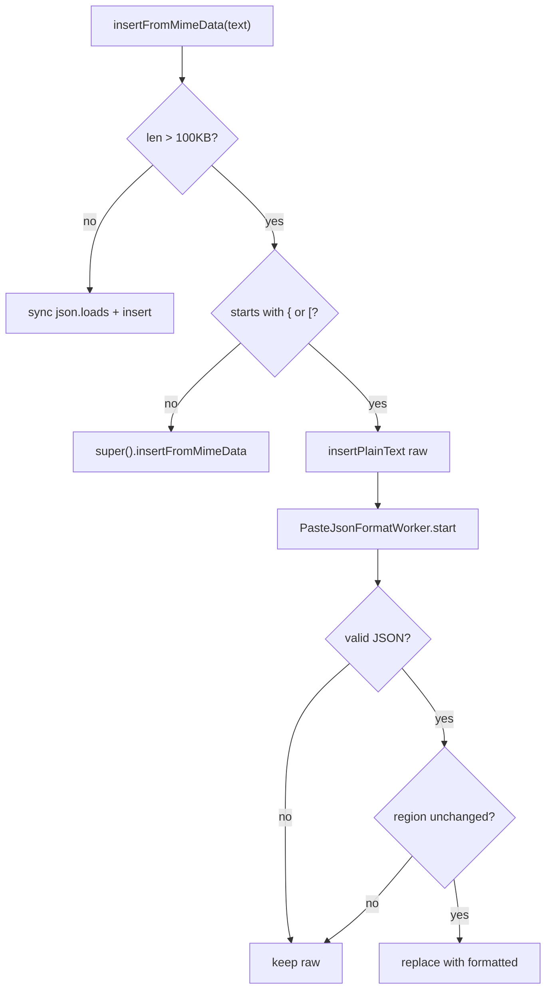

# PYPOST-111: Architecture — async large-paste JSON format

## Problem

`CodeEditor.insertFromMimeData` runs `json.loads` on the UI thread. PYPOST-109 skips parse above
100KB. Users pasting large valid JSON get unformatted minified text.

## Approach

| Paste size | Looks like JSON | Behaviour |
| ---------- | --------------- | --------- |
| ≤100KB | any | Sync parse/format (unchanged) |
| >100KB | no | Default Qt insert (unchanged) |
| >100KB | yes | Insert raw immediately; `PasteJsonFormatWorker` formats off-thread |

`PasteJsonFormatWorker` (`QThread`) mirrors `EnvironmentStorageWorker`: parse, format as indented
JSON or YAML (when `yaml_as_json`), emit result to the editor.

## Flow



## Stale-result guard

Monotonic `generation` id per async paste. Worker returns its generation; editor ignores
callbacks from superseded pastes or when the user edited the inserted range.

## Verification

```bash
QT_QPA_PLATFORM=offscreen make test
```
