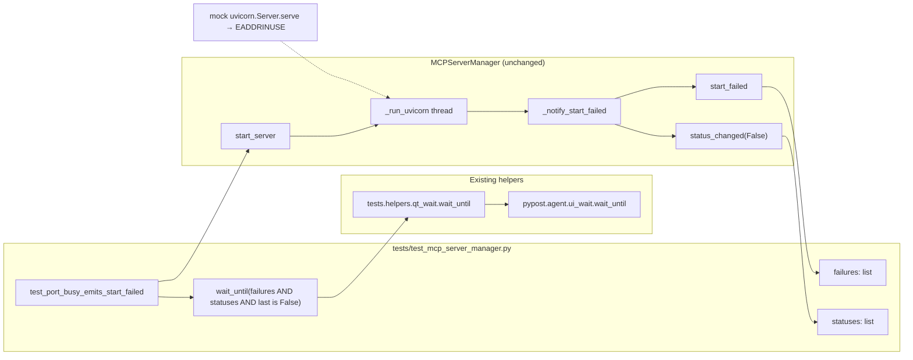

# PYPOST-1113: Stabilize busy-port start-failure test synchronization

## Research

### Problem evidence

- Jira [PYPOST-1113](https://pypost.atlassian.net/browse/PYPOST-1113) (Debt, 2 SP):
  `tests/test_mcp_server_manager.py::test_port_busy_emits_start_failed` intermittently
  fails with `assert statuses` / `E assert []` under load.
- Origin: NON-BLOCKER follow-up in `ai-tasks/PYPOST-1088/60-tech-debt.md` — observed
  ~1/4–1/6 failure rate, including on an unmodified baseline worktree (commit
  `3e4cc8b8`), so the flake predates PYPOST-1088.
- Suggested fix there (and in Jira): extend `wait_until` to require both
  `failures` and `statuses` (or a second bounded wait) before asserting
  `statuses[-1]`.

### Product signal flow (unchanged)

`MCPServerManager` (`pypost/core/qt/mcp_server.py`) already emits both outcomes on
busy-port failure:

1. `_run_uvicorn` runs in a background thread; patched/mocked
   `uvicorn.Server.serve` raises `OSError(EADDRINUSE)`.
2. `_notify_start_failed` emits `start_failed(str)` then `status_changed(False)`.
3. The `finally` block may also emit `status_changed(False)` when startup was
   never notified.

Product start/stop behavior is correct; no production change is required for
this debt item. **Do not edit** `mcp_server.py` or PYPOST-1178 WIP
(`mcp_live_server.py`, `port_allocation.py`).

### Why the test races

Cross-thread Qt signal delivery is typically **queued** into the GUI thread.
`wait_until` (via `tests/helpers/qt_wait.py` → `pypost.agent.ui_wait.wait_until`)
pumps `QCoreApplication.processEvents()` until its predicate is true.

Committed (pre-WIP) wait:

```python
wait_until(lambda: bool(failures), message="start_failed was not emitted")
assert statuses  # can still be [] if status_changed not yet delivered
```

Under load, one `processEvents` turn can deliver `start_failed` while
`status_changed` remains queued. The wait returns early; `assert statuses`
fails even though the manager will emit stopped status moments later.

### In-scope WIP (land this)

Working-tree diff already hardens the wait to match sibling
`test_status_true_when_port_is_listening` style:

```python
wait_until(
    lambda: bool(failures) and bool(statuses) and statuses[-1] is False,
    message="start_failed and stopped status were not emitted",
)
```

Post-wait asserts remain: exactly one failure message, port string present,
`statuses[-1] is False`. Redundant `assert statuses` is dropped because the
predicate already requires a non-empty stopped status.

### Industry / library guidance

- [pytest-qt `waitUntil`](https://pytest-qt.readthedocs.io/stable/wait_until.html):
  wait for a **condition**, not a single signal, when async GUI delivery can
  make immediate asserts flaky.
- [pytest-qt `waitSignals`](https://pytest-qt.readthedocs.io/latest/signals.html):
  can wait for multiple signals order-independently; useful elsewhere, but this
  suite already standardizes on bounded `wait_until` + list append slots
  (`doc/dev/testing.md`, PYPOST-727 / PYPOST-837 / PYPOST-840). Prefer extending
  the existing predicate over introducing `qtbot.waitSignals` for one test.
- [pytest flaky-test guidance](https://docs.pytest.org/en/stable/explanation/flaky.html):
  incomplete synchronization with concurrent/async effects is a classic flake
  source; fix waits, not “sleep longer.”

### Related but distinct

- **PYPOST-716** (Done): macOS segfault in the same test — fixed by mocking
  `uvicorn.Server.serve` instead of real bind. Different symptom; keep that mock.
- Module already has `pytestmark = pytest.mark.timeout(60)` (do-testing /
  lsr-python). Default `wait_until` timeout remains bounded (~10s).

## Implementation Plan

1. **Land in-scope WIP only** in `tests/test_mcp_server_manager.py` for
   `test_port_busy_emits_start_failed`: compound `wait_until` requiring
   `failures`, non-empty `statuses`, and `statuses[-1] is False`; keep failure
   content asserts; leave production and PYPOST-1178 files untouched.
2. **Do not** add fixed `time.sleep`, unbounded polls, or broader refactors of
   other MCP manager tests unless a second flake is proven in-scope.
3. **Validate** via Makefile (`make test` with focused node id, then stress-style
   multi-module command from PYPOST-1088 debt notes if needed).

**Mandatory — Failing Repro (next Step 3):**

| Item | Plan |
| --- | --- |
| Desired behavior | Wait returns only after both start-failure and stopped status are observed; then asserts on message content and `statuses[-1] is False`. |
| Where | Same node: `tests/test_mcp_server_manager.py::test_port_busy_emits_start_failed` (no new production module). |
| Force failure without live deps | Keep existing `@patch("uvicorn.Server.serve", side_effect=OSError(EADDRINUSE, ...))`. For a **deterministic** red before landing the compound wait: temporarily use the incomplete predicate `bool(failures)` only, and defer appending to `statuses` by one event-loop turn (e.g. wrap the `status_changed` slot with `QTimer.singleShot(0, ...)` or equivalent) so `start_failed` arrives first; assert that the incomplete wait returns with `statuses == []` (or that a subsequent `assert statuses` fails). Prefer this over relying on load-dependent stress alone. |
| Sequencing | Research committed incomplete wait → red with deferred status + old predicate → restore/land compound WIP wait → green under deferred status and normal path. |
| Note | If Step 3 elects stress-only red instead, use the PYPOST-1088 multi-module command repeatedly against HEAD wait; document non-determinism. Prefer deferred-delivery red for CI reliability. |

## Architecture

### Scope decision

| Layer | Change? |
| --- | --- |
| `MCPServerManager` production | No |
| `wait_until` / `ui_wait` helpers | No (reuse as-is) |
| `test_port_busy_emits_start_failed` | Yes — compound observation wait |
| Other MCP manager tests | No |
| PYPOST-1178 WIP files | No |

### Module diagram



### Module responsibilities

| Module | Responsibility in this task |
| --- | --- |
| `test_port_busy_emits_start_failed` | Connect slots, start server, **wait for both signals’ effects**, assert message + stopped status |
| `tests.helpers.qt_wait` / `ui_wait` | Bounded event-loop polling (unchanged API) |
| `MCPServerManager` | Emit `start_failed` + stopped `status_changed` on bind failure (unchanged) |
| uvicorn mock | Deterministic busy-port path without real bind (kept from PYPOST-716) |

### Selected patterns

- **Test-side synchronization (Observer / multi-condition wait):** Treat pass criteria as a
  conjunction of observer lists, not “first signal wins.” Aligns with pytest-qt
  condition waiting and repo `wait_until` practice.
- **No product redesign:** Requirements state emissions are already correct;
  changing emission order or coalescing signals would mix scopes and risk UI
  regressions.
- **Minimal diff:** Land existing WIP predicate; mirror
  `test_status_true_when_port_is_listening` (`bool(statuses) and statuses[-1] is True`).

### Interfaces (unchanged contracts)

| Interface | Contract used by the test |
| --- | --- |
| `MCPServerManager.start_failed: Signal(str)` | Append to `failures`; expect length 1 and port substring |
| `MCPServerManager.status_changed: Signal(bool)` | Append to `statuses`; expect latest `False` |
| `wait_until(condition, *, message=..., timeout=...)` | Raise `UiWaitTimeoutError` if conjunction not met within bound |
| `MCPServerManager.start_server` / `stop_server` | Exercise + cleanup in `try`/`finally` |

### Interaction scheme

1. Connect `start_failed` → `failures.append`, `status_changed` → `statuses.append`.
2. Call `start_server` (mock causes bind failure path).
3. `wait_until` until `failures` non-empty **and** `statuses` non-empty with
   last value `False` (order of list population does not matter).
4. Assert failure payload; assert stopped status (predicate already implies the
   latter’s presence).
5. `stop_server` in `finally`.

## Q&A

**Why not change `_notify_start_failed` to a single combined signal?**  
Requirements prefer a test-only sync fix; product already emits both. A combined
signal would be a larger API change with UI consumers.

**Why include `statuses[-1] is False` instead of only `bool(statuses)`?**  
Matches the debt suggestion’s intent (stopped status) and the sibling running-status
test; avoids accepting a stale/unexpected `True` if emission order ever varies.

**Why not `qtbot.waitSignals([start_failed, status_changed])`?**  
Valid, but inconsistent with this module’s established `wait_until` + list pattern
and with WIP already written. Stick to landing the compound predicate.

**Is PYPOST-716 still relevant?**  
Yes for the uvicorn mock / no real bind. This ticket only closes the Linux
signal-delivery wait gap left after that work.

**Out-of-scope sibling WIP?**  
Do not touch `pypost/core/qt/mcp_server.py`, `tests/helpers/mcp_live_server.py`,
or `tests/helpers/port_allocation.py` (PYPOST-1178).

### References

- [PYPOST-1113](https://pypost.atlassian.net/browse/PYPOST-1113)
- `ai-tasks/PYPOST-1088/60-tech-debt.md` (NON-BLOCKER entry)
- `ai-tasks/PYPOST-716/20-architecture.md` (uvicorn mock for same test)
- [pytest-qt waitUntil](https://pytest-qt.readthedocs.io/stable/wait_until.html)
- [pytest-qt waitSignals](https://pytest-qt.readthedocs.io/latest/signals.html)
- [pytest flaky tests](https://docs.pytest.org/en/stable/explanation/flaky.html)
- `doc/dev/testing.md` (bounded `wait_until` guidance)
