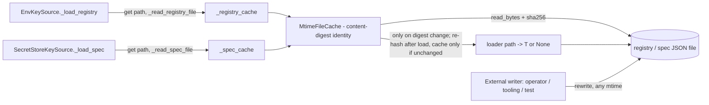

# PYPOST-1114: Structurally harden MtimeFileCache against same-tick rewrite races

## Research

### Current code (as of `dev` @ `095b8f70`)

- `pypost/core/key_sources/file_cache.py` — `MtimeFileCache[T].get(path, loader)`:
  `path.stat().st_mtime_ns` → if `(str(path), mtime_ns)` equals the stored identity and a value is
  cached, return it; otherwise call `loader(path)`. `OSError` on stat or `None` from the loader
  clears state and returns `None`. `clear()` resets `_path` / `_mtime_ns` / `_value`.
- Users (both module-level singletons, no other users in `pypost/`):
  - `pypost/core/key_sources/env.py` — `_registry_cache: MtimeFileCache[KeyRegistry]`,
    loader `EnvKeySource._read_registry_file(path)` (open + `json.load` + validation),
    `clear_registry_cache()`.
  - `pypost/core/key_sources/secret_store.py` — `_spec_cache: MtimeFileCache[dict[str, Any]]`,
    loader `SecretStoreKeySource._read_spec_file(path)`, `clear_spec_cache()`.
  - Both callers check `path.is_file()` before `get()` and log only `path=` / exception reason.
- Tests touching the cache: `tests/test_key_sources_chain_coverage.py`
  (`test_env_keys_file_cache_avoids_reread`, `test_mtime_file_cache_clear`,
  `test_clear_registry_cache_forces_reload`, `test_clear_spec_cache_forces_reload`) — these
  monkeypatch the loaders as `(self, path)` callables and assert loader call counts, so the loader
  signature `Callable[[Path], T | None]` is a de-facto contract. `tests/conftest.py` autouse
  fixture clears both caches; 4 explicit PYPOST-1088 clears in `tests/test_encryption_migration.py`
  and `tests/test_encryption_migrate_cli.py`.
- Repro convention: `tests/test_pypost_<N>_failing_repro.py` with module `pytestmark` timeout.

### Timestamp granularity (why mtime alone is insufficient)

Web search performed in Step 2 (2026-10-07); sources linked inline. These facts explain *why*
mtime is unreliable; the design does not depend on any of them (content identity is
timestamp-independent, and the repro pins mtime explicitly with `os.utime`).

- Linux stores `st_mtime_ns` with ns precision, but inode timestamps have historically been taken
  from a coarse clock updated once per jiffy, so all changes within one jiffy get the same
  timestamp ([kernel docs: Multigrain Timestamps](https://docs.kernel.org/filesystems/multigrain-ts.html)).
- Linux 6.13 merged multigrain timestamps: a fine-grained timestamp is used for the next update
  only if the inode's mtime/ctime was queried since the last change, and only on filesystems that
  opt in ([kernel docs](https://docs.kernel.org/filesystems/multigrain-ts.html);
  [Phoronix: Multigrain Timestamps for Linux 6.13](https://phoronix.com/news/Linux-6.13-Multigrain-Timestamp)).
  This is a mitigation, not a guarantee across the kernels/filesystems PyPost may run on.
- Coarser on-disk resolution: FAT write time 2 s
  ([Microsoft: Setting and Getting the Timestamp of a File](https://learn.microsoft.com/en-us/windows/win32/fileio/setting-and-getting-the-timestamp-of-a-file)),
  exFAT modified time 10 ms, HFS+ 1 s
  ([Digital Detective KB: timestamp resolution](https://kb.digital-detective.net/x/1YEU);
  [dfDateTime: Date and time values](https://dfdatetime.readthedocs.io/en/latest/sources/Date-and-time-values.html)).
- Network filesystems: NFSv3 clients validate caches by timestamps and cannot see changes made
  within the same timestamp granule
  ([kernel docs](https://docs.kernel.org/filesystems/multigrain-ts.html);
  [LKML: NFS limited mtime resolution](https://lkml.iu.edu/hypermail/linux/kernel/0009.1/0725.html)).
  Overlay and other network filesystems were not researched individually (not load-bearing).
- `os.utime(path, ns=(atime_ns, mtime_ns))` (`utimensat(2)`) sets atime/mtime explicitly, so a
  test can force the "same mtime, different content" state deterministically on any filesystem.
  `ctime` cannot be chosen by the caller — `utimensat` itself sets ctime to the current time
  ([utimensat(2)](https://man7.org/linux/man-pages/man2/utimensat.2.html)) — so ctime-based
  detection cannot be tested this way and is not used below.

### Alternatives considered

| Option | Detects same-tick rewrite by external writer? | Same-length rewrite (AC-3)? | Cost per lookup | Verdict |
| --- | --- | --- | --- | --- |
| A. Writer-side generation counter (Jira suggestion 1) | No — PyPost never writes these files; operators/tooling/tests do | — | O(1) | Rejected: cannot satisfy AC-1/AC-2 alone |
| B. Extended stat identity `(mtime_ns, ctime_ns, size, ino)` | Partly: atomic rename changes `st_ino`; in-place same-length rewrite in one tick does not change any field | No | 1 `stat` | Rejected: fails AC-3; ctime equally tick-bound |
| C. Content digest of raw bytes (Jira suggestion 2) | Yes, independent of timestamps and writer | Yes | read file (KB) + hash | **Chosen** |
| D. Hybrid: stat fast path, hash only when mtime unchanged | Yes | Yes | same as C in the stale-risk case | Rejected: the "mtime unchanged" case is the hot path, so it always hashes anyway; extra branch for no gain |
| E. TTL / always re-parse | Yes (TTL: eventually) | Yes | full parse each time / stale window | Rejected: violates AC-5 or gives only eventual freshness |

Registry/spec files are small (KB range) and read on key lookups, not in tight loops; one
`read_bytes()` + one hash per lookup is a bounded cost permitted by the non-functional requirements,
while the expensive parse + validation (`json.load`, `filter_valid_registry_keys`) still runs only
on actual content change (AC-5).

## Implementation Plan

1. **Step 3 — red test** (below) committed first; confirm it fails on current code via `make test`.
2. **Step 4 — fix in `file_cache.py` only:**
   - Replace the stored identity `(path, mtime_ns)` with `(path, digest)` where
     `digest = hashlib.sha256(raw_bytes).digest()` and `raw_bytes = path.read_bytes()`.
   - `OSError` on read → `clear()` and return `None` (same outcome as today's stat failure; AC-6).
   - If path and digest match and a value is cached → return cached value (no loader call).
   - Otherwise call `loader(path)` unchanged; on `None` → clear and return `None`.
   - **Post-load verification (closes the hash/load race):** after the loader returns a value,
     read and hash the file again. Only if `digest_after == digest_before` store
     `(path, digest_before, value)`. If the digest changed, or the second read raises `OSError`,
     do **not** cache (call `clear()`) and return the loaded value for this call; the next `get`
     re-hashes and re-parses. No retry loop (bounded cost, no livelock under a busy writer).
     Cost: the second read + hash runs only on the miss path; cache hits still do one read + hash.
   - `clear()` keeps its name/semantics (resets path, digest, value).
   - Update module/class docstrings: identity is content-based; mtime no longer used.
   - No changes to `env.py` / `secret_store.py` call sites, loaders or `clear_*_cache()` functions.
3. Keep existing tests green (`test_mtime_file_cache_clear`, `*_forces_reload`, `*_avoids_reread`).
4. Step 8 — update `doc/dev/environment_encryption_at_rest.md` § File-backed registry caching and
   the note at `doc/dev/encryption_key_migration.md:615` (AC-9): content-digest identity, no
   caller-side clear required, `clear()` kept for test isolation, limits (torn writes out of scope,
   no thread-safety guarantee, residual A→B→A rewrite completed entirely within one loader call —
   see Architecture › Interaction and edge cases).
5. `make check` and `make typecheck` (AC-8).

**Mandatory — Failing Repro (next Step 3):**

- **File:** `tests/test_pypost_1114_failing_repro.py`, module-level
  `pytestmark = pytest.mark.timeout(30)`. No live external deps; uses `tmp_path`, `monkeypatch`.
- **Forcing technique (deterministic):** helper `_rewrite_same_mtime(path, text)` that captures
  `st = path.stat()` before the write, writes the new text, then calls
  `os.utime(path, ns=(st.st_atime_ns, st.st_mtime_ns))` and asserts
  `path.stat().st_mtime_ns == st.st_mtime_ns`. This pins mtime regardless of filesystem resolution.
  No `clear_registry_cache()` / `clear_spec_cache()` / `cache.clear()` call anywhere in the tests
  after the initial state (the conftest autouse clear runs only before/after each test).
- **Tests (each must fail on current code, except the AC-5 guard):**
  1. `test_generic_cache_same_mtime_same_length_rewrite_reloads` (AC-3): `MtimeFileCache[str]`,
     write `"AAAA"`, `get` → `"AAAA"`; rewrite `"BBBB"` (same length) with pinned mtime; `get` →
     `"BBBB"`, loader called twice.
  2. `test_registry_two_rapid_rewrites_resolve_latest_active_key` (AC-1, AC-4): generate three
     Fernet keys (`pytest.importorskip("cryptography.fernet")`); registry v1 active=k1 →
     `EnvKeySource().try_resolve_active().key_id == id1`; rewrite v2 active=k2 (pinned mtime) →
     `== id2`; rewrite v3 active=k3 (pinned mtime) → `== id3`; also
     `try_resolve_by_id(id3)` resolves k3 material.
  3. `test_spec_same_mtime_rewrite_reloads` (AC-2): spec file v1 `{"marker": "one", ...}`,
     `SecretStoreKeySource()._load_spec()` → v1; rewrite v2 with pinned mtime → `_load_spec()`
     returns v2 (asserting on the parsed dict, avoiding secret-backend wiring).
  4. `test_unchanged_file_is_not_reparsed` (AC-5 guard, expected green before and after): three
     `get` calls on an unchanged file with a counting loader → loader called once.
  5. `test_touch_only_change_is_not_reparsed` — **design-semantics coverage, not AC coverage**
     (no AC requires it; it pins the chosen content-identity behaviour; red on current code):
     bump mtime with `os.utime` while bytes stay identical → loader still called once.
  6. `test_rewrite_during_load_is_not_cached_then_rollback_reloads` (AC-3 freshness under the
     hash/load race; design invariant of post-load verification; red on current code):
     `MtimeFileCache[str]`, file holds `"v1"`; capture `st` (mtime). Loader on its **first** call
     writes `"v2"` to the file (simulating an external writer landing between the cache's read and
     the loader's read), then returns `path.read_text()` → `"v2"`; later calls just return
     `path.read_text()`. `get` → `"v2"`. Then roll back: write `"v1"` and pin mtime to `st`
     (`os.utime`). `get` → must return `"v1"` with the loader called a second time. On current
     code the stale `"v2"` is served (identity `(path, mtime)` matches); with a naive
     digest-before-load design it would also be stale (`digest(v1)` stored with value `"v2"`);
     with post-load verification the first result is not cached, so it is green. Deterministic: no
     threads, no sleeps.
- **Sequencing:** research (this doc) → Step 3 writes the file, runs `make test`, records the
  failing assertions (tests 1–3 and 6 show a stale value, test 5 shows an extra re-parse) in the
  roadmap → Step 4 fix until green → `make check`.

## Architecture

### Module diagram



### Modules and responsibilities

| Module | Responsibility | Change |
| --- | --- | --- |
| `pypost/core/key_sources/file_cache.py` (`MtimeFileCache`) | Decide whether the file version changed; memoize the loader result per version | **Changed**: identity = `(path, sha256(bytes))` instead of `(path, st_mtime_ns)` |
| `pypost/core/key_sources/env.py` | Registry parsing/validation, `clear_registry_cache()` | None |
| `pypost/core/key_sources/secret_store.py` | Spec parsing, `clear_spec_cache()` | None |
| `tests/test_pypost_1114_failing_repro.py` | Regression proof (AC-1..AC-5, hash/load race) + design-semantics test 5 | **New** (Step 3) |
| `doc/dev/environment_encryption_at_rest.md`, `doc/dev/encryption_key_migration.md` | Developer docs | **Updated** (Step 8) |

### Interfaces (unchanged public surface)

```python
class MtimeFileCache(Generic[T]):
    def get(self, path: Path, loader: Callable[[Path], T | None]) -> T | None: ...
    def clear(self) -> None: ...

def clear_registry_cache() -> None: ...   # env.py
def clear_spec_cache() -> None: ...       # secret_store.py
```

Internal state: `_path: str | None`, `_digest: bytes | None`, `_value: T | None`
(`_mtime_ns` removed). The class name `MtimeFileCache` is kept for compatibility with tests and
docs even though identity is no longer mtime-based (renaming is a follow-up, see Risks).

### Patterns and justification

- **Content-addressed memoization** — the only identity that is independent of who wrote the file
  and of timestamp resolution; covers external writers (rules out option A) and same-length
  rewrites (rules out option B).
- **Single point of change** — fixing the shared cache gives both users (and any future user) the
  guarantee without caller changes (AC-3), keeping the 4 PYPOST-1088 clears harmless.
- **Loader contract preserved** — the cache still passes `path` to the loader instead of the bytes,
  so monkeypatched loaders in existing tests and the loaders' own error logging stay unchanged.

### Interaction and edge cases

- **Hash-read vs loader-read race (TOCTOU):** the cache reads bytes for the digest, then the loader
  re-opens the file. Without a guard this can get stuck stale: cache hashes v1 → writer writes v2
  → loader parses v2 → cache stores `(digest(v1), value(v2))`; if the file is later rewritten
  back to v1 bytes (rollback), the digest matches and stale v2 is served indefinitely.
  **Closed by post-load verification:** the cache re-reads and re-hashes after the loader returns
  and stores the entry only when the digest is unchanged; otherwise it returns the loaded value
  for this call without caching it (Step 3 test 6 reproduces exactly this sequence).
  **Residual limit:** an A→B→A sequence completed entirely *inside* one loader call (writer
  changes to B before the loader reads, then back to A before the re-hash) is not detectable by
  any before/after content check; it requires two external writes within a few-ms parse window
  and is self-correcting on the next real change. Documented as a limit (AC-9) together with
  torn writes (out of scope — writers must replace atomically) and no thread-safety guarantee.
  The returned value of a racing call always reflects a version that existed during the call.
- **Missing / unreadable / deleted file:** `read_bytes()` raises `OSError` → clear + `None`
  (callers' `is_file()` pre-check unchanged). Invalid / non-object JSON: loader returns `None` →
  clear + `None` (AC-6).
- **Path change:** `_path` comparison retained (AC-6).
- **Mtime-only change (touch, identical bytes):** no re-parse — strictly fewer loader calls than
  today; no test relies on touch-triggered reload (checked: only clear-based reload tests exist).

### Security (AC-7)

The digest is held only in the instance's private attribute; it is never logged, persisted,
returned or included in exceptions/`repr`.

> **Amended in Step 6:** `file_cache.py` now emits two DEBUG events on the rare post-load race
> branches — `file_cache_rewrite_during_load path=%s` and
> `file_cache_recheck_failed path=%s reason=%s` (reason = `OSError` text). They carry only the
> path and the error reason; the digest, content, size and parsed value are still never logged.
> Hit and normal miss paths stay silent. Rationale and caplog tests: `50-observability.md`.

SHA-256 is used as a change detector, not for authentication; a full-strength hash avoids
accidental collisions and avoids static-analysis findings on weak hashes.

## Risks

| Risk | Impact | Mitigation |
| --- | --- | --- |
| Per-lookup file read + hash cost | Small extra I/O on each key lookup | Files are KB-sized; parse still skipped (AC-5 test); if hot-path profiling later shows cost, add a stat pre-filter (option D) as tech debt |
| Class name `MtimeFileCache` now misleading | Maintainer confusion | Docstring + docs state content identity; record rename as Step 7 tech-debt candidate |
| Digest leakage | Content-derived value exposure | Private attribute only; digest never logged — Step 6 DEBUG events carry path/`OSError` reason only, asserted by caplog tests (AC-7, see `50-observability.md`) |
| Behaviour change on touch-only updates | A workflow relying on `touch` to force reload stops reloading | Content unchanged ⇒ parsed value identical, so no observable difference; `clear_*` still available |
| Hash/load race: write lands between the cache's read and the loader's read, later rolled back to the earlier bytes | Stale value served indefinitely (digest of old bytes paired with newer value) | Closed: post-load re-hash, cache only if digest unchanged (Step 3 test 6); miss path pays a second read + hash |
| Residual A→B→A rewrite fully inside one loader call | Value of B cached under digest of A until the next content change | Accepted limit: needs two external writes within one parse window; documented in AC-9 docs; no retry loop to keep cost bounded |
| `os.utime` pinning unavailable on exotic test FS | Repro not deterministic | Helper asserts the pin took effect (fails loudly, not silently green) |
| mypy baseline drift | AC-8 | Fully typed attributes (`bytes | None`); run `make typecheck` |

## Q&A

- **Q: Why not a write-generation counter as Jira suggests?** A: PyPost never writes these files
  (requirements § Current behaviour); a counter only covers writes PyPost performs, so it cannot meet
  AC-1/AC-2.
- **Q: Why not just add `st_size` / `st_ino` / `st_ctime_ns` to the key?** A: An in-place
  same-length rewrite within one tick changes none of them (AC-3 requires this case); ctime has the
  same tick granularity as mtime and cannot be pinned in tests.
- **Q: Does the loader signature change?** A: No; `Callable[[Path], T | None]` is kept so existing
  callers and monkeypatched test loaders are untouched.
- **Q: Do the 4 PYPOST-1088 `clear_registry_cache()` calls get removed?** A: No (out of scope);
  they become redundant but harmless. The Step 3 repro proves the guarantee without them.
- **Q: Thread safety?** A: Unchanged (out of scope); the cache was not thread-safe before either.
