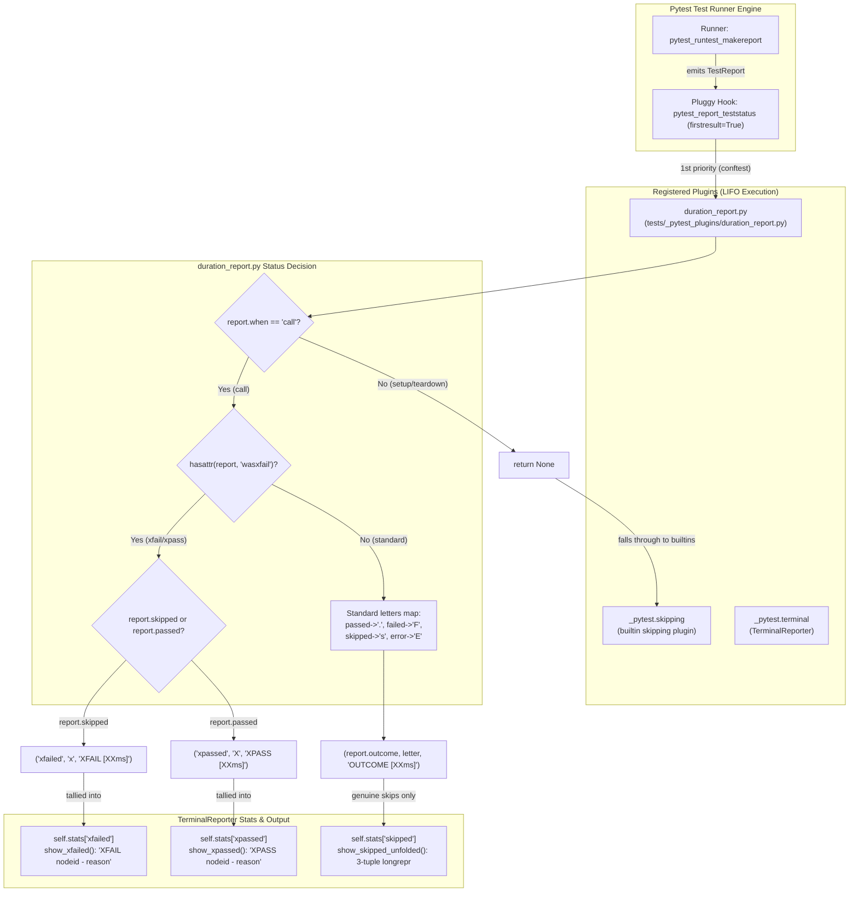

# PYPOST-1116: Fix xfail and XPASS outcome reporting in duration report pytest plugin

## Research

### Background and Defect Mechanism

The repository uses an in-tree pytest plugin (`tests/_pytest_plugins/duration_report.py`) loaded
globally via `tests/conftest.py`. Its purpose is twofold:
1. Append formatted elapsed test durations `[<time>]` to verbose status words in the terminal.
2. Track call durations to print a "top 5 slowest tests" summary table at session end.

However, the plugin's hook implementation of `pytest_report_teststatus` currently intercepts
test status reporting indiscriminately for all `call` reports:

```python
def pytest_report_teststatus(report: TestReport, config):
    if report.when != "call":
        return None
    letters = {"passed": ".", "failed": "F", "skipped": "s", "error": "E"}
    letter = letters.get(report.outcome, "?")
    word = f"{report.outcome.upper()} [{format_duration(report.duration)}]"
    return report.outcome, letter, word
```

This causes two severe defects:
1. **Misclassification of `xfail` and `XPASS` outcomes**:
   - In pytest, expected failures (`xfail`) that fail during the call phase have
     `report.outcome = "skipped"` and `report.wasxfail = "<reason>"`.
   - Unexpected passes (`xfail(strict=False)` tests that pass) have `report.outcome = "passed"`
     and `report.wasxfail = "<reason>"`.
   - The plugin maps `report.outcome` directly: an `xfail` failure is reported as category
     `"skipped"`, letter `"s"`, and word `"SKIPPED [<time>]"`. An `XPASS` pass is reported as
     category `"passed"`, letter `"."`, and word `"PASSED [<time>]"`.
   - The developer loses all visibility into expected failures and resolved bugs.

2. **Terminal crash (`AssertionError`) under `-ra` / `-rs` / `-rA`**:
   - In `_pytest/terminal.py`, the terminal reporter organizes reports into categories
     returned by `pytest_report_teststatus` via `self._add_stats(category, [rep])`.
   - When `-ra` or `-rs` is passed, `TerminalReporter.short_test_summary()` executes
     `show_skipped_unfolded()`, iterating over `self.stats.get("skipped", [])`.
   - `show_skipped_unfolded()` asserts that every report in `"skipped"` has a 3-tuple
     `longrepr` (file path, line number, skip reason):
     ```python
     assert rep.longrepr is not None
     assert isinstance(rep.longrepr, tuple), (rep, rep.longrepr)
     assert len(rep.longrepr) == 3, (rep, rep.longrepr)
     ```
   - For an `xfail` report, `rep.longrepr` is an exception traceback / crash representation
     (or string), NOT a 3-tuple. The assertion fails and crashes the test run.

### Hook Execution Order and Pluggy Semantics

In pytest, `pytest_report_teststatus` is defined in `_pytest/hookspec.py` as:
```python
@hookspec(firstresult=True)
def pytest_report_teststatus(
    report: CollectReport | TestReport, config: Config
) -> TestShortLogReport | tuple[str, str, str | tuple[str, Mapping[str, bool]]]:
    ...
```

Key architectural rules of pluggy and pytest hooks:
- **`firstresult=True`**: The pluggy hook runner executes registered implementations in LIFO
  (reverse registration) order unless decorated with `tryfirst=True` or `trylast=True`.
- As soon as any hook implementation returns a non-None value, execution stops and that result
  is taken as the final outcome.
- Plugins listed in `tests/conftest.py` (`pytest_plugins = [...]`) are registered after core
  pytest plugins (such as `_pytest.skipping` and `_pytest.terminal`).
- Therefore, `duration_report.pytest_report_teststatus` executes **before**
  `_pytest.skipping.pytest_report_teststatus`.
- When `duration_report.py` returns `(report.outcome, letter, word)` for `when == "call"`,
  `_pytest.skipping`'s hook is completely bypassed.

### Native Pytest Skipping Implementation

In pytest (`_pytest/skipping.py`), test report creation and status reporting work as follows:

1. **Report Generation (`pytest_runtest_makereport`)**:
   - When an `xfail(strict=False)` test fails during `call`:
     `rep.outcome = "skipped"`
     `rep.wasxfail = xfailed.reason`
   - When an `xfail(strict=False)` test passes during `call`:
     `rep.outcome = "passed"`
     `rep.wasxfail = xfailed.reason`
   - When an `xfail(strict=True)` test passes during `call`:
     `rep.outcome = "failed"`
     `rep.longrepr = "[XPASS(strict)] " + xfailed.reason`
     (Notice: `rep.wasxfail` is NOT set for strict xpass; it is treated as a hard failure).
   - When an `xfail` test fails with an exception not listed in `raises`:
     `rep.outcome = "failed"`
     (Notice: `rep.wasxfail` is NOT set; it is treated as an unexpected failure).

2. **Status Reporting (`pytest_report_teststatus` in `_pytest/skipping.py`)**:
   ```python
   def pytest_report_teststatus(report: BaseReport) -> tuple[str, str, str] | None:
       if hasattr(report, "wasxfail"):
           if report.skipped:
               return "xfailed", "x", "XFAIL"
           elif report.passed:
               return "xpassed", "X", "XPASS"
       return None
   ```
   Notice that `skipping.py` returns `None` if `not hasattr(report, "wasxfail")`, allowing
   subsequent hooks (the default terminal reporter) to handle standard outcomes.

3. **Phase Handling (`when != "call"`)**:
   - Test execution involves three phases: `setup`, `call`, `teardown`.
   - Skips or xfails during `setup` (e.g. `@pytest.mark.skip` or `pytest.xfail` in a fixture)
     have `report.when == "setup"`.
   - Returning `None` when `report.when != "call"` allows pytest's native hooks to format
     `setup` / `teardown` reports cleanly without attaching misleading call-duration brackets.

## Implementation Plan

### High-Level Sequencing

1. **Step 2 (Architecture Design — this step)**:
   - Document research, hook semantics, component interactions, and repro test design.
   - Create `ai-tasks/PYPOST-1116/20-architecture.md` and update `00-roadmap.md`.
2. **Step 3 (Failing Repro Test)**:
   - Create automated red tests in `tests/test_duration_report.py`.
   - Assert expected outcomes for `xfail` (category `xfailed`, letter `x`, word `XFAIL [...]`),
     `xpass` (category `xpassed`, letter `X`, word `XPASS [...]`), standard outcomes, and
     absence of `AssertionError` under `-ra`.
   - Verify that these tests fail against current unpatched `duration_report.py`.
3. **Step 4 (Development / Production Fix)**:
   - Update `tests/_pytest_plugins/duration_report.py` to inspect `hasattr(report, "wasxfail")`.
   - Ensure `report.skipped` returns `("xfailed", "x", f"XFAIL [{format_duration(...)}]")`.
   - Ensure `report.passed` returns `("xpassed", "X", f"XPASS [{format_duration(...)}]")`.
   - Verify all tests pass cleanly under `make test` and `make check`.
4. **Steps 5–8 (Cleanup, Observability, Tech Debt, Dev Docs)**:
   - Standard top-down workflow completion steps.

### Mandatory — Failing Repro (next Step 3)

The failing repro tests will be implemented in `tests/test_duration_report.py` without requiring
any live external services or network calls:

1. **Unit Test Level (`test_pytest_report_teststatus_xfail_outcomes`)**:
   - Construct mock / real `TestReport` instances representing:
     - `xfail` failure during `call`: `when="call"`, `outcome="skipped"`, `wasxfail="known bug"`
       -> asserts return is `("xfailed", "x", "XFAIL [12ms]")`
     - `xfail` pass during `call`: `when="call"`, `outcome="passed"`, `wasxfail="resolved bug"`
       -> asserts return is `("xpassed", "X", "XPASS [12ms]")`
     - Standard `passed` during `call`: `when="call"`, `outcome="passed"`
       -> asserts return is `("passed", ".", "PASSED [12ms]")`
     - Standard `failed` during `call`: `when="call"`, `outcome="failed"`
       -> asserts return is `("failed", "F", "FAILED [12ms]")`
     - Standard `skipped` during `call`: `when="call"`, `outcome="skipped"`
       -> asserts return is `("skipped", "s", "SKIPPED [12ms]")`
     - Non-call phases (`when="setup"` or `when="teardown"`)
       -> asserts return is `None`
   - *Failure mechanism on unpatched code*:
     The unpatched hook returns `("skipped", "s", "SKIPPED [12ms]")` instead of `xfailed`, and
     `("passed", ".", "PASSED [12ms]")` instead of `xpassed`.

2. **Integration Test Level (`test_duration_report_xfail_terminal_integration`)**:
   - Use pytest's built-in `pytester` fixture (`pytest_plugins = ["pytester"]`).
   - Create an in-memory test file `test_sample.py` with:
     - A test `@pytest.mark.xfail(strict=False)` that fails (`assert False`).
     - A test `@pytest.mark.xfail(strict=False)` that passes (`assert True`).
     - A test `@pytest.mark.skip` (`assert True`).
     - A standard passing test (`assert True`).
   - Execute `result = pytester.runpytest("-v", "-ra")`.
   - Assert:
     - Terminal output contains `XFAIL [` and `XPASS [`.
     - Summary output reflects `1 passed, 1 skipped, 1 xfailed, 1 xpassed`.
     - Process exit code is `0`.
     - Stderr / stdout contains no `AssertionError` from `show_skipped_unfolded`.
   - *Failure mechanism on unpatched code*:
     The unpatched plugin causes `AssertionError` inside `show_skipped_unfolded` when `-ra` is
     passed, terminating pytest abnormally.

## Architecture

### Component Diagram



### Module Responsibilities

- **`duration_report.py`** (`tests/_pytest_plugins/duration_report.py`):
  Detect `wasxfail` on call reports; return `xfailed`/`xpassed` categories, `x`/`X` letters,
  and `XFAIL [...]`/`XPASS [...]` status words. Return `None` for non-call phases.
- **`test_duration_report.py`** (`tests/test_duration_report.py`):
  Unit tests for `format_duration` and `pytest_report_teststatus`; integration tests via
  `pytester` covering `-ra` flag and xfail/xpass terminal formatting.
- **`_pytest.skipping`** (Pytest core plugin):
  Populates `report.wasxfail` during `pytest_runtest_makereport`. Serves as fallback for
  setup/teardown xfail reporting when plugin returns `None`.
- **`_pytest.terminal`** (Pytest core plugin):
  Aggregates test statistics and formats short test summary (`-r` flags) based on categories
  returned by `pytest_report_teststatus`.

### Detailed Interface and Logic Changes

The updated `pytest_report_teststatus` in `tests/_pytest_plugins/duration_report.py` will follow
this exact interface and control flow:

```python
def pytest_report_teststatus(report: TestReport, config) -> tuple[str, str, str] | None:
    if report.when != "call":
        return None

    duration_tag = f"[{format_duration(report.duration)}]"

    if hasattr(report, "wasxfail"):
        if report.skipped:
            return "xfailed", "x", f"XFAIL {duration_tag}"
        if report.passed:
            return "xpassed", "X", f"XPASS {duration_tag}"

    letters = {"passed": ".", "failed": "F", "skipped": "s", "error": "E"}
    letter = letters.get(report.outcome, "?")
    word = f"{report.outcome.upper()} {duration_tag}"
    return report.outcome, letter, word
```

### Invariant Analysis

1. **xfail (expected failure)**:
   - Call phase fails.
   - `report.outcome == "skipped"`, `report.skipped is True`, `hasattr(report, "wasxfail") is True`.
   - Returns: `("xfailed", "x", f"XFAIL [{format_duration(report.duration)}]")`.
   - Category is `"xfailed"`, so `TerminalReporter` places it in `stats["xfailed"]`.
   - In verbose mode, displays `XFAIL [15ms]`.
   - In progress mode, displays `x`.
   - Under `-ra`, `show_xfailed()` is invoked, displaying reason without error.

2. **XPASS (unexpected pass, non-strict)**:
   - Call phase passes.
   - `report.outcome == "passed"`, `report.passed is True`, `hasattr(report, "wasxfail") is True`.
   - Returns: `("xpassed", "X", f"XPASS [{format_duration(report.duration)}]")`.
   - Category is `"xpassed"`, so `TerminalReporter` places it in `stats["xpassed"]`.
   - In verbose mode, displays `XPASS [12ms]`.
   - In progress mode, displays `X`.
   - Under `-ra`, `show_xpassed()` is invoked, displaying reason without error.

3. **XPASS (strict)**:
   - Call phase passes under `@pytest.mark.xfail(strict=True)`.
   - Pytest `skipping.py` sets `report.outcome = "failed"` and does NOT set `report.wasxfail`.
   - `hasattr(report, "wasxfail")` is `False`.
   - Returns: `("failed", "F", f"FAILED [{format_duration(report.duration)}]")`.
   - Fully matches pytest native behavior (strict XPASS is a test failure).

4. **Genuine skip**:
   - `report.outcome == "skipped"`, `hasattr(report, "wasxfail") is False`.
   - Returns: `("skipped", "s", f"SKIPPED [{format_duration(report.duration)}]")`.
   - `TerminalReporter` places it in `stats["skipped"]`.
   - Under `-ra`, `show_skipped_unfolded()` processes genuine skips where `longrepr` is a
     valid 3-tuple. No `AssertionError` is raised.

5. **Genuine pass / fail / error**:
   - Standard outcomes continue to return `("passed", ".", f"PASSED [{dur}]")`,
     `("failed", "F", f"FAILED [{dur}]")`, `("error", "E", f"ERROR [{dur}]")`.

6. **Non-call phases**:
   - Setup / teardown reports return `None`, leaving status reporting to pytest's native
     `_pytest.skipping` and `_pytest.terminal` plugins.

## Q&A

- **Q: Why does pytest_report_teststatus in duration_report take precedence over skipping.py?**
  A: Plugins declared via `pytest_plugins = [...]` in `conftest.py` are registered after
  built-in plugins. Because pluggy hook specifications marked `firstresult=True` execute hooks
  in LIFO (reverse registration) order, `duration_report.py` executes before `skipping.py`.
  When `duration_report.py` returns a non-None tuple, pluggy halts hook execution and uses that
  value.

- **Q: Why did pytest crash with AssertionError when -ra or -rs was passed?**
  A: In `_pytest/terminal.py:1309`, `show_skipped_unfolded` iterates over `self.stats["skipped"]`
  and executes `assert isinstance(rep.longrepr, tuple)`. Genuine skip reports provide a
  3-tuple `(filepath, lineno, reason)`. When `duration_report.py` categorized `xfail` reports
  as `"skipped"`, pytest placed them into `stats["skipped"]`. Because `xfail` reports contain
  a crash representation or traceback object rather than a 3-tuple, the assertion failed.

- **Q: Why should non-call phases return None?**
  A: Test durations are only meaningful and tracked during the `call` phase. If setup or teardown
  raises an exception or is skipped, pytest's built-in reporters format the failure or skip
  appropriately (such as displaying `ERROR` in setup). Formatting duration brackets during
  setup/teardown would produce confusing output and override pytest's setup error handling.

- **Q: Will this fix impact the top-5 slowest tests summary?**
  A: No. The slowest tests summary is populated in `pytest_runtest_logreport` when
  `report.when == "call"`, appending `(report.nodeid, report.duration)` to `_call_durations`.
  This is orthogonal to `pytest_report_teststatus` and operates correctly across all outcomes.

- **Q: Are any application code files modified in this task?**
  A: No. This task is strictly scoped to the test infrastructure:
  `tests/_pytest_plugins/duration_report.py` and `tests/test_duration_report.py`.
