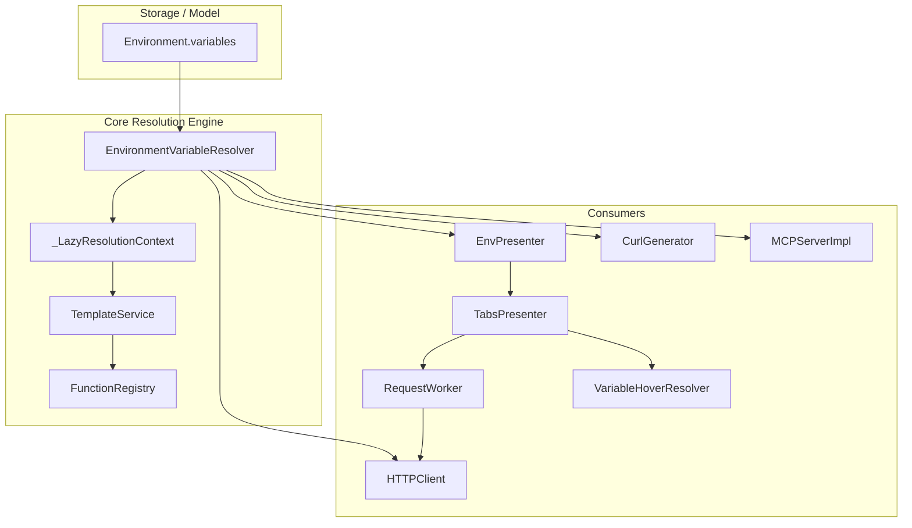

# Architecture: PYPOST-1119

## Overview

PYPOST-1119 enables template expression evaluation (including built-in functions such as `env`, `urlencode`, `md5`, `base64`, `to_int` and cross-variable references) inside environment profile variable values.

## Architectural Components

### 1. `EnvironmentVariableResolver` (`pypost/core/environment_variable_resolver.py`)
- Encapsulates recursive evaluation of environment variable values.
- Fast-path check: If no values contain `{{`, returns the raw mapping immediately without executing Jinja2 compilation.
- Uses `_LazyResolutionContext` (a custom dict mapping) during Jinja rendering to resolve referenced variables lazily on-demand.
- Tracks active recursion stack (`visiting`) to detect circular dependencies (e.g. `A -> B -> A`) and logs a warning while returning the unrendered fallback value to prevent infinite recursion.
- Enforces `MAX_VARIABLE_RESOLUTION_DEPTH = 32` to cap chain depth.

### 2. `TemplateService` Integration (`pypost/core/template_service.py`)
- Exposes `resolve_environment_variables(variables: dict[str, Any], render_path: str = "runtime") -> dict[str, str]`.
- Integrates `EnvironmentVariableResolver` using the service's existing Jinja2 `Environment` and metrics tracker.
- `render_string` can automatically resolve variables if raw variable templates are provided.

### 3. `FunctionRegistry` Enhancements (`pypost/core/function_registry.py`)
- Updates `_env(name)` to inspect `name._undefined_name` when Jinja evaluates an undefined identifier like `{{ env(API_KEY) }}`, retrieving `os.environ.get("API_KEY", "")`. This enables both variable-backed arguments (`{{env(key)}}` where `key="API_KEY"`) and direct identifier arguments (`{{env(API_KEY)}}`).

### 4. Consumer Wiring
- **UI Presenters**: `EnvPresenter` resolves active environment variables on selection / change before emitting `env_variables_changed`, ensuring widgets and hover resolvers receive the resolved snapshot.
- **Request Dispatch**: `HTTPClient.send_request` and `RequestService.execute` evaluate variable values prior to request preparation and HTTP execution.
- **MCP Server**: `MCPServerImpl._build_execution_variables` resolves environment variables before merging with `mcp.request` arguments.
- **cURL Generation**: `CurlGenerator.generate` operates on resolved variables.
- **Hover & Runtime Parity**: Hover tooltips via `VariableHoverResolver` match runtime evaluated values across all function calls and cross-variable references.
