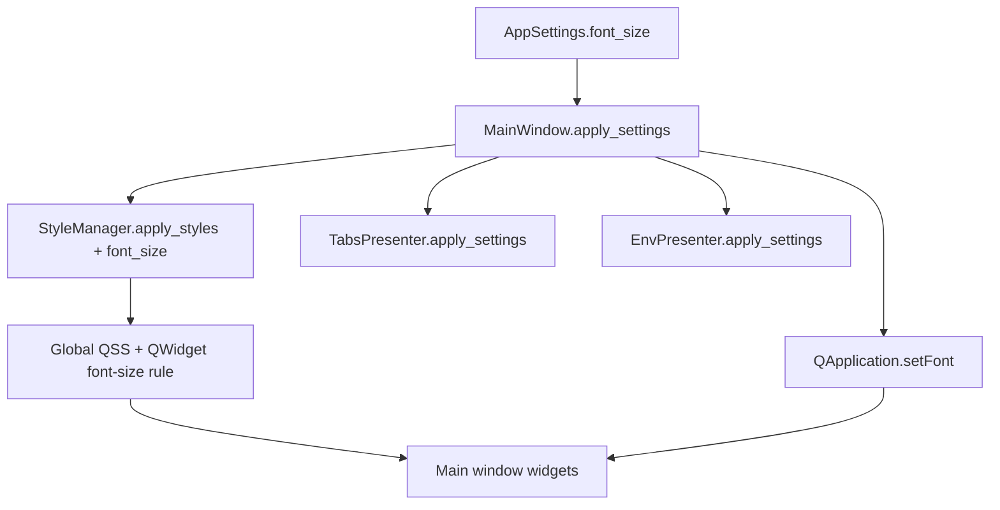

# PYPOST-112: Font inheritance investigation

## Investigation summary

### Why automatic inheritance failed (PYPOST-12 era)

| Cause | Effect | Mitigation |
| --- | --- | --- |
| `QApplication.setStyleSheet()` re-polish | Resets application default font if `setFont` ran first (PYPOST-404) | Apply stylesheet before `app.setFont` |
| Global QSS without `font-size` rule | Styled widgets keep stylesheet defaults, not user setting | Inject `QWidget { font-size: Npt; }` via `StyleManager` (PYPOST-106) |
| Widget-local `setStyleSheet` with fixed `font-size` | Local rule overrides inheritance | Accept or audit per-widget QSS separately |
| `CodeEditor` layout metrics | Tab stops and gutter width tied to font metrics | `_refresh_font_metrics` on `QEvent.FontChange` (PYPOST-107) |

### Current `apply_settings` flow (verified)

`MainWindow.apply_settings` no longer calls `setFont` on individual child widgets. Presenter
`apply_settings` methods handle non-font settings only (indent, JSON colors).

### PYPOST-107 overlap

PYPOST-107 removed body-editor font propagation from `TabsPresenter` and added
`CodeEditor._refresh_font_metrics` on `FontChange`. That addresses the one case where inheritance
alone was insufficient: layout derived from font metrics must be recalculated when the inherited
font changes.

### Conclusion

No further refactor of `MainWindow.apply_settings` is required. The PYPOST-12 debt item is
satisfied by the combined PYPOST-106 + PYPOST-107 work plus this investigation record.

## Implementation plan (this task)

1. Document findings in `doc/dev/ui_font_and_styles.md`.
2. Mark PYPOST-112 resolved in `ai-tasks/PYPOST-12/40-tech-debt.md`.
3. Re-run font regression tests to confirm behaviour.
