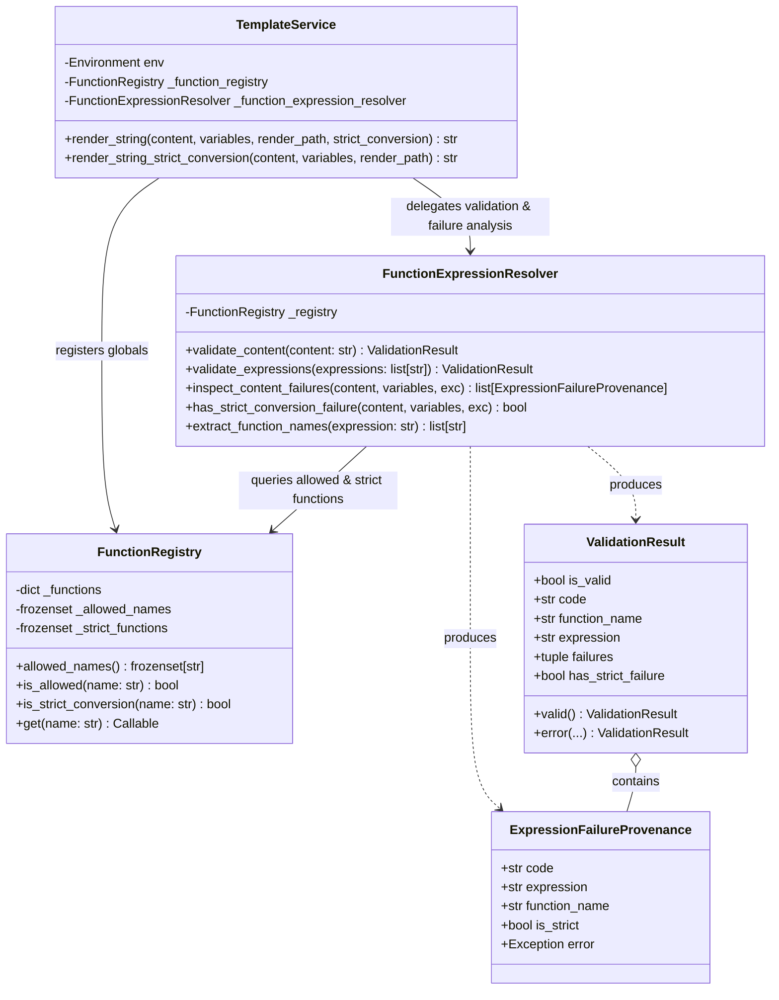
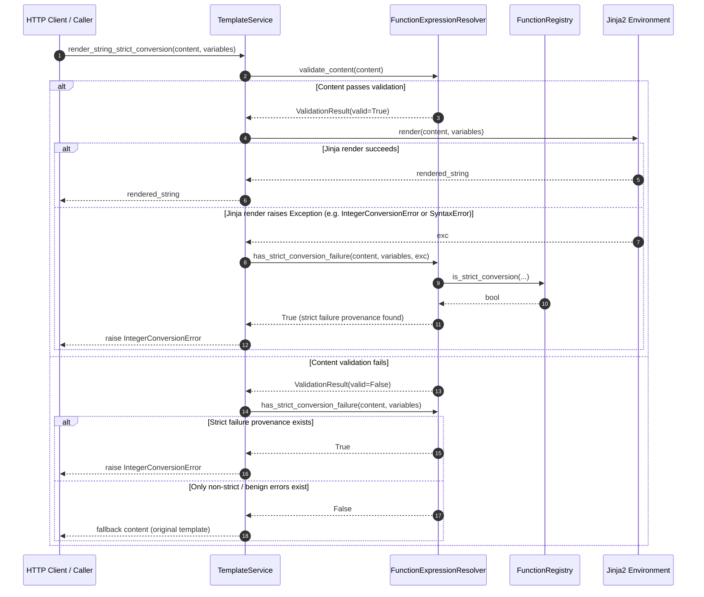

# PYPOST-1120: Return structured failed-function provenance from FunctionExpressionResolver for strict rendering

## Research

### Background and Problem Statement

In [PYPOST-1037](https://pypost.atlassian.net/browse/PYPOST-1037), strict conversion was introduced for `to_int` to ensure HTTP requests fail closed when integer conversion fails, rather than silently sending invalid unconverted literal placeholders to external APIs or MCP services.

During that implementation, a non-blocking technical debt item was recorded in `ai-tasks/PYPOST-1037/60-tech-debt.md` (lines 29-35 and 91):
> `TemplateService` recognizes failed `to_int` calls with `_TO_INT_CALL_RE` and `_STARTED_TO_INT_CALL_RE`, while `FunctionExpressionResolver` owns the expression grammar. The current patterns cover the required valid, malformed, wrong-arity, nested, and identifier-boundary cases. If the expression grammar or a future strict conversion function is added, the resolver should return structured failure provenance instead of extending regex heuristics in the renderer.

### Codebase Inspection Findings

1. **Renderer Regex Heuristics in [`TemplateService`](file:///home/src/pypost/core/template_service.py#L35-L40):**
   - Lines 37-38 define regex constants directly on `TemplateService`:
     ```python
     _DIRECT_TO_INT_CALL_RE = re.compile(r"^\s*to_int\s*\(")
     _STARTED_TO_INT_CALL_RE = re.compile(r"\{\{\s*to_int\s*\(")
     ```
   - In [`_is_failed_to_int_expression`](file:///home/src/pypost/core/template_service.py#L134-L176), `TemplateService` loops through completed placeholders matching `_DIRECT_TO_INT_CALL_RE` and uses `_STARTED_TO_INT_CALL_RE` to detect unclosed placeholders like `{{to_int(...)`.
   - **Architectural Violation:** `TemplateService` (the rendering orchestrator) performs ad-hoc lexical parsing and hardcodes function names (`to_int`). It bypasses the grammar engine in `FunctionExpressionResolver`.

2. **Grammar Evading Edge Cases:**
   - **Nested strict conversion:** In an expression like `{{ md5(to_int(issue_id)) }}`, `_DIRECT_TO_INT_CALL_RE` (`^\s*to_int\s*\(`) does *not* match because `md5` is the outer function. If this template also contains an earlier invalid expression (e.g. `{{not_allowed(x)}}/{{md5(to_int(issue_id))}}`), the resolver fails on `not_allowed(x)`. When fallback handling runs, `_is_failed_to_int_expression` checks `_DIRECT_TO_INT_CALL_RE`, misses `to_int`, and erroneously falls back to literal content instead of failing closed!
   - **New strict functions:** If another conversion function with strict fail-closed requirements is registered (e.g. `to_float`, `to_bool`), `TemplateService` would require duplicate regexes.
   - **Grammar variations:** Whitespace or future delimiter evolutions require dual maintenance in both the tokenizer/resolver and the renderer.

3. **Current Function Expression Subsystem State:**
   - [`FunctionRegistry`](file:///home/src/pypost/core/function_registry.py): Single catalog of permitted functions (`urlencode`, `md5`, `base64`, `to_int`, `env`), but lacks metadata about whether a function enforces strict conversion semantics.
   - [`template_expression_types.py`](file:///home/src/pypost/core/template_expression_types.py): Contains `ValidationResult` with scalar fields (`is_valid`, `code`, `function_name`, `expression`), but cannot carry multiple failures or structured failure provenance records across a template containing multiple placeholders.
   - [`FunctionExpressionResolver`](file:///home/src/pypost/core/function_expression_resolver.py): Validates single expressions or token lists, but terminates at the first error (`validate_expressions`), and lacks an authoritative method to inspect complete content and extract structured failure provenance.

---

## Implementation Plan

### High-Level Execution Strategy

1. **Declare Strict Function Metadata in `FunctionRegistry`:**
   - Add `STRICT_CONVERSION_FUNCTIONS = frozenset({"to_int"})` to `FunctionRegistry`.
   - Provide `FunctionRegistry.is_strict_conversion(name: str) -> bool` to make function classification authoritative and centralized.

2. **Model Structured Failure Provenance in `template_expression_types.py`:**
   - Introduce `ExpressionFailureProvenance`:
     - `code: str` (e.g. `"unknown_function"`, `"invalid_syntax"`, `"invalid_arity"`, `"invalid_argument"`, `"conversion_error"`)
     - `expression: str | None` (the inner expression string)
     - `function_name: str | None` (the function that triggered or is associated with the failure)
     - `is_strict: bool` (whether the failed function or any function in the failed call chain enforces strict conversion)
     - `error: Exception | None` (underlying exception if evaluated)
   - Enrich `ValidationResult` with `failures: tuple[ExpressionFailureProvenance, ...]` while preserving `is_valid`, `code`, `function_name`, and `expression` for complete backward compatibility with all existing consumers and tests.
   - Add helper property `has_strict_failure: bool` to `ValidationResult`.

3. **Provide Authoritative Failure Provenance in `FunctionExpressionResolver`:**
   - Enhance the resolver with:
     - `extract_function_names(expression: str) -> list[str]`: Recursively inspects parsed expressions to find all functions called (outer and nested).
     - `contains_strict_function(expression: str) -> bool`: Checks if any function in the expression is strict.
     - `inspect_content_failures(content: str, variables: dict[str, Any] | None = None, exc: Exception | None = None) -> list[ExpressionFailureProvenance]`:
       - Tokenizes completed `{{ ... }}` placeholders and identifies unclosed `{{ ...` placeholders.
       - Validates all placeholders (not just stopping at the first failure), building structured `ExpressionFailureProvenance` entries.
       - For placeholders containing strict functions that passed syntactic validation, attempts evaluation against `variables` to detect runtime conversion failures (`IntegerConversionError`).
       - For unclosed placeholders, inspects the partial token to detect if strict functions were invoked.
     - `validate_expressions_with_provenance(expressions: list[str]) -> ValidationResult`: Returns a `ValidationResult` populated with full provenance for all failing expressions.

4. **Decouple `TemplateService` from Regex Heuristics:**
   - Delete `_DIRECT_TO_INT_CALL_RE` and `_STARTED_TO_INT_CALL_RE` from `TemplateService`.
   - Replace `_is_failed_to_int_expression` with a clean resolver query:
     - Query `self._function_expression_resolver.has_strict_conversion_failure(content, variables, exc=exc)` (or inspect provenance).
     - If any strict conversion failed, raise `IntegerConversionError("Invalid to_int template expression") from exc`.
     - Otherwise, preserve safe literal fallback.

---

### Mandatory — Failing Repro Test Plan (Step 3)

- **Test File Location:** `tests/test_template_service_strict_to_int.py` (dedicated regression and contract suite).
- **Red Assertions to author *before* production fix:**
  1. **Absence of Regex Coupling:**
     - Assert that `hasattr(TemplateService, "_DIRECT_TO_INT_CALL_RE") is False`.
     - Assert that `hasattr(TemplateService, "_STARTED_TO_INT_CALL_RE") is False`.
  2. **Nested Strict Conversion Detection:**
     - Template: `"{{not_allowed(dummy)}}/{{md5(to_int(val))}}"` with `{"val": "not-an-int", "dummy": "x"}`.
     - Calling `svc.render_string_strict_conversion(...)` must raise `IntegerConversionError`.
     - Under the old code, this test **fails** (raises `AssertionError` because old code returns fallback due to `_DIRECT_TO_INT_CALL_RE` only matching prefix `to_int\s*\(`).
  3. **Structured Failure Provenance Contract on Resolver:**
     - Call `resolver.inspect_content_failures("{{not_allowed(x)}}/{{to_int(42, 99)}}")`.
     - Assert that the returned provenance list contains 2 failures:
       - Failure 1: `function_name="not_allowed"`, `code="unknown_function"`, `is_strict=False`.
       - Failure 2: `function_name="to_int"`, `code="invalid_arity"`, `is_strict=True`.
     - Call `resolver.inspect_content_failures("{{to_int(unclosed")` (unclosed placeholder).
       - Assert that it returns provenance with `function_name="to_int"` and `is_strict=True`.
- **Sequencing:**
  1. Step 3: Write tests in `tests/test_template_service_strict_to_int.py` demonstrating the failures under the existing codebase.
  2. Step 4: Implement `FunctionRegistry.is_strict_conversion`, `ExpressionFailureProvenance`, `FunctionExpressionResolver.inspect_content_failures`, and refactor `TemplateService` until the tests pass green.

---

## Architecture

### Component Diagram



### Module Responsibilities & Boundary Definition

| Module | Responsibility | Key Invariants |
| --- | --- | --- |
| [`FunctionRegistry`](file:///home/src/pypost/core/function_registry.py) | Catalog of allowable functions and strict conversion classification. | Single source of truth for function metadata (`allowed_names`, `is_strict_conversion`). |
| [`template_expression_types`](file:///home/src/pypost/core/template_expression_types.py) | Data contracts for expression outcomes and failure provenance. | `ValidationResult` retains 100% backward-compatible fields (`is_valid`, `code`, `function_name`, `expression`) while adding structured `failures` tuples. |
| [`FunctionExpressionResolver`](file:///home/src/pypost/core/function_expression_resolver.py) | Parsing, AST/grammar analysis, expression validation, and failure provenance generation. | Resolves function calls recursively (including nested expressions); identifies whether any failed expression involves strict conversion functions. |
| [`TemplateService`](file:///home/src/pypost/core/template_service.py) | Rendering orchestration, Jinja invocation, metrics/observability, and strict conversion policy enforcement. | Contains **zero** function name regexes (`_DIRECT_TO_INT_CALL_RE` and `_STARTED_TO_INT_CALL_RE` removed). Queries the resolver for strict failure provenance. |

### Strict Rendering Interaction Flow



---

## Q&A

### 1. Why must `_DIRECT_TO_INT_CALL_RE` and `_STARTED_TO_INT_CALL_RE` be removed from `TemplateService`?
`TemplateService` is a template rendering service, not an expression parser. Placing regex heuristics in `TemplateService` coupled it directly to specific function names (`to_int`) and rigid syntax shapes (`^\s*to_int\s*\(`). This broke when functions were nested (`md5(to_int(x))`) and would require updating `TemplateService` every time a new strict conversion function was created. Removing them establishes clean domain boundaries where `FunctionExpressionResolver` owns all expression parsing and failure classification.

### 2. How are unclosed placeholders (e.g. `{{to_int(issue_id)`) detected without `_STARTED_TO_INT_CALL_RE`?
In `FunctionExpressionResolver`, content scanning identifies any `{{` delimiter that does not have a matching `}}`. The resolver extracts the partial inner expression, tokenizes or parses its leading function call, and checks whether it designates a strict conversion function in `FunctionRegistry`. This allows `FunctionExpressionResolver` to report structured provenance for unclosed placeholders without hardcoding function names in the renderer.

### 3. How does this maintain backward compatibility for existing callers of `ValidationResult`?
`ValidationResult` retains its existing signature and fields: `is_valid: bool`, `code: str | None = None`, `function_name: str | None = None`, and `expression: str | None = None`. Existing code reading these attributes or using `ValidationResult.valid()` / `ValidationResult.error(...)` continues to function without alteration. The new `failures` attribute defaults to `()` and provides structured provenance for multi-expression scenarios.

### 4. What happens when a template contains both a valid strict conversion and an invalid unrelated function?
Example: `{{to_int(issue_id)}}/{{not_allowed(value)}}` with valid `issue_id="42"`.
`FunctionExpressionResolver.has_strict_conversion_failure` verifies that `to_int(issue_id)` evaluates successfully and that `not_allowed(value)` is not a strict conversion function. Because no strict conversion failed, `TemplateService` preserves the legacy literal fallback behavior, safely returning the unrendered template string without halting execution.

### 5. Does this change any public interfaces or MCP tool contracts?
No. The public contracts of `TemplateService.render_string`, `TemplateService.render_string_strict_conversion`, and `TemplateService.validate_function_expressions` remain unchanged. All changes are internal architectural improvements decoupling the renderer from the resolver.
