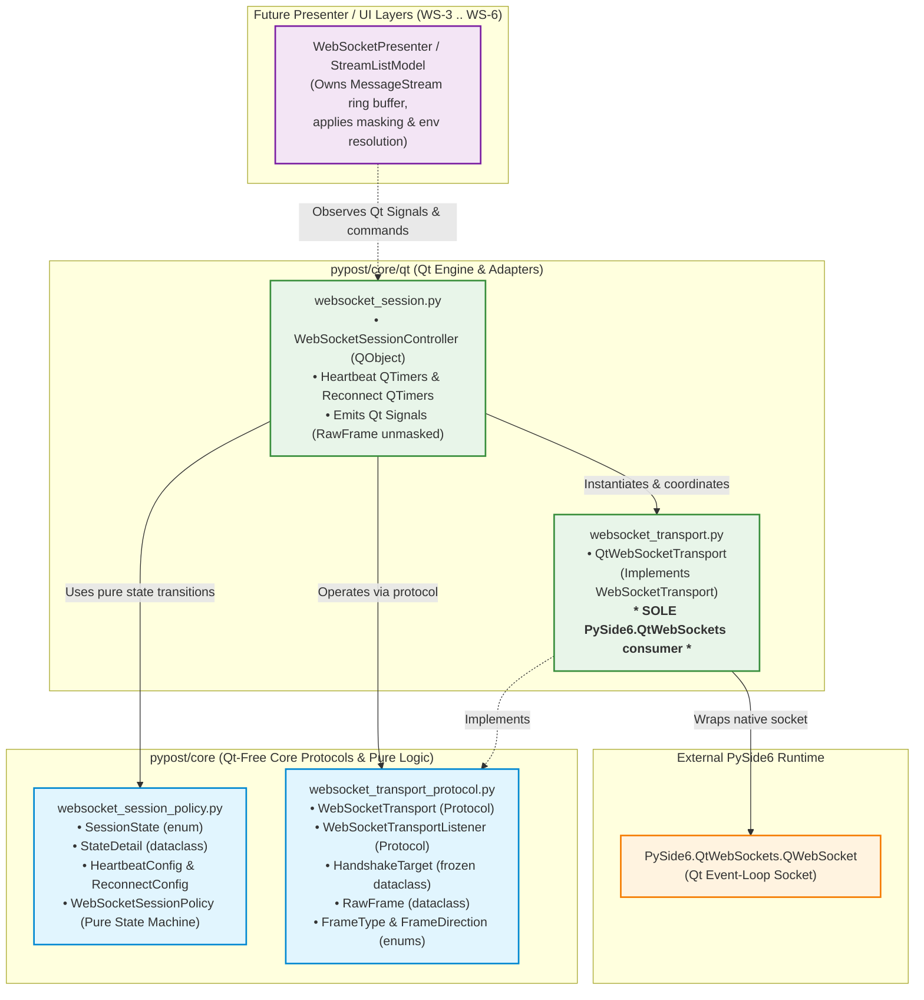
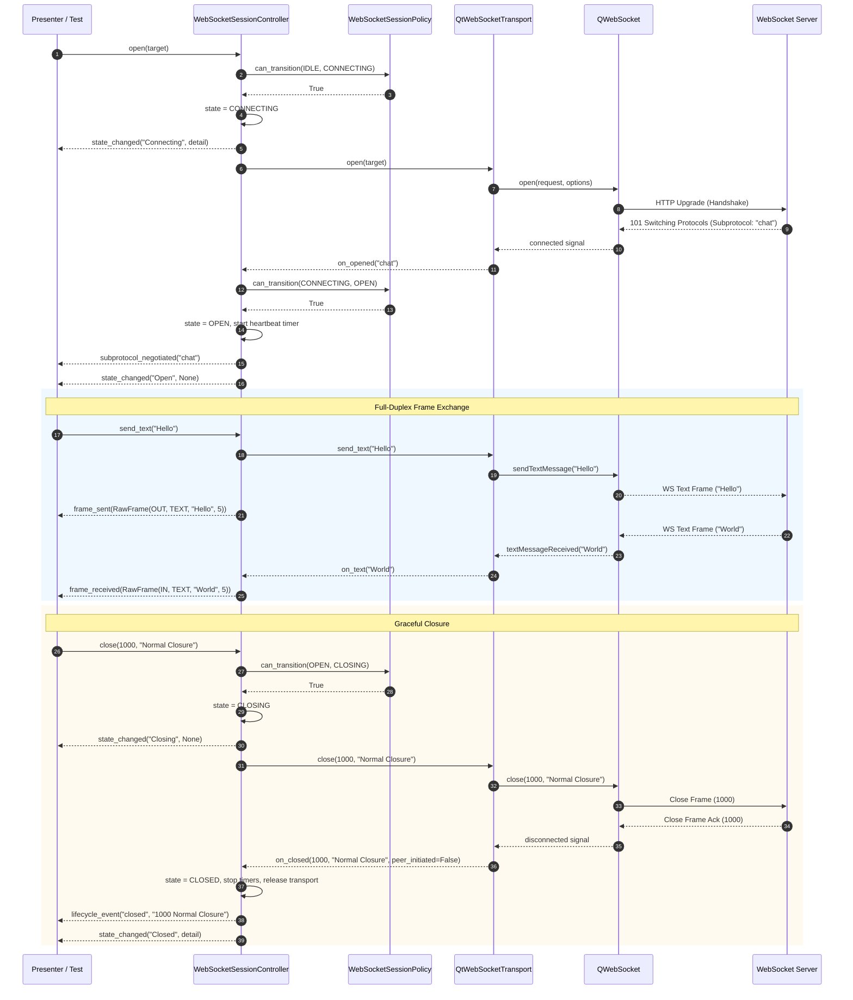
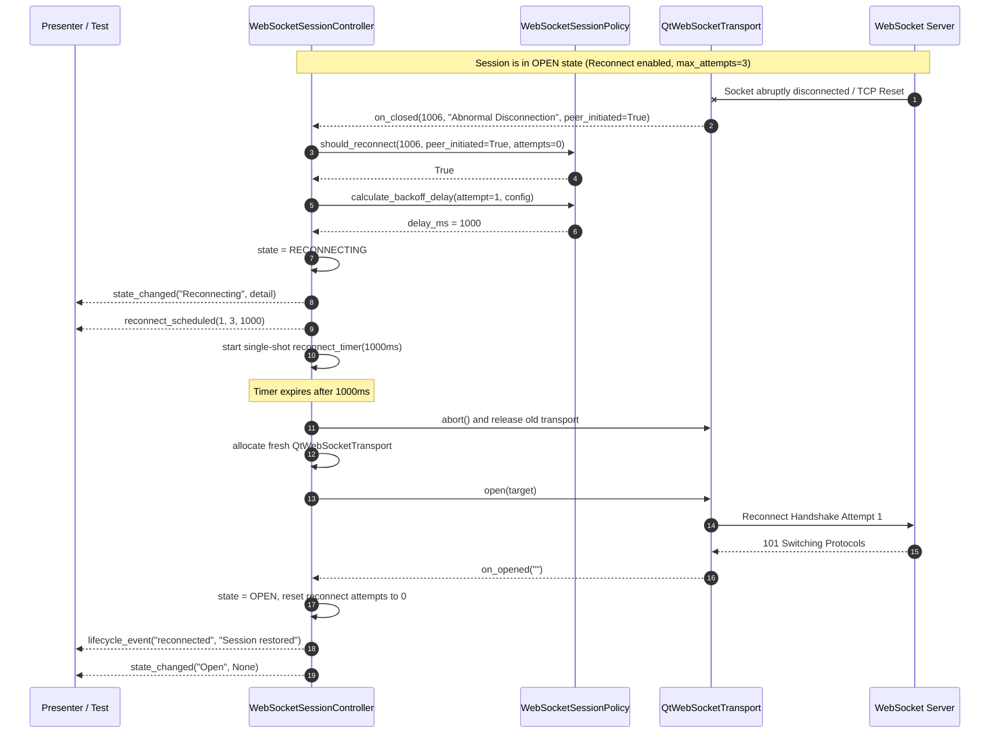
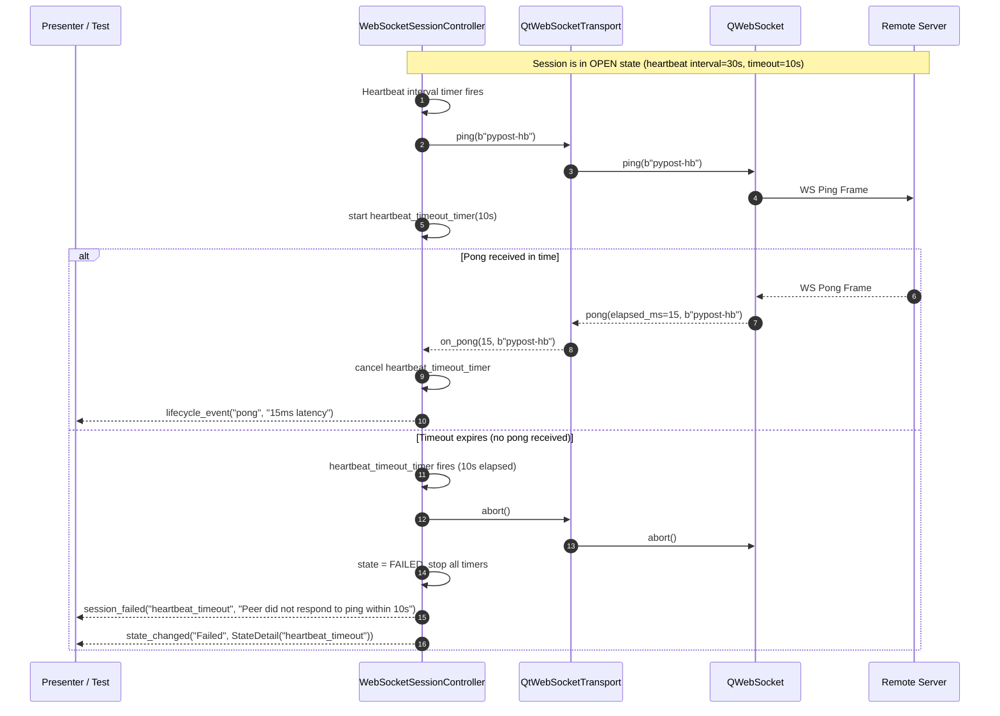

# PYPOST-1127: WS-1 WebSocket Transport Seam and Qt-Native Session Engine

This document defines the high-level architecture for **PYPOST-1127 (WS-1)**, the foundational transport and session engine story for Epic PYPOST-1123. It translates the requirements in [`10-requirements.md`](10-requirements.md) and the approved system design in [`ai-tasks/PYPOST-1124/20-architecture.md`](../PYPOST-1124/20-architecture.md) into concrete module designs, interfaces, state transition tables, sequence diagrams, and test plans.

---

## Research

### Verification Method & Facts

Every claim below has been verified against the codebase, runtime environment, or official Qt 6 documentation:

| Category | Verification Method | Finding / Verification Result |
| --- | --- | --- |
| **Repo Fact** | `pypost/core/` vs `pypost/core/qt/` inspection | Core business logic and domain protocols in `pypost/core/` are strictly Qt-free. All Qt-specific bindings, `QObject` subclasses, signals, and timers reside in `pypost/core/qt/` or `pypost/ui/`. Source: `doc/dev/architecture.md`. |
| **Runtime Fact** | Python 3.13 / PySide6 6.11.1 in `.venv` | `PySide6.QtWebSockets` is present and exports `QWebSocket`, `QWebSocketServer`, `QWebSocketHandshakeOptions`, `QWebSocketProtocol`, `QWebSocketCorsAuthenticator`. Verified via `.venv/bin/python -c "import PySide6.QtWebSockets as qws; print(qws.QWebSocket)"`. |
| **Runtime Fact** | PySide6 `QWebSocket` API surface | `QWebSocket` provides `open(QUrl | QNetworkRequest[, QWebSocketHandshakeOptions])`, `sendTextMessage()`, `sendBinaryMessage()`, `ping()`, `close()`, `subprotocol()`, `errorString()`, `setMaxAllowedIncomingMessageSize()`, and signals `connected`, `disconnected`, `stateChanged`, `textMessageReceived`, `binaryMessageReceived`, `pong`, `errorOccurred`, `sslErrors`. |
| **Vendor Fact** | Qt 6.11 WebSockets specification | Supports RFC 6455 (Version 13). WebSocket extensions (e.g. `permessage-deflate`) are not supported natively by `QWebSocket`. Handshake response headers/status codes are not directly exposed on rejection; errors surface through `errorOccurred` and `errorString()`. |
| **Repo Fact** | Hard LOC caps (`scripts/audit_baseline_metrics.py`) | File LOC caps are strictly enforced by `tests/test_solid_audit_baseline.py`. New modules introduced (`pypost/core/websocket_transport_protocol.py`, `pypost/core/websocket_session_policy.py`, `pypost/core/qt/websocket_transport.py`, `pypost/core/qt/websocket_session.py`) must be cohesive, modular, and maintain clean separation of concerns. |
| **Repo Fact** | Headless GUI testing (`doc/dev/gui_testing.md`) | PyPost tests run in CI under `QT_QPA_PLATFORM=offscreen`. Core protocols and state policies run without a `QApplication`, while Qt session controllers use standard pytest fixtures without requiring display servers. |

### Architectural Invariants & Constraints

1. **Qt-Free Core Seam**: `pypost/core/websocket_transport_protocol.py` and `pypost/core/websocket_session_policy.py` must contain **no Qt imports** (no `PySide6`, no `QtCore`, no `QtWebSockets`). They use only Python standard library and typing constructs (`typing.Protocol`, `dataclasses`, `enum`).
2. **Quarantine of `PySide6.QtWebSockets`**: `pypost/core/qt/websocket_transport.py` is the **single and exclusive** file in the repository permitted to import `PySide6.QtWebSockets`. An automated AST guard test (`test_websocket_import_isolation.py`) enforces this across the entire repository.
3. **Strict Controller Decoupling**: `WebSocketSessionController` in `pypost/core/qt/websocket_session.py` is a headless session coordinator. It must **not** import `pypost.core.websocket_stream` (ring buffer), `pypost.models.models.Environment`, or secret masking policies (`sensitive_data_masking_policy`). It re-emits raw frames unmasked as `RawFrame` dataclasses. Masking and stream buffering are strictly presentation concerns owned by `WebSocketPresenter` (WS-4) and `StreamListModel` (WS-5).
4. **Signal & Callback Ordering (OQ-1 Resolution)**: The authoritative transition to `SessionState.OPEN` is triggered by the transport listener's `on_opened` callback (mapped from `QWebSocket.connected`), not `QWebSocket.stateChanged`. A dedicated test pins this ordering to prevent race conditions.

---

## Implementation Plan

### High-Level Execution Phases

```
┌────────────────────────────────────────────────────────────────────────┐
│ Phase 1: Qt-Free Core Protocols & Data Models                         │
│ - pypost/core/websocket_transport_protocol.py                          │
│   (FrameType, FrameDirection, RawFrame, HandshakeTarget,               │
│    WebSocketTransport, WebSocketTransportListener)                    │
└───────────────────────────────────┬────────────────────────────────────┘
                                    │
                                    ▼
┌────────────────────────────────────────────────────────────────────────┐
│ Phase 2: Pure Session Policy State Machine & Backoff Scheduler         │
│ - pypost/core/websocket_session_policy.py                              │
│   (SessionState, StateDetail, HeartbeatConfig, ReconnectConfig,        │
│    WebSocketSessionPolicy)                                             │
└───────────────────────────────────┬────────────────────────────────────┘
                                    │
                                    ▼
┌────────────────────────────────────────────────────────────────────────┐
│ Phase 3: Qt-Native QWebSocket Transport Adapter                        │
│ - pypost/core/qt/websocket_transport.py                                │
│   (QtWebSocketTransport implementing WebSocketTransport, sole importer│
│    of PySide6.QtWebSockets, maps Qt signals to listener callbacks)     │
└───────────────────────────────────┬────────────────────────────────────┘
                                    │
                                    ▼
┌────────────────────────────────────────────────────────────────────────┐
│ Phase 4: Decoupled Qt Session Controller & Timers                      │
│ - pypost/core/qt/websocket_session.py                                  │
│   (WebSocketSessionController(QObject) orchestrating policy,           │
│    transport lifecycle, heartbeat QTimers, reconnect QTimers, signals) │
└───────────────────────────────────┬────────────────────────────────────┘
                                    │
                                    ▼
┌────────────────────────────────────────────────────────────────────────┐
│ Phase 5: Comprehensive Unit, Integration, and Guard Test Suite         │
│ - tests/test_websocket_transport_protocol.py                           │
│ - tests/test_websocket_session_policy.py                               │
│ - tests/test_websocket_transport_adapter.py                            │
│ - tests/test_websocket_session_controller.py                           │
│ - tests/test_websocket_import_isolation.py                             │
└────────────────────────────────────────────────────────────────────────┘
```

### Mandatory — Failing Repro Design (for Step 3)

In accordance with `td-20-architecture/SKILL.md` and `td-25-failing-repro/SKILL.md`, Step 3 will write automated failing red tests asserting the desired contracts and behavioral requirements before Step 4 implementation begins:

1. **Repro Location**: `tests/test_websocket_session_engine_repro.py` and `tests/test_websocket_import_isolation.py`.
2. **What it Asserts**:
   - **Protocol & Policy Contract**: Asserts that `WebSocketTransport`, `WebSocketTransportListener`, `HandshakeTarget`, `RawFrame`, and `WebSocketSessionPolicy` exist, adhere to the specified signatures, and enforce correct state transitions (`Idle` → `Connecting` → `Open` → `Closing` → `Closed` / `Failed`) without importing Qt.
   - **Import Isolation Boundary**: Asserts that no file in `pypost/` imports `PySide6.QtWebSockets` except `pypost/core/qt/websocket_transport.py`, and that `pypost/core/qt/websocket_session.py` has zero imports of `websocket_stream` or secret masking.
   - **Session Engine Lifecycle & Duplex Round-Trip**: Connects `WebSocketSessionController` against a hermetic local `QWebSocketServer` echo test fixture, asserting state reaches `Open`, reports subprotocol, sends and receives text and binary `RawFrame` instances without mutation, initiates graceful disconnect (`Closed` with code 1000), handles handshake rejection (`Failed` with descriptive reason), enforces heartbeat timeouts, and executes bounded reconnection backoff.
3. **Failure Mechanism**: Prior to Step 4 implementation, the test suite will fail with `ImportError` / `ModuleNotFoundError` for the new modules, and assertion errors on expected protocol methods.
4. **Sequencing**: Step 2 (Architecture Design) → Step 3 (Commit failing repro tests and record red test run) → Step 4 (Implement modules iteratively until all tests pass green).

---

## Architecture

### System Module Diagram



---

### Module Breakdown & Responsibilities

#### 1. `pypost/core/websocket_transport_protocol.py` (Qt-Free)

- **Purpose**: Defines the abstract transport contract, listener protocol, and immutable data structures for connection parameters and unmasked frames.
- **Dependencies**: Python standard library (`typing`, `dataclasses`, `enum`, `datetime`). Zero external dependencies.
- **Key Components**:
  - `FrameType(Enum)`: `TEXT = "text"`, `BINARY = "binary"`.
  - `FrameDirection(Enum)`: `IN = "in"`, `OUT = "out"`.
  - `RawFrame(dataclass)`: Represents an unmasked frame with `direction: FrameDirection`, `payload_format: FrameType`, `payload: str | bytes`, `byte_size: int`, `timestamp: datetime`.
  - `HandshakeTarget(frozen dataclass)`: Encapsulates connection targets: `url: str`, `headers: dict[str, str]`, `subprotocols: list[str]`, `max_incoming_message_bytes: int`, `verify_tls: bool`.
  - `WebSocketTransport(Protocol)`:
    * `open(target: HandshakeTarget) -> None`
    * `send_text(message: str) -> None`
    * `send_binary(payload: bytes) -> None`
    * `ping(payload: bytes = b"") -> None`
    * `close(code: int = 1000, reason: str = "") -> None`
    * `abort() -> None`
    * `negotiated_subprotocol() -> str`
    * `set_listener(listener: WebSocketTransportListener) -> None`
  - `WebSocketTransportListener(Protocol)`:
    * `on_opened(subprotocol: str) -> None`
    * `on_text(message: str) -> None`
    * `on_binary(payload: bytes) -> None`
    * `on_pong(elapsed_ms: int, payload: bytes) -> None`
    * `on_closed(code: int, reason: str, peer_initiated: bool) -> None`
    * `on_failed(category: str, message: str, detail: str) -> None`
    * `on_tls_errors(errors: tuple[str, ...]) -> bool`

#### 2. `pypost/core/websocket_session_policy.py` (Qt-Free)

- **Purpose**: Pure domain logic and state machine controlling connection lifecycles, state transitions, heartbeat checks, and exponential reconnect backoff schedules.
- **Dependencies**: Python standard library (`dataclasses`, `enum`, `typing`, `random`). Zero external or Qt dependencies.
- **Key Components**:
  - `SessionState(Enum)`: `IDLE = "Idle"`, `CONNECTING = "Connecting"`, `OPEN = "Open"`, `CLOSING = "Closing"`, `CLOSED = "Closed"`, `RECONNECTING = "Reconnecting"`, `FAILED = "Failed"`.
  - `StateDetail(dataclass)`: `message: str`, `error_category: str | None = None`, `close_code: int | None = None`, `reason: str | None = None`.
  - `HeartbeatConfig(dataclass)`: `interval_seconds: float = 30.0`, `timeout_seconds: float = 10.0`, `ping_payload: bytes = b""`.
  - `ReconnectConfig(dataclass)`: `enabled: bool = False`, `initial_delay_seconds: float = 1.0`, `multiplier: float = 2.0`, `max_delay_seconds: float = 60.0`, `max_attempts: int = 5`, `jitter: bool = True`.
  - `WebSocketSessionPolicy`:
    * State transition validator: `can_transition(current: SessionState, target: SessionState) -> bool`.
    * Reconnect backoff calculator: `calculate_backoff_delay(attempt: int, config: ReconnectConfig) -> float`.
    * Unexpected drop evaluator: `should_reconnect(close_code: int, peer_initiated: bool, config: ReconnectConfig, attempts_made: int) -> bool`.

#### 3. `pypost/core/qt/websocket_transport.py` (Qt Adapter)

- **Purpose**: Concrete `WebSocketTransport` implementation adapting `PySide6.QtWebSockets.QWebSocket`.
- **Dependencies**: `PySide6.QtWebSockets`, `PySide6.QtCore`, `PySide6.QtNetwork`, `pypost/core/websocket_transport_protocol.py`.
- **Key Responsibilities**:
  - Acts as the **sole importer** of `PySide6.QtWebSockets` in the entire codebase.
  - Translates `HandshakeTarget` parameters into `QUrl`, `QNetworkRequest` (with custom headers), and `QWebSocketHandshakeOptions` (subprotocols).
  - Enforces `setMaxAllowedIncomingMessageSize(target.max_incoming_message_bytes)`.
  - Hooks `QWebSocket` signals (`connected`, `disconnected`, `textMessageReceived`, `binaryMessageReceived`, `pong`, `errorOccurred`, `sslErrors`) and dispatches corresponding `WebSocketTransportListener` callbacks.
  - Pins the authoritative `on_opened` event to `QWebSocket.connected` signal.
  - Maps numeric close codes and reasons verbatim from `closeCode()` and `closeReason()`.

#### 4. `pypost/core/qt/websocket_session.py` (Session Controller)

- **Purpose**: `QObject` session controller managing the connection lifecycle, timers, and emitting Qt signals for UI presenters.
- **Dependencies**: `PySide6.QtCore` (`QObject`, `Signal`, `QTimer`), `pypost/core/websocket_transport_protocol.py`, `pypost/core/websocket_session_policy.py`, `pypost/core/qt/websocket_transport.py`.
- **Zero Coupling Invariant**: Does **not** import `MessageStream`, `Environment`, or secret masking functions.
- **Qt Signal Surface**:
  ```python
  class WebSocketSessionController(QObject):
      state_changed = Signal(str, object)          # (SessionState.value: str, StateDetail | None)
      frame_received = Signal(object)              # (RawFrame, unmasked)
      frame_sent = Signal(object)                  # (RawFrame, unmasked)
      lifecycle_event = Signal(str, str)           # (event_name: str, detail_text: str)
      reconnect_scheduled = Signal(int, int, int)  # (attempt: int, max_attempts: int, delay_ms: int)
      subprotocol_negotiated = Signal(str)         # (subprotocol: str)
      session_failed = Signal(str, str)            # (category: str, message: str)
      tls_errors_raised = Signal(object)           # (errors: tuple[str, ...])
  ```
- **Timer Coordination**:
  - `_heartbeat_interval_timer`: Dispatches `ping()` periodically when session is in `OPEN` state.
  - `_heartbeat_timeout_timer`: Started when `ping()` is sent; cancelled when `pong` arrives. If it fires, invokes `abort()` and transitions session to `FAILED` with category `heartbeat_timeout`.
  - `_reconnect_timer`: Single-shot timer triggered when in `RECONNECTING` state after calculating backoff delay; on timeout, instantiates a fresh transport and invokes `open()`.

---

### Sequence Diagrams

#### 1. Successful Connection, Duplex Frame Exchange, and Normal Closure



#### 2. Network Drop and Bounded Exponential Reconnection



#### 3. Heartbeat Ping-Pong & Timeout Failure



---

### State Machine Transition Rules

The table below defines all valid transitions for `SessionState`:

| Current State | Target State | Triggering Event / Condition | Post-Actions |
| --- | --- | --- | --- |
| `IDLE` | `CONNECTING` | Caller calls `open(target)` | Allocate transport, initiate socket handshake |
| `CONNECTING` | `OPEN` | Transport reports `on_opened` | Start heartbeat timer, emit `subprotocol_negotiated` |
| `CONNECTING` | `FAILED` | Handshake rejected, DNS failure, TLS failure | Emit `session_failed`, clean up transport socket |
| `CONNECTING` | `IDLE` | Caller calls `close()` / cancel | Abort transport, clean up timers |
| `OPEN` | `CLOSING` | Caller calls `close(code, reason)` | Send WS close frame to peer, await disconnect |
| `OPEN` | `CLOSED` | Peer initiates clean close frame (1000/1001) | Emit `lifecycle_event("closed")`, stop heartbeat |
| `OPEN` | `RECONNECTING` | Unexpected drop (1006) with reconnect enabled & attempts < max | Schedule backoff timer, emit `reconnect_scheduled` |
| `OPEN` | `FAILED` | Unexpected drop with reconnect disabled OR heartbeat timeout | Emit `session_failed`, abort socket, stop timers |
| `CLOSING` | `CLOSED` | Disconnect handshake completes or timeout expires | Stop all timers, release transport instance |
| `RECONNECTING` | `OPEN` | Reconnection handshake succeeds (`on_opened`) | Reset retry counter to 0, resume heartbeat timer |
| `RECONNECTING` | `RECONNECTING` | Reconnection attempt fails & attempts < max | Schedule next backoff retry with exponential delay |
| `RECONNECTING` | `FAILED` | Reconnection attempts exhausted (`attempts == max`) | Emit `session_failed("reconnect_exhausted")`, stop timers |
| `RECONNECTING` | `IDLE` | Caller calls `close()` / cancel while reconnecting | Stop reconnect timer, reset policy state to `IDLE` |
| `FAILED` | `CONNECTING` | Caller calls `open(target)` after failure | Reset error state, allocate new transport, connect |
| `CLOSED` | `CONNECTING` | Caller calls `open(target)` after clean close | Reset state, allocate new transport, connect |

---

### Selected Architectural Patterns

1. **Adapter Pattern (`QtWebSocketTransport`)**:
   - *Rationale*: `PySide6.QtWebSockets.QWebSocket` has Qt-specific types (`QUrl`, `QByteArray`, `QNetworkRequest`, Qt signals). `QtWebSocketTransport` adapts `QWebSocket` to the Qt-free `WebSocketTransport` protocol interface, encapsulating Qt types and confining `PySide6.QtWebSockets` to a single file.
2. **State Machine Pattern (`WebSocketSessionPolicy`)**:
   - *Rationale*: Isolating state transitions, transition guards, backoff calculation, and reconnect criteria into a pure, Qt-free class enables 100% unit test coverage in standard Python without spinning Qt event loops or allocating sockets.
3. **Protocol / Dependency Inversion (`WebSocketTransport` / `WebSocketTransportListener`)**:
   - *Rationale*: High-level controllers depend on abstract protocols rather than concrete socket implementations. If PyPost switches or adds alternative transport backends (e.g. asyncio, C++ native) in the future, the session controller, presenter, and UI code require zero modifications.
4. **Observer Pattern / Qt Signals & Slots (`WebSocketSessionController`)**:
   - *Rationale*: Decouples the headless session engine from downstream stream ring buffers, presenters, and UI tabs. Presenters subscribe to Qt signals (`frame_received`, `frame_sent`, `state_changed`) without the controller needing to know about UI widgets or secret masking.

---

### Detailed Interfaces & API Signatures

```python
# pypost/core/websocket_transport_protocol.py
from __future__ import annotations
from dataclasses import dataclass
from datetime import datetime
from enum import Enum
from typing import Protocol, runtime_checkable

class FrameType(str, Enum):
    TEXT = "text"
    BINARY = "binary"

class FrameDirection(str, Enum):
    IN = "in"
    OUT = "out"

@dataclass(frozen=True)
class RawFrame:
    direction: FrameDirection
    payload_format: FrameType
    payload: str | bytes
    byte_size: int
    timestamp: datetime

@dataclass(frozen=True)
class HandshakeTarget:
    url: str
    headers: dict[str, str]
    subprotocols: tuple[str, ...] = ()
    max_incoming_message_bytes: int = 16 * 1024 * 1024  # 16 MB default
    verify_tls: bool = True

@runtime_checkable
class WebSocketTransportListener(Protocol):
    def on_opened(self, subprotocol: str) -> None: ...
    def on_text(self, message: str) -> None: ...
    def on_binary(self, payload: bytes) -> None: ...
    def on_pong(self, elapsed_ms: int, payload: bytes) -> None: ...
    def on_closed(self, code: int, reason: str, peer_initiated: bool) -> None: ...
    def on_failed(self, category: str, message: str, detail: str) -> None: ...
    def on_tls_errors(self, errors: tuple[str, ...]) -> bool: ...

@runtime_checkable
class WebSocketTransport(Protocol):
    def open(self, target: HandshakeTarget) -> None: ...
    def send_text(self, message: str) -> None: ...
    def send_binary(self, payload: bytes) -> None: ...
    def ping(self, payload: bytes = b"") -> None: ...
    def close(self, code: int = 1000, reason: str = "") -> None: ...
    def abort() -> None: ...
    def negotiated_subprotocol(self) -> str: ...
    def set_listener(self, listener: WebSocketTransportListener) -> None: ...
```

```python
# pypost/core/websocket_session_policy.py
from __future__ import annotations
from dataclasses import dataclass
from enum import Enum
from typing import Optional

class SessionState(str, Enum):
    IDLE = "Idle"
    CONNECTING = "Connecting"
    OPEN = "Open"
    CLOSING = "Closing"
    CLOSED = "Closed"
    RECONNECTING = "Reconnecting"
    FAILED = "Failed"

@dataclass(frozen=True)
class StateDetail:
    message: str
    error_category: Optional[str] = None
    close_code: Optional[int] = None
    reason: Optional[str] = None

@dataclass(frozen=True)
class HeartbeatConfig:
    interval_seconds: float = 30.0
    timeout_seconds: float = 10.0
    ping_payload: bytes = b""

@dataclass(frozen=True)
class ReconnectConfig:
    enabled: bool = False
    initial_delay_seconds: float = 1.0
    multiplier: float = 2.0
    max_delay_seconds: float = 60.0
    max_attempts: int = 5
    jitter: bool = True

class WebSocketSessionPolicy:
    def can_transition(self, current: SessionState, target: SessionState) -> bool: ...
    def calculate_backoff_delay(self, attempt: int, config: ReconnectConfig) -> float: ...
    def should_reconnect(
        self,
        close_code: int,
        peer_initiated: bool,
        config: ReconnectConfig,
        attempts_made: int,
    ) -> bool: ...
```

---

## Q&A

| Question | Answer |
| --- | --- |
| **Why is `QWebSocket` quarantined in `websocket_transport.py` instead of used directly in `WebSocketSessionController`?** | Quarantining `PySide6.QtWebSockets` behind `WebSocketTransport` ensures engine reversibility (RFC PYPOST-1124 A-1.4). If PyPost needs an alternative transport in the future, only this adapter changes. Additionally, keeping the controller decoupled from direct Qt socket calls allows testing the session policy and controller with mock transports. |
| **How is signal/callback ordering (OQ-1) handled?** | In Qt 6.11, `QWebSocket` emits `stateChanged(ConnectedState)` and `connected()`. The session engine explicitly treats `on_opened` (connected signal) as the authoritative event that transitions `SessionState` to `OPEN` and records subprotocol negotiation, while `stateChanged` provides internal telemetry only. A dedicated test pins this ordering. |
| **Why does `WebSocketSessionController` not handle stream buffers or variable masking?** | Per RFC PYPOST-1124 A-3.1, separation of concerns dictates that the controller manages only network lifecycles and unmasked frames. Stream buffering (ring capacity, eviction) and secret masking require `Environment` and `hidden_keys`, which belong to `WebSocketPresenter` (WS-4) and `StreamListModel` (WS-5). This ensures the session controller remains 100% testable headlessly and independently. |
| **How are tests executed without an external network?** | All network tests use a hermetic local `QWebSocketServer` fixture running on `127.0.0.1` (under `QT_QPA_PLATFORM=offscreen`). Zero tests make outbound internet calls. |
