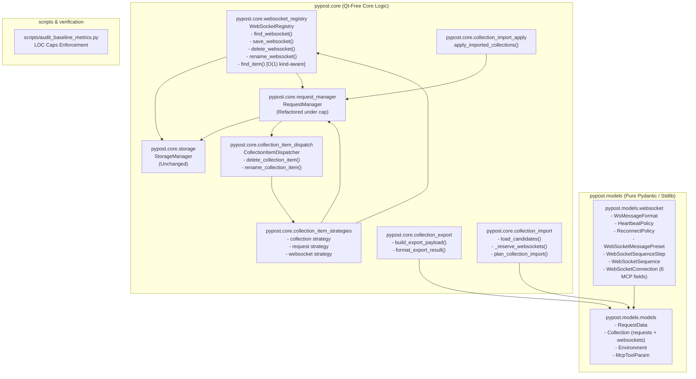

# PYPOST-1128: WebSocket connection profile model, persistence and collection interchange

## Research

### R-0 Verification method

All architectural choices and constraints are verified according to the standard project classification:

| Kind | Verification source |
| --- | --- |
| **Repo fact** | Read from existing codebase: `pypost/models/models.py`, `pypost/core/storage.py`, `pypost/core/request_manager.py`, `pypost/core/collection_item_strategies.py`, `pypost/core/collection_export.py`, `pypost/core/collection_import.py`, `scripts/audit_baseline_metrics.py`. |
| **Runtime fact** | Verified against the active Python 3.12 environment with Pydantic v2. |
| **Epic architecture fact** | Sourced directly from Epic RFC [`ai-tasks/PYPOST-1124/20-architecture.md`](../PYPOST-1124/20-architecture.md), specifically sections A-4.1, A-13.2, R-1.1, and R-2. |

### R-1 Model Separation and Isolation

- **RequestData lean copy policy:** `RequestData` is documented to stay lean because tab isolation deep-copies it (`pypost/models/models.py:65-72`, `doc/dev/request_data_copy_policy.md`). Reusing or overloading `RequestData` with WebSocket properties (subprotocols, heartbeat/reconnect policies, presets, sequences) would cause severe memory inflation and unnecessary copy overhead during HTTP tab operations.
- **Separate collection list:** `Collection` currently defines `requests: List[RequestData]`. Adding a separate `websockets: List[WebSocketConnection] = Field(default_factory=list)` ensures HTTP requests and WebSocket profiles are independently typed, cleanly isolated, and safely ignored by older PyPost versions without confusing HTTP execution engines.

### R-2 Backward Compatibility and Storage Invariance

- **Pydantic v2 `extra='ignore'`:** As established in Epic RFC R-2, `Collection` uses Pydantic's default `extra='ignore'`. Older PyPost versions reading a collection JSON file with `websockets` will ignore the unknown key without error, preserving HTTP request data. Re-saving on older versions drops unknown keys (lossy downgrade), which is documented and expected behavior.
- **Storage invariance:** `StorageManager.save_collection` executes `collection.model_dump_json(indent=2)` and `load_collections` executes `Collection(**data)` (`pypost/core/storage.py:107-169`). Because `Collection` defaults `websockets` to `[]`, `storage.py` requires **zero code changes** to round-trip collections with WebSocket profiles.

### R-3 SOLID Cap Constraints (R-1.1)

- `pypost/core/request_manager.py` currently has **261 LOC** against a cap of **260 LOC** (0 lines of headroom). Adding WebSocket indexing, CRUD, or dispatch directly to `request_manager.py` would violate baseline metrics (`scripts/audit_baseline_metrics.py`).
- **Extraction strategy:** 
  1. Extract item-type dispatch (`delete_collection_item`, `rename_collection_item`) from `request_manager.py` into a new module `pypost/core/collection_item_dispatch.py`.
  2. Implement WebSocket indexing and profile CRUD in a new Qt-free module `pypost/core/websocket_registry.py`.
  3. Re-derive the cap for `request_manager.py` based on post-extraction line counts and register `websocket_registry.py` and `collection_item_dispatch.py` with ~10% headroom in `scripts/audit_baseline_metrics.py`.

### R-4 Collection Import / Export Interchange

- **Export:** `pypost/core/collection_export.py` calls `collection.model_dump(mode="json")`, which automatically includes `websockets`. Export result dataclasses (`CollectionExportResult`, `CollectionsExportResult`) and formatting helpers need extension to track and display WebSocket counts.
- **Import:** `pypost/core/collection_import.py` requires updating to:
  1. Validate the structure of `websockets` in candidate JSON records.
  2. Reserve WebSocket IDs alongside request IDs (`_reserve_websockets`) to avoid ID collisions.
  3. Re-key colliding WebSocket IDs before persistence.
  4. Track `websocket_count` in `CollectionImportPlanResult` and format it distinctly in the import summary message.

---

## Implementation Plan

### High-Level Implementation Steps

1. **Domain Models (`pypost/models/websocket.py` & `pypost/models/models.py`):**
   - Create `pypost/models/websocket.py` declaring `WsMessageFormat`, `HeartbeatPolicy`, `ReconnectPolicy`, `WebSocketMessagePreset`, `WebSocketSequenceStep`, `WebSocketSequence`, and `WebSocketConnection` (including the 6 MCP fields).
   - Update `Collection` in `pypost/models/models.py` with `websockets: List[WebSocketConnection] = Field(default_factory=list)`.
2. **Item Dispatch Extraction (`pypost/core/collection_item_dispatch.py` & `request_manager.py`):**
   - Extract item dispatch logic (`delete_collection_item`, `rename_collection_item`) into `pypost/core/collection_item_dispatch.py`.
   - Update `RequestManager` to delegate to `collection_item_dispatch.py`.
3. **WebSocket Registry (`pypost/core/websocket_registry.py`):**
   - Implement `WebSocketRegistry` with in-memory index over collection WebSockets, CRUD operations (`save_websocket`, `delete_websocket`, `rename_websocket`, `find_websocket`), and kind-aware O(1) `find_item(item_id)`.
4. **Strategy Dispatch Extension (`pypost/core/collection_item_strategies.py`):**
   - Extend strategy handlers to receive a unified dispatch context (`RequestManager` + `WebSocketRegistry`).
   - Register `"websocket"` item strategy for deletion and renaming.
5. **Collection Export and Import (`pypost/core/collection_export.py`, `collection_import.py`, `collection_messages.py`):**
   - Add `websocket_count` to export result objects and formatters.
   - Update candidate parsing, shape validation, ID reservation (`_reserve_websockets`), collision re-keying, planning, and summary strings (`SUMMARY_WEBSOCKETS_IMPORTED`).
6. **Baseline Metrics Audit (`scripts/audit_baseline_metrics.py`):**
   - Re-derive `pypost/core/request_manager.py` cap.
   - Add `pypost/core/websocket_registry.py` and `pypost/core/collection_item_dispatch.py` caps.
7. **Comprehensive Unit & Integration Test Suite:**
   - Unit tests for models, validation, storage round-trip, registry index, dispatch, and export/import interchange.

---

### Mandatory — Failing Repro (Next Step 3)

In Step 3, before implementing production models or registry logic, an automated failing test suite will be added to verify that the missing WebSocket domain models, collection fields, registry index, and interchange handlers fail as expected.

- **Test file:** `tests/test_websocket_models_and_persistence.py`
- **What it asserts (desired behavior):**
  1. `WebSocketConnection` and its sub-models (`HeartbeatPolicy`, `ReconnectPolicy`, `WebSocketMessagePreset`, `WebSocketSequence`, `WsMessageFormat`) can be instantiated with custom and default parameters, strictly enforcing validation constraints.
  2. `Collection` includes `websockets: List[WebSocketConnection]`, defaulting to an empty list.
  3. Legacy collection JSON files lacking the `websockets` key load cleanly as `Collection` with `websockets == []`.
  4. Saving a `Collection` with `WebSocketConnection` items via `StorageManager` persists to disk and reloads identically without modifying `pypost/core/storage.py`.
  5. `WebSocketRegistry` indexes WebSocket profiles across collections and resolves any ID via `find_item(item_id)` in O(1) time to `("request" | "websocket", object, owning_collection)`.
  6. Item dispatch (`delete_collection_item`, `rename_collection_item`) correctly renames and deletes WebSocket profiles.
  7. Collection export includes `websockets` in the payload, and collection import detects existing IDs, re-keys colliding IDs with fresh UUIDs, and reports `WebSockets imported: X` separately from requests.
- **Forcing the failure:** Running `pytest tests/test_websocket_models_and_persistence.py` will fail with `ImportError: cannot import name 'WebSocketConnection' from 'pypost.models.websocket'` and `AttributeError: 'Collection' object has no attribute 'websockets'`.
- **Sequencing:**
  1. Step 3: Write `tests/test_websocket_models_and_persistence.py` and confirm red failure.
  2. Step 4: Implement `models/websocket.py`, update `models/models.py`, create `core/websocket_registry.py`, `core/collection_item_dispatch.py`, update `collection_item_strategies.py`, update `collection_export.py`/`collection_import.py`, update `scripts/audit_baseline_metrics.py`, and iterate until all tests are green.

---

## Architecture

### System Module Diagram



---

### Module Breakdown and Responsibilities

#### 1. `pypost/models/websocket.py`
Pure standard-library and Pydantic module defining domain structures for WebSocket connection profiles:
- `WsMessageFormat(str, Enum)`: Enumerates supported body formats (`TEXT = "text"`, `JSON = "json"`, `HEX = "hex"`, `BASE64 = "base64"`).
- `HeartbeatPolicy(BaseModel)`: Automatic keep-alive ping configuration (`enabled`, `interval_seconds`, `timeout_seconds`).
- `ReconnectPolicy(BaseModel)`: Exponential backoff reconnection parameters (`enabled`, `max_attempts`, `initial_delay_seconds`, `backoff_multiplier`, `max_delay_seconds`).
- `WebSocketMessagePreset(BaseModel)`: Reusable message template with `id`, `name`, `format`, and `payload` template.
- `WebSocketSequenceStep(BaseModel)`: Single step in a multi-step sequence with `preset_id`, `inline_payload`, `format`, and `delay_ms` (pre-step delay).
- `WebSocketSequence(BaseModel)`: Ordered series of message steps with `id`, `name`, and `steps`.
- `WebSocketConnection(BaseModel)`: Saved endpoint configuration containing:
  - Connection attributes: `id`, `name`, `url`, `headers`, `params`, `subprotocols`, `heartbeat`, `reconnect`, `presets`, `sequences`, `default_format`.
  - The 6 MCP metadata fields (authoritatively owned and persisted by WS-2):
    * `expose_as_mcp: bool = False`
    * `mcp_description: str = ""`
    * `mcp_params: Dict[str, McpToolParam] = Field(default_factory=dict)`
    * `mcp_probe_preset_id: Optional[str] = None`
    * `mcp_probe_max_messages: Optional[int] = None`
    * `mcp_probe_max_duration_ms: Optional[int] = None`

#### 2. `pypost/models/models.py`
- Extension of `Collection`:
  ```python
  class Collection(BaseModel):
      id: str = Field(default_factory=lambda: str(uuid.uuid4()))
      name: str = "New Collection"
      requests: List[RequestData] = Field(default_factory=list)
      websockets: List[WebSocketConnection] = Field(default_factory=list)  # NEW in PYPOST-1128
  ```

#### 3. `pypost/core/websocket_registry.py`
Pure Qt-free index service managing WebSocket profiles across loaded collections:
- Maintains internal index mapping `ws_id -> (WebSocketConnection, Collection)`.
- Rebuilds or updates indices when collections mutate or reload.
- Provides CRUD operations: `find_websocket`, `save_websocket`, `delete_websocket`, `rename_websocket`.
- Provides O(1) kind-aware item lookup:
  `find_item(item_id) -> Optional[Tuple[str, object, Collection]]` returning `("request", RequestData, Collection)` or `("websocket", WebSocketConnection, Collection)`.

#### 4. `pypost/core/collection_item_dispatch.py`
Dedicated item dispatch module extracted from `RequestManager` to adhere to SOLID LOC caps:
- Contains `delete_collection_item(dispatch_context, item_id, item_type) -> bool`.
- Contains `rename_collection_item(dispatch_context, item_id, item_type, new_name) -> bool`.
- Accepts an `ItemDispatchContext` (or manager + registry references) to route operations according to the registered strategies.

#### 5. `pypost/core/collection_item_strategies.py`
Strategy mapping for collection item operations:
- Defines strategy protocol / dataclass accepting `ItemDispatchContext`.
- Registers handlers for `"collection"`, `"request"`, and `"websocket"`.
- `"websocket"` delete strategy calls `registry.delete_websocket(item_id)`.
- `"websocket"` rename strategy calls `registry.rename_websocket(item_id, new_name)`.

#### 6. `pypost/core/collection_export.py` & `pypost/core/collection_import.py`
- **Export:** Serializes `Collection.model_dump(mode="json")` including both `requests` and `websockets`. Updates export result objects to report `websocket_count` alongside `request_count`.
- **Import:**
  - Validates `websockets` list format in `load_collection_import_candidates`.
  - Reserves WebSocket IDs via `_reserve_websockets(source.websockets, taken_ws_ids)` to prevent collisions.
  - Generates fresh UUIDs when imported WebSocket IDs collide with existing IDs in the workspace.
  - Updates import planning and counting to report `websocket_count`.
  - Extends summary messages with `SUMMARY_WEBSOCKETS_IMPORTED` in `pypost/core/collection_messages.py`.

#### 7. `pypost/core/storage.py` (Unchanged)
- Persists `Collection` via `collection.model_dump_json(indent=2)` and loads via `Collection(**data)`.
- Naturally serializes and deserializes `websockets` without modifying code in `storage.py`.

#### 8. `scripts/audit_baseline_metrics.py`
- Re-derives `pypost/core/request_manager.py` cap from post-extraction line count + ~10% headroom.
- Registers caps for `pypost/core/websocket_registry.py` and `pypost/core/collection_item_dispatch.py`.

---

### Data Models & Pydantic Schemas

```python
# pypost/models/websocket.py
from __future__ import annotations

import uuid
from enum import Enum
from typing import Dict, List, Optional
from pydantic import BaseModel, Field

from pypost.models.models import McpToolParam


class WsMessageFormat(str, Enum):
    TEXT = "text"
    JSON = "json"
    HEX = "hex"
    BASE64 = "base64"


class HeartbeatPolicy(BaseModel):
    enabled: bool = True
    interval_seconds: int = Field(default=30, ge=5, le=3600)
    timeout_seconds: int = Field(default=10, ge=1, le=300)


class ReconnectPolicy(BaseModel):
    enabled: bool = True
    max_attempts: int = Field(default=5, ge=0, le=100)
    initial_delay_seconds: float = Field(default=1.0, gt=0)
    backoff_multiplier: float = Field(default=2.0, ge=1.0)
    max_delay_seconds: float = Field(default=30.0, gt=0)


class WebSocketMessagePreset(BaseModel):
    id: str = Field(default_factory=lambda: str(uuid.uuid4()))
    name: str = "New Message"
    format: WsMessageFormat = WsMessageFormat.JSON
    payload: str = ""  # template text; never a resolved value


class WebSocketSequenceStep(BaseModel):
    preset_id: Optional[str] = None
    inline_payload: str = ""
    format: WsMessageFormat = WsMessageFormat.JSON
    delay_ms: int = Field(default=0, ge=0, le=600_000)  # waited BEFORE this step


class WebSocketSequence(BaseModel):
    id: str = Field(default_factory=lambda: str(uuid.uuid4()))
    name: str = "New Sequence"
    steps: List[WebSocketSequenceStep] = Field(default_factory=list)


class WebSocketConnection(BaseModel):
    """Saved, reusable description of a real-time endpoint. Peer of RequestData."""

    id: str = Field(default_factory=lambda: str(uuid.uuid4()))
    name: str = "New WebSocket"
    url: str = ""  # ws:// or wss://, may contain {{ vars }}
    headers: Dict[str, str] = Field(default_factory=dict)
    params: Dict[str, str] = Field(default_factory=dict)
    subprotocols: List[str] = Field(default_factory=list)
    heartbeat: HeartbeatPolicy = Field(default_factory=HeartbeatPolicy)
    reconnect: ReconnectPolicy = Field(default_factory=ReconnectPolicy)
    presets: List[WebSocketMessagePreset] = Field(default_factory=list)
    sequences: List[WebSocketSequence] = Field(default_factory=list)
    default_format: WsMessageFormat = WsMessageFormat.JSON

    # MCP tool configuration fields (authoritatively owned by WS-2)
    expose_as_mcp: bool = False
    mcp_description: str = ""
    mcp_params: Dict[str, McpToolParam] = Field(default_factory=dict)
    mcp_probe_preset_id: Optional[str] = None
    mcp_probe_max_messages: Optional[int] = None
    mcp_probe_max_duration_ms: Optional[int] = None
```

---

### Selected Architectural Patterns & Justifications

1. **Domain Model Pattern:**
   - *Pattern:* Rich, typed domain entities (`WebSocketConnection`, `HeartbeatPolicy`, `ReconnectPolicy`, `WebSocketMessagePreset`, `WebSocketSequence`) encapsulate data structures and field-level validation rules using Pydantic v2.
   - *Justification:* Ensures schema validity, type safety, self-documenting constraints, and automatic JSON serialization/deserialization without manual parsing boilerplate.
2. **Registry / Dispatcher Pattern:**
   - *Pattern:* `WebSocketRegistry` maintains in-memory lookup maps (`ws_id -> (conn, collection)`) and unifies cross-entity lookups via `find_item(item_id)`.
   - *Justification:* Provides O(1) lookups for tab restoration and UI actions, avoiding O(N) linear scans across collection hierarchies.
3. **Strategy Pattern:**
   - *Pattern:* `CollectionItemStrategy` and `DEFAULT_COLLECTION_ITEM_STRATEGIES` route polymorphic tree actions (delete, rename) based on `item_type` (`"collection"`, `"request"`, `"websocket"`).
   - *Justification:* Decouples UI tree actions from concrete entity managers and makes adding new entity types open for extension without modifying core presenters or bloated if/else chains.
4. **Layered Architecture & SOLID Seams:**
   - *Pattern:* Models (`pypost/models/`) are stdlib/Pydantic only; Core services (`pypost/core/`) are Qt-free and storage-independent; Storage (`pypost/core/storage.py`) handles persistence without model-specific code additions.
   - *Justification:* Strict layer boundaries ensure headless testability, rapid test execution without `QApplication`, and adherence to module-size limits.

---

### Interface Definitions and API Signatures

#### `pypost/core/websocket_registry.py`

```python
class WebSocketRegistry:
    def __init__(self, request_manager: RequestManager, storage: StorageInterface) -> None: ...
    def rebuild_index(self) -> None: ...
    def get_websockets(self) -> List[WebSocketConnection]: ...
    def find_websocket(self, ws_id: str) -> Optional[Tuple[WebSocketConnection, Collection]]: ...
    def save_websocket(self, conn: WebSocketConnection, collection_id: str) -> None: ...
    def delete_websocket(self, ws_id: str) -> bool: ...
    def rename_websocket(self, ws_id: str, new_name: str) -> bool: ...
    def find_item(self, item_id: str) -> Optional[Tuple[str, object, Collection]]:
        """Resolve an id in O(1) to ('request' | 'websocket', object, owning_collection)."""
        ...
```

#### `pypost/core/collection_item_dispatch.py`

```python
@dataclass(frozen=True)
class ItemDispatchContext:
    request_manager: RequestManager
    websocket_registry: Optional[WebSocketRegistry] = None


def delete_collection_item(
    context: ItemDispatchContext,
    item_id: str,
    item_type: str,
    strategies: Optional[dict[str, CollectionItemStrategy]] = None,
) -> bool: ...


def rename_collection_item(
    context: ItemDispatchContext,
    item_id: str,
    item_type: str,
    new_name: str,
    strategies: Optional[dict[str, CollectionItemStrategy]] = None,
) -> bool: ...
```

#### `pypost/core/collection_item_strategies.py`

```python
DeleteHandler = Callable[[ItemDispatchContext, str], bool]
RenameHandler = Callable[[ItemDispatchContext, str, str], bool]


@dataclass(frozen=True)
class CollectionItemStrategy:
    delete: DeleteHandler
    rename: RenameHandler


DEFAULT_COLLECTION_ITEM_STRATEGIES: dict[str, CollectionItemStrategy]
```

---

### Non-Functional & Security Considerations

1. **Secret & Sensitive Data Safety:**
   - Saved collection files (`.json`) and export payloads contain **only raw template strings** (e.g., `{{ API_KEY }}`, `wss://{{ HOST }}/ws`) and message presets with unresolved expressions.
   - Template resolution and environment substitution occur strictly at runtime when initiating connections or sending messages (WS-7). No resolved environment secrets are ever written to disk or exported.
2. **Performance & Scalability:**
   - `WebSocketRegistry` provides O(1) time complexity for profile lookups by ID and `find_item` queries across all loaded collections.
   - Separate list storage in `Collection.websockets` ensures HTTP tab cloning/isolation (`RequestData`) does not incur overhead from WebSocket configurations.
3. **Backward Compatibility & Lossy Downgrade Policy:**
   - Collections created in older versions load seamlessly with `websockets: []`.
   - Collections with WebSocket profiles loaded in older versions drop the `websockets` key silently on re-save without crashing or corrupting HTTP requests.
4. **Qt-Free Modularity:**
   - All modules created or modified in this story (`models/websocket.py`, `models/models.py`, `core/websocket_registry.py`, `core/collection_item_dispatch.py`, `core/collection_item_strategies.py`, `core/collection_export.py`, `core/collection_import.py`) are strictly Qt-free and fully testable without `QApplication`.

---

## Q&A

**Q: Why are the six MCP tool fields defined in `WebSocketConnection` during WS-2 instead of WS-9?**  
**A:** WS-2 is the single authoritative owner of the `WebSocketConnection` schema and its persistence. Defining `expose_as_mcp`, `mcp_description`, `mcp_params`, `mcp_probe_preset_id`, `mcp_probe_max_messages`, and `mcp_probe_max_duration_ms` now guarantees data schema stability and prevents downstream schema migrations when WS-9 implements MCP tool execution.

**Q: Why extract `collection_item_dispatch.py` instead of adding WebSocket handling to `RequestManager`?**  
**A:** `request_manager.py` has 0 LOC of headroom under the project's SOLID baseline metrics. Extracting item dispatch logic frees lines in `request_manager.py` while providing a dedicated, clean seam for multi-entity polymorphic actions.

**Q: How are ID collisions handled when importing a collection?**  
**A:** `_reserve_requests` and `_reserve_websockets` check incoming IDs against existing workspace IDs. If a duplicate is encountered, a fresh `uuid4()` is assigned before saving, ensuring existing profiles and requests are never overwritten.

**Q: Does `storage.py` require any code modifications for WebSocket persistence?**  
**A:** No. `StorageManager` relies on Pydantic's `model_dump_json()` and `Collection(**data)`. Extending `Collection` with `websockets: List[WebSocketConnection] = Field(default_factory=list)` is sufficient for complete serialization and deserialization.
