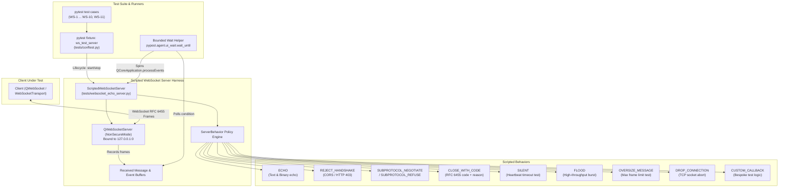

# PYPOST-1129: WS-11 WebSocket test harness

## Research

### 1. Context and Problem Baseline

Epic PYPOST-1123 introduces WebSocket protocol support to PyPost, transitioning from a one-shot HTTP request/response model to a persistent bidirectional communication model. As established in the Epic Architecture RFC ([`ai-tasks/PYPOST-1124/20-architecture.md`](../PYPOST-1124/20-architecture.md), section A-13.11), story **WS-11 (WebSocket test harness)** serves as the foundational "Wave 0" prerequisite. All downstream implementation stories (WS-1 transport, WS-2 persistence, WS-3 ring buffer, WS-4 tab, WS-5 stream inspector, WS-6 composer, WS-7 masking, WS-8 TLS, WS-9 MCP probe, WS-10 metrics) depend on this harness to enable automated, deterministic, offline, and headless verification.

To prevent test flakiness, CI hanging, and port contention, the test harness must fulfill four critical engineering imperatives:
1. **100% Offline & In-Process Execution**: Zero reliance on public third-party echo services (e.g. `echo.websocket.org`), which introduce latency, rate limits, and network flakiness.
2. **Ephemeral Dynamic Port Allocation**: The server must bind to `127.0.0.1:0` so the OS assigns a free port on loopback, preventing port collision across parallel test runners.
3. **Scripted Protocol & Edge-Case Simulation**: Capabilities to deterministically exercise error scenarios—handshake rejections, subprotocol negotiation/refusal, custom RFC 6455 close codes and reasons, silent servers (heartbeat timeouts), high-frequency message floods, oversize frames, and abrupt socket drops.
4. **Clean Lifecycle & Zero Leaks**: Strict teardown guarantees ensuring all client sockets and server instances are closed within bounded timeouts, with no leaked ports or lingering background threads in CI.

### 2. Runtime Investigation: `PySide6.QtWebSockets`

Runtime inspection in the pinned environment (`PySide6==6.11.1`) reveals that `PySide6.QtWebSockets` exports both client and server primitives:
- **`QWebSocketServer`**:
  - Instantiation: `QWebSocketServer("name", QWebSocketServer.SslMode.NonSecureMode)`.
  - Binding: `server.listen(QHostAddress.SpecialAddress.LocalHost, 0)` binds to `127.0.0.1` on an OS-assigned ephemeral port.
  - Port access: `server.serverPort()` returns the bound integer port; `server.serverUrl()` returns `QUrl("ws://127.0.0.1:<port>")`.
  - Incoming connections: Signal `newConnection` fires when a client connects; `server.nextPendingConnection()` retrieves the `QWebSocket` client socket instance.
  - Handshake authentication: Signal `originAuthenticationRequired(QWebSocketCorsAuthenticator*)` fires during handshake negotiation. Setting `authenticator.setAllowed(False)` rejects the handshake with HTTP 403 Forbidden.
  - Subprotocol negotiation: `server.setSupportedSubprotocols([...])` configures supported subprotocols. `server.supportedSubprotocols()` exposes the active list.
  - Error and close hooks: Signal `serverError`, `acceptError`, and method `server.close()`.
- **`QWebSocket`** (server-side client socket returned by `nextPendingConnection()`):
  - Frame delivery: `client.sendTextMessage(str)`, `client.sendBinaryMessage(QByteArray)`.
  - Message reception: Signals `textMessageReceived(str)`, `binaryMessageReceived(QByteArray)`.
  - Controlled close: `client.close(QWebSocketProtocol.CloseCode, str)` sends an RFC 6455 close frame with status code and reason string.
  - Abrupt drop: `client.abort()` immediately drops the underlying TCP socket without sending a close frame.
  - Subprotocol: `client.subprotocol()` returns the negotiated subprotocol string.
- **`QWebSocketProtocol.CloseCode`**:
  - Enumerates standard close codes: `CloseCodeNormal` (1000), `CloseCodeGoingAway` (1001), `CloseCodeProtocolError` (1002), `CloseCodeDatatypeNotSupported` (1003), `CloseCodePolicyViolated` (1008), `CloseCodeTooMuchData` (1009), `CloseCodeBadOperation` (1011), `CloseCodeTlsHandshakeFailed` (1015).

### 3. Threading and Event Loop Synchronization

In PyPost, tests execute in offscreen mode (`QT_QPA_PLATFORM=offscreen`) using a module-scoped `qapp` fixture (`tests/conftest.py`). Because `QWebSocketServer` is purely event-driven and non-blocking:
- The test server runs directly on the active Qt event loop.
- Client and server events are processed synchronously via `QCoreApplication.processEvents()`.
- Deterministic synchronization is achieved through `pypost/agent/ui_wait.py` (`wait_until`), which spins `QCoreApplication.processEvents()` until predicates are satisfied (e.g. server listening, connection accepted, message echoed, socket closed) or a bounded timeout expires.
- This design completely eliminates cross-thread synchronization overhead, race conditions, and arbitrary `time.sleep()` delays.

### 4. Responsiveness and Flood Test Design

To safeguard against GUI freeze and unbounded memory growth under streaming conditions:
- The test harness includes a flood generator capable of dispatching bursts of N messages at configurable intervals.
- A dedicated performance probe measures event-loop responsiveness by timing `processEvents()` ticks during active message streaming.
- Tests assert that the GUI event loop latency remains within acceptable bounds (< 50 ms) and that the test server handles high-throughput message ingestion without socket saturation or dropped frames.

---

## Implementation Plan

### High-Level Sequencing

1. **Step 3: Automated Failing Repro Tests**
   - Create `tests/test_websocket_echo_server.py` asserting startup, loopback binding, echo behavior, and scripted edge cases against `tests/websocket_echo_server.py`.
   - Add failing assertions verifying fixture availability (`ws_test_server`) in `tests/conftest.py`.
   - Run pytest to confirm red status due to missing module / fixture.

2. **Step 4: Development**
   - Implement `tests/websocket_echo_server.py`:
     - Define `ServerBehavior` enum and `ServerBehaviorConfig` dataclass.
     - Implement `ScriptedWebSocketServer` encapsulating `QWebSocketServer`.
     - Implement handlers for `ECHO`, `REJECT_HANDSHAKE`, `SUBPROTOCOL_NEGOTIATE`, `SUBPROTOCOL_REFUSE`, `CLOSE_WITH_CODE`, `SILENT`, `FLOOD`, `OVERSIZE_MESSAGE`, `DROP_CONNECTION`, and `CUSTOM_CALLBACK`.
     - Add clean start/stop lifecycle management with bounded wait.
   - Register the `ws_test_server` pytest fixture in `tests/conftest.py`.
   - Implement flood and responsiveness test suite (`tests/test_websocket_flood.py` / `tests/test_websocket_echo_server.py`).
   - Run the complete test suite to verify 100% green execution.

3. **Step 5: Code Cleanup**
   - Verify PEP 8 compliance, docstrings, type annotations, and remove any scratch artifacts.
   - Generate `ai-tasks/PYPOST-1129/40-code-cleanup.md`.

4. **Step 6: Observability**
   - Document logging, debug hooks, and message inspection utilities within the test server.
   - Generate `ai-tasks/PYPOST-1129/50-observability.md`.

5. **Step 7: Technical Debt Analysis**
   - Assess test coverage, code caps, and future extensions (such as TLS fixtures in WS-8).
   - Generate `ai-tasks/PYPOST-1129/60-tech-debt.md`.

6. **Step 8: Developer Documentation**
   - Update `doc/dev/testing.md` and related dev documentation to explain `ws_test_server` usage and scripted behavior patterns.
   - Generate `ai-tasks/PYPOST-1129/70-dev-docs.md`.

### Mandatory — Failing Repro (Step 3 Design)

- **Test Location:** `tests/test_websocket_echo_server.py`
- **What it Asserts:**
  1. `ScriptedWebSocketServer` can be instantiated, started, and bound to `127.0.0.1:0`.
  2. `ws_test_server` fixture in `tests/conftest.py` starts cleanly and yields a running server with a valid `ws://127.0.0.1:<port>` URL.
  3. A client connecting to `ws_test_server` with `ServerBehavior.ECHO` successfully exchanges text and binary frames.
  4. Scripted behaviors (`REJECT_HANDSHAKE`, `SUBPROTOCOL_NEGOTIATE`, `SUBPROTOCOL_REFUSE`, `CLOSE_WITH_CODE`, `SILENT`, `FLOOD`, `OVERSIZE_MESSAGE`, `DROP_CONNECTION`, `CUSTOM_CALLBACK`) execute as configured.
  5. Server teardown (`server.stop()`) closes all sockets with zero port leaks.
- **How Failure is Forced:**
  The test imports `ScriptedWebSocketServer` from `tests.websocket_echo_server` and requests fixture `ws_test_server`. In Step 3, before production test files are implemented, running `pytest tests/test_websocket_echo_server.py` immediately fails with `ModuleNotFoundError: No module named 'tests.websocket_echo_server'` and fixture resolution errors.
- **Sequencing:**
  Write red test suite in Step 3 → execute to confirm failure → implement test server and fixture in Step 4 → execute to confirm green.

---

## Architecture

### System Architecture & Data Flow Diagram



### Module Breakdown and Responsibilities

| Module / File | Layer / Component | Responsibility |
| --- | --- | --- |
| `tests/websocket_echo_server.py` | Test Infrastructure | Defines `ScriptedWebSocketServer`, `ServerBehavior` enum, `ServerBehaviorConfig`, and all scripted response policies. Manages `QWebSocketServer` lifecycle, socket accounting, message logging, and teardown. |
| `tests/conftest.py` | Pytest Configuration | Registers the `ws_test_server` pytest fixture with automatic start/stop lifecycle, bounded wait, and safe cleanup between tests. |
| `pypost/agent/ui_wait.py` | Wait / Polling Utility | Provides `wait_until` helper used to poll server conditions while pumping `QCoreApplication.processEvents()`, avoiding flaky `time.sleep` calls. |
| `tests/test_websocket_echo_server.py` | Test Suite | Comprehensive unit and integration test suite validating all server behaviors, clean startup/shutdown, no port leaks, and subprotocol negotiation. |
| `tests/test_websocket_flood.py` | Test Suite (Performance) | Dedicated stress test validating GUI event-loop responsiveness, message intake throughput, and memory retention bounds under high-rate streaming. |

### Selected Architectural Patterns and Justification

1. **Fixture / Test Harness Pattern**:
   - Encapsulates server instantiation, dynamic port discovery, and lifecycle management within a standard pytest fixture (`ws_test_server`).
   - Guarantees test isolation: each test receives a freshly initialized or reset server instance with bounded teardown, preventing cross-test state pollution.

2. **Scripted Mock / Fake Server Pattern**:
   - Instead of a static echo server, `ScriptedWebSocketServer` models a stateful, programmable peer via `ServerBehavior`.
   - Allows test cases to configure deterministic server responses (e.g. handshake refusal, specific close codes, silence, socket drop) before or during client interactions.

3. **Event-Driven Non-Blocking State Pattern**:
   - Operates entirely on the Qt event loop without separate background threads.
   - Synchronizes with test assertions via Qt signal slots and bounded event processing (`QCoreApplication.processEvents()`), ensuring 100% deterministic test execution in headless environments (`QT_QPA_PLATFORM=offscreen`).

### Interface Definitions and API Signatures

#### 1. Server Behaviors: `tests/websocket_echo_server.py`

```python
from __future__ import annotations

from dataclasses import dataclass, field
from enum import Enum, auto
from typing import Callable, Optional
from PySide6.QtCore import QObject
from PySide6.QtWebSockets import QWebSocketServer, QWebSocket, QWebSocketProtocol


class ServerBehavior(Enum):
    """Enumeration of supported scripted server behaviors."""
    ECHO = auto()
    REJECT_HANDSHAKE = auto()
    SUBPROTOCOL_NEGOTIATE = auto()
    SUBPROTOCOL_REFUSE = auto()
    CLOSE_WITH_CODE = auto()
    SILENT = auto()
    FLOOD = auto()
    OVERSIZE_MESSAGE = auto()
    DROP_CONNECTION = auto()
    CUSTOM_CALLBACK = auto()


@dataclass
class ServerBehaviorConfig:
    """Configuration options for scripted server behaviors."""
    behavior: ServerBehavior = ServerBehavior.ECHO
    supported_subprotocols: list[str] = field(default_factory=list)
    close_code: int = 1000
    close_reason: str = "Normal closure"
    close_on_connect: bool = True
    close_on_message_count: Optional[int] = None
    oversize_bytes: int = 10 * 1024 * 1024  # 10 MB default
    flood_count: int = 100
    flood_message_size: int = 1024
    custom_callback: Optional[Callable[[ScriptedWebSocketServer, QWebSocket, str, object], None]] = None
```

#### 2. Test Server Class: `ScriptedWebSocketServer`

```python
class ScriptedWebSocketServer(QObject):
    """Local, in-process scripted WebSocket server for offline testing."""

    def __init__(
        self,
        server_name: str = "ScriptedWebSocketServer",
        config: Optional[ServerBehaviorConfig] = None,
        parent: Optional[QObject] = None,
    ) -> None:
        super().__init__(parent)
        self.server_name = server_name
        self.config = config or ServerBehaviorConfig()
        self._server: Optional[QWebSocketServer] = None
        self._clients: list[QWebSocket] = []
        self._received_messages: list[str | bytes] = []
        self._received_text_messages: list[str] = []
        self._received_binary_messages: list[bytes] = []
        self._connection_count: int = 0
        self._disconnection_count: int = 0

    @property
    def host(self) -> str:
        return "127.0.0.1"

    @property
    def port(self) -> int:
        if self._server is None or not self._server.isListening():
            raise RuntimeError("Server is not listening")
        return self._server.serverPort()

    @property
    def url(self) -> str:
        return f"ws://{self.host}:{self.port}"

    @property
    def is_listening(self) -> bool:
        return self._server is not None and self._server.isListening()

    @property
    def clients(self) -> list[QWebSocket]:
        return list(self._clients)

    @property
    def received_messages(self) -> list[str | bytes]:
        return list(self._received_messages)

    @property
    def received_text_messages(self) -> list[str]:
        return list(self._received_text_messages)

    @property
    def received_binary_messages(self) -> list[bytes]:
        return list(self._received_binary_messages)

    def start(self, timeout: float = 5.0) -> None:
        """Start listening on 127.0.0.1:0 and bounded-wait until ready."""
        ...

    def stop(self, timeout: float = 5.0) -> None:
        """Close all client connections, close the server, and settle events."""
        ...

    def reset(self) -> None:
        """Reset received buffers and restore default configuration."""
        ...

    def configure(self, config: ServerBehaviorConfig) -> None:
        """Update active server behavior configuration."""
        ...

    def send_to_all(self, message: str | bytes) -> None:
        """Broadcast a message to all connected clients."""
        ...

    def flood(self, count: int, size: int = 1024) -> None:
        """Emit a burst of messages to connected clients for stress testing."""
        ...

    def drop_clients(self) -> None:
        """Abruptly abort all active client connections."""
        ...

    def __enter__(self) -> ScriptedWebSocketServer:
        self.start()
        return self

    def __exit__(self, exc_type, exc_val, exc_tb) -> None:
        self.stop()
```

#### 3. Pytest Fixture: `tests/conftest.py`

```python
@pytest.fixture
def ws_test_server(qapp):
    """Function-scoped scripted WebSocket test server fixture."""
    from tests.websocket_echo_server import ScriptedWebSocketServer

    server = ScriptedWebSocketServer()
    server.start()
    try:
        yield server
    finally:
        server.stop()
```

---

## Definition of Done Traceability Matrix

| Requirement / DoD Item (from `10-requirements.md`) | Architectural Component | Verification / Test Strategy |
| --- | --- | --- |
| Local in-process WebSocket test server fixture available in `tests/conftest.py`. | `tests/conftest.py` (`ws_test_server`), `tests/websocket_echo_server.py` | `tests/test_websocket_echo_server.py`: `test_fixture_startup_and_lifecycle` |
| Server binds dynamically to `127.0.0.1:0` (ephemeral port) to prevent port collisions. | `ScriptedWebSocketServer.start()` (`QHostAddress.LocalHost`, `0`) | `tests/test_websocket_echo_server.py`: `test_server_binds_ephemeral_port` |
| Echo behavior for text and binary frames. | `ServerBehavior.ECHO` in `ScriptedWebSocketServer` | `tests/test_websocket_echo_server.py`: `test_echo_text_and_binary_messages` |
| Simulated handshake rejection (HTTP 403 / CORS failure). | `ServerBehavior.REJECT_HANDSHAKE` | `tests/test_websocket_echo_server.py`: `test_reject_handshake_behavior` |
| Subprotocol negotiation and refusal. | `ServerBehavior.SUBPROTOCOL_NEGOTIATE` & `SUBPROTOCOL_REFUSE` | `tests/test_websocket_echo_server.py`: `test_subprotocol_negotiation_and_refusal` |
| Controlled closure with RFC 6455 close codes and reasons. | `ServerBehavior.CLOSE_WITH_CODE` | `tests/test_websocket_echo_server.py`: `test_close_with_code_and_reason` |
| Silent server simulation for client heartbeat/timeout testing. | `ServerBehavior.SILENT` | `tests/test_websocket_echo_server.py`: `test_silent_server_suppresses_replies` |
| Message flood generation for intake and rate testing. | `ServerBehavior.FLOOD`, `ScriptedWebSocketServer.flood()` | `tests/test_websocket_flood.py`: `test_message_flood_throughput_and_responsiveness` |
| Oversize frame generation for client message limit testing. | `ServerBehavior.OVERSIZE_MESSAGE` | `tests/test_websocket_echo_server.py`: `test_oversize_message_delivery` |
| Abrupt socket drops without close handshake. | `ServerBehavior.DROP_CONNECTION`, `ScriptedWebSocketServer.drop_clients()` | `tests/test_websocket_echo_server.py`: `test_midstream_connection_drop` |
| Zero socket, port, or thread leaks across repeated test cycles. | `ScriptedWebSocketServer.stop()` bounded cleanup | `tests/test_websocket_echo_server.py`: `test_repeated_startup_teardown_leak_free` |
| Deterministic synchronization via `pypost/agent/ui_wait.py`. | `wait_until` in test helpers and server lifecycle | All tests synchronize via `wait_until` instead of `time.sleep` |
| Zero external network calls; strict timeout markers; headless offscreen compatibility. | Pytest configuration, `QT_QPA_PLATFORM=offscreen`, `pytest.mark.timeout` | CI automated test run enforcement |

---

## Q&A

**Q: Why implement `ScriptedWebSocketServer` using `PySide6.QtWebSockets.QWebSocketServer` rather than an external Python library (e.g. `websockets` or `aiohttp`)?**  
**A:** `PySide6.QtWebSockets` is already installed and bundled in the pinned virtual environment (`pyside6-addons`). Using `QWebSocketServer` requires zero new production or test dependencies, integrates directly with the existing Qt event loop (`QCoreApplication.processEvents()`), operates with zero thread hops, and runs seamlessly under `QT_QPA_PLATFORM=offscreen`.

**Q: How does ephemeral port binding (`127.0.0.1:0`) prevent test flakiness in parallel CI builds?**  
**A:** Binding to port `0` instructs the operating system kernel to allocate an available high-numbered dynamic port. This guarantees that multiple test processes running concurrently on the same machine never conflict or fail due to `Address already in use` (`EADDRINUSE`) errors.

**Q: How does the harness simulate handshake rejection?**  
**A:** When `ServerBehavior.REJECT_HANDSHAKE` is active, the server connects to the `originAuthenticationRequired` signal. When a client attempts a handshake, the server calls `authenticator.setAllowed(False)`, which causes `QWebSocketServer` to reject the handshake with HTTP 403 Forbidden.

**Q: How does the harness test client heartbeat timeout detection?**  
**A:** When `ServerBehavior.SILENT` is active, the server accepts the incoming connection but ignores all subsequent ping requests and application messages, withholding any response. This allows client-side heartbeat monitors (such as those tested in WS-1 and WS-4) to trigger heartbeat timeout handlers deterministically.

**Q: How is clean teardown verified to ensure no socket or port leaks occur?**  
**A:** In `stop()`, `ScriptedWebSocketServer` explicitly iterates over all connected client sockets and invokes `client.close()` and `client.abort()`, calls `server.close()`, and processes pending Qt events with `wait_until(lambda: not server.isListening())`. Repeated startup/teardown tests assert that ports are released immediately.
