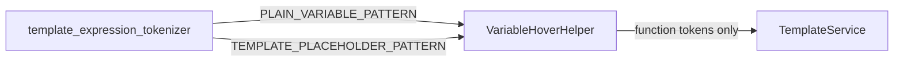

# PYPOST-113: Architecture

## Decision

**Document and export** the plain-variable regex in `template_expression_tokenizer.py`.
Hover keeps a fast path for `{{name}}` tokens; function placeholders still use
`TEMPLATE_PLACEHOLDER_PATTERN` + `TemplateService.render_string`.

## Implementation Plan

1. Add `PLAIN_VARIABLE_PATTERN`, `is_plain_variable_token`, `extract_plain_variable_name`
   to `template_expression_tokenizer.py`.
2. Set `VariableHoverHelper.VARIABLE_PATTERN = PLAIN_VARIABLE_PATTERN`.
3. Use helpers in `resolve_text` / `_resolve_plain_variable`.
4. Add unit tests in `test_template_expression_tokenizer.py`.
5. Update `doc/dev/template_expression_functions.md`.

## Architecture

### Two-pattern model

| Pattern | Regex | Use |
| --- | --- | --- |
| `TEMPLATE_PLACEHOLDER_PATTERN` | `\{\{\s*(.*?)\s*\}\}` | All placeholders — render, validation, hover scan |
| `PLAIN_VARIABLE_PATTERN` | `\{\{([a-zA-Z0-9_]+)\}\}` | Plain names only — hover fast lookup |

### Identifier note

`PLAIN_VARIABLE_PATTERN` allows digit-leading captures (legacy hover behavior).
`FunctionExpressionResolver._IDENTIFIER_RE` requires a letter/underscore start — documented
as intentional divergence until a follow-up aligns rules.
