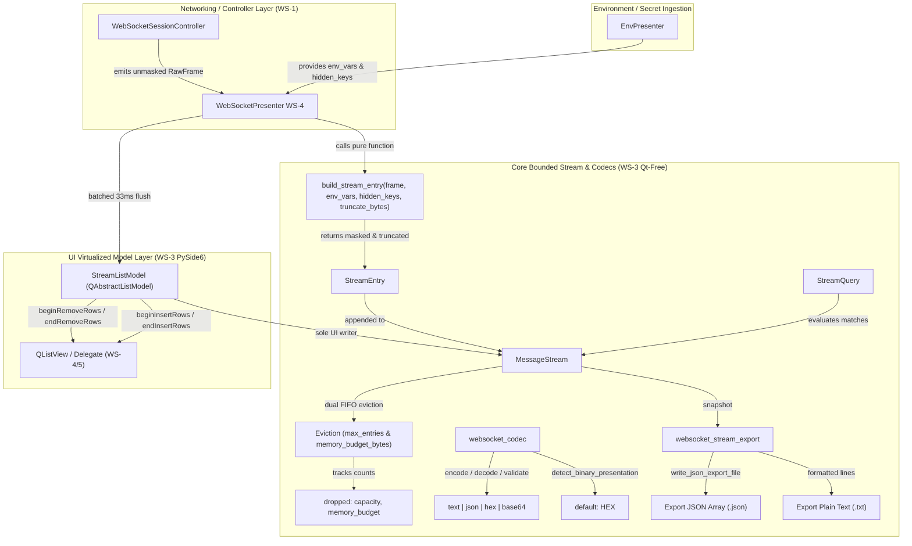

# PYPOST-1130: WS-3 Bounded message stream, codecs and export

## Research

### R-0 Verification Method

| Kind | How it was verified |
| --- | --- |
| **Repo fact** | Read from existing codebase: `pypost/models/websocket.py`, `pypost/core/websocket_transport_protocol.py`, `pypost/core/export_file_writer.py`, `pypost/core/sensitive_text_sanitizer.py`, `pypost/core/sensitive_data_masking_policy.py`, `ai-tasks/PYPOST-1124/20-architecture.md` |
| **Runtime fact** | Verified against Python 3.13.2 and PySide6 6.11.1 in `.venv` |
| **Vendor fact** | Verified against RFC 6455 (WebSocket Protocol), RFC 4648 (Base64/Base16 codecs), and Qt 6 `QAbstractListModel` documentation |

### R-1 Existing Architectural Precedents & Constraints

1. **Strict Layering (`doc/dev/architecture.md`)**:
   - `models/` is stdlib + Pydantic only.
   - `core/` is 100% Qt-free. All stream, codec, query, and export modules under `pypost/core/` must not import `PySide6` or QtCore/QtWidgets. They must be fully unit-testable headlessly without `QApplication`.
   - `ui/` hosts Qt-aware views, presenters, and item models (`pypost/ui/widgets/websocket/stream_model.py`).
2. **Export Infrastructure (`pypost/core/export_file_writer.py`)**:
   - `write_json_export_file(path, payload, *, error_cls)` is the shared helper for JSON export in PyPost (used by collection and environment exports). Reusing this helper ensures consistent atomic directory creation and error wrapping (RFC PYPOST-1124 A-6.5).
3. **Secret Masking Invariant (`pypost/core/sensitive_text_sanitizer.py`, RFC PYPOST-1124 A-8.2)**:
   - Secrets must be masked *at write time* before entering ring buffers or export records.
   - `build_stream_entry` is a pure function in `pypost/core/websocket_stream.py` that takes raw frame data plus explicit `env_vars` (Mapping[str, str]) and `hidden_keys` (Iterable[str]), and produces a masked `StreamEntry`. It imports no `Environment` class.
4. **UI Ingestion & Batch Flush (`doc/dev/response-streaming-display.md`, RFC PYPOST-1124 A-6.3)**:
   - Stream entries arriving at high rates are batched and flushed on the UI thread at ~33 ms (30 FPS) intervals.
   - `StreamListModel.append_batch(entries)` is the **sole writer** of `MessageStream` on the UI thread, ensuring that Qt `beginInsertRows`/`endInsertRows` and `beginRemoveRows`/`endRemoveRows` signals remain synchronized with internal `collections.deque` modifications.
5. **Memory and Capacity Ceilings (RFC PYPOST-1124 A-6.1, A-6.2, A-12)**:
   - Default `max_entries = 5000`.
   - Default `memory_budget_bytes = 67,108,864` (64 MiB).
   - Default `ws_display_truncate_bytes = 262,144` (256 KiB).
   - Dual eviction (capacity and memory budget) operates oldest-first (FIFO) and tracks drop counts per cause (`dropped["capacity"]`, `dropped["memory_budget"]`).

---

## Implementation Plan

### High-Level Execution Phases

1. **Phase 1 (Step 3): Automated Red Test Suite (`tests/test_websocket_stream_and_codecs.py`)**:
   - Write comprehensive red tests asserting all acceptance criteria before implementing production code:
     - `MessageStream` capacity eviction, byte-budget eviction, snapshot immutability, clear/reset, and drop counters.
     - `StreamQuery` filtering on direction, kind, format, search text, and heartbeat toggle.
     - `build_stream_entry` pure masking, display truncation with true `byte_size` preservation, sequence numbering, and Qt-free isolation.
     - `websocket_codec` round-trip encoding/decoding (text, json, hex, base64), validation errors for corrupted hex/base64, and binary presentation detection defaulting to `hex`.
     - `websocket_stream_export` JSON array and Plain Text transcript formatting, drop count headers, determinism, and disk export.
     - `StreamListModel` (`QAbstractListModel`) row count, role data mapping, stable `seq` identity across front evictions, and single-transaction `append_batch` signaling.
2. **Phase 2 (Step 4): Core Qt-Free Modules**:
   - Implement `pypost/core/websocket_stream.py`: `StreamEntry`, `StreamQuery`, `MessageStream`, and `build_stream_entry`.
   - Implement `pypost/core/websocket_codec.py`: `encode_payload`, `decode_payload`, `detect_binary_presentation`, `validate_format`.
   - Implement `pypost/core/websocket_stream_export.py`: `format_json_transcript`, `format_text_transcript`, `export_stream_to_json_file`, `export_stream_to_text_file`.
3. **Phase 3 (Step 4): Qt Virtualized List Model**:
   - Implement `pypost/ui/widgets/websocket/stream_model.py`: `StreamListModel` inheriting `QAbstractListModel` with custom roles and atomic `append_batch`.
4. **Phase 4 (Step 4): Verification & Polish**:
   - Verify green test suite under `QT_QPA_PLATFORM=offscreen`.
   - Validate strict Qt-free import isolation for `core/websocket_stream.py`, `core/websocket_codec.py`, `core/websocket_stream_export.py`.
   - Run quality gate and baseline metrics checks (`scripts/audit_baseline_metrics.py --check`).

### Mandatory — Failing Repro (next Step 3)

- **Test file**: `tests/test_websocket_stream_and_codecs.py`
- **What it asserts (desired behavior)**:
  1. *Dual Eviction & Drop Counters*: Appending past `max_entries` evicts the oldest entry and increments `dropped["capacity"]`. Appending large payloads past `memory_budget_bytes` evicts oldest entries and increments `dropped["memory_budget"]`.
  2. *Display Truncation & Wire Size*: Payloads larger than `truncate_bytes` are truncated in `StreamEntry.payload`, set `truncated=True`, but preserve full byte size in `StreamEntry.byte_size`.
  3. *Pure Masking Isolation*: `build_stream_entry` redacts values of `hidden_keys` using `env_vars` with `***`, imports no Qt or `Environment` classes, and produces safe `StreamEntry` instances.
  4. *Multi-Format Codecs*: Bidirectional encoding and decoding for `text`, `json`, `hex`, `base64`. Specific syntax validation error messages for odd/non-hex strings and malformed Base64 strings. Binary presentation detection defaults to `WsMessageFormat.HEX`.
  5. *Transcript Export*: JSON array export (via `write_json_export_file`) and plain text export retain drop counts (`capacity`, `memory_budget`), include masked payloads, and produce byte-identical files on identical input.
  6. *Virtualized Stream Model*: `StreamListModel` emits matching `beginRemoveRows`/`endRemoveRows` during front evictions and `beginInsertRows`/`endInsertRows` during insertions, maintaining stable `seq` identities for remaining entries.
- **How failure is forced**: Importing `pypost.core.websocket_stream`, `pypost.core.websocket_codec`, `pypost.core.websocket_stream_export`, and `pypost.ui.widgets.websocket.stream_model` before they are created will immediately fail with `ModuleNotFoundError` / `ImportError` or assertion errors against stubbed behavior.
- **Sequencing**:
  1. Write `tests/test_websocket_stream_and_codecs.py` (Red / Failing).
  2. Implement `pypost/core/websocket_stream.py`, `pypost/core/websocket_codec.py`, `pypost/core/websocket_stream_export.py`, and `pypost/ui/widgets/websocket/stream_model.py`.
  3. Run tests until all 100% green.

---

## Architecture

### System Module Diagram



---

### Module Breakdown and Responsibilities

#### 1. `pypost/core/websocket_stream.py` (Qt-Free, stdlib only)

- **`StreamEntry`**:
  Immutable (`@dataclass(frozen=True)`) data carrier representing a single timestamped session event:
  - `seq: int`: Monotonically increasing sequence number within the session (1, 2, 3...). Provides stable identity across front evictions.
  - `ts_utc: str`: ISO-8601 UTC timestamp with millisecond precision (e.g. `2026-08-22T11:27:00.123Z`).
  - `kind: str`: Event kind (`"message"` or `"lifecycle"`).
  - `direction: str`: Transmission direction (`"in"`, `"out"`, or `"none"`).
  - `payload_format: str`: Format name (`"text"`, `"json"`, `"hex"`, `"base64"`).
  - `payload: str`: Sanitized and display-truncated payload text.
  - `byte_size: int`: True un-truncated wire byte size.
  - `truncated: bool`: `True` if payload exceeded `ws_display_truncate_bytes`, otherwise `False`.
  - `detail: str`: Supplementary text (e.g. close code, error message, lifecycle event reason).

- **`StreamQuery`**:
  Filter predicate dataclass for querying stream contents:
  - `direction: Optional[str] = None` (`"in"`, `"out"`, or `None` for all).
  - `kind: Optional[str] = None` (`"message"`, `"lifecycle"`, or `None` for all).
  - `payload_format: Optional[str] = None` (`"text"`, `"json"`, `"hex"`, `"base64"`, or `None`).
  - `search_text: str = ""` (Case-insensitive substring search matching against `payload` and `detail`).
  - `show_heartbeats: bool = False` (If `False`, excludes routine ping/pong heartbeat lifecycle events).
  - `matches(entry: StreamEntry) -> bool`: Pure evaluation method returning `True` if the entry satisfies all active filter criteria.

- **`MessageStream`**:
  Bounded append-only ring buffer backed by `collections.deque` with dual eviction and drop accounting:
  - `__init__(max_entries: int = 5000, memory_budget_bytes: int = 67_108_864)`
  - `append(entry: StreamEntry) -> tuple[int, str | None]`:
    1. *Capacity check*: If `len(_entries) >= max_entries`, pop oldest entry from the front, deduct its retained payload bytes, increment `dropped["capacity"]`, record reason `"capacity"`.
    2. *Entry size calculation*: Calculate retained payload byte length `len(entry.payload.encode("utf-8"))`.
    3. *Memory budget check*: While `_entries` is non-empty and `(_retained_bytes + entry_bytes > memory_budget_bytes)`, pop oldest entries from the front, deduct their bytes, increment `dropped["memory_budget"]`, record reason `"memory_budget"`.
    4. *Store entry*: Append `entry` to `_entries`, add `entry_bytes` to `_retained_bytes`.
    5. *Return*: `(total_evicted_count, primary_reason)`.
  - `snapshot() -> tuple[StreamEntry, ...]`: Returns an immutable snapshot tuple of all currently retained entries.
  - `matching(query: StreamQuery) -> tuple[int, ...]`: Returns sequence numbers (`seq`) of entries matching `query`.
  - `clear() -> None`: Empties the deque and resets `_retained_bytes = 0`, `dropped["capacity"] = 0`, `dropped["memory_budget"] = 0`.
  - `@property dropped -> Mapping[str, int]`: Returns a copy of `{"capacity": self._dropped_capacity, "memory_budget": self._dropped_memory_budget}`.
  - `@property total_retained_bytes -> int`: Returns current retained payload bytes.
  - `__len__() -> int` and `__getitem__(index: int) -> StreamEntry`.

- **`build_stream_entry(...)`**:
  Pure function converting a `RawFrame` (from `websocket_transport_protocol.py`) or explicit arguments into a masked, display-truncated `StreamEntry`:
  ```python
  def build_stream_entry(
      frame: RawFrame | None = None,
      *,
      env_vars: Mapping[str, str] | None = None,
      hidden_keys: Iterable[str] | None = None,
      truncate_bytes: int = 262_144,
      seq: int,
      kind: str = "message",
      direction: str | None = None,
      payload_format: str | None = None,
      payload: str | None = None,
      byte_size: int | None = None,
      detail: str = "",
      ts_utc: str | None = None,
  ) -> StreamEntry: ...
  ```
  - Redacts occurrences of values from `hidden_keys` using `_redact_hidden_values` and `sanitize_text`.
  - Computes payload wire size in bytes.
  - If wire size > `truncate_bytes`, truncates string payload to `truncate_bytes` and marks `truncated = True`. True wire size is stored in `byte_size`.
  - Formats timestamp to ISO-8601 UTC with milliseconds.

---

#### 2. `pypost/core/websocket_codec.py` (Qt-Free, stdlib only)

- **`encode_payload(data: str, format: WsMessageFormat | str) -> bytes | str`**:
  Encodes user input string into payload ready for transmission:
  - `WsMessageFormat.TEXT`: Returns string or UTF-8 encoded `bytes`.
  - `WsMessageFormat.JSON`: Validates JSON syntax using `json.loads(data)` and returns string or UTF-8 encoded `bytes`.
  - `WsMessageFormat.HEX`: Converts hex string to binary `bytes` using `bytes.fromhex(data.strip())`. Rejects invalid hex characters or odd-length strings with `ValueError`.
  - `WsMessageFormat.BASE64`: Converts Base64 string to binary `bytes` using `base64.b64decode(data.strip(), validate=True)`. Rejects invalid Base64 with `ValueError`.

- **`decode_payload(payload: bytes | str, format: WsMessageFormat | str) -> str`**:
  Decodes raw incoming frame payload to display presentation:
  - `WsMessageFormat.TEXT`: Decodes `bytes` to string using UTF-8 with replacement (`payload.decode("utf-8", errors="replace")`).
  - `WsMessageFormat.JSON`: Decodes `bytes` to UTF-8 string; attempts `json.loads` and returns formatted JSON if valid, or fallback text if not.
  - `WsMessageFormat.HEX`: Converts `bytes` to hex string (`payload.hex()`).
  - `WsMessageFormat.BASE64`: Converts `bytes` to Base64 ASCII string (`base64.b64encode(payload).decode("ascii")`).

- **`detect_binary_presentation(payload: bytes) -> WsMessageFormat`**:
  Returns `WsMessageFormat.HEX` as default presentation for binary frames (RFC PYPOST-1124 A-13.3 AC 5).

- **`validate_format(data: str, format: WsMessageFormat | str) -> tuple[bool, str | None]`**:
  Validates syntax before transmission or preset saving:
  - `TEXT`: Always returns `(True, None)`.
  - `JSON`: Returns `(True, None)` or `(False, f"Invalid JSON: {exc.msg} (line {exc.lineno}, col {exc.colno})")`.
  - `HEX`: Returns `(True, None)` or `(False, "Invalid hexadecimal payload: odd number of digits or non-hex characters")`.
  - `BASE64`: Returns `(True, None)` or `(False, "Invalid Base64 payload: incorrect padding or invalid characters")`.

---

#### 3. `pypost/core/websocket_stream_export.py` (Qt-Free, stdlib only)

- **`format_json_transcript(stream: MessageStream, metadata: Mapping[str, Any] | None = None) -> dict[str, Any]`**:
  Produces a structured dictionary conforming to PyPost JSON transcript format:
  ```json
  {
    "schema_version": "1.0",
    "metadata": {
      "exported_at": "2026-08-22T11:30:00.000Z",
      "total_retained": 5000,
      "dropped": {
        "capacity": 12,
        "memory_budget": 3
      }
    },
    "entries": [
      {
        "seq": 1,
        "ts_utc": "2026-08-22T11:29:00.123Z",
        "kind": "message",
        "direction": "in",
        "payload_format": "json",
        "payload": "{\"status\":\"ok\"}",
        "byte_size": 15,
        "truncated": false,
        "detail": ""
      }
    ]
  }
  ```

- **`format_text_transcript(stream: MessageStream, metadata: Mapping[str, Any] | None = None) -> str`**:
  Produces plain-text transcript lines with header summary and drop counters:
  ```text
  # PyPost WebSocket Transcript
  # Exported: 2026-08-22T11:30:00.000Z
  # Retained entries: 5000
  # Dropped entries: capacity=12, memory_budget=3
  # ----------------------------------------------------------------------
  [2026-08-22T11:29:00.123Z] [in] [15B] {"status":"ok"}
  [2026-08-22T11:29:01.000Z] [out] [24B] [TRUNCATED] {"op":"subscribe"}
  [2026-08-22T11:29:02.500Z] [none] [0B] [lifecycle] connected subprotocol=json.v2
  ```

- **`export_stream_to_json_file(path: Path, stream: MessageStream, metadata: Mapping[str, Any] | None = None) -> None`**:
  Delegates file writing to `pypost.core.export_file_writer.write_json_export_file(path, payload, error_cls=WebSocketExportError)`.

- **`export_stream_to_text_file(path: Path, stream: MessageStream, metadata: Mapping[str, Any] | None = None) -> None`**:
  Writes plain-text transcript to `path` with UTF-8 encoding and directory creation.

---

#### 4. `pypost/ui/widgets/websocket/stream_model.py` (PySide6 / Qt List Model)

- **`StreamListModel(QAbstractListModel)`**:
  Virtualized list model providing low-overhead data access to `MessageStream`:
  - **Custom Item Data Roles**:
    ```python
    SeqRole = Qt.ItemDataRole.UserRole + 1
    TimestampRole = Qt.ItemDataRole.UserRole + 2
    KindRole = Qt.ItemDataRole.UserRole + 3
    DirectionRole = Qt.ItemDataRole.UserRole + 4
    FormatRole = Qt.ItemDataRole.UserRole + 5
    TruncatedRole = Qt.ItemDataRole.UserRole + 6
    ByteSizeRole = Qt.ItemDataRole.UserRole + 7
    DetailRole = Qt.ItemDataRole.UserRole + 8
    StreamEntryRole = Qt.ItemDataRole.UserRole + 9
    ```
  - **`rowCount(parent=QModelIndex()) -> int`**: Returns `len(self._stream)` if parent is invalid; 0 otherwise.
  - **`data(index: QModelIndex, role: int = Qt.ItemDataRole.DisplayRole) -> Any`**: Returns entry attributes according to requested role.
  - **`append_batch(entries: Sequence[StreamEntry]) -> tuple[int, int]`**:
    The **sole UI write path** mutating `MessageStream`:
    ```python
    def append_batch(self, entries: Sequence[StreamEntry]) -> tuple[int, int]:
        if not entries:
            return 0, 0
        
        # 1. Calculate evictions across the batch to emit exact Qt remove/insert signals
        # If ring buffer eviction occurs:
        # Emit beginRemoveRows(QModelIndex(), 0, count - 1) before removing
        # Emit beginInsertRows(QModelIndex(), old_len, old_len + inserted - 1) for new items
        ...
    ```
  - **`clear() -> None`**: Emits `beginResetModel()`, calls `_stream.clear()`, emits `endResetModel()`.
  - **`@property stream -> MessageStream`**: Access to the underlying stream for read-only queries and export.

---

### Data Structures & Eviction Algorithm

#### Dual Eviction Invariant in `MessageStream`

```text
Let:
  max_entries = M (e.g. 5000)
  memory_budget_bytes = B (e.g. 64 MiB)
  _entries = deque of StreamEntry
  _retained_bytes = sum of len(e.payload.encode("utf-8")) for e in _entries

On append(new_entry):
  entry_cost = len(new_entry.payload.encode("utf-8"))
  
  1. Capacity Eviction:
     While len(_entries) >= M:
         old_entry = _entries.popleft()
         _retained_bytes -= len(old_entry.payload.encode("utf-8"))
         _dropped_capacity += 1
         
  2. Memory Budget Eviction:
     While _entries and (_retained_bytes + entry_cost > B):
         old_entry = _entries.popleft()
         _retained_bytes -= len(old_entry.payload.encode("utf-8"))
         _dropped_memory_budget += 1
         
  3. Enqueue:
     _entries.append(new_entry)
     _retained_bytes += entry_cost
```

Complexity:
- Amortized Time Complexity: $O(1)$ per append.
- Space Complexity: Strictly bounded by $\min(M \times \text{entry\_size}, B)$ bytes.

---

## Q&A

| Question | Answer |
| --- | --- |
| Why is `StreamListModel.append_batch` the sole ring writer on the UI path? | To guarantee that Qt's model index state (`beginInsertRows`/`endInsertRows`, `beginRemoveRows`/`endRemoveRows`) and the underlying `collections.deque` remain 100% in sync without race conditions or index corruption. |
| Why does `build_stream_entry` take explicit `env_vars` and `hidden_keys` rather than an `Environment` object? | To enforce pure architectural layering. `pypost/core/websocket_stream.py` remains Qt-free and decoupled from domain environment classes, enabling fast, isolated unit testing. |
| Why are raw binary frame payloads presented as hexadecimal by default? | Most WebSocket binary payloads represent structured protocols (MessagePack, Protobuf, binary framing) where byte-by-byte hex pairs (`01020304`) provide the cleanest diagnostic view. Users can override the display format to Base64 per session. |
| How does the model ensure stable row identity across front evictions? | Each `StreamEntry` has an immutable `seq` integer assigned at creation. When oldest items are evicted from the top of the list, remaining items keep their `seq` value. The UI detail inspector tracks entries by `seq`, avoiding stale row pointer bugs. |
| How does export ensure that truncated transcripts are never mistaken for full logs? | Both JSON and Plain Text export headers include `dropped: {"capacity": X, "memory_budget": Y}` counters, so anyone reading the transcript immediately knows if messages were dropped due to buffer bounds. |
