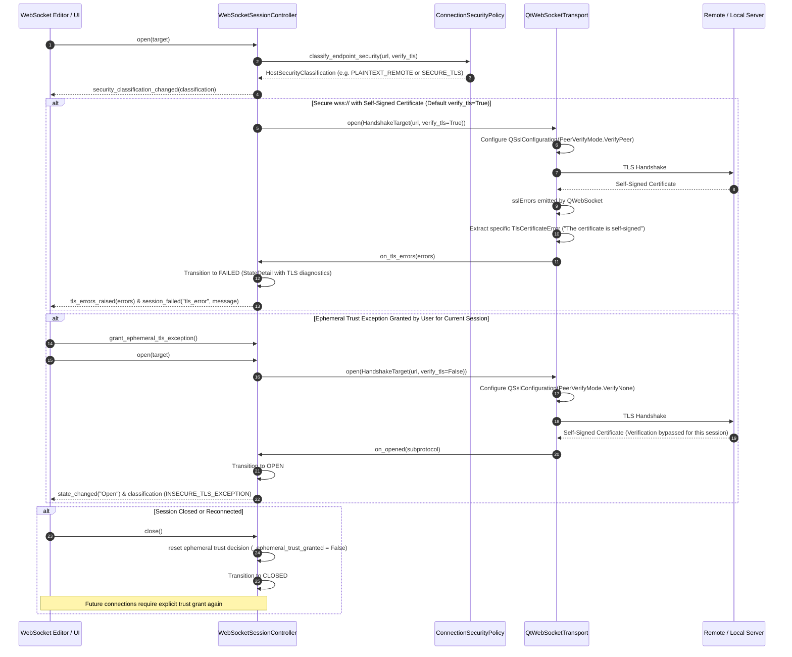

# PYPOST-1131: WS-8 TLS and connection-security policy

## Research

### 1. PySide6 / QtWebSockets TLS Verification Engine
`PySide6.QtWebSockets.QWebSocket` delegates network transport security to Qt's underlying OpenSSL backend (`QSslSocket`).
- **Default Verification Mode**: By default, `QSslConfiguration.defaultConfiguration()` enables full peer verification (`QSslSocket.PeerVerifyMode.VerifyPeer`), validating the complete X.509 certificate chain against system-trusted Certificate Authorities (CAs), enforcing certificate validity periods (not before / not after), and strictly verifying the target hostname against Subject Alternative Names (SAN) and Common Name (CN).
- **TLS Error Signal Propagation**: When validation fails during handshake, `QWebSocket.sslErrors` emits a list of `QSslError` objects. In Qt, if these errors are not handled or if `ignoreSslErrors()` is not invoked, the handshake automatically aborts, the socket closes, and the connection never transitions to `Open`.
- **Diagnostic Error Extraction**: Each `QSslError` provides:
  - `errorString()`: Human-readable, descriptive failure message (e.g. `"The certificate is self-signed, and untrusted"`, `"The host name did not match any of the valid hosts for this certificate"`, `"The certificate has expired"`).
  - `error()`: `QSslError.SslError` enum identifier.
  - `certificate()`: Associated `QSslCertificate` containing subject, issuer, SHA-256 fingerprint, and validity timestamps.

### 2. Elimination of Blanket `ignoreSslErrors()`
- In RFC PYPOST-1124 (D-12) and PYPOST-1131 requirements, unconditional bypasses via `ignoreSslErrors()` are strictly forbidden in production code under `pypost/`.
- The current interim code in `pypost/core/qt/websocket_transport.py` contains `self._socket.ignoreSslErrors()`, which must be removed.
- When an ephemeral user override is granted for a specific connection attempt (`verify_tls=False`), the transport configures `QSslConfiguration` on the socket with `PeerVerifyMode.VerifyNone` before invoking `open()`. This avoids invoking `ignoreSslErrors()` while cleanly and explicitly controlling the TLS verification mode per session.
- An automated static AST guard test (`test_no_ignore_ssl_errors_in_production_code`) will inspect all Python files in `pypost/` to prevent regression.

### 3. Ephemeral Trust Lifecycle & Zero Disk Persistence Invariant
- **Lifecycle Boundary**: An exception granted for an untrusted certificate applies strictly to that active connection instance.
- **In-Memory Tracking**: State is tracked in-memory by `WebSocketSessionController` / `EphemeralSessionTrustDecision`. Closing the session, disconnecting, or starting a new session resets trust back to `reject_by_default`.
- **Zero Disk Persistence Guarantee**: Neither `WebSocketConnection` in `pypost/models/websocket.py`, nor `Collection` JSON files, nor `AppSettings` contain fields for persisting certificate bypasses or fingerprints. Unit and integration tests verify on-disk state invariance after sessions with overrides.

### 4. Loopback Detection and Plaintext Warning Classification
- Connections over unencrypted `ws://` to remote hosts expose tokens and headers on the wire.
- **Loopback Classification**: An address is classified as loopback if:
  - Hostname is `"localhost"`, `"localhost.localdomain"`, or ends with `".localhost"` (RFC 6761).
  - Hostname parses via `ipaddress.ip_address()` as an IPv4 loopback (`127.0.0.0/8`) or IPv6 loopback (`::1`, `[::1]`).
- **Policy Outcomes**:
  - `ws://` + loopback host -> `HostSecurityClassification.PLAINTEXT_LOOPBACK` (safe local interface, no security warning banner).
  - `ws://` + remote/non-loopback host -> `HostSecurityClassification.PLAINTEXT_REMOTE` (triggers persistent plaintext security warning indicator).
  - `wss://` + verified certificate -> `HostSecurityClassification.SECURE_TLS` (secure encrypted transport).
  - `wss://` + ephemeral override -> `HostSecurityClassification.INSECURE_TLS_EXCEPTION` (insecure TLS override active for current session).

### 5. Architectural Separation of Concerns
- **Domain Security Policy**: `pypost/core/websocket_security_policy.py` is pure, Qt-free domain logic containing classification rules, loopback detection, dataclasses, and error formatters.
- **Transport Interface**: `pypost/core/websocket_transport_protocol.py` defines `HandshakeTarget` (with `verify_tls`), `WebSocketTransportListener` (with `on_tls_errors`), and `WebSocketTransport`.
- **Qt Transport Adapter**: `pypost/core/qt/websocket_transport.py` implements Qt-specific SSL configuration (`QSslConfiguration`) and error extraction (`QSslError`).
- **Session Coordinator**: `pypost/core/qt/websocket_session.py` coordinates ephemeral trust state, signals, state machine transitions, and error emissions.

---

## Implementation Plan

### Mandatory — Failing Repro (next Step 3)

The failing repro test suite for Step 3 will live in:
- `tests/test_websocket_tls_security_guardrails.py` (static AST and model guardrails)
- `tests/test_websocket_tls_policy.py` (pure domain policy, loopback classification, error extraction, and hermetic SSL server lifecycle tests)

#### Desired Behaviors & Assertions
1. **Static AST Guardrail**:
   - `test_no_ignore_ssl_errors_in_production_code`: Scans all Python files under `pypost/` and asserts that the string/call `ignoreSslErrors(` does not appear. (Fails initially against existing `pypost/core/qt/websocket_transport.py:100`).
2. **Model Persistence Isolation Guardrail**:
   - `test_websocket_connection_model_has_no_tls_bypass_fields`: Inspects `WebSocketConnection` model fields and serializations, asserting that no certificate exception, fingerprint whitelist, or insecure flag is persisted.
3. **Loopback Classification & Plaintext Warnings**:
   - `test_loopback_host_detection`: Verifies that `localhost`, `127.0.0.1`, `127.0.1.1`, `::1`, `[::1]`, and `sub.localhost` are recognized as loopback, while `192.168.1.1`, `api.example.com`, and `10.0.0.1` are recognized as non-loopback.
   - `test_endpoint_security_classification`: Asserts that `ws://remote.com` produces `PLAINTEXT_REMOTE`, `ws://127.0.0.1` produces `PLAINTEXT_LOOPBACK`, `wss://echo.com` produces `SECURE_TLS`, and `wss://echo.com` with `verify_tls=False` produces `INSECURE_TLS_EXCEPTION`.
4. **Default TLS Rejection on Self-Signed Certificate**:
   - `test_wss_rejects_self_signed_cert_by_default`: Runs local in-process SSL WebSocket server with self-signed certificate, connects with default `verify_tls=True`. Asserts that the connection aborts, the session never reaches `Open`, and `tls_errors_raised` / `session_failed` emits specific diagnostic strings (`"The certificate is self-signed"`).
5. **Ephemeral Per-Session Exception Lifecycle**:
   - `test_wss_ephemeral_override_lifecycle`: Verifies that when an ephemeral exception is explicitly granted, the session connects to the self-signed server. When the session is closed and re-opened without an override, the connection is rejected again by default. Inspecting saved collection models confirms zero on-disk persistence.

#### Sequencing
1. **Step 3**: Author `tests/test_websocket_tls_security_guardrails.py` and `tests/test_websocket_tls_policy.py` demonstrating failures on `ignoreSslErrors` and missing TLS policy modules.
2. **Step 4 (Iter 1)**: Implement pure domain policy in `pypost/core/websocket_security_policy.py`.
3. **Step 4 (Iter 2)**: Refactor `pypost/core/qt/websocket_transport.py` to remove `ignoreSslErrors()`, configure `QSslConfiguration(VerifyNone)` when `verify_tls=False`, and extract structured `TlsCertificateError` diagnostics.
4. **Step 4 (Iter 3)**: Update `pypost/core/qt/websocket_session.py` to coordinate ephemeral trust decisions and emit structured security events.
5. **Step 4 (Iter 4)**: Enhance `tests/websocket_echo_server.py` with SSL mode (`QWebSocketServer.SslMode.SecureMode`) and verify all tests pass green.

---

## Architecture

### System Module Diagram

```mermaid
graph TD
    subgraph UI Layer
        UI["WebSocket Editor & Presenter"]
        Badge["Security State Badge (Plaintext / TLS Warning)"]
    end

    subgraph Core Qt Layer (pypost/core/qt/)
        Controller["WebSocketSessionController\n(Ephemeral Trust Decision State)"]
        Transport["QtWebSocketTransport\n(QSslConfiguration Setup & Error Extraction)"]
    end

    subgraph Core Domain Policy - Qt-Free (pypost/core/)
        SecurityPolicy["websocket_security_policy.py\n- ConnectionSecurityPolicy\n- HostSecurityClassification\n- is_loopback_host()\n- classify_endpoint_security()\n- TlsDiagnosticReport"]
        TransportProtocol["websocket_transport_protocol.py\n- HandshakeTarget (verify_tls)\n- WebSocketTransportListener (on_tls_errors)"]
    end

    subgraph Models & Persistence (pypost/models/)
        WSModel["WebSocketConnection\n(Zero TLS Bypass Fields)"]
    end

    UI --> Controller
    Controller --> SecurityPolicy
    Controller --> Transport
    Transport --> TransportProtocol
    Controller --> Badge
    Controller -.-> WSModel
```

### Module Responsibilities

| Module | Location | Responsibility |
| --- | --- | --- |
| `websocket_security_policy.py` | `pypost/core/` | **Pure Qt-free domain logic**: Host classification (loopback vs remote), URL security evaluation, TLS certificate error dataclasses, diagnostic report generation, and ephemeral trust invariants. |
| `websocket_transport_protocol.py` | `pypost/core/` | **Transport abstractions**: Interface contracts for `HandshakeTarget` (including `verify_tls`), `WebSocketTransportListener`, and `WebSocketTransport`. |
| `websocket_transport.py` | `pypost/core/qt/` | **Qt transport adapter**: Configures `QWebSocket` with `QSslConfiguration` (`VerifyPeer` vs `VerifyNone`), captures `QWebSocket.sslErrors`, extracts specific error strings, and strictly avoids `ignoreSslErrors()`. |
| `websocket_session.py` | `pypost/core/qt/` | **Headless session controller**: Manages session state machine, holds in-memory ephemeral trust state (`_ephemeral_trust_granted`), resets trust on disconnect/close, and emits security signals. |
| `websocket.py` | `pypost/models/` | **Data models**: Connection definitions. Enforces invariant of zero TLS override fields. |
| `websocket_echo_server.py` | `tests/` | **Test harness**: Scripted in-process WebSocket server supporting both plaintext and SSL modes (`QWebSocketServer.SslMode.SecureMode`) with self-signed certificate generation for hermetic offline tests. |

---

### Data Structures & Enums

```python
# pypost/core/websocket_security_policy.py

from dataclasses import dataclass
from datetime import datetime
from enum import Enum
from typing import Optional


class HostSecurityClassification(str, Enum):
    """Security classification of a WebSocket endpoint transport."""

    SECURE_TLS = "secure_tls"
    INSECURE_TLS_EXCEPTION = "insecure_tls_exception"
    PLAINTEXT_REMOTE = "plaintext_remote"
    PLAINTEXT_LOOPBACK = "plaintext_loopback"


@dataclass(frozen=True)
class TlsCertificateError:
    """Detailed metadata for a single TLS certificate validation failure."""

    error_code: str
    message: str
    certificate_subject: str = ""
    certificate_issuer: str = ""
    certificate_fingerprint: str = ""
    expiry_date: Optional[datetime] = None


@dataclass(frozen=True)
class TlsDiagnosticReport:
    """Structured diagnostic report containing all TLS errors encountered."""

    errors: tuple[TlsCertificateError, ...]
    summary_message: str
    target_url: str
    target_host: str
    timestamp: datetime


@dataclass
class EphemeralSessionTrustDecision:
    """In-memory, non-persistent trust decision for an active session."""

    session_id: str
    target_url: str
    exception_granted: bool = False
    granted_at: Optional[datetime] = None

    def reset(self) -> None:
        """Purge exception grant on session termination."""
        self.exception_granted = False
        self.granted_at = None
```

---

### Module Interaction Scheme



---

### Invariants and Security Guarantees

1. **Secure by Default (`wss://`)**:
   Every `wss://` connection mandates full certificate chain and hostname verification (`PeerVerifyMode.VerifyPeer`). Self-signed, expired, hostname-mismatched, or untrusted certificates abort the handshake immediately and prevent transitioning to `Open`.
2. **Zero `ignoreSslErrors()` in Production**:
   Blanket `ignoreSslErrors()` calls are prohibited from all production modules in `pypost/`. Bypassing TLS for ephemeral testing is achieved strictly through pre-handshake `QSslConfiguration` setup (`PeerVerifyMode.VerifyNone`).
3. **Strict Ephemeral Trust Invariant (D-12)**:
   Certificate exceptions exist strictly in volatile process memory during the active session. They are never written to `WebSocketConnection`, `Collection` JSON files, or application settings files.
4. **Specific Error Diagnostics**:
   TLS validation failures report concrete diagnostic reasons (e.g. self-signed certificate, hostname mismatch, expired validity) extracted from `QSslError.errorString()`, avoiding generic "Connection failed" messages.
5. **Loopback Classification Accuracy**:
   Only verified loopback interfaces (`localhost`, `127.0.0.0/8`, `::1`, `[::1]`, `*.localhost`) are exempt from plaintext warnings. All remote `ws://` connections trigger a persistent plaintext warning indicator.

---

## Q&A

| Question | Answer | Reference / Decision |
| --- | --- | --- |
| Why is `ignoreSslErrors()` banned rather than filtered? | `ignoreSslErrors()` without arguments suppresses all SSL validation globally for the socket. Even parameterized `ignoreSslErrors(errors)` can lead to unintended error suppression if misused. Using explicit `QSslConfiguration(PeerVerifyMode.VerifyNone)` when `verify_tls=False` makes the bypass explicit at socket configuration time while allowing static AST tests to enforce zero blanket bypasses in production code. | RFC PYPOST-1124 (D-12), Acceptance Criteria #5 & #6 |
| Why are certificate overrides not saved in collection files? | Storing certificate overrides in collection JSON files creates security drift: temporary test overrides might be committed to source control or shared across teams, permanently weakening security postures. Follow-up FU-6 will address enterprise custom CA trust roots properly. | RFC PYPOST-1124 (D-12, FU-6) |
| How are certificate error strings extracted in headless Qt environments? | PySide6's `QSslError.errorString()` and `QSslCertificate` APIs operate identically in headless environments (`QT_QPA_PLATFORM=offscreen`) without requiring a GUI display server or external network access. | NFR-4, `tests/websocket_echo_server.py` |
| Why classify `*.localhost` as loopback? | RFC 6761 Section 6.3 establishes that any domain name with `.localhost` as the top-level domain resolves to loopback IP addresses. Local development tools (like local reverse proxies) frequently use subdomains such as `api.localhost`. | RFC 6761, `is_loopback_host()` |
| What happens to the ephemeral exception when a connection disconnects unexpectedly? | When a session disconnects, closes, or fails, `WebSocketSessionController` purges the ephemeral trust state. Automatic reconnections or manual reconnects will not silently reuse the exception unless the session lifecycle explicitly maintains it during that specific attempt. | Invariant 3, `EphemeralSessionTrustDecision` |
