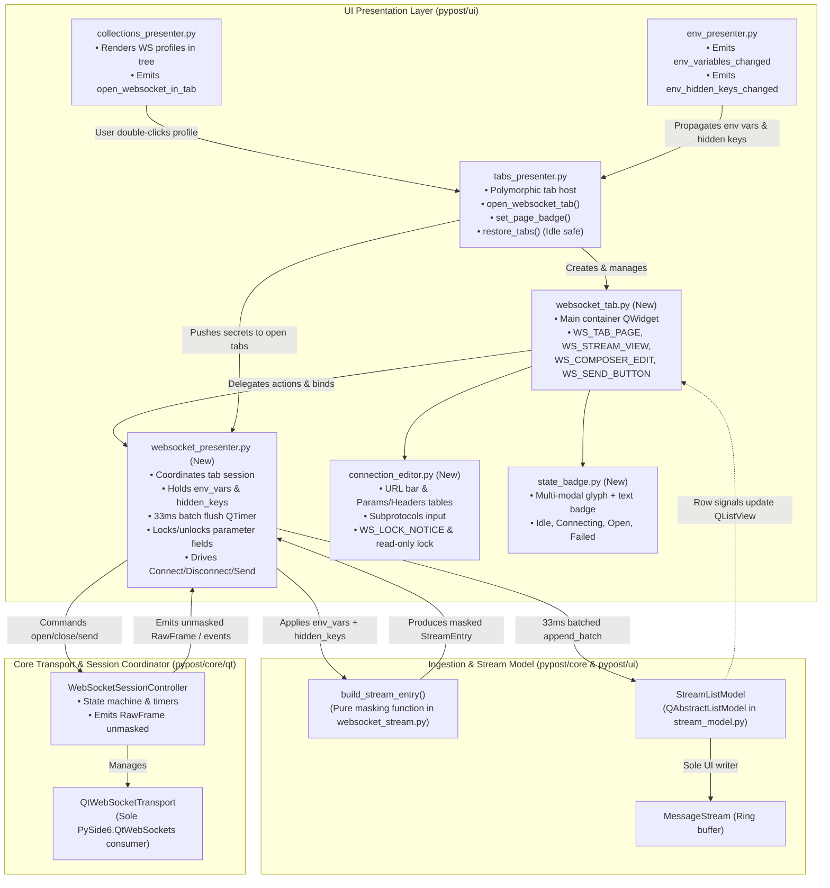
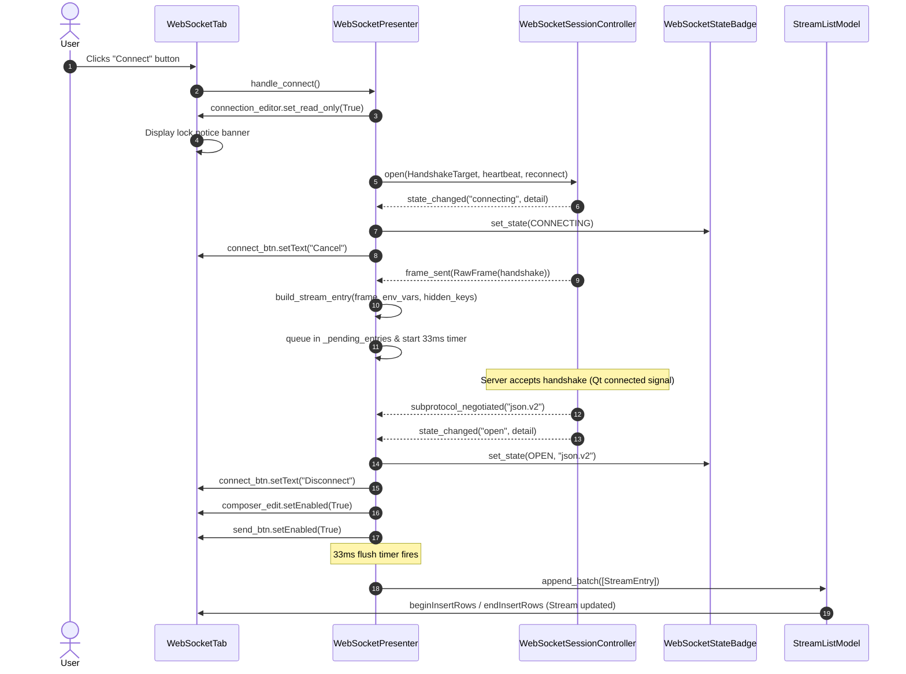
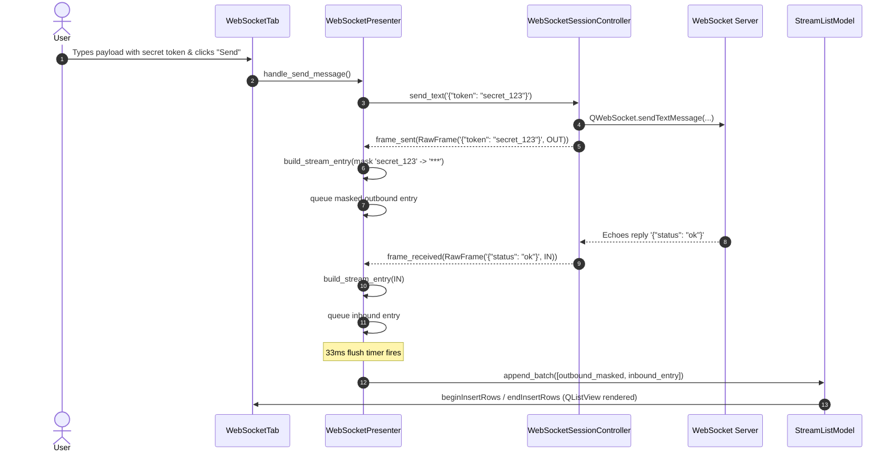
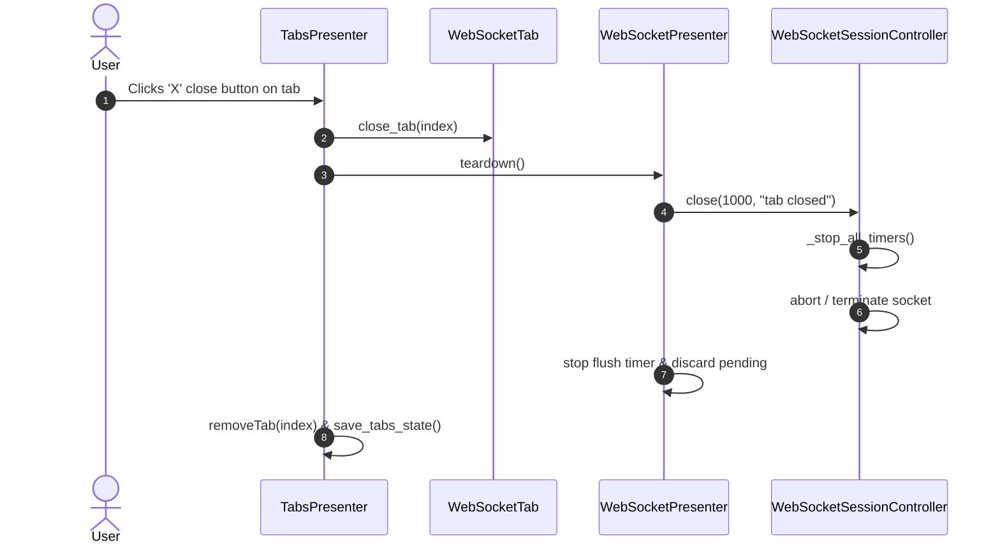

# PYPOST-1132: WS-4 WebSocket session tab and minimal client — Architecture Design

This document defines the high-level architecture for **PYPOST-1132 (WS-4)**, the first user-visible WebSocket client story in Epic PYPOST-1123. It translates the approved requirements in [`10-requirements.md`](10-requirements.md) and the system-level RFC in [`ai-tasks/PYPOST-1124/20-architecture.md`](../PYPOST-1124/20-architecture.md) (specifically Sections A-3.1, A-5.2, A-5.4, A-13.4, and A-14) into detailed module designs, class interfaces, interaction sequence diagrams, dataflow pipelines, failing repro designs, and test verification strategies.

---

## Research

### R-0 Verification Method & Facts

All claims, invariants, and constraints have been verified against the codebase, runtime environment, and official Qt 6 documentation:

| Category | Verification Method | Finding / Verification Result |
| --- | --- | --- |
| **Repo Fact** | `pypost/ui/presenters/tabs_presenter.py` inspection | `TabsPresenter` currently has **642 LOC** against a hard regression cap of **785 LOC** (143 lines of headroom). Headroom is preserved by limiting changes in `TabsPresenter` to thin polymorphic page delegation methods (`open_websocket_tab`, `close_tab`, `set_page_badge`), placing all WebSocket session coordination in a new `WebSocketPresenter` (`pypost/ui/presenters/websocket_presenter.py`). Source: `scripts/audit_baseline_metrics.py`, RFC A-1.1 / A-13.4. |
| **Repo Fact** | `pypost/core/qt/websocket_session.py` (WS-1) | `WebSocketSessionController` is a headless session coordinator emitting unmasked `RawFrame` instances (`frame_received`, `frame_sent`) and lifecycle signals (`state_changed`, `lifecycle_event`, `session_failed`, `subprotocol_negotiated`). It has **zero dependencies** on UI widgets, `MessageStream`, `Environment`, or secret masking policies. |
| **Repo Fact** | `pypost/core/websocket_stream.py` & `pypost/ui/widgets/websocket/stream_model.py` (WS-3) | `build_stream_entry(frame, *, env_vars, hidden_keys, truncate_bytes, seq, ...)` is a pure, Qt-free function that redacts hidden variables with `***`. `StreamListModel` (`QAbstractListModel`) is the sole UI writer of `MessageStream`, supporting atomic `append_batch(entries)` with synchronized `beginInsertRows`/`endInsertRows` and FIFO eviction `beginRemoveRows`/`endRemoveRows`. |
| **Repo Fact** | `pypost/ui/presenters/env_presenter.py` | `EnvPresenter` emits `env_variables_changed(dict)` and `env_hidden_keys_changed(set)` and maintains `EnvVariableSnapshot`. Variable and hidden-key updates propagate to open tabs through `TabsPresenter.on_env_variables_changed` and `on_env_hidden_keys_changed`. Source: `doc/dev/variable_propagation.md`. |
| **Repo Fact** | `pypost/core/websocket_registry.py` (WS-2) | `WebSocketRegistry.find_item(item_id)` provides O(1) kind-aware lookup returning `("request" \| "websocket", item_data, owning_collection)`. `find_websocket(ws_id)` returns `(WebSocketConnection, Collection)`. |
| **Repo Fact** | `pypost/ui/presenters/collections_presenter.py` | Collections tree renders items from `col.requests`. Extending it to iterate over `getattr(col, "websockets", [])` enables displaying saved WebSocket profiles in the tree with distinct icons and double-click actions. |
| **Repo Fact** | `tests/websocket_echo_server.py` & fixture | `ScriptedWebSocketServer` (WS-11) runs a local `QWebSocketServer` on `127.0.0.1:0` supporting echo, handshake rejection, subprotocol negotiation, close frames, and silent server modes without external network access. |
| **Runtime Fact** | Python 3.13 / PySide6 6.11.1 in `.venv` | `QListView`, `QSplitter`, `QTabBar`, and `QAbstractListModel` operate offscreen under `QT_QPA_PLATFORM=offscreen` with sub-millisecond event loop ticks. |

---

### Architectural Invariants & Constraints

1. **Strict Layering & Single Responsibility**:
   - `WebSocketSessionController` (`pypost/core/qt/websocket_session.py`) remains headless and Qt-transport-focused; it never touches widgets, environment snapshots, or message ring buffers.
   - `WebSocketPresenter` (`pypost/ui/presenters/websocket_presenter.py`) owns session coordination for a single tab, holds active `env_vars` and `hidden_keys`, runs the 33 ms ingestion batch timer, and drives UI updates.
   - `WebSocketTab` (`pypost/ui/widgets/websocket/websocket_tab.py`) owns layout and widget hierarchy, delegating all user actions to the presenter.
2. **Ingestion & Secret Masking Pipeline (RFC Section A-3.1)**:
   - Raw frames emitted by `WebSocketSessionController` are unmasked.
   - `WebSocketPresenter` converts raw frames into `StreamEntry` instances via `build_stream_entry` using active `env_vars` and `hidden_keys` from `EnvPresenter`.
   - Masked entries are buffered in `_pending_entries` and flushed every 33 ms via `StreamListModel.append_batch`. Cleartext secrets never reach `MessageStream`, preventing accidental leakage via copy, export, or screen rendering.
3. **Multi-Modal State Accessibility (WCAG 2.1 / FR-3)**:
   - Session state (`Idle`, `Connecting...`, `Open`, `Closing...`, `Reconnecting`, `Failed`) is conveyed simultaneously via **symbolic glyphs** and **explicit text labels** on both the tab strip and the in-page header badge. Color accents are decorative and never the sole indicator of state.
4. **Dynamic Connection Parameter Locking (FR-4 / RFC Section A-5.3)**:
   - All connection configuration fields (URL input, query parameters table, headers table, subprotocol field) are locked to read-only whenever the session is active or in-flight (`Connecting`, `Open`, `Closing`, `Reconnecting`).
   - A contextual informational banner explains: *"Connection parameters are read-only while connected. Disconnect to edit."*
   - Fields return to editable state immediately when the session transitions to `Idle` or `Failed`.
5. **Deterministic Teardown & Safe Restoration (FR-1, FR-7 / RFC Section A-5.2)**:
   - Closing a session tab or quitting PyPost triggers deterministic socket close (`close(1000)`), timer cancellations, and memory buffer release.
   - Saved WebSocket tabs restored at startup initialize in the `Idle` state without initiating automatic network connections.
6. **Automation Identities (`pypost_` prefix / FR-8 / RFC Section A-5.7)**:
   - All critical widgets expose stable `objectName` and `accessibleIdentifier` attributes (`WS_*` constants in `pypost/ui/widget_ids.py`) for test automation and agent e2e workflows.

---

## Implementation Plan

### High-Level Execution Phases

```
┌────────────────────────────────────────────────────────────────────────┐
│ Phase 1: Automation Identities & Core Widgets                          │
│ - pypost/ui/widget_ids.py (Declare WS_* identity constants)            │
│ - pypost/ui/widgets/websocket/state_badge.py (WebSocketStateBadge)     │
│ - pypost/ui/widgets/websocket/connection_editor.py (Connection Editor) │
│ - pypost/ui/widgets/websocket/websocket_tab.py (WebSocketTab layout)   │
└───────────────────────────────────┬────────────────────────────────────┘
                                    │
                                    ▼
┌────────────────────────────────────────────────────────────────────────┐
│ Phase 2: WebSocket Session Presenter & Ingestion Loop                  │
│ - pypost/ui/presenters/websocket_presenter.py                          │
│   (Coordinates controller, 33ms batch flush, secret masking,           │
│    Connect/Disconnect/Send actions, parameter freezing, state sync)    │
└───────────────────────────────────┬────────────────────────────────────┘
                                    │
                                    ▼
┌────────────────────────────────────────────────────────────────────────┐
│ Phase 3: Tab System & Collection Tree Integration                      │
│ - pypost/ui/presenters/tabs_presenter.py                                │
│   (Polymorphic page handling, set_page_badge, restore-disconnected)   │
│ - pypost/ui/presenters/collections_presenter.py & tree actions         │
│   (Render websocket profiles, double-click open, context menu)         │
│ - pypost/ui/main_window_signals.py (Wire env secret propagation)       │
└───────────────────────────────────┬────────────────────────────────────┘
                                    │
                                    ▼
┌────────────────────────────────────────────────────────────────────────┐
│ Phase 4: Verification, Spotchecks & Agent End-to-End Test Suite        │
│ - tests/test_websocket_tab.py (GUI & state unit tests)                 │
│ - tests/test_ui_identity_spotcheck.py (Extend with WS_* widget ids)    │
│ - tests/test_agent_e2e_websocket.py (Full loopback e2e test)           │
│ - scripts/audit_baseline_metrics.py (Register new capped modules)      │
└────────────────────────────────────────────────────────────────────────┘
```

---

### Mandatory — Failing Repro Design (for Step 3)

In accordance with `td-20-architecture/SKILL.md` and `td-25-failing-repro/SKILL.md`, Step 3 will establish an automated red test suite asserting all required runtime behaviors before production code implementation:

1. **Repro Location**: `tests/test_websocket_client_ui_repro.py`
2. **What it Asserts**:
   - **Widget Hierarchy & Identity Resolution**: Asserts that `WebSocketTab`, `WebSocketStateBadge`, `WebSocketConnectionEditor`, and `WebSocketPresenter` can be instantiated, expose all documented `WS_*` widget identities (`WS_TAB_PAGE`, `WS_URL_INPUT`, `WS_CONNECT_BUTTON`, `WS_STATE_BADGE`, `WS_PARAMS_TABLE`, `WS_HEADERS_TABLE`, `WS_SUBPROTOCOLS_INPUT`, `WS_STREAM_VIEW`, `WS_COMPOSER_EDIT`, `WS_SEND_MESSAGE_BUTTON`, `WS_LOCK_NOTICE`), and resolve correctly on a live tab.
   - **Connection Lifecycle & Multi-Modal Badge**: Asserts that clicking Connect initiates the handshake, transitions the badge from `○ Idle` to `⏳ Connecting...` and then `● Open`, updates button text from `Connect` to `Disconnect`, and locks URL/headers inputs with the read-only notice.
   - **Secret Masking & Chronological Stream Ingestion**: Asserts that connecting with an active secret environment variable (e.g. `{{API_KEY}}` marked hidden) and sending a payload masks the secret with `***` in the resulting `StreamEntry` rows within `StreamListModel`, and that outbound and inbound rows appear with correct timestamps, byte sizes, and directional markers (`->`, `<-`).
   - **Independent Send Control**: Asserts that attempting to send while `Idle` or `Connecting` is prevented, and that sending while `Open` transmits the message over the socket.
   - **Deterministic Teardown & Safe Restore**: Asserts that closing the tab closes the socket, and that restoring tabs from state opens the tab in `Idle` without auto-connecting.
3. **How Failure is Forced**: Prior to Step 4 implementation, importing `WebSocketPresenter`, `WebSocketTab`, or the `WS_*` constants from `widget_ids.py` will raise `ImportError` / `ModuleNotFoundError`, and instantiating tabs will fail assertions against nonexistent UI elements.
4. **Sequencing**: Step 2 (Architecture Approval) → Step 3 (Write and verify red tests in `tests/test_websocket_client_ui_repro.py`) → Step 4 (Implement modules until all tests pass green).

---

## Architecture

### System Module Diagram



---

### Module Breakdown & Responsibilities

#### 1. `pypost/ui/widgets/websocket/state_badge.py` (`WebSocketStateBadge`)

- **Purpose**: Displays accessible, multi-modal session lifecycle status using explicit text labels, symbolic glyphs, and contextual metric summaries.
- **Inherits**: `QWidget`.
- **Identity**: `WS_STATE_BADGE` (`pypost_ws_state_badge`).
- **Key Methods**:
  - `set_state(state: SessionState, detail: Optional[StateDetail] = None) -> None`: Updates text and glyph according to the state table:
    * `IDLE`: Glyph `○` (hollow circle), text `Idle`, tooltip `Session idle. Click Connect to start.`
    * `CONNECTING`: Glyph `⏳` / `~`, text `Connecting...`, tooltip `Establishing WebSocket handshake...`
    * `OPEN`: Glyph `●` (filled circle), text `Open`, tooltip `Connected to endpoint.`
    * `CLOSING`: Glyph `⏳`, text `Closing...`, tooltip `Closing connection...`
    * `RECONNECTING`: Glyph `⏳` / `~`, text `Reconnecting {attempt}/{max}`, tooltip `Connection lost. Retrying in {delay}s.`
    * `FAILED`: Glyph `✕` (cross), text `Failed: {reason}`, tooltip Verbatim failure description.
  - `set_metrics(subprotocol: str = "", message_count: int = 0, elapsed_seconds: float = 0.0) -> None`: Displays secondary summary info (e.g. `● Open • json.v2 • 12 msgs`).
  - `reset() -> None`: Restores badge to `Idle` state.

#### 2. `pypost/ui/widgets/websocket/connection_editor.py` (`WebSocketConnectionEditor`)

- **Purpose**: Hosts endpoint URL input, query parameters table, handshake request headers table, subprotocols input, and read-only parameter locking banner.
- **Inherits**: `QWidget`.
- **Identities**:
  - `WS_URL_INPUT` (`pypost_ws_url_input`)
  - `WS_PARAMS_TABLE` (`pypost_ws_params_table`)
  - `WS_HEADERS_TABLE` (`pypost_ws_headers_table`)
  - `WS_SUBPROTOCOLS_INPUT` (`pypost_ws_subprotocols_input`)
  - `WS_LOCK_NOTICE` (`pypost_ws_lock_notice`)
- **Key Methods & Behavior**:
  - `load_connection(conn: WebSocketConnection) -> None`: Populates fields from data model.
  - `get_target() -> HandshakeTarget`: Builds and returns resolved `HandshakeTarget` (merging query parameters into URL and headers table into dictionary).
  - `set_read_only(read_only: bool) -> None`:
    * When `read_only=True`: Sets URL bar, params table, headers table, and subprotocols to non-editable, and reveals the informational banner: *"Connection parameters are read-only while connected. Disconnect to edit."*
    * When `read_only=False`: Enables editing across all inputs and hides the banner.

#### 3. `pypost/ui/widgets/websocket/websocket_tab.py` (`WebSocketTab`)

- **Purpose**: Top-level container widget for a single WebSocket session workspace tab.
- **Inherits**: `QWidget`.
- **Identity**: `WS_TAB_PAGE` (`pypost_ws_tab_page`).
- **Child Components**:
  - Header Row: URL input, Connect/Disconnect button (`WS_CONNECT_BUTTON`), `WebSocketStateBadge` (`WS_STATE_BADGE`).
  - Connection Config: `WebSocketConnectionEditor` within detail tab strip (`WS_DETAIL_TABS`).
  - Stream Area: `QListView` (`WS_STREAM_VIEW`) backed by `StreamListModel`.
  - Composer Area: Multi-line plain text edit (`WS_COMPOSER_EDIT`) and Send button (`WS_SEND_MESSAGE_BUTTON`).
- **Key Attributes**:
  - `connection_data: WebSocketConnection`: The backing data model for this tab.
  - `presenter: WebSocketPresenter`: The active presenter coordinating this tab.

#### 4. `pypost/ui/presenters/websocket_presenter.py` (`WebSocketPresenter`)

- **Purpose**: Headless presentation coordinator managing a single `WebSocketTab`, ingesting frames, applying secret masking, and driving controller operations.
- **Inherits**: `QObject`.
- **Signals**:
  - `tab_title_changed = Signal(str, str)`: Emits `(glyph, title)` to update tab strip badge.
  - `connection_saved = Signal(WebSocketConnection)`: Emitted when profile changes are persisted.
- **Responsibilities**:
  - **Connection Lifecycle Management**:
    * `handle_connect()`: Validates URL, builds `HandshakeTarget`, and calls `session_controller.open(target, heartbeat=..., reconnect=...)`.
    * `handle_disconnect()`: Calls `session_controller.close(1000, "user requested disconnect")`.
    * `handle_send_message()`: Reads composer text, validates `state == SessionState.OPEN`, calls `session_controller.send_text(text)`, and clears composer.
  - **Secret-Masked Ingestion Loop**:
    * Listens to `session_controller.frame_received`, `frame_sent`, `lifecycle_event`, `subprotocol_negotiated`, `session_failed`, and `state_changed`.
    * On arrival of any frame/event:
      ```python
      entry = build_stream_entry(
          frame,
          env_vars=self._env_vars,
          hidden_keys=self._hidden_keys,
          seq=self._next_seq,
          truncate_bytes=self._truncate_bytes,
      )
      self._pending_entries.append(entry)
      self._next_seq += 1
      if not self._flush_timer.isActive():
          self._flush_timer.start(33)
      ```
    * On `_on_flush_timer()` timeout:
      ```python
      batch = list(self._pending_entries)
      self._pending_entries.clear()
      self.stream_model.append_batch(batch)
      ```
  - **State Machine Synchronization**:
    * On `session_controller.state_changed`:
      1. Updates `WebSocketStateBadge` via `badge.set_state(state, detail)`.
      2. Updates tab strip header badge via `tab_title_changed.emit(glyph, tab_name)`.
      3. Toggles connection parameter inputs: `connection_editor.set_read_only(state not in (IDLE, FAILED))`.
      4. Toggles Connect button text/enabled state:
         - `IDLE`, `FAILED` → Text `"Connect"`, enabled.
         - `CONNECTING`, `RECONNECTING` → Text `"Cancel"`, enabled.
         - `OPEN` → Text `"Disconnect"`, enabled.
         - `CLOSING` → Text `"Closing..."`, disabled.
      5. Toggles Composer / Send button enabled state: Enabled only when `state == SessionState.OPEN`.
  - **Teardown & Cleanup**:
    * `teardown()`: Aborts/closes `session_controller`, stops `_flush_timer`, flushes remaining pending entries, and disconnects signals.

#### 5. `pypost/ui/presenters/tabs_presenter.py` (Extension)

- **Modifications (Preserving LOC Cap < 785)**:
  - Add `open_websocket_tab(conn: WebSocketConnection, save_state: bool = True) -> WebSocketTab`:
    * Instantiates `WebSocketPresenter` and `WebSocketTab`.
    * Connects `presenter.tab_title_changed` to `_header.set_tab_label`.
    * Injects current `_current_variables` and `_current_hidden_keys`.
    * Inserts tab into `QTabWidget` before the trailing plus button.
  - Polymorphic `close_tab(index: int) -> None`:
    * Checks if widget at `index` is `WebSocketTab`; if so, calls `tab.presenter.teardown()`.
  - Safe `restore_tabs()`:
    * For each `item_id` in `state_manager.get_open_tabs()`:
      * Uses `WebSocketRegistry.find_item(item_id)`:
        - If kind is `"request"`, calls `add_new_tab(request_data, save_state=False)`.
        - If kind is `"websocket"`, calls `open_websocket_tab(conn, save_state=False)` in `Idle` state without auto-connecting.
  - Secret propagation:
    * Updates `on_env_variables_changed` and `on_env_hidden_keys_changed` to propagate snapshots to both `RequestTab` and `WebSocketTab` instances.

#### 6. `pypost/ui/presenters/collections_presenter.py` (Tree Integration)

- **Modifications**:
  - `refresh_tree()`: In addition to `col.requests`, iterates over `getattr(col, "websockets", [])`, appending `_make_websocket_item(ws)`.
  - `_make_websocket_item(ws: WebSocketConnection) -> QStandardItem`:
    * Sets text to `f"ws {ws.name}"` or icon.
    * Sets `Qt.UserRole` data to `ws`.
  - Tree click handler `_on_collection_clicked`:
    * If `data` is `WebSocketConnection`, emits `open_websocket_in_tab(ws)`.
  - Focus existing tab on re-open:
    * If a tab with `conn.id` is already open in `TabsPresenter`, focuses that tab instead of opening a duplicate.

---

### Sequence Diagrams

#### Sequence 1: Connect Handshake & Parameter Locking



#### Sequence 2: Message Authoring, Transmission, and Secret Masking



#### Sequence 3: Tab Close & Deterministic Teardown



---

### Selected Architectural Patterns

1. **Model-View-Presenter (MVP)**:
   - Complete decoupling of UI widgets (`WebSocketTab`) from networking and state policies (`WebSocketSessionController`). The presenter manages all event subscriptions, data transformations, and UI state switches.
2. **Virtualized Model-View Presentation**:
   - `StreamListModel` (`QAbstractListModel`) backs a virtualized `QListView`, ensuring zero per-row widget allocations and sub-millisecond scrolling performance across 5,000+ entries.
3. **Pure Functional Ingestion & Secret Masking**:
   - All secret masking occurs through `build_stream_entry` prior to appending to the list model, ensuring cleartext secrets never touch memory buffers, logs, or UI widgets.
4. **Periodic Coalesced UI Ingestion**:
   - Single-shot 33 ms `QTimer` aggregates high-frequency frame bursts into single-transaction model insertions (`append_batch`), preserving smooth 30+ FPS UI responsiveness.
5. **Multi-Modal Accessibility**:
   - Status indicators combine geometric symbols, explicit text labels, and tooltips, satisfying WCAG 2.1 visual accessibility standards.

---

### Main Interfaces and Signatures

```python
# pypost/ui/presenters/websocket_presenter.py
class WebSocketPresenter(QObject):
    tab_title_changed = Signal(str, str)  # (glyph, title)
    connection_saved = Signal(object)     # WebSocketConnection

    def __init__(
        self,
        connection: WebSocketConnection,
        session_controller: Optional[WebSocketSessionController] = None,
        stream_model: Optional[StreamListModel] = None,
        env_vars: Optional[dict[str, str]] = None,
        hidden_keys: Optional[set[str]] = None,
        parent: Optional[QObject] = None,
    ) -> None: ...

    def set_tab(self, tab: WebSocketTab) -> None: ...
    def handle_connect(self) -> None: ...
    def handle_disconnect(self) -> None: ...
    def handle_send_message(self) -> None: ...
    def set_variables(self, variables: dict[str, str]) -> None: ...
    def set_hidden_keys(self, hidden_keys: set[str]) -> None: ...
    def teardown(self) -> None: ...


# pypost/ui/widgets/websocket/websocket_tab.py
class WebSocketTab(QWidget):
    def __init__(
        self,
        connection: WebSocketConnection,
        presenter: WebSocketPresenter,
        parent: Optional[QWidget] = None,
    ) -> None: ...

    @property
    def connection_editor(self) -> WebSocketConnectionEditor: ...
    @property
    def state_badge(self) -> WebSocketStateBadge: ...
    @property
    def stream_view(self) -> QListView: ...


# pypost/ui/widgets/websocket/state_badge.py
class WebSocketStateBadge(QWidget):
    def set_state(self, state: SessionState, detail: Optional[StateDetail] = None) -> None: ...
    def set_metrics(self, subprotocol: str = "", message_count: int = 0) -> None: ...
    def reset(self) -> None: ...


# pypost/ui/widgets/websocket/connection_editor.py
class WebSocketConnectionEditor(QWidget):
    def load_connection(self, conn: WebSocketConnection) -> None: ...
    def get_target(self) -> HandshakeTarget: ...
    def set_read_only(self, read_only: bool) -> None: ...
```

---

## Q&A

| Question | Answer |
| --- | --- |
| **Why is `WebSocketPresenter` separate from `WebSocketSessionController`?** | `WebSocketSessionController` is a headless, Qt-network coordinator that must remain 100% UI-free and secret-agnostic so it can be tested headlessly and reused in non-UI workflows. `WebSocketPresenter` owns UI bindings, user interaction triggers, secret masking inputs (`env_vars`, `hidden_keys`), and the 33 ms UI batching timer. |
| **How does `TabsPresenter` stay within its 143 LOC headroom cap?** | `TabsPresenter` adds only three thin delegating methods (`open_websocket_tab`, polymorphic `close_tab`, and badge synchronization). All WebSocket-specific logic (editor management, stream buffering, connection controls) lives in `WebSocketPresenter` and `WebSocketTab`. |
| **Why must connection parameters be frozen during active sessions?** | Modifying HTTP handshake headers or URL query parameters on an already-open TCP socket does not alter the established connection. Freezing fields with a clear banner (*"Disconnect to edit"*) eliminates user confusion. |
| **How is secret masking guaranteed for high-frequency streams?** | `build_stream_entry` is applied immediately upon receiving raw frames from the controller before queuing into `_pending_entries`. Masked entries are then batch-inserted into `StreamListModel`. Raw credentials never enter the `MessageStream` ring buffer. |
| **Why do restored tabs open in the `Idle` state?** | Automatically initiating network connections upon application launch can trigger unintended network traffic, leak credentials, or fail if environment variables are not yet loaded. Opening in `Idle` guarantees predictability and safety. |

---

## Completion Criteria

- [x] All modules and widgets defined and described (`WebSocketTab`, `WebSocketPresenter`, `WebSocketStateBadge`, `WebSocketConnectionEditor`).
- [x] Dependencies and signal interactions between modules are fully mapped out.
- [x] 33 ms batched secret-masked ingestion pipeline is explicitly specified.
- [x] Headroom compliance for `tabs_presenter.py` and other capped modules is guaranteed.
- [x] Failing repro design for Step 3 is documented in detail.
