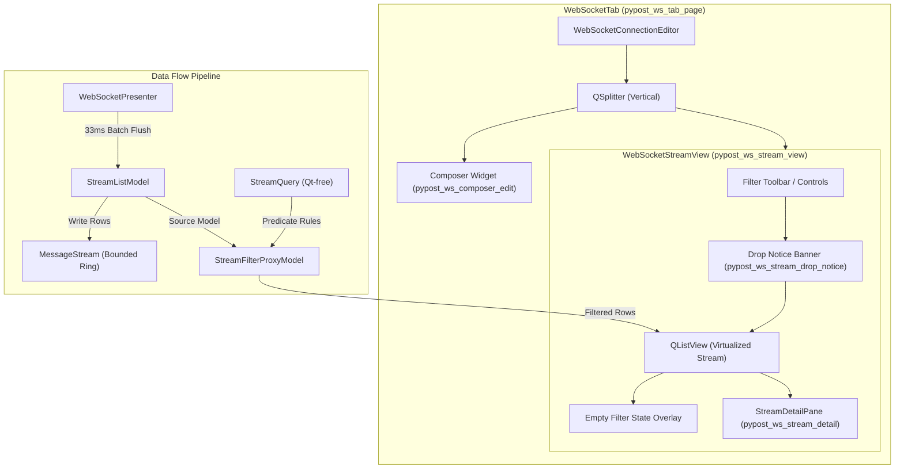
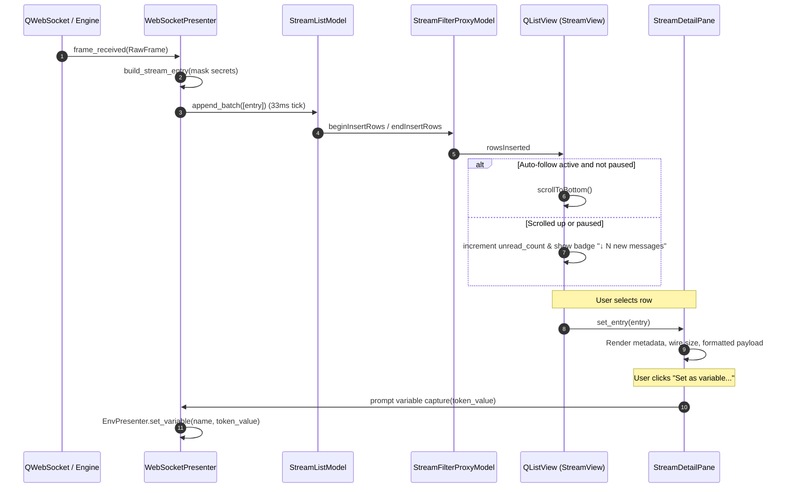

# PYPOST-1133: WS-5 Stream inspector — High-Level Architecture

This document is the Step 2 artifact for **PYPOST-1133 (WS-5 Stream inspector)**. It translates the approved requirements in [`10-requirements.md`](10-requirements.md) and the parent WebSocket epic specifications in [`ai-tasks/PYPOST-1124/20-architecture.md`](../PYPOST-1124/20-architecture.md) (sections A-5.4, A-5.6, A-5.7, A-6, and A-13.5) into a modular, high-performance, and testable architectural design.

---

## Research

### R-0 Verification Method

Claims and architectural choices in this document are categorized according to the verification methodology established across Epic PYPOST-1123:

| Kind | Verification Source |
| --- | --- |
| **Repo Fact** | Read directly from codebase files: `pypost/core/websocket_stream.py`, `pypost/core/websocket_stream_export.py`, `pypost/ui/widgets/websocket/stream_model.py`, `pypost/ui/widgets/websocket/websocket_tab.py`, `pypost/ui/presenters/websocket_presenter.py`, `pypost/ui/widget_ids.py`, `scripts/audit_baseline_metrics.py`. |
| **Runtime Fact** | Observed and executed in the pinned virtual environment (`.venv`, Python 3.13 / PySide6 6.11.1). |
| **Vendor Fact** | Sourced from official Qt 6 / PySide6 documentation (`QListView`, `QStyledItemDelegate`, `QSortFilterProxyModel`, `QScrollBar`). |

### R-1 Baseline Stream Infrastructure (WS-3 & WS-4 Precedents)

The codebase already contains foundational stream components delivered by stories WS-3 (PYPOST-1130) and WS-4 (PYPOST-1132):

1. **Qt-Free Core Stream Ring (`pypost/core/websocket_stream.py`)**:
   - `StreamEntry`: Immutable dataclass representing a single stream entry (`seq`, `ts_utc`, `kind`, `direction`, `payload_format`, `payload`, `byte_size`, `truncated`, `detail`).
   - `StreamQuery`: Qt-free predicate dataclass evaluating `matches(entry: StreamEntry) -> bool` against direction (`in`, `out`), kind (`message`, `lifecycle`), format, search text, and heartbeat noise suppression.
   - `MessageStream`: Dual-bounded FIFO ring buffer capping at `max_entries = 5,000` and `memory_budget_bytes = 64 MiB` with exact drop counter tracking per cause (`capacity` vs `memory_budget`).
   - `build_stream_entry()`: Pure factory applying secret masking against environment variables and hidden keys, truncating payloads larger than `truncate_bytes = 256 KiB`.

2. **Virtualized Model (`pypost/ui/widgets/websocket/stream_model.py`)**:
   - `StreamListModel(QAbstractListModel)`: Exposes `MessageStream` entries to Qt views via custom data roles (`SeqRole`, `TimestampRole`, `KindRole`, `DirectionRole`, `FormatRole`, `TruncatedRole`, `ByteSizeRole`, `DetailRole`, `StreamEntryRole`).
   - `append_batch(entries)`: Emits synchronized `beginRemoveRows`/`endRemoveRows` for FIFO evictions followed by `beginInsertRows`/`endInsertRows` for new entries.
   - `clear()`: Emits `beginResetModel`/`endResetModel` and resets the ring and drop counters.

3. **Transcript Export Writers (`pypost/core/websocket_stream_export.py`)**:
   - `format_json_transcript()` / `export_stream_to_json_file()`: Exports structured JSON array with schema version and drop metadata.
   - `format_text_transcript()` / `export_stream_to_text_file()`: Exports clean timestamped plain-text lines with header drop metadata.

4. **Session Coordinator (`pypost/ui/presenters/websocket_presenter.py`)**:
   - Runs a single-shot `QTimer` at **33 ms** to coalesce incoming frames into batch flushes on `StreamListModel`, ensuring high-frequency streams never starve the GUI thread.
   - Applies secret masking to each inbound and outbound frame at ingestion before pushing to `StreamListModel`.

### R-2 High-Capacity Virtualized List View vs Widget Allocation

- **Problem with Item Widgets**: Creating a `QWidget` per row (e.g. `QListWidget` with `setItemWidget` or custom composite widgets) for 5,000 items creates 5,000 QWidget allocations, hundreds of layout passes, and severe memory and GPU churn. Fast scrolling results in noticeable stuttering.
- **Solution via `QListView` and `QStyledItemDelegate`**:
   - `QListView` with `uniformItemSizes = True` calculates item geometry in $O(1)$ without querying every row.
   - `StreamItemDelegate(QStyledItemDelegate)` overrides `paint()` and `sizeHint()` to paint row contents (timestamp, glyph, wire size, snippet) directly onto the painter canvas.
   - Only the rows visible on screen ($\approx 20\text{--}40$ items) are painted during any frame. Memory consumption is flat $O(1)$ with respect to total retained stream size.

### R-3 Filtering and Text Search with `QSortFilterProxyModel`

- Qt's `QSortFilterProxyModel` acts as an intermediate layer between `StreamListModel` and `QListView`.
- Overriding `filterAcceptsRow(source_row, source_parent)` delegates row evaluation directly to `StreamQuery.matches(entry)`.
- When the user types in the search box or changes filter dropdowns, `StreamQuery` is updated and `invalidateFilter()` is called.
- `proxy_model.rowCount()` instantly provides the visible match count, while `source_model.rowCount()` provides the total retained entries.
- The difference `source_model.rowCount() - proxy_model.rowCount()` accurately gives the number of entries hidden by the active filter.

### R-4 Follow-Tail Mechanics and Honest Flow Control

- **Auto-Follow Detection**: When the vertical scrollbar of `QListView` is at `maximum()`, the view is in *tail-following mode*.
- **Scroll-Up Detachment**: When the user scrolls up (e.g. `value < maximum()`), auto-follow is automatically detached. New incoming entries arriving via 33 ms flushes increment an unread counter `_unread_count`.
- **Return-to-Tail Indicator**: A floating badge/button (`↓ N new messages`) appears over the stream. Clicking it scrolls to the bottom (`scrollToBottom()`), resets `_unread_count = 0`, and re-engages follow-tail.
- **Display Pause vs Network Intake**:
  - Clicking **Pause** explicitly sets `_is_paused = True` and detaches follow-tail.
  - The underlying WebSocket network session, socket reads, frame processing, and `MessageStream` buffering **continue running completely uninterrupted in the background**.
  - Clicking **Resume** clears `_is_paused`, scrolls immediately to the tail, and re-engages live tracking.
  - Tooltips and control labels explicitly inform the user: *"Pause display tracking (network intake continues in background)"*.

### R-5 Detail Inspection Pane, Formatting, and Hex Presentation

- Selecting any row in `QListView` extracts `StreamEntry` via `StreamEntryRole` and displays it in `StreamDetailPane`.
- Metadata bar displays: Direction (`<- Inbound`, `-> Outbound`, `(i) Lifecycle`), Format (`json`, `text`, `hex`, `base64`), Byte size (`96 B`, `1.4 KB`), Timestamp (`12:04:02.004`), and Lifecycle details.
- **Wrap Toggle**: Switches `QTextEdit.lineWrapMode` between `QTextEdit.LineWrapMode.WidgetWidth` and `QTextEdit.LineWrapMode.NoWrap`.
- **Hex View Toggle**:
  - `Formatted Text`: Displays decoded/masked payload.
  - `Hex Dump`: Displays standard 16-byte hex dump layout with offsets, hex byte values, and ASCII printable columns (e.g. `00000000: 7b 22 74 79 70 65 22 3a  20 22 64 65 6c 74 61 22  |{"type": "delta"|`).
- **Truncation Notice**: If `entry.truncated` is True, an alert banner notes: *"Display truncated to 256 KiB (wire size: 1.2 MiB)"*.

### R-6 Variable Capture Integration ("Set as variable...")

- Users can highlight a specific token (e.g. `"order_99824"`) or use the entire payload.
- Clicking **Set as variable…** opens a compact variable assignment prompt or dialog requesting the variable name (defaulting to clean suggested names or existing keys).
- On confirmation, the variable is saved into the active environment via `EnvPresenter` / environment manager, making it immediately available across all tabs and templates as `{{VARIABLE_NAME}}`.

### R-7 Strict Secret Masking Invariants

- Live stream entries in `StreamListModel` are pre-sanitized with `***` placeholders by `WebSocketPresenter` using active `env_vars` and `hidden_keys`.
- Copying from the detail pane (`[Copy]` button) copies the masked content to the clipboard.
- Exporting to JSON or Text transcripts uses the masked entries in `MessageStream` and embeds drop counts in the transcript headers.

### R-8 LOC and Audit Baseline Metrics

- `pypost/ui/widgets/websocket/websocket_tab.py` is currently 147 LOC.
- Creating a dedicated module `pypost/ui/widgets/websocket/stream_view.py` encapsulates all inspector UI components (delegate, proxy model, filter bar, drop notice, detail pane, stream view container), keeping `websocket_tab.py` lean and modular.
- Neither `websocket_tab.py` nor `stream_view.py` are capped in `scripts/audit_baseline_metrics.py`, but modular design ensures both stay under 350 LOC.

---

## Implementation Plan

### P-1 Delivery Components

```text
pypost/
  ui/
    widget_ids.py                             # Register WS_STREAM_* widget identities
    presenters/websocket_presenter.py         # Expose clear_stream, export, variable capture
    widgets/websocket/
      stream_view.py                          # NEW: StreamView, Delegate, ProxyModel, DetailPane
      websocket_tab.py                        # Embed WebSocketStreamView in middle splitter pane
tests/
  test_websocket_stream_view_repro.py         # Step 3 Failing Repro & Step 4 verification
  test_ui_identity_spotcheck.py               # Extend with WS_STREAM_* widget IDs
```

### P-2 Mandatory — Failing Repro Test (Step 3 Design)

- **File**: `tests/test_websocket_stream_view_repro.py`
- **Purpose**: Assert all WS-5 stream inspector capabilities *before* implementing `stream_view.py`:
  1. **Virtualized List & Delegate Rendering**: Renders entries with correct roles without per-row widget creation.
  2. **Direction & Kind Filtering**: Verifies filtering by `in`, `out`, `message`, `lifecycle`, and toggling routine heartbeat pings/pongs.
  3. **Full-Text Search & Match Accounting**: Verifies search query filtering and real-time match count reporting (`X matches, Y hidden`).
  4. **Empty Filter State & Reset**: Asserts that when a filter returns zero rows, the empty state banner is displayed with hidden count, and clicking `[Clear filter]` resets query controls and restores stream items.
  5. **Follow-Tail & Display Pause**: Asserts that scrolling up detaches tail-follow, Pause halts auto-scrolling while new entries append in background, unread badge increments, and Resume jumps to tail.
  6. **Stream Buffer Clear**: Asserts that `Clear` empties retained rows and resets drop counters while keeping the active connection alive.
  7. **Drop Notice Accounting**: Asserts drop notice appears only when drops > 0 and displays correct count and cause (`capacity` vs `memory_budget`).
  8. **Detail Pane Inspection**: Asserts row selection populates detail pane, toggles word-wrap, and switches between text and hex dump formats.
  9. **Masked Clipboard Copy & Variable Capture**: Asserts copy redacts secrets and "Set as variable…" captures value into environment.
  10. **Dual-Format Masked Transcript Export**: Asserts export writes JSON and Text files with drop headers and masked secrets.
  11. **UI Widget Identities**: Asserts all stable `WS_STREAM_*` objectNames exist and match spot-check requirements.

### P-3 Sequential Execution Steps (Iterations)

1. **Iteration 1: Widget IDs & Core Proxy Model**:
   - Declare all `WS_STREAM_*` constants in `pypost/ui/widget_ids.py` and register them in `KEY_WIDGET_IDS`.
   - Implement `StreamFilterProxyModel(QSortFilterProxyModel)` in `pypost/ui/widgets/websocket/stream_view.py` delegating to `StreamQuery`.
2. **Iteration 2: Custom Delegate & Virtualized Stream View**:
   - Implement `StreamItemDelegate(QStyledItemDelegate)` with formatted timestamp, direction glyph, size, truncation flag, and payload snippet rendering.
   - Implement `WebSocketStreamView(QWidget)` hosting filter toolbar, search box, match count, pause button, clear button, export button, drop notice banner, `QListView`, and empty filter overlay.
3. **Iteration 3: Follow-Tail, Pause, and Clear Mechanics**:
   - Wire scrollbar signals to detect tail detachment, maintain `_unread_count`, toggle floating unread badge, implement Pause/Resume display logic, and hook Clear button.
4. **Iteration 4: Detail Inspection Pane, Hex Mode & Variable Capture**:
   - Implement `StreamDetailPane(QWidget)` with metadata header, `[Copy]` button, `[Set as variable...]` button, `[Wrap]` toggle, `[Hex]` toggle, and read-only payload viewer.
   - Implement hex dump formatter and variable capture dialog integration.
5. **Iteration 5: Tab Integration, Export Wiring & Test Verification**:
   - Integrate `WebSocketStreamView` into `WebSocketTab`.
   - Connect export actions to `websocket_stream_export.py`.
   - Extend `tests/test_ui_identity_spotcheck.py` and verify all tests pass with zero regressions.

---

## Architecture

### A-0 Decision Register

- **D-1 (Virtualized Rendering)**: `QListView` with `QStyledItemDelegate` and `uniformItemSizes = True` is used for the stream view. No `QWidget` instances are allocated per row, ensuring smooth 60 FPS scrolling even with 5,000 entries.
- **D-2 (Pure Filter Predicate)**: `StreamFilterProxyModel` wraps `StreamListModel` and delegates filtering to the Qt-free `StreamQuery` predicate.
- **D-3 (Honest Display Pause)**: Pausing display stops the viewport from auto-scrolling to the tail. Network reads and background buffer ingestion continue unaffected.
- **D-4 (Transparent Drop Accounting)**: When `MessageStream` evicts entries due to capacity or memory limits, the drop notice banner dynamically surfaces the count and reason (`capacity` vs `memory_budget`).
- **D-5 (Multi-Format Inspection)**: The detail pane provides one-click toggles for word-wrapping and hexadecimal byte inspection.
- **D-6 (One-Click Variable Capture)**: "Set as variable…" captures highlighted or full payload text into the active workspace environment.
- **D-7 (Universal Secret Masking)**: Live view, clipboard copies, and transcript exports strictly apply secret masking against sensitive environment variables.

### A-1 Component Diagram & Layout Hierarchy



### A-2 UI Wireframes & Layout Structure

#### A-2.1 Active Stream with Filter Toolbar & Detail Pane

```text
+- Stream - pypost_ws_stream_view --------------------------------------------------------------------+
| [Search query...  ] Dir:[All v] Kind:[All v] [x] Heartbeats  [Pause] [Clear] [Export v]  1284/5000 |
| (!) 412 messages dropped (capacity)                                   [pypost_ws_stream_drop_notice] |
+-----------------------------------------------------------------------------------------------------+
| 12:04:01.220  (i)  handshake accepted · subprotocol json.v2                                         |
| 12:04:01.221   ->  {"op":"subscribe","channel":"orders","token":"***"}                         42 B |
| 12:04:01.402   <-  {"type":"ack","channel":"orders"}                                           38 B |
| 12:04:02.004   <-  {"type":"delta","seq":18841,"px":"70112.5","qty":"0.42"}                    96 B |
| 12:04:31.000  (i)  heartbeat ok (18 ms)                                                             |
| 12:05:02.771  (!)  connection lost - reconnecting 1/5 in 1 s                                        |
| 12:05:03.902  (i)  reconnected after 1.1 s                                                          |
+-----------------------------------------------------------------------------------------------------+
| [↓ 42 new messages]                                                     (floating follow-tail badge)|
+- Detail Pane - pypost_ws_stream_detail -------------------------------------------------------------+
| <- incoming · json · 96 B · 12:04:02.004                            [Truncated: 256KB/1.2MB] (opt)  |
| [Copy]  [Set as variable...]  [Wrap: ON]  [Hex: OFF]                                                |
| +-------------------------------------------------------------------------------------------------+ |
| | {                                                                                               | |
| |   "type": "delta",                                                                              | |
| |   "seq": 18841,                                                                                 | |
| |   "px": "70112.5",                                                                              | |
| |   "qty": "0.42"                                                                                 | |
| | }                                                                                               | |
| +-------------------------------------------------------------------------------------------------+ |
+-----------------------------------------------------------------------------------------------------+
```

#### A-2.2 Empty Filter State Overlay

```text
+-----------------------------------------------------------------------------------------------------+
| [Search: "nonexistent_id"] Dir:[All v] Kind:[All v] [Pause] [Clear] [Export v]   0 matches (1420 hid)|
+-----------------------------------------------------------------------------------------------------+
|                                                                                                     |
|                                     No messages match "nonexistent_id".                             |
|                                     1,420 hidden by the current filter.                             |
|                                                                                                     |
|                                               [ Clear filter ]                                      |
|                                                                                                     |
+-----------------------------------------------------------------------------------------------------+
```

### A-3 Class Specifications & Responsibilities

#### A-3.1 `StreamFilterProxyModel`

```python
class StreamFilterProxyModel(QSortFilterProxyModel):
    """Sort/filter proxy model wrapping StreamListModel with StreamQuery predicate."""

    def __init__(self, parent: Optional[QObject] = None) -> None:
        super().__init__(parent)
        self._query = StreamQuery()

    @property
    def query(self) -> StreamQuery:
        return self._query

    def set_direction_filter(self, direction: Optional[str]) -> None:
        self._query.direction = direction
        self.invalidateFilter()

    def set_kind_filter(self, kind: Optional[str]) -> None:
        self._query.kind = kind
        self.invalidateFilter()

    def set_search_text(self, text: str) -> None:
        self._query.search_text = text
        self.invalidateFilter()

    def set_show_heartbeats(self, show: bool) -> None:
        self._query.show_heartbeats = show
        self.invalidateFilter()

    def reset_filters(self) -> None:
        self._query = StreamQuery()
        self.invalidateFilter()

    def filterAcceptsRow(self, source_row: int, source_parent: QModelIndex) -> bool:
        model = self.sourceModel()
        if not isinstance(model, StreamListModel):
            return True
        entry = model.get_entry(source_row)
        return self._query.matches(entry)
```

#### A-3.2 `StreamItemDelegate`

```python
class StreamItemDelegate(QStyledItemDelegate):
    """High-performance canvas painter for virtualized stream entries."""

    def paint(self, painter: QPainter, option: QStyleOptionViewItem, index: QModelIndex) -> None:
        # Extracts SeqRole, TimestampRole, DirectionRole, KindRole, ByteSizeRole, DisplayRole
        # Paints:
        # [Timestamp (gray)] [Glyph: <- (blue) / -> (green) / (i) (purple)] [Payload snippet] [Size (gray right-aligned)]
        ...

    def sizeHint(self, option: QStyleOptionViewItem, index: QModelIndex) -> QSize:
        return QSize(option.rect.width(), 26)
```

#### A-3.3 `StreamDetailPane`

```python
class StreamDetailPane(QWidget):
    """Detailed single-entry inspector with formatting, hex dump, wrap, and variable capture."""

    variable_capture_requested = Signal(str, str)  # (suggested_name, value)

    def __init__(self, parent: Optional[QWidget] = None) -> None:
        super().__init__(parent)
        self._current_entry: Optional[StreamEntry] = None
        self._is_wrap: bool = True
        self._is_hex_mode: bool = False
        self._init_ui()

    def set_entry(self, entry: Optional[StreamEntry]) -> None:
        self._current_entry = entry
        self._render_entry()

    def _on_copy_clicked(self) -> None:
        # Copies payload text (or selected snippet) to system clipboard
        ...

    def _on_set_variable_clicked(self) -> None:
        # Extracts highlighted text or full payload, prompts for variable name, emits signal
        ...

    def _on_toggle_wrap(self) -> None:
        self._is_wrap = not self._is_wrap
        ...

    def _on_toggle_hex(self) -> None:
        self._is_hex_mode = not self._is_hex_mode
        ...
```

#### A-3.4 `WebSocketStreamView`

```python
class WebSocketStreamView(QWidget):
    """Main Stream Inspector container widget combining toolbar, list view, notices, and detail pane."""

    def __init__(
        self,
        stream_model: StreamListModel,
        presenter: WebSocketPresenter,
        parent: Optional[QWidget] = None,
    ) -> None:
        super().__init__(parent)
        self._stream_model = stream_model
        self.presenter = presenter
        self._proxy_model = StreamFilterProxyModel(self)
        self._proxy_model.setSourceModel(self._stream_model)
        self._is_paused: bool = False
        self._unread_count: int = 0
        self._init_ui()
```

### A-4 Detailed Interaction Workflows



### A-5 Automation Identities Specification

The following stable widget identities will be declared in `pypost/ui/widget_ids.py` and asserted in `tests/test_ui_identity_spotcheck.py`:

| Constant | `objectName` Identifier | Description |
| --- | --- | --- |
| `WS_STREAM_VIEW` | `pypost_ws_stream_view` | Main stream inspector container / list view |
| `WS_STREAM_SEARCH_INPUT` | `pypost_ws_stream_search_input` | Text search filter input |
| `WS_STREAM_DIRECTION_FILTER` | `pypost_ws_stream_direction_filter` | Direction filter dropdown (`All`, `Inbound`, `Outbound`) |
| `WS_STREAM_KIND_FILTER` | `pypost_ws_stream_kind_filter` | Entry kind filter dropdown (`All`, `Messages`, `Lifecycle`) |
| `WS_STREAM_PAUSE_BUTTON` | `pypost_ws_stream_pause_button` | Display pause / resume tracking toggle button |
| `WS_STREAM_CLEAR_BUTTON` | `pypost_ws_stream_clear_button` | Stream buffer clear button |
| `WS_STREAM_EXPORT_BUTTON` | `pypost_ws_stream_export_button` | Transcript export button / popup menu |
| `WS_STREAM_DROP_NOTICE` | `pypost_ws_stream_drop_notice` | Capacity and memory eviction notification banner |
| `WS_STREAM_DETAIL` | `pypost_ws_stream_detail` | Single-entry detail inspection container |
| `WS_STREAM_CLEAR_FILTER_BUTTON` | `pypost_ws_stream_clear_filter_button` | Reset filter button in empty filter state overlay |
| `WS_STREAM_MATCH_COUNT` | `pypost_ws_stream_match_count` | Search & filter match count indicator label |
| `WS_STREAM_DETAIL_COPY_BUTTON` | `pypost_ws_stream_detail_copy_button` | Copy masked payload button in detail pane |
| `WS_STREAM_DETAIL_SET_VAR_BUTTON` | `pypost_ws_stream_detail_set_var_button` | "Set as variable..." button in detail pane |
| `WS_STREAM_DETAIL_WRAP_BUTTON` | `pypost_ws_stream_detail_wrap_button` | Word wrap toggle button in detail pane |
| `WS_STREAM_DETAIL_HEX_BUTTON` | `pypost_ws_stream_detail_hex_button` | Hexadecimal view toggle button in detail pane |
| `WS_STREAM_FOLLOW_TAIL_BADGE` | `pypost_ws_stream_follow_tail_badge` | Floating unread / return-to-tail button badge |

---

## Q&A

| Question | Answer |
| --- | --- |
| **Why is virtualized rendering with `QStyledItemDelegate` strictly required?** | Allocating individual `QWidget` objects per row for 5,000 messages consumes hundreds of megabytes of memory and results in severe dropped frames and sluggish scrolling during rapid message bursts. `QListView` with `uniformItemSizes=True` and a canvas delegate paints only the 20–40 visible rows on screen, keeping CPU and memory overhead flat regardless of stream depth. |
| **How does "Pause Display" differ from "Pause Intake"?** | "Pause Display" stops the UI scrollbar from automatically snapping to the bottom as new rows arrive, allowing developers to read historical messages comfortably. Background socket intake and ring buffer retention continue running normally. "Pause Intake" would mean stopping network reads, which is not supported by RFC 6455 without risking TCP buffer overflow or socket termination. |
| **How does the lifecycle noise filter work?** | WebSocket servers frequently transmit heartbeat ping/pong frames every few seconds. In long-running sessions, thousands of routine heartbeats drown out application messages. The lifecycle filter hides routine heartbeat events by default while keeping critical lifecycle events (connect, disconnect, errors, subprotocol negotiation) clearly visible. |
| **What happens when a filter query matches zero messages?** | The view displays an empty filter overlay stating: *"No messages match 'query'. N hidden by current filter."* alongside a prominent `[Clear filter]` button that immediately resets the search query and filter dropdowns with a single click. |
| **How is secret redaction maintained when copying or capturing variables?** | All entries in `MessageStream` are sanitized upon ingestion using active environment variables and hidden keys. The `[Copy]` button copies this sanitized text. When the user selects a non-sensitive value for "Set as variable…", saving it as a hidden variable automatically redacts any future occurrences in subsequent stream entries and transcripts. |
| **How does export incorporate drop counts?** | Both JSON and Plain-Text exports include top-level metadata reporting `total_retained` along with `dropped: {"capacity": X, "memory_budget": Y}`. This ensures exported defect transcripts clearly report when and why historical messages were evicted. |
