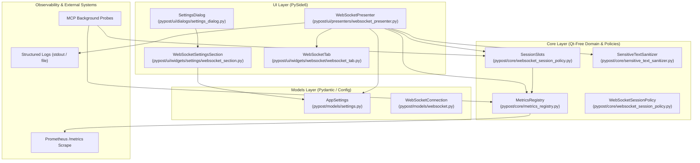

# PYPOST-1136: WS-10 Settings, session ceiling, metrics and logging

## Research

### R-0 Verification Method

This design was formulated and verified against the repository codebase, runtime execution in the pinned Python 3.13 environment (`PySide6==6.11.1`), and established architectural patterns:

| Kind | Verification Source |
| --- | --- |
| **Repo Fact** | Read from existing configuration models (`pypost/models/settings.py`), session policies (`pypost/core/websocket_session_policy.py`), metrics engine (`pypost/core/metrics_registry.py`, `pypost/core/qt/metrics.py`), presenters (`pypost/ui/presenters/websocket_presenter.py`), dialog sections (`pypost/ui/widgets/settings/`), and doc standards (`doc/prometheus_monitoring.md`, `doc/dev/logging.md`). |
| **Runtime Fact** | Executed in `.venv` (Python 3.13 / PySide6 6.11.1) to verify Prometheus instrument registrations, scrape output formats, `AppSettings` Pydantic v2 serialization/deserialization, and baseline checks (`scripts/audit_baseline_metrics.py --check`). |
| **Standards Fact** | Verified against Prometheus OpenMetrics exposition standards, RFC 6455 WebSocket state transitions, and Python `threading` memory visibility semantics. |

---

### R-1 Existing Settings & Configuration Architecture

1. **`AppSettings` Model (`pypost/models/settings.py`):**
   - Built on Pydantic v2 `BaseModel`.
   - Defaults are declared inline, ensuring backward compatibility with older `settings.json` configurations where new keys are missing.
   - Pydantic v2 `extra='ignore'` allows older builds to safely ignore new fields without raising serialization errors.
2. **Settings Dialog Section Architecture (`pypost/ui/widgets/settings/`):**
   - Refactored into modular section builders (`EditorSettingsSection`, `RequestSettingsSection`, `ServerBindSettingsSection`, `EncryptionConfigSection`, `RetryPolicySection`, `SecurityAlertSection`).
   - Adding a dedicated `WebSocketSettingsSection` in `pypost/ui/widgets/settings/websocket_section.py` preserves modularity, keeps `pypost/ui/dialogs/settings_dialog.py` concise, and cleanly isolates WebSocket UI controls.
3. **Immediate Runtime Reconfiguration:**
   - Saved settings update `AppSettings` dynamically. Presenters, session controllers, and background workers read bounds directly from `AppSettings` or pass them into per-session initialization, guaranteeing settings take effect for subsequent connection attempts without requiring an application restart.

---

### R-2 Concurrency Control & Session Slots (D-14)

1. **Process-Wide Concurrency Scope:**
   - WebSocket sessions run in interactive GUI tabs (on the main Qt thread) and as short-lived probes in background thread pools (e.g. MCP tools executing via `run_in_threadpool`).
   - A single process-wide coordinator must enforce `ws_max_concurrent_sessions` across both GUI and background contexts.
2. **Thread Safety & Atomic State:**
   - Synchronized using `threading.Lock` within `SessionSlots` (following the existing pattern in `pypost/core/mcp_activity_log.py`).
   - `acquire(session_id)` checks capacity and registers the session atomically under lock, preventing race conditions when multiple tabs or background tasks connect concurrently.
   - `release(session_id)` is idempotent: releasing an untracked session or double-releasing never decrements counters below zero or corrupts state.
3. **Lockdown & Refusal Semantics:**
   - `ws_max_concurrent_sessions = 0` acts as a lockdown mode, refusing all connection attempts with an explicit operator-policy explanation.
   - When the ceiling $N$ is reached, the $(N+1)$-th connect is rejected immediately without queueing or blocking, leaving the connection in `Idle` state with an enabled Connect button for user retries.

---

### R-3 Prometheus Metrics Registry & Scraping

1. **Metrics Engine (`pypost/core/metrics_registry.py`):**
   - Centralizes `prometheus_client` instruments (`Counter`, `Gauge`, `Histogram`) registered to an internal `CollectorRegistry`.
   - Scraped at `http://127.0.0.1:9080/metrics` and exposed via MCP `metrics://all` resource.
2. **Low-Cardinality Label Contract:**
   - High-cardinality fields (URLs, user IDs, tab IDs, message payloads, error details) are strictly prohibited from metric labels to prevent memory bloat and time-series explosion.
   - Labels are restricted to fixed, finite enums: `outcome`, `reason`, `direction`, `kind`.
3. **Qt Metrics Delegation (`pypost/core/qt/metrics.py`):**
   - `MetricsManager` delegates metric calls to `MetricsRegistry`.
   - To respect the strict LOC cap (185 lines in `scripts/audit_baseline_metrics.py`), `MetricsManager` leverages dynamic `__getattr__` delegation to `self._registry`, routing all new WebSocket tracking methods seamlessly without bloating the file.

---

### R-4 Zero-Leak Structured Logging & Security Isolation

1. **Key=Value Structured Convention (`doc/dev/logging.md`):**
   - Structured events follow `event_name key1=value1 key2=value2` formatting with `%` interpolation.
2. **Strict Redaction Invariants:**
   - **Never Logged:** Message payload bodies (text/binary/hex/base64), handshake HTTP header values, unmasked query parameter credentials, peer close reason text, ping/pong payloads.
   - **Sanitized Values:** Target URLs in logs must always pass through `sanitize_text(url, env_vars, hidden_keys)`.
   - **Audited Verification:** Verified via automated pytest suites using `caplog` with injected synthetic secret tokens.

---

### R-5 SOLID Baseline Metrics & File LOC Constraints

`scripts/audit_baseline_metrics.py` enforces regression line caps. The modules touched by this task are evaluated as follows:

| Module | Current LOC | Cap | Headroom | Impact & Mitigation |
| --- | ---: | ---: | ---: | --- |
| `pypost/core/qt/metrics.py` | 183 | 185 | 2 | Use `__getattr__` delegation to `_registry` to add 0 LOC overhead. |
| `pypost/models/settings.py` | 73 | None | N/A | Add `ws_*` fields directly; no cap constraint. |
| `pypost/core/websocket_session_policy.py` | 153 | None | N/A | Implement `SessionSlots` and `SlotAcquireResult`; no cap constraint. |
| `pypost/core/metrics_registry.py` | 417 | None | N/A | Register 9 WebSocket instruments and tracking methods; no cap constraint. |
| `pypost/ui/widgets/settings/websocket_section.py` | 0 | None | N/A | New modular section class (~120 LOC); no cap constraint. |
| `pypost/ui/dialogs/settings_dialog.py` | 193 | None | N/A | Add 8 lines to wire `WebSocketSettingsSection`; no cap constraint. |

---

## Implementation Plan

### Phases Overview

1. **Phase 1: Domain Settings & Configuration Models (`pypost/models/settings.py`)**
   - Declare all `ws_*` settings fields on `AppSettings` with default values and validation bounds.
   - Ensure seamless backward compatibility for loading and saving `settings.json`.
2. **Phase 2: Concurrency Manager (`SessionSlots` in `pypost/core/websocket_session_policy.py`)**
   - Implement `SessionSlots`, `SlotAcquireResult`, and global accessor `get_session_slots()`.
   - Thread-safe slot acquisition, idempotent release, lockdown mode (`max_slots=0`), and capacity querying.
3. **Phase 3: Prometheus Observability (`pypost/core/metrics_registry.py` & `pypost/core/qt/metrics.py`)**
   - Register the 9 WebSocket Prometheus metrics (counters, gauge, histogram).
   - Implement tracking methods with low-cardinality label normalization.
   - Add `__getattr__` delegation in `MetricsManager` to satisfy the strict line cap.
4. **Phase 4: Settings Dialog UI Integration (`pypost/ui/widgets/settings/websocket_section.py`)**
   - Build `WebSocketSettingsSection` containing controls for concurrency ceilings, stream capacities, memory limits, message size limits, truncation limits, heartbeat, reconnect, and probe parameters.
   - Wire section into `SettingsDialog` in `pypost/ui/dialogs/settings_dialog.py`.
5. **Phase 5: Session Presenter Integration & Zero-Leak Logging (`pypost/ui/presenters/websocket_presenter.py`)**
   - Wire `SessionSlots` acquisition on `handle_connect` and release on terminal transitions (`Idle`, `Closed`, `Failed`, `teardown`).
   - Implement connection refusal handling: preserve `Idle` badge, post inline notification & stream lifecycle entry, increment refusal metric, and log `websocket_session_refused`.
   - Emit structured log events across session lifecycle with masked URLs and zero payload leakage.
6. **Phase 6: Documentation & Audit Baseline Synchronization**
   - Update `doc/prometheus_monitoring.md` with complete WebSocket metrics reference.
   - Update `doc/dev/logging.md` with WebSocket event catalog and redaction invariants.
   - Validate quality gate with `scripts/audit_baseline_metrics.py --check` and full test execution.

---

### Mandatory — Failing Repro (next Step 3)

In Step 3, automated red tests will be written *before* implementation to establish failing baselines:

1. **`tests/test_websocket_settings.py` (Red Test Suite 1):**
   - **Target:** Asserts that `AppSettings` defines all `ws_*` fields with correct defaults (`ws_max_concurrent_sessions=8`, `ws_max_stream_entries=5000`, `ws_session_memory_budget_bytes=67108864`, `ws_max_incoming_message_bytes=8388608`, `ws_display_truncate_bytes=262144`, `ws_default_heartbeat`, `ws_default_reconnect`, `ws_mcp_probe_max_messages=10`, `ws_mcp_probe_max_duration_ms=10000`).
   - **Failure Mode:** Fails initially because `AppSettings` lacks the `ws_*` fields.
2. **`tests/test_websocket_session_slots.py` (Red Test Suite 2):**
   - **Target:** Pure Python unit tests for `SessionSlots`:
     - With ceiling $N$, $N$ acquires succeed; $(N+1)$-th acquire returns `allowed=False, reason="max_concurrent"`.
     - With ceiling $0$, acquire returns `allowed=False, reason="disabled"`.
     - Releasing an active session restores capacity and allows subsequent acquire.
     - Multi-threaded concurrent acquire/release test verifies mutex synchronization without deadlocks or count corruption.
     - Release on simulated failure/timeout paths ensures no slot leaks.
   - **Failure Mode:** Fails initially because `SessionSlots` is not yet defined in `pypost.core.websocket_session_policy`.
3. **`tests/test_websocket_metrics.py` (Red Test Suite 3):**
   - **Target:** Asserts that all 9 WebSocket metrics (`websocket_sessions_opened_total`, `websocket_sessions_closed_total`, `websocket_messages_total`, `websocket_message_bytes_total`, `websocket_stream_entries_dropped_total`, `websocket_reconnect_attempts_total`, `websocket_active_sessions`, `websocket_session_start_refused_total`, `websocket_probe_duration_seconds`) exist in `MetricsRegistry` and scrape correctly with expected label sets.
   - **Failure Mode:** Fails initially because metrics are not registered in `MetricsRegistry`.
4. **`tests/test_websocket_logging_security.py` (Red Test Suite 4):**
   - **Target:** Connects with secret query parameter (`?api_key=SECRET_TOKEN_XYZ`), secret header (`Authorization: Bearer SECRET_AUTH_ABC`), and payload (`SECRET_PAYLOAD_123`). Asserts with pytest `caplog` that none of the synthetic secret strings appear in logs at DEBUG, INFO, WARNING, or ERROR levels.
   - **Failure Mode:** Fails initially because structured logging events and masking checks are not fully wired.

---

## Architecture

### A-1 Decision Register

- **D-10.1 (Process-Wide Concurrency Coordinator):** `SessionSlots` is implemented as a pure Python class in `pypost/core/websocket_session_policy.py`, synchronized via `threading.Lock`. A process-wide default instance `get_session_slots()` is shared between GUI session tabs and MCP background workers.
- **D-10.2 (Immediate Runtime Settings Application):** WebSocket settings are stored in `AppSettings`. On connection initiation, `WebSocketPresenter` reads the latest settings from `AppSettings` and configures session limits without requiring an application restart.
- **D-10.3 (Non-Blocking Concurrency Refusal):** Reaching the session ceiling refuses connection initiation immediately: badge stays `Idle`, no socket is created, an inline warning and stream lifecycle entry state `N of N WebSocket sessions are already open — disconnect one to start another`, refusal metric is incremented, and Connect button stays enabled.
- **D-10.4 (Zero-Session Lockdown Mode):** Setting `ws_max_concurrent_sessions = 0` blocks all connection attempts with an explicit operator-policy notice: `WebSocket connections are disabled by operator policy (ws_max_concurrent_sessions=0)`.
- **D-10.5 (Fixed-Cardinality Metrics):** All WebSocket Prometheus metric labels are bounded to closed, low-cardinality enums (`outcome`, `reason`, `direction`, `kind`). URLs and payloads are strictly forbidden in metric labels.
- **D-10.6 (Zero-Leak Logging):** All WebSocket lifecycle events are logged using `snake_case key=value` syntax. Target URLs are sanitized with `sanitize_text()`. Header values, payload bodies, and raw peer close reasons are never logged at any level.
- **D-10.7 (Headless Unit Testability):** `SessionSlots` and `MetricsRegistry` are entirely Qt-free and execute in pure Python test environments without requiring a `QApplication`.
- **D-10.8 (LOC Cap Compliance):** `pypost/core/qt/metrics.py` uses dynamic `__getattr__` delegation to `MetricsRegistry` to avoid adding lines that would exceed the 185 LOC cap.

---

### A-2 System Module & Interaction Diagram



---

### A-3 Detailed Class & Interface Definitions

#### 1. Configuration Additions (`pypost/models/settings.py`)

```python
class AppSettings(BaseModel):
    # Existing settings fields...
    font_size: int = 12
    indent_size: int = 2
    theme: ThemeSetting = "system"
    request_timeout: int = 60
    # ...

    # WebSocket Global Bounds (WS-10)
    ws_max_stream_entries: int = 5_000
    ws_session_memory_budget_bytes: int = 67_108_864  # 64 MiB
    ws_max_incoming_message_bytes: int = 8_388_608    # 8 MiB
    ws_display_truncate_bytes: int = 262_144          # 256 KiB
    ws_default_heartbeat: HeartbeatPolicy = Field(default_factory=HeartbeatPolicy)
    ws_default_reconnect: ReconnectPolicy = Field(default_factory=ReconnectPolicy)
    ws_mcp_probe_max_messages: int = 10
    ws_mcp_probe_max_duration_ms: int = 10_000
    ws_max_concurrent_sessions: int = 8
```

---

#### 2. Concurrency Manager (`pypost/core/websocket_session_policy.py`)

```python
@dataclass(frozen=True)
class SlotAcquireResult:
    """Result of an atomic session slot acquisition attempt."""
    allowed: bool
    reason: Optional[str] = None  # "max_concurrent" | "disabled" | None
    active_count: int = 0
    limit: int = 8


class SessionSlots:
    """Thread-safe process-wide concurrency ceiling manager for WebSocket sessions."""

    def __init__(self, max_slots: int = 8) -> None:
        self._max_slots: int = max_slots
        self._active_sessions: set[str] = set()
        self._lock: threading.Lock = threading.Lock()

    @property
    def max_slots(self) -> int:
        with self._lock:
            return self._max_slots

    def set_max_slots(self, limit: int) -> None:
        with self._lock:
            self._max_slots = max(0, limit)

    @property
    def active_count(self) -> int:
        with self._lock:
            return len(self._active_sessions)

    def is_holding_slot(self, session_id: str) -> bool:
        with self._lock:
            return session_id in self._active_sessions

    def acquire(self, session_id: str) -> SlotAcquireResult:
        """Atomically attempt to acquire a session concurrency slot."""
        with self._lock:
            if self._max_slots == 0:
                return SlotAcquireResult(
                    allowed=False,
                    reason="disabled",
                    active_count=len(self._active_sessions),
                    limit=0,
                )
            if session_id in self._active_sessions:
                return SlotAcquireResult(
                    allowed=True,
                    reason=None,
                    active_count=len(self._active_sessions),
                    limit=self._max_slots,
                )
            if len(self._active_sessions) >= self._max_slots:
                return SlotAcquireResult(
                    allowed=False,
                    reason="max_concurrent",
                    active_count=len(self._active_sessions),
                    limit=self._max_slots,
                )
            self._active_sessions.add(session_id)
            return SlotAcquireResult(
                allowed=True,
                reason=None,
                active_count=len(self._active_sessions),
                limit=self._max_slots,
            )

    def release(self, session_id: str) -> bool:
        """Idempotently release a previously acquired session slot."""
        with self._lock:
            if session_id in self._active_sessions:
                self._active_sessions.remove(session_id)
                return True
            return False

    def reset(self) -> None:
        """Reset all active slots (primarily for testing)."""
        with self._lock:
            self._active_sessions.clear()


_GLOBAL_SESSION_SLOTS = SessionSlots()

def get_session_slots() -> SessionSlots:
    """Return the process-wide SessionSlots coordinator."""
    return _GLOBAL_SESSION_SLOTS
```

---

#### 3. Prometheus Metrics Registry (`pypost/core/metrics_registry.py`)

```python
class MetricsRegistry:
    # Existing metrics initialization...

    def _init_websocket_metrics(self) -> None:
        """Register WebSocket Prometheus counters, gauge, and histogram."""
        self.websocket_sessions_opened = Counter(
            "websocket_sessions_opened_total",
            "Number of WebSocket sessions opened",
            ["outcome"],  # success, failure, timeout, tls_rejected
            registry=self.registry,
        )
        self.websocket_sessions_closed = Counter(
            "websocket_sessions_closed_total",
            "Number of WebSocket sessions closed",
            ["reason"],   # clean, peer_close, heartbeat_timeout, transport_error, reconnect_exhausted, forced
            registry=self.registry,
        )
        self.websocket_messages = Counter(
            "websocket_messages_total",
            "Number of WebSocket messages transferred",
            ["direction", "kind"],  # direction: inbound, outbound; kind: text, binary, ping, pong
            registry=self.registry,
        )
        self.websocket_message_bytes = Counter(
            "websocket_message_bytes_total",
            "Total volume of WebSocket payload bytes transferred",
            ["direction"],  # inbound, outbound
            registry=self.registry,
        )
        self.websocket_stream_entries_dropped = Counter(
            "websocket_stream_entries_dropped_total",
            "Number of WebSocket stream entries dropped due to buffer bounds",
            ["reason"],   # capacity, memory_budget
            registry=self.registry,
        )
        self.websocket_reconnect_attempts = Counter(
            "websocket_reconnect_attempts_total",
            "Number of WebSocket automatic reconnect attempts",
            ["outcome"],  # scheduled, succeeded, exhausted
            registry=self.registry,
        )
        self.websocket_active_sessions = Gauge(
            "websocket_active_sessions",
            "Instantaneous number of active concurrent WebSocket sessions",
            registry=self.registry,
        )
        self.websocket_session_start_refused = Counter(
            "websocket_session_start_refused_total",
            "Number of WebSocket session start attempts refused by concurrency policy",
            ["reason"],   # max_concurrent, disabled
            registry=self.registry,
        )
        self.websocket_probe_duration_seconds = Histogram(
            "websocket_probe_duration_seconds",
            "Duration of MCP WebSocket probe executions in seconds",
            ["outcome"],  # success, timeout, limit_reached, error
            registry=self.registry,
        )

    # Tracking methods
    def track_websocket_session_opened(self, outcome: str) -> None:
        self.websocket_sessions_opened.labels(outcome=outcome).inc()

    def track_websocket_session_closed(self, reason: str) -> None:
        self.websocket_sessions_closed.labels(reason=reason).inc()

    def track_websocket_message(self, direction: str, kind: str) -> None:
        self.websocket_messages.labels(direction=direction, kind=kind).inc()

    def track_websocket_message_bytes(self, direction: str, byte_count: int) -> None:
        self.websocket_message_bytes.labels(direction=direction).inc(byte_count)

    def track_websocket_stream_entries_dropped(self, reason: str, count: int = 1) -> None:
        self.websocket_stream_entries_dropped.labels(reason=reason).inc(count)

    def track_websocket_reconnect_attempt(self, outcome: str) -> None:
        self.websocket_reconnect_attempts.labels(outcome=outcome).inc()

    def set_websocket_active_sessions(self, count: int) -> None:
        self.websocket_active_sessions.set(count)

    def track_websocket_session_start_refused(self, reason: str) -> None:
        self.websocket_session_start_refused.labels(reason=reason).inc()

    def track_websocket_probe_duration(self, outcome: str, duration_seconds: float) -> None:
        self.websocket_probe_duration_seconds.labels(outcome=outcome).observe(duration_seconds)
```

---

#### 4. Settings Section Widget (`pypost/ui/widgets/settings/websocket_section.py`)

```python
class WebSocketSettingsSection:
    """Settings dialog section for global WebSocket limits and defaults."""

    def __init__(self, current_settings: AppSettings, parent: QWidget) -> None:
        # SpinBoxes for concurrency, stream buffer capacity, memory budget, message size, display truncation
        # CheckBoxes and inputs for default Heartbeat and Reconnect policies
        # Inputs for MCP probe ceilings
        ...

    def add_to_form(self, form: QFormLayout) -> None:
        form.addRow(make_section_header("WebSocket Configuration"))
        # Add rows for bounds, heartbeats, reconnects, probes...

    def collect_fields(self) -> dict[str, Any]:
        return {
            "ws_max_concurrent_sessions": self.max_concurrent_spin.value(),
            "ws_max_stream_entries": self.max_stream_entries_spin.value(),
            "ws_session_memory_budget_bytes": self.memory_budget_spin.value() * 1024 * 1024,
            "ws_max_incoming_message_bytes": self.max_incoming_spin.value() * 1024 * 1024,
            "ws_display_truncate_bytes": self.display_truncate_spin.value() * 1024,
            "ws_default_heartbeat": self._build_heartbeat_policy(),
            "ws_default_reconnect": self._build_reconnect_policy(),
            "ws_mcp_probe_max_messages": self.probe_max_messages_spin.value(),
            "ws_mcp_probe_max_duration_ms": self.probe_max_duration_spin.value(),
        }
```

---

### A-4 Observability & Structured Logging Catalog

Structured events emitted using `%` format strings per `doc/dev/logging.md`:

| Event Name | Level | Format / Key-Value Schema | Redaction & Security Rule |
| --- | --- | --- | --- |
| `websocket_connect_initiated` | INFO | `session_id=%s profile_id=%s url_masked=%s subprotocols=%d` | URL sanitized via `sanitize_text`; header values omitted |
| `websocket_connected` | INFO | `session_id=%s subprotocol=%s handshake_ms=%d` | Low-cardinality subprotocol; timing in ms |
| `websocket_handshake_failed` | ERROR | `session_id=%s category=%s detail_len=%d` | Error category only; raw server body/headers excluded |
| `websocket_closed` | INFO | `session_id=%s close_code=%d peer_initiated=%s duration_s=%d` | RFC close code; raw close reason string omitted |
| `websocket_reconnect_scheduled` | INFO | `session_id=%s attempt=%d max_attempts=%d delay_ms=%d` | Calculated backoff timing |
| `websocket_reconnect_exhausted` | WARNING | `session_id=%s attempts=%d` | Failure count |
| `websocket_heartbeat_timeout` | WARNING | `session_id=%s timeout_s=%d` | Configured timeout interval |
| `websocket_stream_overflow` | WARNING | `session_id=%s dropped=%d reason=%s` | Eviction count and reason (`capacity`/`memory_budget`) |
| `websocket_session_refused` | WARNING | `profile_id=%s reason=%s active=%d limit=%d` | Refusal reason (`max_concurrent`/`disabled`) |
| `websocket_probe_completed` | INFO | `tool=%s outcome=%s messages=%d duration_ms=%d` | Tool identifier, count, duration |

---

## Q&A

| Question | Architectural Rationale & Tradeoffs |
| --- | --- |
| **Q1: Why is `SessionSlots` kept separate from `WebSocketSessionPolicy` instance methods?** | `WebSocketSessionPolicy` is a pure stateless rule engine for state transitions and backoff computations. `SessionSlots` maintains process-wide mutable state (active sessions count, mutex) shared across multiple tabs and background threads. Keeping them cleanly distinguished follows the Single Responsibility Principle while placing both in `websocket_session_policy.py` avoids module proliferation. |
| **Q2: Why use `__getattr__` delegation in `MetricsManager` (`pypost/core/qt/metrics.py`)?** | `pypost/core/qt/metrics.py` has a strict LOC cap of 185 lines (currently at 183 lines with only 2 lines of headroom). Implementing explicit boilerplate delegation methods for all 9 WebSocket metrics would add ~40 lines and trigger a SOLID audit failure. `__getattr__` transparently forwards all `track_websocket_*` calls to `self._registry` in 2 lines of code. |
| **Q3: How does `SessionSlots` handle abnormal crashes or aborted connections?** | When a connection aborts, fails TLS validation, or times out, the controller transitions to `Failed` or `Closed`, and `WebSocketPresenter.teardown()` executes. Both pathways call `SessionSlots.release(session_id)`. The idempotent release guarantees the slot is freed regardless of whether disconnect was clean or abnormal. |
| **Q4: Why are raw peer close reasons excluded from structured logs?** | Remote WebSocket peers can include arbitrary text in their close frames (e.g. error messages echoing user queries, tokens, or PII). Redacting close reasons to only log the RFC 6455 integer `close_code` ensures compliance with the zero-leak logging invariant. |
| **Q5: How do runtime settings updates reach active sessions?** | Active sessions retain their established handshake configuration (frozen connection parameters). When a new connection attempt occurs (e.g., reconnect or new tab), `WebSocketPresenter` reads the latest bounds from `AppSettings`, dynamically honoring updated concurrency ceilings, buffer sizes, and memory budgets. |
