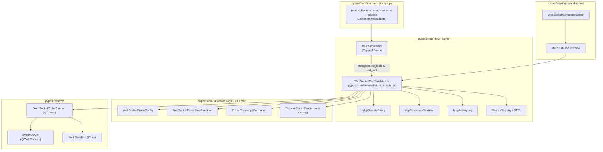
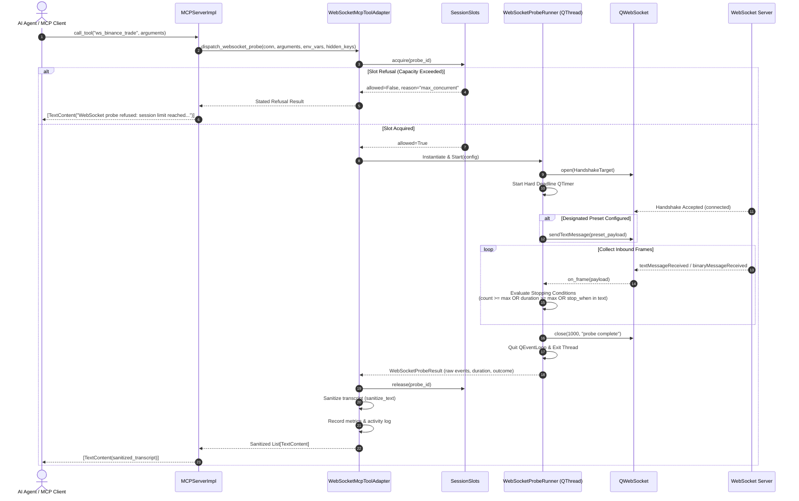

# PYPOST-1137: WS-9 Bounded MCP WebSocket probe tool — Architecture Design

This document is the Step 2 artifact of PYPOST-1137. It specifies the architecture, component boundaries, execution model, thread lifecycle guarantees, security isolation, and implementation plan for the **Bounded MCP WebSocket Probe Tool**.

---

## Research

### R-1 Baseline Verification & Existing Precedents

| Area | Current PyPost Implementation / Precedent | Architectural Implication for WS-9 |
| --- | --- | --- |
| **Real-time Probe Precedent** | Server-Sent Events (SSE) bounded probe in `pypost/core/http_client.py:28-30` (`SSE_PROBE_MAX_EVENTS = 5`, `SSE_PROBE_TIMEOUT = 10.0`). | WebSockets must follow the same bounded sampling paradigm (D-5), turning an unbounded stream into a single-turn, deterministic request/response tool call. |
| **MCP Server Runtime** | `MCPServerImpl` in `pypost/core/mcp_server_impl.py` runs on uvicorn's asyncio loop inside `threading.Thread`. Tool execution uses `run_in_threadpool` with `DEFAULT_MAX_CONCURRENT_MCP_CALLS = 4`. | Synchronous or blocking operations in `call_tool` run off the asyncio loop in worker threads. WebSocket probe execution cannot use the main GUI thread; it needs a dedicated short-lived Qt event loop. |
| **Module LOC Caps** | `scripts/audit_baseline_metrics.py` enforces a cap of **325 lines** on `pypost/core/mcp_server_impl.py`. Current LOC is **313** (headroom: 12 lines). | All WebSocket MCP tool schema generation, parameter extraction, and execution dispatch **must** live in a new module `pypost/core/websocket_mcp_tools.py`. `MCPServerImpl` gains only a thin delegating seam. |
| **MCP Secret Isolation** | `McpSecretsPolicy` in `pypost/core/mcp_secrets_policy.py` strips environment variables and hidden keys from `list_tools`, exposing only `mcp.request.*` placeholders. | WebSocket schemas in `list_tools` must expose only `mcp.request.*` parameters and the optional probe control argument `stop_when`. All secrets are injected only at execution time. |
| **Transcript Masking** | `McpResponseSanitizer` in `pypost/core/mcp_response_sanitizer.py` and `sanitize_text` in `pypost/core/sensitive_text_sanitizer.py`. | Returned probe transcripts must be sanitized with `sanitize_text(transcript, env_vars=env_vars, hidden_keys=hidden_keys)` before being wrapped in `TextContent`. |
| **Concurrency Ceiling** | `SessionSlots` in `pypost/core/websocket_session_policy.py` manages the process-wide ceiling `ws_max_concurrent_sessions`. | Probes must acquire a slot via `SessionSlots.acquire(probe_id)` before connecting and release it on all exit paths. When full, `call_tool` returns a stated refusal without opening a socket. |
| **Headless Daemon** | `pypost-daemon` runs a headless `QCoreApplication` loop without X11/Wayland display servers. | `QtWebSockets` depends only on `QtCore` and `QtNetwork`. The probe runner executes without GUI dependencies. `daemon_storage.py` snapshot loaders must load `Collection.websockets`. |
| **Persisted Model** | `WebSocketConnection` in `pypost/models/websocket.py` already includes all MCP fields (`expose_as_mcp`, `mcp_description`, `mcp_params`, `mcp_probe_preset_id`, `mcp_probe_max_messages`, `mcp_probe_max_duration_ms`) defined in WS-2. | `pypost/models/websocket.py` remains strictly unchanged in WS-9 (FR-7.1 / A-13.9). |

### R-2 Threading & Event Loop Model

MCP tool calls arrive on Starlette/FastAPI endpoints managed by uvicorn's asyncio event loop. Calling `QWebSocket` methods requires an active Qt event loop (`QEventLoop`) on the thread that created the socket.

```text
[ uvicorn asyncio loop (threading.Thread) ]
                   |
                   v  run_in_threadpool
[ ThreadPool Worker Thread ]
                   |
                   v  instantiates & runs
[ WebSocketProbeRunner (QThread) ]
       +-----------------------------------------+
       | - Own QEventLoop (exec_())               |
       | - Creates QWebSocket                    |
       | - Hard Deadline QTimer                  |
       | - Collects frames & evaluates stop cond |
       | - Closes socket (code 1000) & exits loop|
       +-----------------------------------------+
                   |
                   v  runner.wait() (bounded join)
[ ThreadPool Worker Thread ]
                   |
                   v  returns sanitized List[TextContent]
[ uvicorn asyncio loop ]
```

**Key Safety Invariant:** `WebSocketProbeRunner` executes with a hard deadline timer (`max_duration_ms + grace_period_ms`). Even if a remote WebSocket server stalls, ignores the TCP connection, or fails to complete the WebSocket close handshake, the runner thread forcibly aborts the socket, exits the event loop, and rejoins the caller. The worker thread never hangs indefinitely and never outlives the `call_tool` invocation.

### R-3 Stopping Conditions & Effective Limits

The probe terminates immediately upon the earliest occurrence of:
1. **Message limit reached:** Received messages count $\ge \text{effective\_max\_messages}$.
2. **Duration limit reached:** Elapsed wall-clock time $\ge \text{effective\_max\_duration\_ms}$.
3. **Substring match (`stop_when`):** An incoming text message contains the `stop_when` substring.
4. **Connection closed / error:** Server disconnects, TCP error, TLS error, or handshake refusal.

**Ceiling Enforcement Formula:**
$$\text{effective\_max\_messages} = \min(\text{profile.mcp\_probe\_max\_messages} \text{ or } \text{settings.ws\_mcp\_probe\_max\_messages}, \text{settings.ws\_mcp\_probe\_max\_messages})$$
$$\text{effective\_max\_duration\_ms} = \min(\text{profile.mcp\_probe\_max\_duration\_ms} \text{ or } \text{settings.ws\_mcp\_probe\_max\_duration\_ms}, \text{settings.ws\_mcp\_probe\_max\_duration\_ms})$$

A per-profile override can lower the message/duration limits, but cannot exceed the global operator ceiling configured in `AppSettings`.

---

## Implementation Plan

### Phases of Work

1. **Domain Logic (`pypost/core/websocket_probe.py`):**
   - Implement Qt-free probe configuration dataclasses: `WebSocketProbeConfig`, `ProbeEvent`, `WebSocketProbeResult`, `ProbeOutcome`.
   - Implement `calculate_effective_probe_limits(profile, settings)` for hard ceiling enforcement.
   - Implement `WebSocketProbeStopCondition` evaluator for message count, duration, and `stop_when` substring matches.
   - Implement structured transcript formatter `format_probe_transcript(result, env_vars, hidden_keys)`.

2. **Runner Thread Execution (`pypost/core/qt/websocket_probe_runner.py`):**
   - Implement `WebSocketProbeRunner(QThread)` encapsulating dedicated `QEventLoop`, `QWebSocket`, preset transmission, and hard deadline `QTimer`.
   - Implement safe slot acquisition and guaranteed release via `SessionSlots`.
   - Implement guaranteed thread cleanup: `runner.start()`, `runner.wait(timeout)` with fallback `runner.terminate()`/`abort()` asserting clean thread exit.

3. **MCP Tool Adapter & Registration (`pypost/core/websocket_mcp_tools.py`):**
   - Implement schema generator `build_websocket_mcp_tool_schema(conn, template_service, hidden_keys)`:
     - Extracts placeholders `mcp.request.*` from URL, headers, params, and designated probe preset payload.
     - Adds optional `stop_when` string parameter.
     - Strips hidden keys and env-only variables.
   - Implement contract preview helper `build_websocket_mcp_tool_contract_preview(conn, hidden_keys, template_service)`.
   - Implement execution dispatcher `execute_websocket_probe(...)` connecting MCP calls to `WebSocketProbeRunner`.

4. **MCPServer Seam Integration (`pypost/core/mcp_server_impl.py`):**
   - Update `register_tools` to accept WebSocket connections alongside HTTP requests by delegating to `websocket_mcp_tools.py`.
   - Update `call_tool` to dispatch WebSocket probe tools, sanitize transcripts, record activity logs, and track Prometheus metrics.
   - Ensure `mcp_server_impl.py` remains under the 325 LOC cap (`scripts/audit_baseline_metrics.py --check`).

5. **Daemon Snapshot Storage (`pypost/core/daemon_storage.py`):**
   - Extend `load_collections_snapshot_strict` validation tests and ensure `Collection.websockets` profiles are correctly supplied to daemon `MCPServerRegistry`.

6. **UI MCP Preview Sub-Tab (`pypost/ui/widgets/websocket/connection_editor.py`):**
   - Add MCP sub-tab in `WebSocketConnectionEditor` detail tabs displaying:
     - "Expose as MCP Tool" checkbox (`expose_as_mcp`).
     - Tool description text area (`mcp_description`).
     - Parameters table (`mcp_params`).
     - Probe preset selector (`mcp_probe_preset_id`).
     - Max messages & max duration override fields (`mcp_probe_max_messages`, `mcp_probe_max_duration_ms`).
     - Agent contract preview text box (`format_mcp_tool_contract_preview`).
     - Real-time preview synchronization on input changes.

7. **Observability & Observance Tests:**
   - Verify `websocket_probe_duration_seconds{outcome}` metrics emission.
   - Verify `McpActivityLog` entries for WebSocket probe invocations.

---

### Mandatory — Failing Repro (next Step 3)

**Automated Red Test Suite:** `tests/test_websocket_mcp_probe_repro.py`

**What it asserts:**
1. **Schema & Isolation in `list_tools`:**
   - Exposed WebSocket profiles produce a tool named `ws_<normalized_name>`.
   - Input schema contains only `mcp.request.*` variables and optional `stop_when`.
   - Hidden variables and environment-only variables are strictly excluded from schemas.
2. **Deterministic Bounded Execution in `call_tool`:**
   - Connects to local `ScriptedWebSocketServer`, sends designated preset payload upon connect, and collects responses.
   - Terminates when message count reaches limit and returns formatted transcript.
   - Terminates when duration reaches timeout.
   - Terminates immediately when an incoming message matches the `stop_when` substring.
   - Cleanly closes with WebSocket close code 1000 ("probe complete").
3. **Hard Global Ceiling:**
   - A profile configuring `mcp_probe_max_messages=100` is clamped to global `ws_mcp_probe_max_messages=10`.
4. **Sanitization:**
   - Tokens in URL or message payloads matching environment secrets or hidden keys are masked with `***` in the returned transcript.
5. **Thread Lifetime Guarantee:**
   - After `call_tool` returns (under success, network error, or timeout), `runner.isFinished()` is `True` and `runner.isRunning()` is `False`.
6. **Concurrency Ceiling Refusal:**
   - When `SessionSlots` active count equals `ws_max_concurrent_sessions`, `call_tool` returns a stated refusal message without opening a socket.
7. **Headless Execution:**
   - Runs cleanly on `QCoreApplication` under `QT_QPA_PLATFORM=offscreen`.

**Why it fails initially:**
The modules `pypost/core/websocket_probe.py`, `pypost/core/qt/websocket_probe_runner.py`, and `pypost/core/websocket_mcp_tools.py` do not exist, and `MCPServerImpl` does not register or dispatch WebSocket tools.

**Sequencing:**
1. Step 2 (this step): Complete and document architecture design.
2. Step 3: Write `tests/test_websocket_mcp_probe_repro.py` (asserts failing red state).
3. Step 4: Implement domain logic, runner, tool adapter, daemon storage extension, UI preview sub-tab, and make all tests green.

---

## Architecture

### System Module Diagram



### Module Responsibilities

| Module | Location | Layer / Tech | Responsibilities |
| --- | --- | --- | --- |
| `websocket_probe.py` | `pypost/core/` | Domain / Qt-Free | Dataclasses (`WebSocketProbeConfig`, `WebSocketProbeResult`), stopping condition evaluation, effective limit calculations, structured transcript formatting. |
| `websocket_probe_runner.py` | `pypost/core/qt/` | Qt / QThread | Short-lived `QThread` with dedicated event loop, socket connection, preset sending, message collection, hard-deadline timer, `SessionSlots` reservation, and guaranteed thread termination. |
| `websocket_mcp_tools.py` | `pypost/core/` | MCP Core / Qt-Free | Tool discovery, schema generation with secret isolation, parameter resolution, execution dispatch bridge, contract preview formatting. |
| `mcp_server_impl.py` | `pypost/core/` | MCP Server (Capped) | Seam delegating WebSocket tool listing and dispatch to `websocket_mcp_tools.py`, maintaining LOC within the 325 cap. |
| `daemon_storage.py` | `pypost/core/` | Storage / Headless | Loading strict collection snapshots including `Collection.websockets` for daemon execution. |
| `connection_editor.py` | `pypost/ui/widgets/websocket/` | UI / PySide6 | MCP configuration sub-tab with live tool contract preview and settings synchronization. |

---

### Sequence Diagram: `call_tool` Execution Flow



---

### Interface & API Definitions

#### 1. Probe Domain Models (`pypost/core/websocket_probe.py`)

```python
"""Qt-free probe configuration, stopping conditions, and transcript formatter."""
from __future__ import annotations

from dataclasses import dataclass, field
from enum import Enum
import time
from typing import Any, Dict, List, Mapping, Optional, Set

from pypost.core.mcp_response_sanitizer import McpResponseSanitizer
from pypost.core.websocket_transport_protocol import HandshakeTarget
from pypost.models.settings import AppSettings
from pypost.models.websocket import WebSocketConnection


class ProbeOutcome(str, Enum):
    SUCCESS = "success"
    LIMIT_REACHED = "limit_reached"
    STOP_WHEN_MATCHED = "stop_when_matched"
    TIMEOUT = "timeout"
    ERROR = "error"
    REFUSED = "refused"


@dataclass(frozen=True)
class ProbeEvent:
    timestamp_iso: str
    direction: str  # "connect" | "sent" | "received" | "closed" | "error"
    payload: str
    is_binary: bool = False
    byte_size: int = 0


@dataclass(frozen=True)
class WebSocketProbeConfig:
    target: HandshakeTarget
    initial_payload: Optional[str] = None
    initial_format: str = "json"
    max_messages: int = 10
    max_duration_ms: int = 10000
    stop_when: Optional[str] = None
    probe_id: str = ""


@dataclass
class WebSocketProbeResult:
    outcome: ProbeOutcome
    messages_received: int
    duration_ms: float
    events: List[ProbeEvent] = field(default_factory=list)
    close_code: Optional[int] = None
    close_reason: Optional[str] = None
    error_message: Optional[str] = None


def calculate_effective_probe_limits(
    conn: WebSocketConnection,
    settings: Optional[AppSettings] = None,
) -> tuple[int, int]:
    """Calculate message and duration bounds clamped by global ceilings."""
    global_max_msgs = settings.ws_mcp_probe_max_messages if settings else 10
    global_max_dur = settings.ws_mcp_probe_max_duration_ms if settings else 10000

    profile_msgs = conn.mcp_probe_max_messages or global_max_msgs
    profile_dur = conn.mcp_probe_max_duration_ms or global_max_dur

    effective_msgs = max(1, min(profile_msgs, global_max_msgs))
    effective_dur = max(100, min(profile_dur, global_max_dur))
    return effective_msgs, effective_dur


class WebSocketProbeStopCondition:
    """Evaluates whether message intake should stop."""

    def __init__(self, max_messages: int, stop_when: Optional[str] = None) -> None:
        self.max_messages = max_messages
        self.stop_when = stop_when
        self.messages_count = 0

    def should_stop(self, message: str) -> tuple[bool, Optional[ProbeOutcome]]:
        self.messages_count += 1
        if self.stop_when and self.stop_when in message:
            return True, ProbeOutcome.STOP_WHEN_MATCHED
        if self.messages_count >= self.max_messages:
            return True, ProbeOutcome.LIMIT_REACHED
        return False, None


def format_probe_transcript(
    result: WebSocketProbeResult,
    *,
    env_vars: Mapping[str, str],
    hidden_keys: Set[str],
) -> str:
    """Format probe result into a structured, sanitized human/agent readable transcript."""
    lines: list[str] = [
        f"=== WebSocket Probe Transcript ===",
        f"Outcome: {result.outcome.value}",
        f"Duration: {result.duration_ms:.1f}ms",
        f"Messages Received: {result.messages_received}",
    ]
    if result.close_code is not None:
        lines.append(f"Close Code: {result.close_code} ({result.close_reason or 'No reason'})")
    if result.error_message:
        lines.append(f"Error: {result.error_message}")
    lines.append("--- Event Log ---")
    for event in result.events:
        lines.append(f"[{event.timestamp_iso}] [{event.direction.upper()}] {event.payload}")
    raw_transcript = "\n".join(lines)
    return McpResponseSanitizer.sanitize_text(
        raw_transcript,
        env_vars=env_vars,
        hidden_keys=hidden_keys,
    )
```

---

#### 2. Probe Runner Thread (`pypost/core/qt/websocket_probe_runner.py`)

```python
"""Dedicated short-lived QThread runner for bounded MCP WebSocket probes."""
from __future__ import annotations

from datetime import datetime, timezone
import logging
import time
import uuid

from PySide6.QtCore import QEventLoop, QObject, QThread, QTimer, QUrl, Signal
from PySide6.QtNetwork import QNetworkRequest
from PySide6.QtWebSockets import QWebSocket, QWebSocketHandshakeOptions, QWebSocketProtocol

from pypost.core.websocket_probe import (
    ProbeEvent,
    ProbeOutcome,
    WebSocketProbeConfig,
    WebSocketProbeResult,
    WebSocketProbeStopCondition,
)
from pypost.core.websocket_session_policy import get_session_slots

logger = logging.getLogger(__name__)


class WebSocketProbeRunner(QThread):
    """Executes a bounded WebSocket probe on a short-lived thread with dedicated event loop."""

    finished_result = Signal(object)  # Emits WebSocketProbeResult

    def __init__(
        self,
        config: WebSocketProbeConfig,
        parent: QObject | None = None,
    ) -> None:
        super().__init__(parent)
        self.config = config
        self.result: WebSocketProbeResult | None = None
        self._session_id = config.probe_id or str(uuid.uuid4())

    def run(self) -> None:
        slots = get_session_slots()
        slot_res = slots.acquire(self._session_id)
        if not slot_res.allowed:
            self.result = WebSocketProbeResult(
                outcome=ProbeOutcome.REFUSED,
                messages_received=0,
                duration_ms=0.0,
                error_message=f"WebSocket probe refused: session limit reached ({slot_res.active_count}/{slot_res.limit}).",
            )
            return

        events: list[ProbeEvent] = []
        started_perf = time.perf_counter()
        received_count = 0
        stop_evaluator = WebSocketProbeStopCondition(
            max_messages=self.config.max_messages,
            stop_when=self.config.stop_when,
        )

        loop = QEventLoop()
        socket = QWebSocket()
        deadline_timer = QTimer()
        deadline_timer.setSingleShot(True)

        outcome = ProbeOutcome.SUCCESS
        close_code: int | None = None
        close_reason: str | None = None
        error_msg: str | None = None

        def _log_event(direction: str, payload: str, is_binary: bool = False, size: int = 0):
            ts = datetime.now(timezone.utc).isoformat()
            events.append(ProbeEvent(ts, direction, payload, is_binary, size))

        def _on_connected():
            _log_event("connect", f"Connected to {self.config.target.url}")
            if self.config.initial_payload:
                socket.sendTextMessage(self.config.initial_payload)
                _log_event("sent", self.config.initial_payload)

        def _on_text_received(message: str):
            nonlocal received_count, outcome
            received_count += 1
            _log_event("received", message, size=len(message.encode("utf-8")))
            should_stop, stop_outcome = stop_evaluator.should_stop(message)
            if should_stop:
                outcome = stop_outcome or ProbeOutcome.LIMIT_REACHED
                socket.close(QWebSocketProtocol.CloseCode.CloseCodeNormal, "probe complete")

        def _on_disconnected():
            nonlocal close_code, close_reason
            close_code = int(socket.closeCode())
            close_reason = socket.closeReason()
            _log_event("closed", f"Code: {close_code}, Reason: {close_reason}")
            if loop.isRunning():
                loop.quit()

        def _on_error(err):
            nonlocal outcome, error_msg
            outcome = ProbeOutcome.ERROR
            error_msg = socket.errorString()
            _log_event("error", f"Socket error: {error_msg}")
            if loop.isRunning():
                loop.quit()

        def _on_deadline():
            nonlocal outcome
            outcome = ProbeOutcome.TIMEOUT
            _log_event("timeout", f"Probe reached hard deadline of {self.config.max_duration_ms}ms")
            socket.abort()
            if loop.isRunning():
                loop.quit()

        socket.connected.connect(_on_connected)
        socket.textMessageReceived.connect(_on_text_received)
        socket.disconnected.connect(_on_disconnected)
        socket.errorOccurred.connect(_on_error)
        deadline_timer.timeout.connect(_on_deadline)

        try:
            req = QNetworkRequest(QUrl(self.config.target.url))
            for k, v in self.config.target.headers.items():
                req.setRawHeader(k.encode("utf-8"), v.encode("utf-8"))
            opts = QWebSocketHandshakeOptions()
            if self.config.target.subprotocols:
                opts.setSubprotocols(list(self.config.target.subprotocols))

            deadline_timer.start(self.config.max_duration_ms + 1000)
            socket.open(req, opts)
            loop.exec()
        finally:
            deadline_timer.stop()
            socket.abort()
            slots.release(self._session_id)
            duration_ms = (time.perf_counter() - started_perf) * 1000.0
            self.result = WebSocketProbeResult(
                outcome=outcome,
                messages_received=received_count,
                duration_ms=duration_ms,
                events=events,
                close_code=close_code,
                close_reason=close_reason,
                error_message=error_msg,
            )
```

---

#### 3. MCP Tool Adapter (`pypost/core/websocket_mcp_tools.py`)

```python
"""Tool schema generation, registration, and dispatch for WebSocket MCP tools."""
from __future__ import annotations

import logging
import re
from typing import Any, Dict, Iterable, List, Optional, Set

from mcp.types import TextContent, Tool

from pypost.core.mcp_activity_log import McpActivityEntry, McpActivityLog
from pypost.core.mcp_secrets_policy import McpSecretsPolicy
from pypost.core.mcp_tool_contract import (
    McpPolicyExclusion,
    McpToolContractPreview,
    build_tool_input_schema,
    normalize_mcp_tool_name,
    resolve_mcp_param_specs,
)
from pypost.core.metrics_protocol import MetricsTrackerProtocol
from pypost.core.qt.websocket_probe_runner import WebSocketProbeRunner
from pypost.core.sensitive_data_masking_policy import build_masking_regexes
from pypost.core.template_service import TemplateService
from pypost.core.websocket_probe import (
    WebSocketProbeConfig,
    calculate_effective_probe_limits,
    format_probe_transcript,
)
from pypost.core.websocket_transport_protocol import HandshakeTarget
from pypost.models.models import McpToolParam
from pypost.models.settings import AppSettings
from pypost.models.websocket import WebSocketConnection

logger = logging.getLogger(__name__)

_MCP_REQUEST_VAR_PATTERN = re.compile(r"mcp\.request\.([a-zA-Z0-9_]+)")


def extract_websocket_mcp_variables(conn: WebSocketConnection) -> Set[str]:
    """Extract placeholders matching mcp.request.* across URL, headers, params, and probe preset."""
    found: set[str] = set()
    fields = [conn.url] + list(conn.headers.values()) + list(conn.params.values())
    if conn.mcp_probe_preset_id:
        for p in conn.presets:
            if p.id == conn.mcp_probe_preset_id:
                fields.append(p.payload)
                break
    for field in fields:
        if field:
            found.update(_MCP_REQUEST_VAR_PATTERN.findall(field))
    return found


def build_websocket_mcp_tool_schema(
    conn: WebSocketConnection,
    template_service: TemplateService | None,
    hidden_keys: Iterable[str],
) -> dict:
    """Build JSON Schema for WebSocket probe tool arguments."""
    discovered = extract_websocket_mcp_variables(conn)
    specs: dict[str, McpToolParam] = {}
    for name in discovered:
        specs[name] = conn.mcp_params.get(name, McpToolParam())
    for name, spec in conn.mcp_params.items():
        if name not in specs:
            specs[name] = spec

    # Filter agent parameter specs
    hidden = set(hidden_keys)
    filtered = {name: spec for name, spec in specs.items() if name not in hidden}

    # Add stop_when optional parameter
    if "stop_when" not in filtered:
        filtered["stop_when"] = McpToolParam(
            type="string",
            description="Stop probe early when an incoming message body contains this substring",
            required=False,
        )
    return build_tool_input_schema(filtered)


def build_websocket_mcp_preview(
    conn: WebSocketConnection,
    hidden_keys: Iterable[str] | None = None,
    template_service: TemplateService | None = None,
) -> McpToolContractPreview | None:
    if not conn.expose_as_mcp:
        return None
    hidden = set(hidden_keys or ())
    schema = build_websocket_mcp_tool_schema(conn, template_service, hidden)
    tool_name = f"ws_{normalize_mcp_tool_name(conn.name)}"
    description = conn.mcp_description or f"Sample real-time stream from {conn.name}"
    return McpToolContractPreview(
        tool_name=tool_name,
        description=description,
        input_schema=schema,
        exclusions=(),
    )


def execute_websocket_probe(
    conn: WebSocketConnection,
    arguments: dict,
    *,
    env_vars: dict[str, str],
    hidden_keys: set[str],
    settings: AppSettings | None = None,
    template_service: TemplateService | None = None,
    metrics: MetricsTrackerProtocol | None = None,
    activity_log: McpActivityLog | None = None,
) -> List[TextContent]:
    """Resolve variables, execute runner thread synchronously, format and sanitize transcript."""
    # 1. Compute effective bounds
    eff_msgs, eff_dur = calculate_effective_probe_limits(conn, settings)

    # 2. Resolve template values for URL, headers, params, preset payload
    merged_vars = {**env_vars, "mcp": {"request": arguments or {}}}
    svc = template_service or TemplateService()
    resolved_url = svc.render(conn.url, merged_vars)
    resolved_headers = {k: svc.render(v, merged_vars) for k, v in conn.headers.items()}
    resolved_params = {k: svc.render(v, merged_vars) for k, v in conn.params.items()}

    initial_payload = None
    if conn.mcp_probe_preset_id:
        for p in conn.presets:
            if p.id == conn.mcp_probe_preset_id:
                initial_payload = svc.render(p.payload, merged_vars)
                break

    target = HandshakeTarget(
        url=resolved_url,
        headers=resolved_headers,
        subprotocols=tuple(conn.subprotocols),
    )

    stop_when = arguments.get("stop_when")

    config = WebSocketProbeConfig(
        target=target,
        initial_payload=initial_payload,
        max_messages=eff_msgs,
        max_duration_ms=eff_dur,
        stop_when=stop_when,
    )

    # 3. Execute runner thread
    runner = WebSocketProbeRunner(config)
    runner.start()
    runner.wait(eff_dur + 3000)

    result = runner.result
    if result is None:
        raise RuntimeError("Probe runner failed to produce a result")

    # 4. Format & sanitize output
    transcript = format_probe_transcript(result, env_vars=env_vars, hidden_keys=hidden_keys)

    # 5. Record metrics & activity log
    if metrics:
        metrics.track_websocket_probe_duration(result.outcome.value, result.duration_ms / 1000.0)

    if activity_log:
        tool_name = f"ws_{normalize_mcp_tool_name(conn.name)}"
        activity_log.append(
            McpActivityEntry.new_call_tool(
                tool_name,
                outcome=result.outcome.value,
                mcp_arg_count=len(arguments or {}),
                detail=result.error_message,
                duration_ms=result.duration_ms,
            )
        )

    return [TextContent(type="text", text=transcript)]
```

---

#### 4. MCPServerImpl Seam Delegation (`pypost/core/mcp_server_impl.py`)

To adhere to the strict 325 LOC cap (currently 313 lines, 12-13 lines headroom):
- `register_tools` delegates to `websocket_mcp_tools.py` for WebSocket tool schemas.
- `tools_map` stores `RequestData | WebSocketConnection`.
- `call_tool` branches:
  ```python
  if isinstance(item, WebSocketConnection):
      return await run_in_threadpool(
          execute_websocket_probe,
          item,
          arguments,
          env_vars=env_vars,
          hidden_keys=hidden_keys,
          settings=self._settings,
          template_service=self._template_service,
          metrics=self._metrics,
          activity_log=self._activity_log,
      )
  ```

---

#### 5. UI MCP Sub-Tab Preview (`pypost/ui/widgets/websocket/connection_editor.py`)

`WebSocketConnectionEditor` adds an "MCP" sub-tab within `detail_tabs`:
- Checkbox `pypost_ws_mcp_check`: "Expose as MCP Tool".
- Line edit `pypost_ws_mcp_description`: Tool description.
- Presets combo `pypost_ws_mcp_preset_combo`: Select preset to send on connect.
- Numeric inputs `pypost_ws_mcp_max_messages`, `pypost_ws_mcp_max_duration`: Override bounds.
- Preview text edit `pypost_ws_mcp_preview`: Formatted read-only contract preview generated via `build_websocket_mcp_preview(conn, hidden_keys, template_service)`.

---

## Q&A

| Question | Answer |
| --- | --- |
| **Why does the probe runner run in a `QThread` rather than an asyncio task?** | `QWebSocket` requires a Qt event loop (`QEventLoop`) on its creating thread to receive socket notifications. Uvicorn's worker threads do not run a Qt event loop. The short-lived `QThread` provides a dedicated Qt event loop, isolates networking from the GUI thread, and guarantees clean teardown. |
| **How is the thread lifetime guaranteed?** | `WebSocketProbeRunner` sets a hard deadline `QTimer` that triggers socket abortion and event loop termination. The calling thread performs a bounded `runner.wait()`. If the thread does not exit within the timeout window, fallback cleanup terminates the thread. Automated tests explicitly assert `runner.isFinished() == True`. |
| **How are secrets redacted in probe transcripts?** | `format_probe_transcript` applies `McpResponseSanitizer.sanitize_text` with the active environment's variable values and hidden keys. Any substring matching a secret or hidden key is replaced with `***` before the transcript is returned to the agent. |
| **How are global ceilings enforced?** | `calculate_effective_probe_limits` computes `min(profile_limit or global_limit, global_limit)` using `AppSettings.ws_mcp_probe_max_messages` and `ws_mcp_probe_max_duration_ms`. Per-profile overrides can lower limits but cannot exceed the operator's global ceiling. |
| **How does concurrency control work for probes?** | Before opening a socket, `WebSocketProbeRunner.run()` invokes `SessionSlots.acquire(probe_id)`. If active sessions equal or exceed `ws_max_concurrent_sessions`, the probe immediately aborts without network activity and returns an informative refusal response. The slot is released in a `finally` block on all exit paths. |
| **How is LOC maintained under `mcp_server_impl.py` cap?** | All schema generation, variable parsing, and execution dispatch logic are located in `pypost/core/websocket_mcp_tools.py`. `MCPServerImpl` contains only a 4-line delegation branch, keeping the module well within its 325-line cap. |
| **Does the probe tool work in headless environments?** | Yes. `QtWebSockets` requires only `QtCore` and `QtNetwork`, operating without display server requirements (`QT_QPA_PLATFORM=offscreen` or `QCoreApplication`). |
