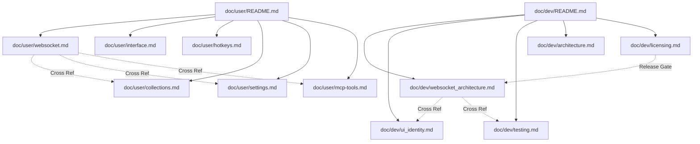

# PYPOST-1138: WS-12 User and developer documentation

## Research

### Existing Documentation Landscape

An analysis of the repository's documentation tree reveals two distinct documentation hierarchies:

1. **User Guide (`doc/user/`):**
   - Indexed by [`doc/user/README.md`](../../doc/user/README.md) and [`doc/README.md`](../../doc/README.md).
   - Currently comprises 13 topic guides: `getting-started.md`, `interface.md`, `requests.md`, `collections.md`, `environments.md`, `templating.md`, `scripts.md`, `history-and-curl.md`, `mcp-tools.md`, `settings.md`, `hotkeys.md`, and `workflows.md`.
   - Written for end users, API developers, and QA engineers. Focuses on workflows, UI interactions, keyboard shortcuts, and configuration without leaking internal Python classes or Qt implementation details.
   - Enforced by automated linters:
     - [`scripts/lint_user_docs.py`](../../scripts/lint_user_docs.py): Enforces line length $\le$ 100 characters (excluding code blocks/tables), no trailing whitespace, ATX headers (`# ...`), and consistent hyphen (`-`) bullet markers.
     - [`scripts/check_user_docs_links.py`](../../scripts/check_user_docs_links.py): Validates all relative file links and heading anchor slugs.

2. **Developer Documentation (`doc/dev/`):**
   - Indexed by [`doc/dev/README.md`](../../doc/dev/README.md).
   - Contains subsystem deep-dives (`mcp_integration.md`, `environments.md`, `collection_storage.md`, `daemon.md`, etc.), cross-cutting architecture guides (`architecture.md`, `ui_identity.md`, `testing.md`, `gui_testing.md`), and governance/release checklists (`licensing.md`, `dependencies_audit.md`).
   - Written for core maintainers, contributors, and automation engineers. Documents software architecture, Qt threading models, layer boundaries, stable `objectName` selectors, test harness conventions, and release gates.

### WebSocket Subsystem Implementation Inventory (WS-1 through WS-10)

The WebSocket implementation delivered across Epic PYPOST-1123 encompasses the following components that require complete documentation:

| Story | Subsystem / Feature | Key Production Modules | Key Concepts to Document |
| --- | --- | --- | --- |
| **WS-1** | Transport & Engine | `pypost/core/websocket_client.py`, `pypost/core/websocket_session.py` | Qt `QWebSocket` transport, connection handshake (`ws://`, `wss://`), subprotocols, lifecycle state machine (`DISCONNECTED`, `CONNECTING`, `CONNECTED`, `CLOSING`, `RECONNECTING`), heartbeat ping/pong, automatic reconnect backoff. |
| **WS-2** | Models & Persistence | `pypost/models/models.py`, `pypost/core/storage.py` | `WebSocketProfile`, `WebSocketMessagePreset`, `WebSocketSequence`, `WebSocketSequenceStep`, collection JSON serialization/deserialization, collection downgrade caveat. |
| **WS-3** | Stream Buffer & Codecs | `pypost/core/websocket_stream.py`, `pypost/core/websocket_codecs.py`, `pypost/core/websocket_export.py` | Bounded memory ring buffer, eviction policies (message count & byte budgets), drop accounting, codecs (UTF-8 text, formatted/validated JSON, binary Hex/Base64), export formats (JSON, NDJSON, CSV). |
| **WS-4** | Session Tab & UI | `pypost/ui/widgets/websocket_tab.py`, `pypost/ui/presenters/websocket_presenter.py` | WebSocket tab layout, connection bar, status badge, handshake parameter/header tables, subprotocol input, composer/stream split view. |
| **WS-5** | Stream Inspector | `pypost/ui/widgets/websocket_stream_view.py` | Directional filtering (All, Inbound, Outbound), frame kind filtering (Text, Binary, Ping/Pong, Close, Error), text search, message detail viewer, hex dump toggle, auto-scroll tailing. |
| **WS-6** | Composer, Presets & Sequences | `pypost/ui/widgets/websocket_composer.py`, `pypost/ui/widgets/websocket_messages_view.py` | Multi-format message composer (Text, JSON, Binary), preset library management, multi-step sequence builder with per-step delays and stop conditions. |
| **WS-7** | Environment Templating & Masking | `pypost/core/websocket_templating.py`, `pypost/core/sensitive_data_masking_policy.py` | Variable interpolation in URLs, handshake headers, and message payloads (`{{var}}`); masking of sensitive/hidden environment secrets in stream viewer and exported files. |
| **WS-8** | TLS & Security Policies | `pypost/core/websocket_tls.py`, `pypost/models/settings.py` | Secure WebSocket (`wss://`), custom CA bundles, client certificate authentication, TLS protocol version negotiation, strict vs relaxed certificate validation. |
| **WS-9** | MCP WebSocket Probe Tool | `pypost/core/mcp_websocket_probe.py`, `pypost/ui/widgets/websocket_tab.py` | Exposing WebSocket profiles as bounded MCP probe tools for AI agents, sampling controls (`max_duration_sec`, `max_messages`, `stop_when` regex pattern), secret masking in MCP transcripts. |
| **WS-10** | Settings, Limits & Observability | `pypost/models/settings.py`, `pypost/core/websocket_session_slots.py`, `pypost/core/metrics_registry.py` | Global settings (`ws_*`), concurrent session slots (`SessionSlots`), Prometheus metrics (`pypost_websocket_sessions_active`, `pypost_websocket_messages_total`, etc.), structured logging. |
| **WS-11** | Test Harness & Mocks | `tests/fixtures/websocket_server.py`, `tests/test_websocket_*.py` | Standalone mock WebSocket server fixture, offscreen Qt integration tests, timeout compliance (`pytest.mark.timeout(30)`). |

### Key Policy and Caveat Discoveries

1. **Collection Downgrade Caveat (A-4.3):**
   - Older versions of PyPost do not recognize the `"websockets"` array within collection JSON files.
   - When a collection containing WebSocket profiles is opened and saved by an older PyPost version, the unsupported `"websockets"` field is omitted upon re-serialization, causing silent profile loss.
   - This must be clearly documented in [`doc/user/collections.md`](../../doc/user/collections.md) and highlighted with appropriate warning callouts.

2. **Known Protocol Limitations (A-1.4, A-13.12):**
   - **No `permessage-deflate` Compression:** PyPost's Qt-native transport does not support WebSocket per-message deflate compression extensions.
   - **No Handshake HTTP Response Body/Header Introspection:** Handshake failure diagnostics are limited to Qt socket error codes and HTTP response status codes; raw HTTP response bodies/headers returned during rejected upgrades are not inspectable.
   - Both limitations must be explicitly stated in the User Guide to avoid user confusion.

3. **Per-Platform `wss://` Smoke Verification Gate (OQ-4, A-16):**
   - OS-native TLS certificate trust stores and system proxy configurations behave differently across Linux (OpenSSL), macOS (Secure Transport / Security Framework), and Windows (CryptoAPI / Schannel).
   - In [`doc/dev/licensing.md`](../../doc/dev/licensing.md), the binary release readiness checklist (G7 Platform Matrix) must be augmented with an explicit per-platform `wss://` smoke verification step.

---

## Implementation Plan

### 1. High-Level Plan

The implementation will be executed strictly following the Top-Down methodology:

1. **Step 3 (Failing Repro Test):** Create an automated test suite (`tests/test_websocket_docs.py`) that asserts the existence, structural integrity, required sections, keywords, widget IDs, hotkeys, settings keys, downgrade caveats, and release checklist gates across all user and developer documentation files. Before writing the documentation, running this test will fail (red).
2. **Step 4 (Documentation Authoring and Synchronization):**
   - **User Documentation:**
     - Create [`doc/user/websocket.md`](../../doc/user/websocket.md) covering connection, composition, presets, sequences, stream inspection, filtering, export, memory limits, reconnection, masking, MCP probes, and known limitations.
     - Update [`doc/user/interface.md`](../../doc/user/interface.md) with WebSocket tab layout, connection bar, status badge, stream viewer, and composer/presets panels.
     - Update [`doc/user/hotkeys.md`](../../doc/user/hotkeys.md) with WebSocket-specific keyboard shortcuts.
     - Update [`doc/user/collections.md`](../../doc/user/collections.md) with WebSocket profile persistence and the downgrade caveat.
     - Update [`doc/user/settings.md`](../../doc/user/settings.md) with all `ws_*` configuration options and defaults.
     - Update [`doc/user/mcp-tools.md`](../../doc/user/mcp-tools.md) with WebSocket MCP probe tool configuration and bounded execution rules.
     - Update [`doc/user/README.md`](../../doc/user/README.md) to add the WebSocket User Guide to the guide table of contents.
   - **Developer Documentation:**
     - Create [`doc/dev/websocket_architecture.md`](../../doc/dev/websocket_architecture.md) detailing component ownership, session lifecycle, presenter architecture, streaming buffer & concurrency slots, threading models, and observability.
     - Update [`doc/dev/ui_identity.md`](../../doc/dev/ui_identity.md) with WebSocket widget object names and automation selectors.
     - Update [`doc/dev/testing.md`](../../doc/dev/testing.md) with WebSocket test strategies, mock server fixture conventions, and timeout rules.
     - Update [`doc/dev/architecture.md`](../../doc/dev/architecture.md) with WebSocket subsystem directory hierarchy and layer boundaries.
     - Update [`doc/dev/licensing.md`](../../doc/dev/licensing.md) with the per-platform `wss://` smoke verification step in the release checklist.
     - Update [`doc/dev/README.md`](../../doc/dev/README.md) to index `websocket_architecture.md`.
   - **Validation & Linter Verification:**
     - Run `make lint-docs` and `make check-docs-links` to ensure zero Markdown formatting or relative link errors.
     - Run `make test` to verify `tests/test_websocket_docs.py` and the existing doc contract tests pass.
3. **Step 5 (Code Cleanup):** Verify clean formatting, no dead links, and consistent terminology.
4. **Step 6 (Observability):** Verify that documentation includes observability references (Prometheus metrics and structured logging).
5. **Step 7 (Technical Debt Analysis):** Document any future documentation enhancements or sync mechanisms.
6. **Step 8 (Dev Docs & Review):** Final verification of documentation consistency.

---

### 2. Mandatory — Failing Repro Design (Step 3)

- **Test Path:** `tests/test_websocket_docs.py`
- **Execution Target:** `QT_QPA_PLATFORM=offscreen pytest tests/test_websocket_docs.py`
- **Timeout Declaration:** `pytestmark = pytest.mark.timeout(10)`
- **Behavioral Assertions:**
  1. **File Existence Assertions:**
     - `doc/user/websocket.md` exists.
     - `doc/dev/websocket_architecture.md` exists.
     - Both files are indexed in `doc/user/README.md` and `doc/dev/README.md`.
  2. **User Guide Content Assertions (`doc/user/websocket.md`):**
     - Contains sections for connecting (`ws://` and `wss://`), message composition (Text, JSON, Binary), presets, sequences, stream inspector (filtering, clearing, export to JSON/NDJSON/CSV, autoscroll), session limits & retention budgets, automatic reconnect & heartbeats, sensitive environment variable masking, and bounded MCP probe tools.
     - Contains explicit statements for known limitations (`permessage-deflate` compression and handshake HTTP response introspection).
  3. **Collections Downgrade Caveat Assertion (`doc/user/collections.md`):**
     - Asserts that `doc/user/collections.md` contains an explicit warning regarding opening and saving collections containing WebSocket profiles in older PyPost versions.
  4. **Settings Documentation Assertion (`doc/user/settings.md`):**
     - Asserts that `doc/user/settings.md` documents all `ws_*` settings (`ws_max_concurrent_sessions`, `ws_max_stream_buffer_bytes`, `ws_heartbeat_interval_sec`, `ws_heartbeat_timeout_sec`, `ws_reconnect_max_attempts`, `ws_reconnect_backoff_base_sec`, `ws_reconnect_backoff_max_sec`, `ws_mcp_probe_max_duration_sec`, `ws_mcp_probe_max_messages`).
  5. **MCP Tools Documentation Assertion (`doc/user/mcp-tools.md`):**
     - Asserts that `doc/user/mcp-tools.md` documents WebSocket probe tool configuration, bounded sampling parameters (`max_duration_sec`, `max_messages`, `stop_when`), and secret isolation.
  6. **UI Identity Documentation Assertion (`doc/dev/ui_identity.md`):**
     - Asserts that `doc/dev/ui_identity.md` documents WebSocket widget object names from `pypost/ui/widget_ids.py` (`pypost_ws_tab_page`, `pypost_ws_url_input`, `pypost_ws_connect_button`, `pypost_ws_stream_view`, `pypost_ws_composer_edit`, `pypost_ws_send_message_button`, etc.).
  7. **Release Checklist Assertion (`doc/dev/licensing.md`):**
     - Asserts that `doc/dev/licensing.md` release checklist includes an explicit per-platform `wss://` smoke verification step across Linux, macOS, and Windows.
  8. **Testing Guide Assertion (`doc/dev/testing.md`):**
     - Asserts that `doc/dev/testing.md` documents WebSocket testing strategy, mock server fixtures, and headless execution.
  9. **Architecture Guide Assertion (`doc/dev/architecture.md`):**
     - Asserts that `doc/dev/architecture.md` lists WebSocket core and UI modules.
  10. **Markdown Linter & Link Verification Integration:**
      - Asserts that `scripts/lint_user_docs.py` and `scripts/check_user_docs_links.py` validate all target files without errors.
- **Forcing Red Failure:** In Step 3, before creating `doc/user/websocket.md` and modifying the target files, running `tests/test_websocket_docs.py` will fail with assertion errors.
- **Sequencing:**
  $$\text{Architecture (Step 2)} \longrightarrow \text{Red Test (Step 3)} \longrightarrow \text{Author Docs (Step 4)} \longrightarrow \text{Green Test (Step 4)}$$

---

## Architecture

### Documentation Information Architecture



---

### Target Document Matrix and Scope Specifications

#### 1. User-Facing Documentation

| Document Path | Target Audience | Primary Content & Additions | Constraints & Style |
| --- | --- | --- | --- |
| **`doc/user/websocket.md`** *(New)* | End users, API testers | Dedicated user guide: Connecting (`ws://`, `wss://`, headers, subprotocols), Composing (Text, JSON validation/formatting, Binary hex/Base64), Presets & Sequences, Stream Inspector (filtering, search, hex dump, export to JSON/NDJSON/CSV), Stream retention & session limits, Auto-reconnect & heartbeats, Secret masking (`{{var}}`), MCP Probe tools, Known limitations (`permessage-deflate`, handshake response body). | Line length $\le$ 100 chars, ATX headers, hyphen bullets, fenced code blocks with language tags. |
| **`doc/user/interface.md`** *(Update)* | End users | Add WebSocket tab layout overview: connection bar, status badge, split view (Stream Inspector on top, Composer / Messages on bottom), parameters/headers tabs. | Match existing ASCII diagram style and structure. |
| **`doc/user/hotkeys.md`** *(Update)* | Power users | Add WebSocket shortcuts table: Connect/Disconnect (`F5`/`Ctrl+Enter`), Send Message (`Ctrl+Enter` in composer), Clear Stream, Format JSON (`Ctrl+Shift+F`), Format Selection. | Align with existing key tables and macOS modifier notes. |
| **`doc/user/collections.md`** *(Update)* | Collaborators | Document WebSocket profile entries in collections, import/export behavior, and add prominent **Downgrade Caveat** warning callout explaining loss of `websockets` if saved in older versions. | Follow existing collection notes and warning callout conventions. |
| **`doc/user/settings.md`** *(Update)* | System operators | Add WebSocket Settings section documenting `ws_max_concurrent_sessions` (default 10), `ws_max_stream_buffer_bytes` (default 10 MB), `ws_heartbeat_interval_sec` (default 30), `ws_heartbeat_timeout_sec` (default 10), `ws_reconnect_max_attempts` (default 5), `ws_reconnect_backoff_base_sec` (default 1.0), `ws_reconnect_backoff_max_sec` (default 60.0), `ws_mcp_probe_max_duration_sec` (default 30.0), `ws_mcp_probe_max_messages` (default 100). | Table layout matching existing settings. |
| **`doc/user/mcp-tools.md`** *(Update)* | AI prompt engineers | Document WebSocket probe tools: how to expose WebSocket profiles as MCP tools, bounded sampling parameters (`max_duration_sec`, `max_messages`, `stop_when`), transcript generation, and secret masking. | Integrate into 4-step setup and safety reminder sections. |
| **`doc/user/README.md`** *(Update)* | All users | Add `WebSocket (Connecting, Composing, Streaming, and Probes)` to the Guide contents list. | Maintain alphabetical/numbered index consistency. |

---

#### 2. Developer Documentation

| Document Path | Target Audience | Primary Content & Additions | Constraints & Style |
| --- | --- | --- | --- |
| **`doc/dev/websocket_architecture.md`** *(New)* | Maintainers, contributors | In-depth architectural guide: subsystem topology, layer boundaries, domain models (`WebSocketProfile`, `WebSocketMessagePreset`, etc.), Qt transport isolation (`QWebSocketClientTransport`), lifecycle state machine, `WebSocketPresenter` & item strategies, ring buffer & memory eviction, concurrency limiter (`SessionSlots`), threading & event loop affinity (`WebSocketProbeRunner` in background thread), observability (Prometheus metrics & logging). | Mermaid diagrams, clear section headers, link cross-references. |
| **`doc/dev/ui_identity.md`** *(Update)* | Automation engineers | Add WebSocket widget identities table documenting all constants in `pypost/ui/widget_ids.py` (`WS_TAB_PAGE`, `WS_URL_INPUT`, `WS_CONNECT_BUTTON`, `WS_STREAM_VIEW`, `WS_COMPOSER_EDIT`, `WS_SEND_MESSAGE_BUTTON`, etc.) and lookup scoping rules. | Follow existing table schema (Constant, objectName, Surface). |
| **`doc/dev/testing.md`** *(Update)* | Test engineers | Add WebSocket test architecture section: pure unit tests (Qt-free) vs Qt integration tests, mock server fixture (`tests/fixtures/websocket_server.py`), timeout contracts (`pytest.mark.timeout`), headless offscreen execution (`QT_QPA_PLATFORM=offscreen`). | Code examples and command tables. |
| **`doc/dev/architecture.md`** *(Update)* | All developers | Update directory structure tree to include WebSocket core and UI modules under `pypost/core/` and `pypost/ui/`. Update layer rules. | Maintain exact directory comment style. |
| **`doc/dev/licensing.md`** *(Update)* | Release engineers | Add per-platform `wss://` smoke verification gate to the Pre-binary-release legal review checklist (G7 Platform Matrix) for Linux, macOS, and Windows releases. | Match existing release readiness checklist table schema. |
| **`doc/dev/README.md`** *(Update)* | Maintainers | Add `websocket_architecture.md` to developer topic index. | Maintain index structure. |

---

### Cross-Cutting Quality and Formatting Contracts

All documentation authored or modified under this task must strictly adhere to the following contracts:

1. **`lsr-markdown` Compliance:**
   - Use standard ATX headings (`#`, `##`, `###`) with an explicit space after `#`.
   - Use `-` for unordered bullet list items throughout `doc/user/` and `doc/dev/`.
   - Fenced code blocks must specify the language identifier (e.g. ```` ```python ````, ```` ```json ````, ```` ```bash ````, ```` ```text ````, ```` ```mermaid ````).
   - Indentation must be spaces (2 or 4 spaces), never tabs.
   - Paragraphs must be separated by single empty lines.
2. **Line Length & Whitespace Constraints:**
   - In all `doc/user/*.md` files and `doc/README.md`, lines outside fenced code blocks and Markdown tables must not exceed 100 characters.
   - Zero trailing whitespace on any line.
3. **Link Integrity:**
   - All relative links (`[label](path/to/file.md)`) must resolve to existing files on disk.
   - All anchor links (`[label](path/to/file.md#anchor)`) must match the GitHub-slugified heading or explicit HTML anchor in the destination document.
4. **Tooling & Make Targets:**
   - `make lint-docs` must execute cleanly without warnings or errors.
   - `make check-docs-links` must execute cleanly with all links verified.

---

## Q&A

**Q: How does the documentation handle the separation between user and developer content?**
A: User guides (`doc/user/*`) focus on user goals, UI workflows, configuration, keyboard navigation, and visible constraints. They deliberately avoid mentioning internal class names, Qt signal-slot mechanisms, or Python internals. Developer guides (`doc/dev/*`) provide deep technical specifications, design patterns, threading constraints, testing harnesses, and automation widget IDs.

**Q: Where should the collection downgrade caveat be placed to ensure maximum visibility?**
A: The downgrade caveat is placed directly in [`doc/user/collections.md`](../../doc/user/collections.md) in a prominent note/warning callout within the "Save a request" / "Export a collection" sections, as well as in the new [`doc/user/websocket.md`](../../doc/user/websocket.md) under session persistence.

**Q: Why are known limitations (no `permessage-deflate`, no handshake response introspection) explicitly documented in user docs?**
A: PyPost uses Qt-native `QWebSocket`, which does not support permessage compression or inspecting the HTTP response body of rejected handshakes. Stating these technical boundaries directly in [`doc/user/websocket.md`](../../doc/user/websocket.md) prevents users from attempting unsupported configurations or filing false bug reports when debugging endpoints with custom handshake payloads.

**Q: How does Step 3 failing repro ensure full documentation coverage?**
A: `tests/test_websocket_docs.py` programmatically parses each target documentation file, asserting the presence of required headings, technical topics, settings keys, hotkeys, widget IDs, downgrade warnings, and release checklist gates. This guarantees that no required section is accidentally omitted or misspelled during authoring.

**Q: Why is the per-platform `wss://` smoke verification added to `doc/dev/licensing.md`?**
A: Platform TLS certificate stores and proxy resolution vary significantly between Linux (OpenSSL), macOS (Security Framework), and Windows (CryptoAPI). Automated headless Linux CI cannot substitute for verifying packaged binaries against native OS trust stores; an explicit release checklist step ensures every packaged release is tested on all three target operating systems.
