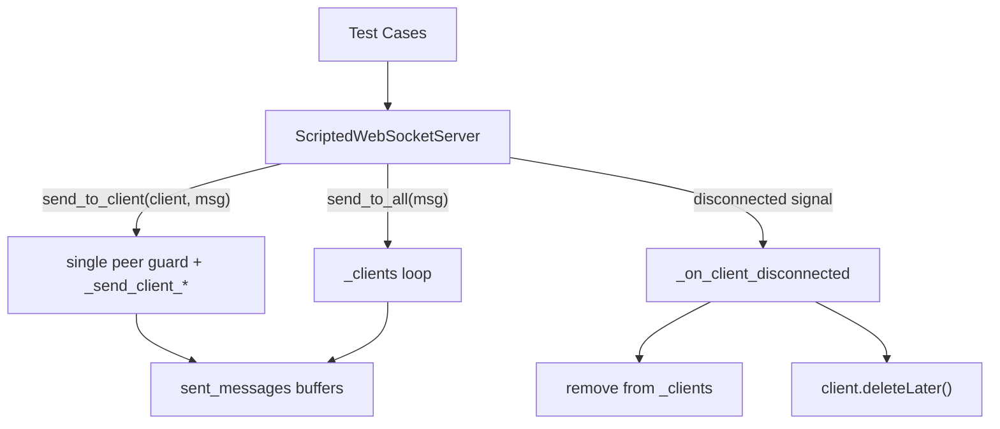

# PYPOST-1139: WS test harness — per-client messaging and disconnection cleanup

## Research

- **Existing harness** (`tests/websocket_echo_server.py`): `ScriptedWebSocketServer` tracks connected peers in `_clients: list[QWebSocket]`, broadcasts via `send_to_all()`, and records sent/received buffers through `_send_client_text` / `_send_client_binary`.
- **TD-1 gap** (PYPOST-1129 `60-tech-debt.md`): no per-client send API; `_on_client_disconnected` removes peers from `_clients` but does not call `client.deleteLater()`, deferring Qt object reclamation to GC.
- **Qt pattern**: `QObject.deleteLater()` schedules safe C++ object destruction on the next event-loop pass — standard practice for disconnected `QWebSocket` children owned by the server.
- **Downstream consumers**: `ws_test_server` fixture, E2E WebSocket tests, MCP probe repro tests — all use broadcast or echo; no production code changes.

## Implementation Plan

1. **Add `send_to_client(client, message)`** on `ScriptedWebSocketServer`:
   - Public method mirroring `send_to_all` semantics but targeting one peer.
   - Guard: peer must be in `_clients` and `client.isValid()`; otherwise no-op (no exception, no buffer write).
   - Delegate to existing `_send_client_text` / `_send_client_binary` so sent-message buffers and debug logging stay consistent with broadcast.
   - Add optional debug log `ws_server_targeted_message_sent` with `name`, `length`, `total_sent`.

2. **Enhance `_on_client_disconnected`**:
   - After removing peer from `_clients` and incrementing `_disconnection_count`, call `client.deleteLater()` to prompt Qt reclamation.
   - Keep existing debug log unchanged.

3. **Tests** (Step 3 red → Step 4 green):
   - `test_send_to_client_selective_delivery`: two connected peers; `send_to_client` to peer A delivers only to A; verify sent buffers; repeat with binary.
   - `test_disconnect_invokes_delete_later`: mock/spy `deleteLater` on disconnect handler path (or verify via churn + existing leak test regression).

**Failing Repro (Step 3):** Add `test_send_to_client_selective_delivery` and `test_disconnect_invokes_delete_later` in `tests/test_websocket_echo_server.py`. Both fail on current code: `AttributeError` (no `send_to_client`) and `deleteLater` not called respectively. No external deps; uses existing `qapp`, `wait_until`, SILENT behavior to suppress echo.

## Architecture

### Module responsibilities

| Component | Change |
| --- | --- |
| `ScriptedWebSocketServer.send_to_client` | New public API for targeted text/binary delivery |
| `ScriptedWebSocketServer._on_client_disconnected` | Add `deleteLater()` after list removal |
| `tests/test_websocket_echo_server.py` | Two focused tests for selective delivery and disconnect cleanup |
| `doc/dev/websocket_test_harness.md` | Document new API and disconnect behavior |

### API contract: `send_to_client(client, message: str | bytes) -> None`

- **Precondition**: `client` is a `QWebSocket` reference returned via `server.clients`.
- **Behavior**: If `client in self._clients` and `client.isValid()`, send one frame (text or binary per `message` type) and append to sent buffers exactly once.
- **Invalid/disconnected peer**: Silent no-op — no raise, no buffer append (callers may hold stale references briefly after disconnect).
- **Broadcast unchanged**: `send_to_all` continues to iterate all valid clients; no shared refactor beyond reusing `_send_client_*`.

### Patterns

- **Reuse over duplication**: Targeted send reuses `_send_client_text` / `_send_client_binary` (same as broadcast inner loop).
- **Qt lifecycle**: `deleteLater()` in disconnect handler aligns with Qt parent/child ownership; server remains parent via `QWebSocketServer.nextPendingConnection()`.

## Q&A

**Q: Should `send_to_client` raise if the peer is unknown?**
A: No — silent no-op matches harness test-helper style and avoids races when a disconnect signal is in flight.

**Q: Does `deleteLater()` in `stop()` / `drop_clients()` need the same treatment?**
A: Out of scope for TD-1. `stop()` already closes/aborts and clears the list; disconnect handler covers normal churn. `drop_clients()` may be a follow-up if needed.

**Q: New debug log required?**
A: Optional single `ws_server_targeted_message_sent` DEBUG line for parity with broadcast send logs; not production observability.
