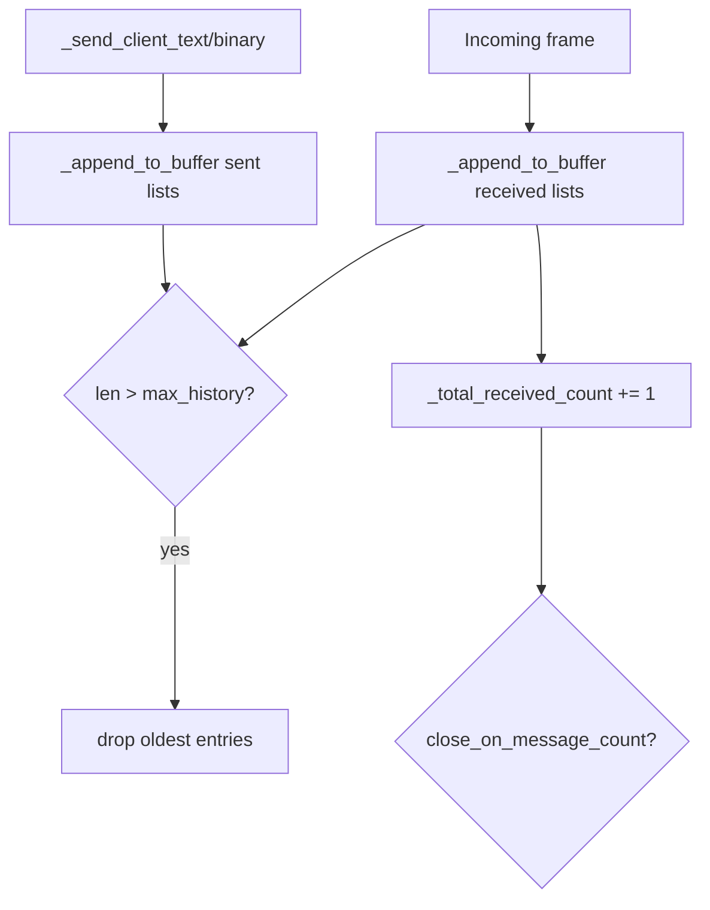

# PYPOST-1140: WS test harness — optional max_history buffer cap

## Research

- **Existing buffers** (`tests/websocket_echo_server.py`): six parallel lists — `_received_messages`, `_received_text_messages`, `_received_binary_messages`, `_sent_messages`, `_sent_text_messages`, `_sent_binary_messages` — append on every frame via `_on_text_message_received`, `_on_binary_message_received`, `_send_client_text`, `_send_client_binary`.
- **TD-2 gap** (PYPOST-1129 `60-tech-debt.md`): unbounded growth during >100k frame benchmarks; mitigation noted as optional `max_history`.
- **Close-on-message-count**: `CLOSE_WITH_CODE` behavior compares `len(self._received_messages)` against `close_on_message_count` — truncation would break this if buffer length is used; requires a separate `_total_received_count` incremented on each receive and reset in `reset()`.
- **Default**: `max_history=None` preserves current unbounded behavior.

## Implementation Plan

1. **Constructor parameter** `max_history: Optional[int] = None` on `ScriptedWebSocketServer`.
2. **Private helper** `_append_to_buffer(buffer: list, item) -> None`: append then, if `max_history` is set and `len(buffer) > max_history`, delete oldest entries from the front (ring-buffer cap).
3. **Apply helper** in all six buffer append sites (received text/binary aggregate + typed, sent text/binary aggregate + typed).
4. **Add `_total_received_count`**: increment on each received message; use in `close_on_message_count` checks instead of `len(_received_messages)`; reset in `reset()`.
5. **Optional property** `max_history` for tests/docs (read-only exposure of configured cap).

**Failing Repro (Step 3):** Add `test_max_history_truncates_received_and_sent_buffers` in `tests/test_websocket_echo_server.py`. Server with `max_history=3`, SILENT behavior, single client sends five text messages — assert `received_text_messages` and typed buffers contain only the last three payloads (`"msg-3"`, `"msg-4"`, `"msg-5"`). Then `send_to_all` three more messages — assert `sent_text_messages` retains only the last three. Fails on current code because all five received messages are retained.

## Architecture

### Module responsibilities

| Component | Change |
| --- | --- |
| `ScriptedWebSocketServer.__init__` | Add `max_history` parameter; store `_max_history`; init `_total_received_count` |
| `ScriptedWebSocketServer._append_to_buffer` | Ring-buffer truncation helper |
| Receive/send paths | Use helper instead of raw `append` |
| `close_on_message_count` checks | Use `_total_received_count` |
| `reset()` | Clear `_total_received_count` |
| `tests/test_websocket_echo_server.py` | Red/green test for truncation |

### API contract

- **`max_history: Optional[int] = None`**: Maximum entries per buffer list. `None` = unbounded (default). Positive integer = retain most recent N entries only.
- **Properties exposed via lists**: `received_messages`, `sent_messages`, and typed variants return copies of truncated buffers (existing `list(...)` copy behavior unchanged).

## Q&A

**Q: One shared cap for all six lists?**
A: Yes — each list is capped independently to the same N. A text receive appends to `_received_messages` and `_received_text_messages` (both capped to N). Aggregate and typed lists stay aligned.

**Q: Validate max_history > 0?**
A: If `max_history` is not None and `max_history < 1`, treat as invalid — raise `ValueError` at construction (document in dev docs).
