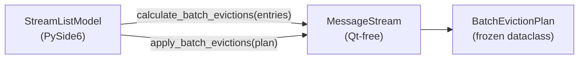

# PYPOST-1141: WS: Add batch eviction calculation API to MessageStream to decouple StreamListModel

## Research

### R-0 Verification Method

| Kind | Verification Source |
| --- | --- |
| **Repo Fact** | `pypost/core/websocket_stream.py` (`MessageStream.append`, private `_entries` deque, `_retained_bytes`), `pypost/ui/widgets/websocket/stream_model.py` (`StreamListModel.append_batch` inline simulation and private member access), `ai-tasks/PYPOST-1130/60-tech-debt.md` (PYPOST-1141 follow-up). |
| **Runtime Fact** | Existing tests in `tests/test_websocket_stream_and_codecs.py` (`TestStreamListModel`, `TestMessageStream`) verify batch append eviction signaling and dual FIFO eviction. |
| **Standards Fact** | WS-3 architectural invariant: core stream module is Qt-free; `StreamListModel` is sole UI writer. |

### R-1 Current Coupling

`StreamListModel.append_batch` (lines 106–159) performs:

1. `temp_entries = list(self._stream._entries)` — copies private deque.
2. Inline FIFO simulation using `self._stream._max_entries` and `self._stream._memory_budget_bytes`.
3. Direct `self._stream._entries.popleft()` / `.append()` and `_retained_bytes` arithmetic.
4. Direct `_dropped_capacity` / `_dropped_memory_budget` increments.

Eviction math duplicates the loops in `MessageStream.append` (capacity then memory budget, oldest-first).

### R-2 Desired Boundary

```
StreamListModel (Qt)          MessageStream (Qt-free)
─────────────────────         ─────────────────────────
append_batch(entries)
  ├─ plan = stream.calculate_batch_evictions(entries)
  ├─ beginRemoveRows if plan.existing_evicted > 0
  ├─ stream.apply_batch_evictions(plan)
  └─ beginInsertRows for plan.entries_to_append
```

## Implementation Plan

### Phase 1: Core API (`pypost/core/websocket_stream.py`)

1. Add frozen `@dataclass BatchEvictionPlan` with fields:
   - `existing_evicted: int`
   - `dropped_capacity: int`
   - `dropped_memory_budget: int`
   - `total_evicted: int`
   - `entries_to_append: tuple[StreamEntry, ...]`
2. Add `MessageStream.calculate_batch_evictions(entries)` — extract simulation from `StreamListModel.append_batch`.
3. Add `MessageStream.apply_batch_evictions(plan)` — front removal, drop counter update, append new entries.

### Phase 2: UI Refactor (`pypost/ui/widgets/websocket/stream_model.py`)

1. Replace inline simulation with `plan = self._stream.calculate_batch_evictions(entries)`.
2. Emit Qt removal signals based on `plan.existing_evicted`.
3. Call `self._stream.apply_batch_evictions(plan)`.
4. Emit Qt insertion signals for `plan.entries_to_append`.

### Phase 3: Tests & Docs

1. Headless repro tests in `tests/test_websocket_batch_eviction_repro.py`.
2. AST architectural test: `StreamListModel` must not reference `_entries` or `_retained_bytes`.
3. Update `doc/dev/websocket_message_stream.md` batch synchronization section.

### Mandatory — Failing Repro (Step 3)

**File:** `tests/test_websocket_batch_eviction_repro.py`

| Test | Asserts | Failure mode (pre-fix) |
| --- | --- | --- |
| `test_message_stream_has_calculate_batch_evictions` | `MessageStream` exposes callable `calculate_batch_evictions` | `AttributeError` |
| `test_calculate_batch_evictions_capacity` | Plan for `max_entries=3` pre-filled + 2 new entries: `existing_evicted=2`, correct `entries_to_append` seq values | `AttributeError` or wrong plan |
| `test_calculate_batch_evictions_memory_budget` | Memory-budget eviction returns correct `dropped_memory_budget` | Wrong counts |
| `test_apply_batch_evictions_mutates_stream` | After apply, buffer length and drop counters match plan | `AttributeError` |
| `test_stream_list_model_no_private_member_access` | AST parse of `stream_model.py` finds no `_entries` or `_retained_bytes` attribute access on stream | Test fails while private access remains |

**Sequencing:** Red tests → implement core API → refactor model → green.

## Architecture

### A-1 Decision Register

- **D-1141.1 (Plan/Apply Split):** Eviction simulation (`calculate_batch_evictions`) is side-effect free; mutation (`apply_batch_evictions`) is invoked by `StreamListModel` between Qt signal brackets. This preserves the existing signal ordering invariant.
- **D-1141.2 (Behavioral Parity):** Simulation logic is moved verbatim from `StreamListModel.append_batch` to avoid behavior drift; no policy change.
- **D-1141.3 (Minimal Public Surface):** Only `_entries` and `_retained_bytes` access is eliminated from the UI model. Drop counter updates move into `apply_batch_evictions`; `_max_entries` / `_memory_budget_bytes` reads move into `calculate_batch_evictions`.
- **D-1141.4 (Qt-Free Core):** `BatchEvictionPlan` and new methods live in `websocket_stream.py` with zero Qt imports.

### A-2 Module Diagram



### A-3 Interface Definitions

```python
@dataclass(frozen=True)
class BatchEvictionPlan:
    existing_evicted: int
    dropped_capacity: int
    dropped_memory_budget: int
    total_evicted: int
    entries_to_append: tuple[StreamEntry, ...]

class MessageStream:
    def calculate_batch_evictions(
        self, entries: Sequence[StreamEntry]
    ) -> BatchEvictionPlan: ...

    def apply_batch_evictions(self, plan: BatchEvictionPlan) -> None: ...
```

## Q&A

| Question | Answer |
| --- | --- |
| Why not a single `append_batch` on `MessageStream`? | Qt signals must bracket mutations; splitting plan/apply lets `StreamListModel` emit `beginRemoveRows`/`beginInsertRows` at the correct points. |
| Why keep list-copy simulation? | 1 SP scope; deque-index optimization is documented as follow-up debt. |
| Does `apply_batch_evictions` log eviction? | No new logs in core; existing `StreamListModel` debug logs remain unchanged. |
