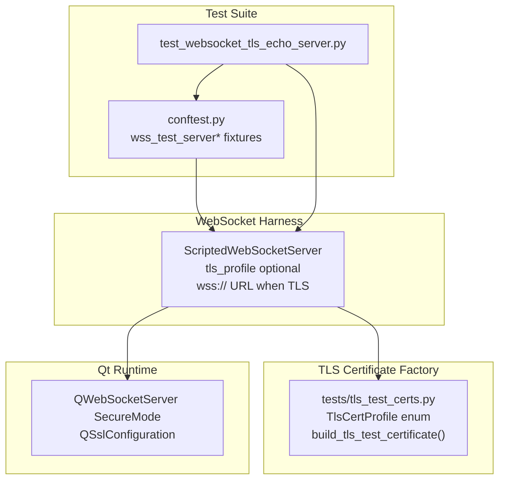

# PYPOST-1142: Live TLS test server fixture with multi-cert profiles

## Research

### 1. Qt WebSocket TLS server mode

`QWebSocketServer` supports `SslMode.SecureMode`. When enabled, the server requires `QSslConfiguration` with a local certificate and private key before `listen()` succeeds. PySide6 loads PEM-encoded material via `QSslCertificate(bytes)` and `QSslKey(bytes, QSsl.KeyAlgorithm.Rsa, QSsl.EncodingFormat.Pem)`.

### 2. In-process certificate generation

The repository already depends on `cryptography==48.0.1`. Using `x509.CertificateBuilder` avoids external OpenSSL CLI, checked-in PEM artifacts, and multi-process test daemons. Generated certificates are ephemeral and never written to disk.

### 3. Profile matrix (PYPOST-1131 follow-up)

| Profile | Certificate subject / SAN | Validity | Expected client rejection (VerifyPeer) |
| --- | --- | --- | --- |
| `SELF_SIGNED` | CN=localhost, SAN=localhost + 127.0.0.1 | Valid | Self-signed / untrusted |
| `EXPIRED` | CN=localhost, SAN=localhost + 127.0.0.1 | `notAfter` in the past | Certificate expired |
| `HOSTNAME_MISMATCH` | CN=mismatch.example.com | Valid | Hostname does not match 127.0.0.1 |

### 4. Backward compatibility

Default `ScriptedWebSocketServer()` construction remains `NonSecureMode`. TLS is opt-in via `tls_profile=TlsCertProfile.*`.

---

## Implementation Plan

### Mandatory — Failing Repro (Step 3)

**Test file:** `tests/test_websocket_tls_echo_server.py`

**Desired behaviors:**

1. `test_tls_server_startup_and_wss_url` — constructing `ScriptedWebSocketServer(tls_profile=SELF_SIGNED)` and calling `start()` yields `server.url` starting with `wss://` and `server.is_tls is True`. **Fails before Step 4** because TLS mode is not implemented.
2. `test_tls_profile_rejects_default_verification` (parametrized) — `QWebSocket` client with default verification connects to each profile and collects `sslErrors`; asserts diagnostic substring (`self-signed`, `expired`, `host name`). **Fails before Step 4** because no secure server exists.
3. `test_tls_self_signed_echo_with_verify_none` — client with `PeerVerifyMode.VerifyNone` echoes text over `wss://`. **Fails before Step 4**.

**Sequencing:** Step 3 writes red tests → Step 4 adds `tests/tls_test_certs.py`, extends `ScriptedWebSocketServer`, adds fixtures → tests go green.

---

## Architecture

### Module diagram



### Module responsibilities

| Module | Location | Responsibility |
| --- | --- | --- |
| `TlsCertProfile` / `build_tls_test_certificate` | `tests/tls_test_certs.py` | Generate ephemeral X.509 + Qt `QSslCertificate` / `QSslKey` for each profile |
| `ScriptedWebSocketServer` | `tests/websocket_echo_server.py` | Opt-in `tls_profile`; configure `SecureMode` + SSL; expose `is_tls`, `wss://` URL |
| `wss_test_server*` fixtures | `tests/conftest.py` | Function-scoped secure server lifecycle per profile |
| TLS harness tests | `tests/test_websocket_tls_echo_server.py` | Live handshake rejection matrix and echo over `wss://` |

### Constructor API

```python
server = ScriptedWebSocketServer(
    tls_profile=TlsCertProfile.SELF_SIGNED,  # None => ws:// (default)
)
server.start()
assert server.url.startswith("wss://")
```

---

## Q&A

| Question | Answer |
| --- | --- |
| Why separate `tls_test_certs.py`? | Keeps certificate generation logic isolated from server behavior dispatch; enables unit testing of profile material without starting a server. |
| Why connect to 127.0.0.1 for hostname mismatch? | Mirrors real client behavior when URL host does not match certificate SAN; server still binds loopback for offline CI. |
| Will this slow CI? | TLS tests add ~4s for 9 cases; still hermetic and parallelizable. No external network. |
