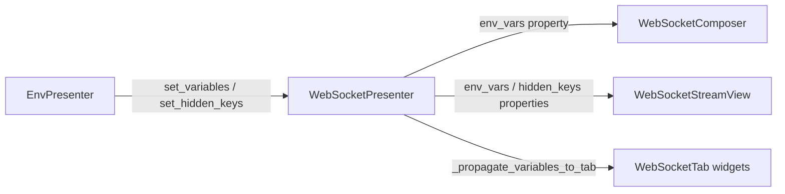

# PYPOST-1143: WS — Expose public env_vars and hidden_keys properties on WebSocketPresenter

## Research

- **Origin:** `ai-tasks/PYPOST-1135/60-tech-debt.md` item 1 — private `_env_vars` / `_hidden_keys` with `getattr` fallbacks in child widgets.
- **Existing pattern:** `EnvPresenter` already exposes `current_variables` and `current_hidden_keys` as public `@property` accessors returning copies.
- **Call sites to migrate (grep):**
  - `pypost/ui/widgets/websocket/composer.py` — `send_current_payload()` line ~307
  - `pypost/ui/widgets/websocket/stream_view.py` — `export_json()` / `export_text()` lines ~887–903
- **Presenter internals:** `_env_vars` and `_hidden_keys` are set in `__init__`, updated by `set_variables()` / `set_hidden_keys()`, and used internally for templating, masking, and tab propagation. No other modules need changes.

## Implementation Plan

1. **Step 3 — Red test** (`tests/test_websocket_presenter_env_properties.py`):
   - Instantiate `WebSocketPresenter` with known `env_vars` / `hidden_keys`.
   - Assert `presenter.env_vars` and `presenter.hidden_keys` return matching snapshots (will fail with `AttributeError` before Step 4).
   - Assert `set_variables()` / `set_hidden_keys()` updates are visible through properties.
   - Assert returned collections are copies (mutating them does not alter presenter state).
   - Assert `WebSocketComposer` and `WebSocketStreamView` source no longer reference `getattr(..., "_env_vars")` — optional static check via `inspect.getsource` or grep-based assertion on module text.

2. **Step 4 — Implementation:**
   - Add two `@property` methods on `WebSocketPresenter` returning `dict(self._env_vars)` and `set(self._hidden_keys)`.
   - Replace `getattr` fallbacks in composer and stream_view with `presenter.env_vars` / `presenter.hidden_keys` when presenter is bound; retain local widget fallbacks when presenter is `None`.

3. **Step 8 — Docs:** Update `doc/dev/websocket_environments_templating_and_masking.md` to reference public properties.

**Failing Repro (Step 3):** `tests/test_websocket_presenter_env_properties.py` — asserts public properties exist and return correct snapshots. Fails on current code because properties are undefined. No live network or GUI event loop required (headless presenter construction).

## Architecture



### Module Changes

| Module | Change |
| ------ | ------ |
| `pypost/ui/presenters/websocket_presenter.py` | Add `env_vars` and `hidden_keys` read-only properties |
| `pypost/ui/widgets/websocket/composer.py` | Use `presenter.env_vars` in `send_current_payload()` |
| `pypost/ui/widgets/websocket/stream_view.py` | Use `presenter.env_vars` / `presenter.hidden_keys` in export methods |

### Interface

```python
class WebSocketPresenter(QObject):
    @property
    def env_vars(self) -> dict[str, str]:
        """Active environment variables snapshot (read-only copy)."""

    @property
    def hidden_keys(self) -> set[str]:
        """Hidden variable keys for the active environment (read-only copy)."""
```

### Invariants Preserved

- `set_variables()` / `set_hidden_keys()` remain the sole mutation entry points.
- `WebSocketSessionController` stays environment-free.
- Masking and templating behavior unchanged.

## Q&A

**Q: Why properties instead of methods?**
A: Matches `EnvPresenter.current_hidden_keys` and existing presenter property style (`state`, `stream_model`).

**Q: Why keep `_env_vars` private?**
A: Encapsulation — external code uses the property; internal presenter methods continue using `_env_vars` directly for zero-copy hot paths.
