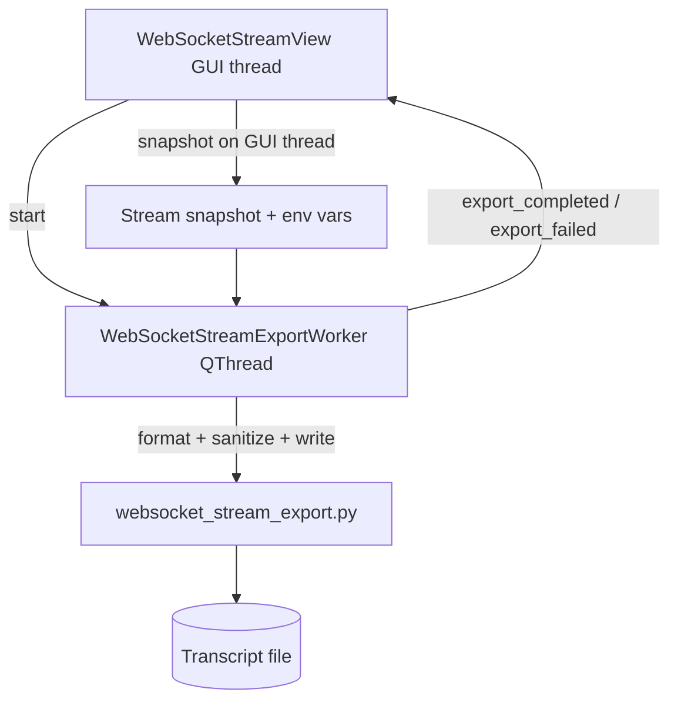

# PYPOST-1144: WS — Asynchronous background thread processing for stream file export

## Research

- **Origin:** `ai-tasks/PYPOST-1135/60-tech-debt.md` item 2 — synchronous export on Qt main thread.
- **Existing patterns:**
  - `CollectionImportParseWorker` + `CollectionImportActions` — parse off GUI thread, busy guard, `QThread.finished` cleanup ([PYPOST-1005](https://pypost.atlassian.net/browse/PYPOST-1005)).
  - `EnvironmentStorageWorker` / `CollectionStorageWorker` — gateway pattern with `is_busy()` and short post-finish join.
- **Current export path:** `WebSocketStreamView.export_json/text` → `export_stream_to_json_file` / `export_stream_to_text_file` in `pypost/core/websocket_stream_export.py` (Qt-free core).
- **Thread safety:** `MessageStream` is mutated on the GUI thread during live intake; worker must receive an immutable snapshot (`StreamEntry` tuples + dropped counts) captured before `QThread.start()`.

## Implementation Plan

1. **Step 3 — Red test** (`tests/test_websocket_stream_export_responsiveness.py`):
   - Patch core export write to sleep ~400 ms (simulated slow disk).
   - Call `WebSocketStreamView.export_json()` and assert a `QTimer` on the GUI thread fires while export is in flight.
   - Assert export serialization runs on a non-main thread.
   - Fails on current code because synchronous export blocks the event loop during sleep.

2. **Step 4 — Implementation:**
   - Add `StreamExportSnapshot` adapter in `websocket_stream_export.py` (duck-types `MessageStream` for format/write helpers).
   - Add `WebSocketStreamExportWorker(QThread)` in `pypost/core/qt/websocket_stream_export_worker.py`.
   - Refactor `WebSocketStreamView`:
     - Capture `stream.snapshot()` + `stream.dropped` + env snapshot on GUI thread.
     - Start worker; disable Export button while busy.
     - Handle `export_completed` / `export_failed` signals on GUI thread.
   - Update `test_websocket_stream_view_repro.py` export test to `process_until` file exists.

3. **Step 8 — Docs:** Update `doc/dev/websocket_message_stream.md` with async export worker section.

**Failing Repro (Step 3):** `tests/test_websocket_stream_export_responsiveness.py` — GUI event-loop responsiveness during slow export. Fails because export currently runs synchronously on the main thread. Uses pytest-qt `qapp`, patched slow write, no live network.

## Architecture



### Module Changes

| Module | Change |
| ------ | ------ |
| `pypost/core/websocket_stream_export.py` | Add `StreamExportSnapshot` read-only adapter for off-thread export |
| `pypost/core/qt/websocket_stream_export_worker.py` | New `QThread` worker invoking core export helpers |
| `pypost/ui/widgets/websocket/stream_view.py` | Async export orchestration, busy guard, button state |
| `tests/test_websocket_stream_export_responsiveness.py` | New responsiveness + thread assertions |
| `tests/test_websocket_stream_view_repro.py` | Wait for async export completion |

### Interface

```python
class WebSocketStreamExportWorker(QThread):
    export_completed = Signal(str, str)  # path, format ("json" | "text")
    export_failed = Signal(str, object)  # format, error

class WebSocketStreamView(QWidget):
    def is_export_busy(self) -> bool: ...
    def export_json(self, path: Path | str) -> None: ...  # starts worker, returns immediately
    def export_text(self, path: Path | str) -> None: ...
```

### Invariants Preserved

- Tier 2 `sanitize_text` egress masking unchanged.
- Core export module remains Qt-free; only the worker bridge imports PySide6.
- Export file content for a given snapshot matches prior synchronous behavior.

## Q&A

**Q: Why snapshot instead of passing live `MessageStream`?**
A: Prevents data races when frames arrive during export and guarantees a point-in-time transcript.

**Q: Why not `QThreadPool` / `QtConcurrent`?**
A: Matches existing `CollectionImportParseWorker` and storage worker conventions in this codebase.
