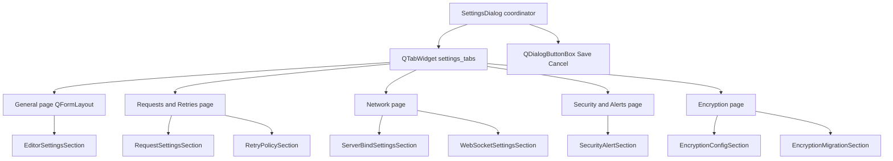

# PYPOST-1145: UI — Refactor SettingsDialog into categorized tabbed layout

## Research

- **Origin:** `ai-tasks/PYPOST-1136/60-tech-debt.md` — SettingsDialog vertical scroll scaling.
- **Prior art:** PYPOST-598 extracted section builders; coordinator still uses one `QFormLayout`.
  PYPOST-598 architecture rejected tabbed layout then due to "recognizable layout" requirement;
  PYPOST-1145 explicitly adopts tabs now that section count has grown.
- **User guide alignment:** `doc/user/settings.md` already lists six logical groups (editor,
  requests, retries/alerts, WebSocket, MCP/metrics, encryption).
- **Qt pattern:** `QTabWidget` with one `QWidget` page per category, each hosting a
  `QFormLayout` — same pattern as `RequestEditor.detail_tabs` and WebSocket connection editor.
- **Test contracts:** `tests/test_settings_dialog.py`, `tests/test_settings_encryption.py`,
  `tests/test_settings_encryption_migration_ui.py` use `dlg.form_layout.indexOf(widget)`;
  replace with `dlg.form_layout_index_of(widget)` searching all tab forms.

## Implementation Plan

1. **Step 3 — Red test** (`tests/test_settings_dialog_tabbed_layout.py`):
   - Assert `SettingsDialog` exposes `settings_tabs: QTabWidget`.
   - Assert tab labels: General, Requests & Retries, Network, Security & Alerts, Encryption.
   - Assert representative widgets appear on the expected tab page form layout.
   - Fails on current code (no `QTabWidget`, single `form_layout`).

2. **Step 4 — Implementation:**
   - Refactor `SettingsDialog.__init__`:
     - Create `QTabWidget` (`settings_tabs`) with five pages.
     - Each page: `QWidget` + `QFormLayout`.
     - Assign sections to pages per table below.
     - Add `form_layout_index_of(widget)` scanning `_tab_form_layouts`.
     - Add `SETTINGS_TABS` widget id on the tab widget.
     - Increase default dialog size modestly (tabs need header chrome).
   - Update tests using `form_layout.indexOf` → `form_layout_index_of`.
   - Split cross-tab ordering test into per-tab ordering assertions.

3. **Step 8 — Docs:** Update `doc/dev/settings_dialog.md` with tab category table.

**Failing Repro (Step 3):** `tests/test_settings_dialog_tabbed_layout.py` — asserts
`QTabWidget` presence and expected tab labels. Fails because current dialog uses a single
`QFormLayout`. Uses pytest-qt `qapp`, no network.

## Architecture

### Tab → Section Mapping

| Tab label | Sections | Rationale |
| --- | --- | --- |
| **General** | `EditorSettingsSection` | Editor and appearance (`doc/user/settings.md`) |
| **Requests & Retries** | `RequestSettingsSection`, `RetryPolicySection` | HTTP request defaults + retry policy |
| **Network** | `ServerBindSettingsSection`, `WebSocketSettingsSection` | MCP/metrics bind + WebSocket transport |
| **Security & Alerts** | `SecurityAlertSection` | Hidden-key logging + alert delivery |
| **Encryption** | `EncryptionConfigSection`, `EncryptionMigrationSection` | Encryption mode + migration actions |

### Module Changes

| Module | Change |
| --- | --- |
| `pypost/ui/dialogs/settings_dialog.py` | Tab coordinator; `settings_tabs`, `form_layout_index_of()` |
| `pypost/ui/widget_ids.py` | Add `SETTINGS_TABS` constant |
| `tests/test_settings_dialog_tabbed_layout.py` | New layout contract tests |
| `tests/test_settings_dialog.py` | Use `form_layout_index_of`; per-tab ordering |
| `tests/test_settings_encryption.py` | Use `form_layout_index_of` |
| `tests/test_settings_encryption_migration_ui.py` | Use `form_layout_index_of` |
| `doc/dev/settings_dialog.md` | Tab layout section |

### Invariants Preserved

- Section builder modules unchanged (SRP from PYPOST-598).
- `accept()` validation and `collect_fields()` merge order unchanged.
- Widget handles on `SettingsDialog` instance unchanged.
- `SETTINGS_DIALOG` objectName unchanged.

## Q&A

**Q: Why not QListWidget side nav?**
A: `QTabWidget` matches other PyPost editors; five categories fit comfortably in a tab bar.

**Q: Why group retries with requests?**
A: Matches operator mental model (HTTP behavior) and keeps Security tab focused on logging/alerts.
