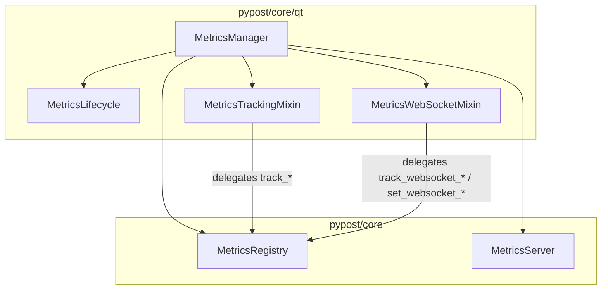

# PYPOST-1146: Modularize MetricsManager to eliminate dynamic getattr delegation

## Research

### Current State

- [`pypost/core/qt/metrics.py`](../../pypost/core/qt/metrics.py) defines `MetricsManager`, a
  Qt-facing facade over `MetricsRegistry` and `MetricsServer`.
- Lines 63–185 contain explicit one-line delegation methods for HTTP, GUI, MCP, history, and
  template metrics.
- Lines 45–46 use `__getattr__` to forward any remaining `track_websocket_*` /
  `set_websocket_*` calls to `self._registry` (nine methods added in PYPOST-1136).
- [`scripts/audit_baseline_metrics.py`](../../scripts/audit_baseline_metrics.py) enforces a
  **185-line cap** on `pypost/core/qt/metrics.py`.
- Callers (`websocket_presenter.py`, `websocket_mcp_tools.py`) invoke WebSocket metrics via
  `hasattr` guards; they do not depend on dynamic lookup semantics.

### Prior Art

- PYPOST-1054, PYPOST-1071, and PYPOST-1128 extracted cohesive modules (e.g.
  `mcp_server_controller.py`, `collection_item_dispatch.py`) when caps were exceeded.
- `MetricsLifecycle` was already extracted to `metrics_lifecycle.py`.

## Implementation Plan

1. Create `pypost/core/qt/metrics_tracking.py` — `MetricsTrackingMixin` with all non-WebSocket
   explicit delegation methods currently in `metrics.py`.
2. Create `pypost/core/qt/metrics_websocket.py` — `MetricsWebSocketMixin` with nine explicit
   WebSocket delegation methods matching `MetricsRegistry` / `MetricsProtocol`.
3. Slim `MetricsManager` to inherit `MetricsLifecycle`, `MetricsTrackingMixin`,
   `MetricsWebSocketMixin`; remove `__getattr__`.
4. Register LOC caps for the two new modules in `scripts/audit_baseline_metrics.py`.
5. Update dev docs and the existing websocket delegation test.

### Failing Repro (Step 3)

**File:** `tests/test_metrics_manager_modularization.py`

**Assertions (desired behavior, fails on current code):**

1. `MetricsManager` does **not** define `__getattr__` for registry forwarding.
2. Each of the nine WebSocket method names appears in `MetricsManager.__dict__` (explicit class
   body, not inherited from `object`).
3. WebSocket methods remain callable and increment the expected Prometheus counters (smoke via
   registry scrape).

**How to force failure without external deps:** Pure structural `inspect` / `__dict__` checks —
no live server or network required for the primary red assertions.

**Sequencing:** Red structural test → extract mixins → green structural + existing suite.

## Architecture



### Module Responsibilities

| Module | Responsibility |
| --- | --- |
| `metrics.py` | Composition root: lifecycle, server control, `registry` property, signal wiring |
| `metrics_tracking.py` | Explicit delegation for HTTP, GUI, MCP, history, template, environment metrics |
| `metrics_websocket.py` | Explicit delegation for WebSocket session/message/probe metrics |
| `metrics_lifecycle.py` | Qt signals for server listen state (unchanged) |

### Interfaces

```python
class MetricsTrackingMixin:
    _registry: MetricsRegistry
    def track_request_sent(self, method: str) -> None: ...
    # ... all non-websocket track_* methods

class MetricsWebSocketMixin:
    _registry: MetricsRegistry
    def track_websocket_session_opened(self, outcome: str) -> None: ...
    def set_websocket_active_sessions(self, count: int) -> None: ...
    # ... remaining websocket methods

class MetricsManager(MetricsLifecycle, MetricsTrackingMixin, MetricsWebSocketMixin):
    ...
```

MRO places mixins after `MetricsLifecycle` so Qt `QObject` initialization remains correct.

## Q&A

| Question | Answer |
| --- | --- |
| Why mixins instead of composition? | Matches existing `MetricsLifecycle` extraction pattern; keeps `MetricsManager()` call sites unchanged. |
| Why split tracking vs websocket? | Domain boundary aligns with PYPOST-1136 scope; keeps each file well under LOC caps. |
